<div style="text-align: center;">
  
</div>

<h2 style="text-align: center;"> Universidad Peruana de Ciencias Aplicadas </h2>

<h4 style="text-align: center"> Ingeniería de Software </h4>

<h4 style="text-align: center"> Periodo: 202620 </h4>

<h4 style="text-align: center"> 1ASI0732 | Diseño de Experimentos de Ingeniería de Software </h4>

<h4 style="text-align: center"> NRC: &lt;9108&gt; </h4>

<h4 style="text-align: center"> Docente: &lt;Noriega Meléndez, Julio Manuel&gt; </h4>

<br>

<h3 style="text-align: center;"> Informe de Trabajo Final </h3>

<h4 style="text-align: center"> Startup: YieldLabs </h4>

<h4 style="text-align: center"> Producto: Vankoo </h4>

<h4 style="text-align: center">Integrantes:</h4>

<div style="text-align:center; margin-top: 10px; font-size: 90%; line-height: 1.6;">
  <p>&lt;Código&gt; — Acuache Lucas, Mathias Joaquin</p>
  <p>&lt;U20221g044&gt; — Amaro Villar, Anjali</p>
  <p>&lt;U202212994&gt; — García Bernal, Daniela</p>
  <p>&lt;U202315654&gt; — Pillaca Vidal, Luis Angel</p>
</div>

<br>

<h5 style="text-align: center; font-style: italic;"> Setiembre 2026 </h5>

<hr class="page-break">

# Registro de Versiones del Informe


| Versión | Fecha    | Autor                | Descripción de modificación                                   |
|---------|----------|----------------------|---------------------------------------------------------------|
| 1.0     | 02/09/26 | YieldLabs            | Organización inicial del informe y estructura del repositorio |
|         |          |                      |                                                               |

<hr class="page-break">

# Project Report Collaboration Insights

Enlace del repositorio del Project Report: [*Ver en GitHub*](https://github.com/yieldlabshq/report)

**GitHub Collaboration Insights**

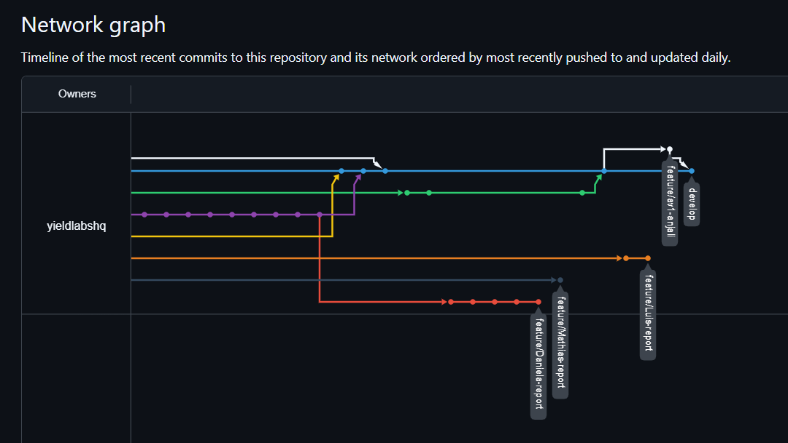

Los integrantes del equipo son:

| Integrante                     | Usuario GitHub |
|--------------------------------|----------------|
| Acuache Lucas, Mathias Joaquin | MathiasA25     |
| Amaro Villar, Anjali           | njlmrvllr      |
| García Bernal, Daniela         | danygbernal |
| Pillaca Vidal, Luis Angel      | luispillacavidal |

Las principales ramas del repositorio, gestionadas bajo **GitFlow Workflow**, **Conventional Commits** y **Semantic Versioning 2.0.0**, son:

* `main`: rama principal que contiene la versión estable del informe.
* `develop`: rama de integración de las secciones antes de fusionarse a `main`.
* `feature/X-mathias`: rama utilizada por Mathias para las tareas correspondientes a una determinada entrega (av1, tb1, av2, tb2).
* `feature/X-anjali`: rama utilizada por Anjali para las tareas correspondientes a una determinada entrega (av1, tb1, av2, tb2).
* `feature/X-daniela`: rama utilizada por Daniela para las tareas correspondientes a una determinada entrega (av1, tb1, av2, tb2).
* `feature/X-luis`: rama utilizada por Luis para las tareas correspondientes a una determinada entrega (av1, tb1, av2, tb2).
* `release/vX.X.X`: rama de preparación de versiones candidatas del informe.
* `hotfix/<descripcion>`: rama para correcciones urgentes sobre `main`.

**AV1**

<!-- Assets: ./assets/github-insights/ — capturas de Insights > Contributors e Insights > Network. -->

_Pendiente: capturas de los analíticos de colaboración y commits en GitHub._

<hr class="page-break">

# Contenido

- [Registro de Versiones del Informe](#registro-de-versiones-del-informe)
- [Project Report Collaboration Insights](#project-report-collaboration-insights)
- [Contenido](#contenido)
- [Student Outcome](#student-outcome)
- [Capítulo I: Introducción](#capítulo-i-introducción)
  - [1.1. Startup Profile](#11-startup-profile)
    - [1.1.1. Descripción de la Startup](#111-descripción-de-la-startup)
    - [1.1.2. Perfiles de integrantes del equipo](#112-perfiles-de-integrantes-del-equipo)
  - [1.2. Solution Profile](#12-solution-profile)
    - [1.2.1. Antecedentes y problemática](#121-antecedentes-y-problemática)
    - [1.2.2. Lean UX Process](#122-lean-ux-process)
      - [1.2.2.1. Lean UX Problem Statements](#1221-lean-ux-problem-statements)
      - [1.2.2.2. Lean UX Assumptions](#1222-lean-ux-assumptions)
      - [1.2.2.3. Lean UX Hypothesis Statements](#1223-lean-ux-hypothesis-statements)
      - [1.2.2.4. Lean UX Canvas](#1224-lean-ux-canvas)
  - [1.3. Segmentos objetivo](#13-segmentos-objetivo)
- [Capítulo II: Requirements Elicitation \& Analysis](#capítulo-ii-requirements-elicitation--analysis)
  - [2.1. Competidores](#21-competidores)
    - [2.1.1. Análisis competitivo](#211-análisis-competitivo)
    - [2.1.2. Estrategias y tácticas frente a competidores](#212-estrategias-y-tácticas-frente-a-competidores)
  - [2.2. Entrevistas](#22-entrevistas)
    - [2.2.1. Diseño de entrevistas](#221-diseño-de-entrevistas)
    - [2.2.2. Registro de entrevistas](#222-registro-de-entrevistas)
    - [2.2.3. Análisis de entrevistas](#223-análisis-de-entrevistas)
  - [2.3. Needfinding](#23-needfinding)
    - [2.3.1. User Personas](#231-user-personas)
    - [2.3.2. User Task Matrix](#232-user-task-matrix)
    - [2.3.3. User Journey Mapping](#233-user-journey-mapping)
    - [2.3.4. Empathy Mapping](#234-empathy-mapping)
    - [2.3.5. As-is Scenario Mapping](#235-as-is-scenario-mapping)
  - [2.4. Ubiquitous Language](#24-ubiquitous-language)
- [Capítulo III: Requirements Specification](#capítulo-iii-requirements-specification)
  - [3.1. To-Be Scenario Mapping](#31-to-be-scenario-mapping)
  - [3.2. User Stories](#32-user-stories)
  - [3.3. Product Backlog](#33-product-backlog)
  - [3.4. Impact Mapping](#34-impact-mapping)
- [Capítulo IV: Product Design](#capítulo-iv-product-design)
  - [4.1. Style Guidelines](#41-style-guidelines)
    - [4.1.1. General Style Guidelines](#411-general-style-guidelines)
    - [4.1.2. Web Style Guidelines](#412-web-style-guidelines)
    - [4.1.3. Mobile Style Guidelines](#413-mobile-style-guidelines)
      - [4.1.3.1. iOS Mobile Style Guidelines](#4131-ios-mobile-style-guidelines)
      - [4.1.3.2. Android Mobile Style Guidelines](#4132-android-mobile-style-guidelines)
  - [4.2. Information Architecture](#42-information-architecture)
    - [4.2.1. Organization Systems](#421-organization-systems)
    - [4.2.2. Labeling Systems](#422-labeling-systems)
    - [4.2.3. SEO Tags and Meta Tags](#423-seo-tags-and-meta-tags)
    - [4.2.4. Searching Systems](#424-searching-systems)
    - [4.2.5. Navigation Systems](#425-navigation-systems)
  - [4.3. Landing Page UI Design](#43-landing-page-ui-design)
    - [4.3.1. Landing Page Wireframe](#431-landing-page-wireframe)
    - [4.3.2. Landing Page Mock-up](#432-landing-page-mock-up)
  - [4.4. Mobile Applications UX/UI Design](#44-mobile-applications-uxui-design)
    - [4.4.1. Mobile Applications Wireframes](#441-mobile-applications-wireframes)
    - [4.4.2. Mobile Applications Wireflow Diagrams](#442-mobile-applications-wireflow-diagrams)
    - [4.4.3. Mobile Applications Mock-ups](#443-mobile-applications-mock-ups)
    - [4.4.4. Mobile Applications User Flow Diagrams](#444-mobile-applications-user-flow-diagrams)
  - [4.5. Mobile Applications Prototyping](#45-mobile-applications-prototyping)
    - [4.5.1. Android Mobile Applications Prototyping](#451-android-mobile-applications-prototyping)
    - [4.5.2. iOS Mobile Applications Prototyping](#452-ios-mobile-applications-prototyping)
  - [4.6. Web Applications UX/UI Design](#46-web-applications-uxui-design)
    - [4.6.1. Web Applications Wireframes](#461-web-applications-wireframes)
    - [4.6.2. Web Applications Wireflow Diagrams](#462-web-applications-wireflow-diagrams)
    - [4.6.3. Web Applications Mock-ups](#463-web-applications-mock-ups)
    - [4.6.4. Web Applications User Flow Diagrams](#464-web-applications-user-flow-diagrams)
  - [4.7. Web Applications Prototyping](#47-web-applications-prototyping)
  - [4.8. Domain-Driven Software Architecture](#48-domain-driven-software-architecture)
    - [4.8.1. Software Architecture Context Diagram](#481-software-architecture-context-diagram)
    - [4.8.2. Software Architecture Container Diagrams](#482-software-architecture-container-diagrams)
    - [4.8.3. Software Architecture Components Diagrams](#483-software-architecture-components-diagrams)
  - [4.9. Software Object-Oriented Design](#49-software-object-oriented-design)
    - [4.9.1. Class Diagrams](#491-class-diagrams)
    - [4.9.2. Class Dictionary](#492-class-dictionary)
  - [4.10. Database Design](#410-database-design)
    - [4.10.1. Relational/Non-Relational Database Diagram](#4101-relationalnon-relational-database-diagram)
- [Capítulo V: Product Implementation](#capítulo-v-product-implementation)
  - [5.1. Software Configuration Management](#51-software-configuration-management)
    - [5.1.1. Software Development Environment Configuration](#511-software-development-environment-configuration)
    - [5.1.2. Source Code Management](#512-source-code-management)
    - [5.1.3. Source Code Style Guide \& Conventions](#513-source-code-style-guide--conventions)
    - [5.1.4. Software Deployment Configuration](#514-software-deployment-configuration)
  - [5.2. Product Implementation \& Deployment](#52-product-implementation--deployment)
    - [5.2.1. Sprint Backlogs](#521-sprint-backlogs)
    - [5.2.2. Implemented Landing Page Evidence](#522-implemented-landing-page-evidence)
    - [5.2.3. Implemented Frontend-Web Application Evidence](#523-implemented-frontend-web-application-evidence)
    - [5.2.4. Implemented Native-Mobile Application Evidence](#524-implemented-native-mobile-application-evidence)
    - [5.2.5. Implemented RESTful API and/or Serverless Backend Evidence](#525-implemented-restful-api-andor-serverless-backend-evidence)
    - [5.2.6. RESTful API documentation](#526-restful-api-documentation)
    - [5.2.7. Team Collaboration Insights](#527-team-collaboration-insights)
  - [5.3. Video About-the-Product](#53-video-about-the-product)
- [Conclusiones](#conclusiones)
- [Bibliografía](#bibliografía)
- [Anexos](#anexos)

<hr class="page-break">

# Student Outcome


Cada participante del equipo debe sustentar evidencia de cómo las actividades realizadas en el trabajo final han ayudado a desarrollar las dimensiones del student outcome. Por ello en esta sección debe haber una subsección por cada alumno donde éste describa por escrito la relación entre el outcome, sus dimensiones y el trabajo que ha realizado. 

El curso contribuye al cumplimiento del Student Outcome ABET:

**ABET – EAC - Student Outcome 4**

**Criterio:** La capacidad de reconocer responsabilidades éticas y profesionales en situaciones de ingeniería y hacer juicios informados, que deben considerar el impacto de las soluciones de ingeniería en contextos globales, económicos, ambientales y sociales.

En el siguiente cuadro se describe las acciones realizadas y enunciados de conclusiones por parte del grupo, que permiten sustentar el haber alcanzado el logro del ABET – EAC - Student Outcome 4.

| Criterio específico | Acciones realizadas | Conclusiones |
|:--------------------|:--------------------|:-------------|
| **4.c.1** Reconoce responsabilidad ética y profesional en situaciones de ingeniería de software | **Acuache Lucas, Mathias Joaquin**<br>**AV1**<br>Participe en la elaboración del Information Architecture e Implemented Frontend-Web Application Evidence.<br><br>**Amaro Villar, Anjali**<br>**AV1**<br>_Me enfoqué en garantizar que el diseño de nuestra solución respete la privacidad de la información, promoviendo la transparencia y el cumplimiento de estándares éticos durante el desarrollo._<br><br>**García Bernal, Daniela**<br>**AV1**<br>Participé en la elaboración del análisis de usuarios y necesidades del proyecto, incluyendo las entrevistas de Needfinding, User Personas, User Journey Maps, Empathy Maps y As-Is Scenario Mapping.<br><br>**Pillaca Vidal, Luis Angel**<br>**AV1**<br>_Participé en la definición de buenas prácticas de desarrollo y el uso correcto de herramientas, asegurando el trabajo honesto y la ética profesional en el equipo._ | **AV1**<br>_Se logró identificar la importancia de la ética profesional en esta etapa inicial del proyecto._ |
| **4.c.2** Emite juicios informados considerando el impacto de las soluciones de ingeniería de software en contextos globales, económicos, ambientales y sociales | **Acuache Lucas, Mathias Joaquin**<br>**AV1**<br>Participe en la elaboración del To-Be Scenario Mapping, General and Web style guidelines, Landing Page Design,Web Application Prototyping, siguiendo los diversos lineamientos para el proyecto.<br><br>**Amaro Villar, Anjali**<br>**AV1**<br>_Investigué cómo YieldLabs puede mejorar la accesibilidad tecnológica en la comunidad, analizando su viabilidad económica y asegurando que el producto final sea socialmente inclusivo._<br><br>**García Bernal, Daniela**<br>**AV1**<br>Participé en la elaboración del análisis de competidores, las estrategias de diferenciación y la definición del Ubiquitous Language.<br><br>**Pillaca Vidal, Luis Angel**<br>**AV1**<br>_Evalué el impacto de YieldLabs, considerando cómo nuestra plataforma puede optimizar recursos y promover beneficios económicos y sociales para nuestros futuros usuarios._ | **AV1**<br>_Se reconoció el impacto socioeconómico y ambiental positivo de nuestra solución de software._ |

<hr class="page-break">

# Capítulo I: Introducción

## 1.1. Startup Profile

### 1.1.1. Descripción de la Startup

Yieldlabs es una startup Fintech de base tecnológica creada por estudiantes de la carrera de Ingeniería de Software de la UPC. Nuestro objetivo es democratizar el acceso a la liquidez inmediata para las PYMES peruanas a través de una plataforma de crowdfactoring inteligente. Mediante el uso de tecnologías emergentes como Arquitecturas Orientadas a Eventos (EDA) y Tokenización de activos, conectamos a empresas que necesitan capital de trabajo con inversionistas individuales, eliminando barreras tradicionales, reduciendo el riesgo mediante Inteligencia Artificial y promoviendo prácticas empresariales sostenibles a través de nuestro modelo de "Factoring Verde".

**Misión**: Facilitar el crecimiento de las pequeñas y medianas empresas en el Perú proporcionando una plataforma financiera tecnológica, transparente y eficiente que transforme sus cuentas por cobrar en liquidez inmediata, impulsada por el análisis de datos y la colaboración ciudadana.

**Visión**: Ser la plataforma de financiamiento participativo líder en la región, reconocida por revolucionar la arquitectura de servicios financieros mediante el uso ético de la IA y la descentralización de inversiones, construyendo un ecosistema donde el capital fluya de manera justa hacia negocios con impacto positivo.

### 1.1.2. Perfiles de integrantes del equipo

<!-- Por integrante: foto, nombres y apellidos, código de estudiante, carrera y párrafo de resumen con los principales conocimientos técnicos y habilidades que aporta al equipo. -->
<!-- Assets: ./assets/profiles/ -->

|  | **Acuache Lucas, Mathias Joaquin**<br>Código: &lt;u202314898&gt;<br>Carrera: Ingeniería de Software<br><br>Soy Mathias Joaquin Acuache Lucas, me encuentro en el septimo ciclo de la carrera de Ingeniería de Software. Tengo experiencia en C++, SQL y MongoDB,tambien poder crear un Frontend y Backend basico, en vue.js, java,etc.Además de utilizar GitHub de manera correcta. Asimismo, tengo conocimiento en Domain Driven Design y algunos patrones de software los cuales he aplicado en diversos proyectos.Asimismo me considero una persona que le gusta aprender nuevas cosas, aportar las ideas que tenga en mente y apartir de ello presentar buenos trabajos._ |
|---|---|

|  | **Amaro Villar, Anjali**<br>Código: &lt;Código&gt;<br>Carrera: Ingeniería de Software<br><br> Soy estudiante de séptimo ciclo de Ingeniería de Software con sólidas competencias en el diseño e implementación de arquitecturas backend utilizando Java y el ecosistema Spring Boot. Destaco por mi comunicación asertiva, adaptabilidad y trabajo colaborativo, buscando siempre aportar valor técnico continuo y garantizar entregables de calidad dentro del equipo.  |
|--------------------------------------------------------------------|------------------------------------------------------------------------------------------------|

|  | **García Bernal, Daniela**<br>Código: &lt;U202212994&gt;<br>Carrera: Ingeniería de Software<br><br>Soy estudiante de Ingeniería de Software con conocimientos en C++, programación orientada a objetos, estructuras de datos, UML y Diseño de Interfaces. Tengo conocimiento de desarrollo frontend y backend así como de  metodologías ágiles y Scrum. Me interesa aprender nuevas tecnologías y me caracterizo por prestar atención a los detalles al desarrollar mis proyectos. |
|---|---|

|  | **Pillaca Vidal, Luis Angel**<br>Código: &lt;Código&gt;<br>Carrera: Ingeniería de Software<br><br>_Pendiente de elaboración._ |
|---|---|

<hr class="page-break">

## 1.2. Solution Profile

### 1.2.1. Antecedentes y problemática

| Pregunta                 | Respuesta                                                                                                                                                                                                                                                                                                                                                                                                                             |
|--------------------------|---------------------------------------------------------------------------------------------------------------------------------------------------------------------------------------------------------------------------------------------------------------------------------------------------------------------------------------------------------------------------------------------------------------------------------------|
| **What?** (¿Qué?)        | Se presenta una severa restricción de liquidez en las MYPES peruanas. Al cierre de 2024, el ratio de inclusión financiera (acceso al crédito formal) para este segmento fue de apenas 27.8%, frente al 66.1% de la gran empresa (PRODUCE, 2025). Esto genera una brecha de capital de trabajo que el sistema bancario tradicional no logra cubrir debido a requisitos de garantía rígidos.                                            |
| **When?** (¿Cuándo?)     | El problema ocurre en la brecha temporal entre la entrega del bien o servicio y el cobro efectivo. Aunque la Ley N° 31362 establece un plazo de pago de 30 días, la norma permite "pactos en contrario", lo que en la práctica extiende los ciclos de efectivo a 60, 90 o 120 días (LP, 2021). Durante este tiempo, la empresa debe autofinanciar sus operaciones.                                                                    |
| **Where?** (¿Dónde?)     | Se identifica principalmente en las MYPES de los sectores Comercio y Servicios, que representan más del 85% de este tejido empresarial (PRODUCE, 2025). El cuello de botella se encuentra en el proceso de "conformidad" y registro de la factura negociable ante CAVALI, donde las facturas de tickets bajos (menores a S/ 10,000) representan el 67% del volumen pero enfrentan mayores dificultades de negociación (CAVALI, 2024). |
| **Who?** (¿Quién?)       | Afecta a los 2.3 millones de MYPES formales en el Perú (ComexPerú, 2025). La problemática no es de gestión interna, sino de asimetría de poder: el 99.7% de las empresas en Perú son MYPES, pero estas tienen una bajísima capacidad de negociación frente a grandes adquirentes corporativos que imponen los plazos de pago para optimizar su propio flujo de caja.                                                                  |
| **Why?** (¿Por qué?)     | Se debe a la alta percepción de riesgo y los costos operativos de la banca tradicional. El 95% de los deudores MYPE son personas naturales con negocio, lo que dificulta su evaluación bajo modelos de scoring tradicionales (ComexPerú, 2025). Además, existe una ausencia de plataformas descentralizadas (Crowdfactoring) que automaticen la evaluación de riesgo mediante IA y reduzcan costos de intermediación.                 |
| **How?** (¿Cómo?)        | El estado óptimo es un ciclo de caja donde el pago se reciba en máximo 30 días según ley. Sin embargo, la realidad muestra un patrón sistémico de postergación: las ventas de las MYPES continúan perdiendo participación en el PBI total debido a que no pueden reinvertir su capital rápidamente al tenerlo "atrapado" en facturas por cobrar (Innova Funding, 2022).                                                               |
| **How much?** (¿Cuánto?) | El saldo de crédito otorgado a empresas en Perú es de aprox. S/ 213,121 millones (2024), pero la mayoría se concentra en grandes empresas. Se estima que el mercado de factoring aún tiene un potencial de crecimiento de hasta S/ 120,000 millones hacia el 2028 (Contadores y Empresas, 2025).                                                                                                                                      |


### 1.2.2. Lean UX Process


#### 1.2.2.1. Lean UX Problem Statements

La solución que ofrecemos tiene como objetivo proporcionar a las micro y pequeñas empresas (MYPES) del Perú una plataforma de crowdfactoring inteligente que permita convertir sus facturas por cobrar en liquidez inmediata, mediante un mercado descentralizado donde inversionistas individuales financian estas operaciones de manera ágil y segura.

Nos hemos percatado de la severa restricción de caja que enfrentan las MYPES debido a plazos de cobranza que se extienden entre 60 y 120 días, sumado a un acceso limitado al crédito formal donde solo el 27.8% de estas empresas logra obtener financiamiento bancario. Esta deficiencia financiera no se debe a una mala gestión del negocio, sino a la asimetría de poder frente a los grandes adquirentes y a la falta de herramientas tecnológicas que evalúen el riesgo de manera justa. Como consecuencia, muchas empresas se ven obligadas a detener sus operaciones, incumplir pagos a proveedores o incluso cerrar por falta de flujo de caja, perdiendo competitividad en el mercado nacional.

Hemos identificado que la dependencia de procesos manuales y modelos de riesgo tradicionales excluye a miles de facturas de bajo monto del sistema financiero. La ausencia de un sistema transparente y automatizado que utilice Inteligencia Artificial para el scoring de riesgo y arquitecturas distribuidas para garantizar la seguridad de la inversión, impide que el capital fluya de manera eficiente hacia los emprendedores que más lo necesitan, afectando la sostenibilidad y el crecimiento del tejido empresarial peruano.

¿Cómo podríamos democratizar el acceso a la liquidez inmediata para las MYPES de forma transparente y automatizada, permitiendo a los empresarios obtener efectivo sin deuda y a los inversionistas participar en un mercado de bajo riesgo, reduciendo los tiempos de espera y eliminando las barreras de entrada del sistema financiero tradicional?

#### 1.2.2.2. Lean UX Assumptions

**Business Assumptions**

1. **Creemos que nuestros clientes necesitan** una plataforma digital centralizada que les permita obtener liquidez inmediata sin generar deuda bancaria tradicional.
2. **Estas necesidades se pueden resolver con** un marketplace de crowdfactoring que facilite el descuento de facturas negociables, conectando directamente a empresas con inversionistas.
3. **Nuestros clientes iniciales serán** propietarios de pequeñas y medianas empresas de los sectores comercio y servicios que actualmente enfrentan plazos de pago de 60 a 120 días.
4. **El valor más importante que el cliente quiere de nuestro servicio es** la rapidez en el desembolso (menos de 48 horas) y una evaluación de riesgo justa basada en el pagador.
5. **El cliente también puede obtener beneficios adicionales como** un dashboard de salud financiera, reducción de comisiones por prácticas sostenibles (Factoring Verde) y gestión automatizada de sus facturas ante CAVALI.
6. **Vamos a adquirir la mayoría de nuestros clientes mediante** marketing digital dirigido (LinkedIn y Google Ads), alianzas con gremios empresariales y cámaras de comercio locales.
7. **Generaremos dinero a través de** una comisión por operación (ej. 1% del monto de la factura) y un margen sobre el diferencial de la tasa de descuento ofrecida a los inversionistas.
8. **Nuestra competencia principal en el mercado son** las empresas de factoring tradicionales, bancos locales y otras Fintech de financiamiento participativo ya establecidas.
9. **Lo venceremos debido a** nuestra arquitectura basada en IA para un scoring de riesgo más preciso, la capacidad de tokenizar facturas para permitir inversiones de bajo monto y un enfoque en sostenibilidad.
10. **El mayor riesgo del servicio es que** los inversionistas perciban un alto riesgo de impago por parte de los adquirentes o que las MYPES desconfíen de las plataformas no bancarias.
11. **Resolveremos esto a través de un sistema de** transparencia total basado en eventos inmutables (Event Sourcing), validación biométrica para firmas digitales y un motor de IA que filtre facturas de alta probabilidad de cobro.

**User Assumptions**

1. **¿Quién es el usuario?** Principalmente dos perfiles: el empresario MYPE que busca liquidez urgente y el inversionista particular que busca rentabilizar su capital apoyando el crecimiento de negocios locales.
2. **¿Qué problema tiene nuestro producto que debe resolver?** Debe resolver la falta de efectivo para cubrir gastos operativos inmediatos (planillas, impuestos) y la dificultad de encontrar opciones de inversión accesibles y seguras con retornos atractivos.
3. **¿Qué características son importantes?** Destacan el motor de carga y lectura automática de facturas (IA/OCR), el marketplace con niveles de riesgo claros, la firma digital con biometría y el seguimiento en tiempo real del estado de cobranza.
4. **¿Dónde encaja nuestro producto en su trabajo o vida**? En la gestión financiera diaria del empresario para mantener operativo su negocio, y en la estrategia de ahorro e inversión del usuario particular para generar ingresos pasivos.
5. **¿Cuándo y cómo es nuestro producto usado?** Será usado semanalmente para subir nuevas facturas tras una venta, o diariamente por inversionistas para revisar nuevas oportunidades en el marketplace. Se accederá vía web para gestión administrativa y vía móvil para inversiones rápidas.
6. **¿Cómo debe verse nuestro producto y cómo debe comportarse?** Debe proyectar seguridad, transparencia y profesionalismo. La interfaz debe ser limpia, con gráficos claros de rentabilidad y flujos de caja, con una navegación intuitiva que no requiera conocimientos financieros avanzados.

#### 1.2.2.3. Lean UX Hypothesis Statements

**Hypothesis 01:** Creemos que implementar un motor de lectura automática de facturas mediante IA (OCR + NLP) reducirá el tiempo de registro y errores manuales para los empresarios MYPE. Sabremos que hemos tenido éxito cuando el tiempo promedio de carga y validación de una factura disminuya de 15 minutos (proceso manual típico) a menos de 2 minutos, y al menos el 85% de los datos extraídos no requieran corrección manual por parte del usuario.

**Hypothesis 02:** Creemos que el uso de un Score de Riesgo basado en IA, que evalúe la solvencia del adquirente (pagador) y no solo del emisor, aumentará la tasa de aprobación de facturas de pequeñas empresas. Sabremos que hemos tenido éxito cuando el volumen de facturas de MYPES nuevas (con menos de 1 año de creación) aprobadas para subasta crezca en un 50% en comparación con los criterios de evaluación de la banca tradicional durante el primer semestre.

**Hypothesis 03:** Creemos que la tokenización de facturas (fraccionamiento de deuda) permitirá que inversionistas minoristas financien operaciones con montos de entrada bajos, aumentando la velocidad de fondeo. Sabremos que hemos tenido éxito cuando el 90% de las facturas publicadas en el marketplace logren ser financiadas al 100% en un tiempo menor a 24 horas gracias a la participación de múltiples micro-inversionistas.

**Hypothesis 04:** Creemos que la transparencia brindada por una arquitectura de Event Sourcing (Ledger inmutable), que permite rastrear cada evento de la factura, aumentará la confianza de los inversionistas. Sabremos que hemos tenido éxito, cuando el 70% de los inversionistas activos califiquen la "seguridad y trazabilidad" de la plataforma como el factor principal de su permanencia en la encuesta de satisfacción trimestral.

**Hypothesis 05:** Creemos que ofrecer beneficios e incentivos (comisiones reducidas) a través del modelo de Factoring Verde para empresas con impacto positivo atraerá a un segmento de inversionistas éticos. Sabremos que hemos tenido éxito, cuando las facturas etiquetadas como "Verdes" reciban ofertas de financiamiento un 20% más rápido que las facturas convencionales y representen al menos el 15% del volumen total transaccionado en el primer año.

#### 1.2.2.4. Lean UX Canvas

El Lean UX Canvas nos permite organizar de forma clara y colaborativa los elementos clave del diseño: problema, usuarios, suposiciones, hipótesis y métricas. En este proyecto, nos ayuda a enfocar el desarrollo en generar valor real para las PYMES peruanas que requieren liquidez inmediata y los inversionistas que buscan rentabilidad con seguridad tecnológica.

A continuación, se presenta el Lean UX Canvas elaborado en la herramienta Miro:


**Enlace al Lean UX Canvas:** [https://goo.su/XhiN](https://miro.com/app/board/uXjVGGrzXsM=/?share_link_id=452277568220)

<hr class="page-break">

## 1.3. Segmentos objetivo

**Empresarios de Micro y Pequeñas Empresas (MYPES)**  
Este segmento representa el núcleo de la demanda de liquidez en el Perú. Según el informe de ComexPerú (2025), las MYPES formales generan el 99% del empleo empresarial en el país, pero enfrentan una brecha de crédito de aproximadamente S/ 56,000 millones. Estas empresas han sido rechazadas por la banca tradicional debido a modelos de riesgo que no consideran la solvencia del cliente final (el pagador de la factura), lo que las obliga a paralizar operaciones o recurrir a prestamistas informales con tasas usureras
- **Edad**: Emprendedores y dueños de negocio entre los 25 y 55 años.
- **Necesidad clave**: Obtener capital de trabajo de forma inmediata (en menos de 48 horas) sin aumentar su nivel de deuda bancaria y con tasas competitivas basadas en la calidad de sus facturas.
- **Nivel educativo**: Formación técnica o universitaria, con experiencia en gestión comercial pero con limitado conocimiento en ingeniería financiera avanzada.
- **Uso de tecnología**: Utilizan facturación electrónica de SUNAT y aplicaciones bancarias básicas, pero requieren una plataforma intuitiva que automatice la gestión de sus cuentas por cobrar.


**Inversionistas Minoristas (Personas Naturales)**  
Este segmento representa la oferta de capital. El mercado de factoring en Perú alcanzó un monto negociado de S/ 43,000 millones en 2024, lo que representa un crecimiento del 14% respecto al año anterior (Contadores y Empresas, 2025). Esta expansión del mercado permite que personas naturales participen financiando facturas. Según CAVALI (2024), el ticket promedio de las facturas negociadas es de aproximadamente S/ 24,405, un monto que, mediante un modelo de crowdfactoring, puede ser fraccionado para que inversionistas con menor capital participen en la compra de deuda con retornos atractivos.
- **Edad**: Profesionales de entre 22 y 45 años.
- **Necesidad clave**: Acceder a opciones de inversión con tasas de rendimiento competitivas frente a la banca tradicional y con periodos de retorno de capital a corto plazo (entre 30 y 90 días).
- **Nivel educativo**: Educación superior completa, con interés en optimizar la gestión de sus ahorros personales a través de medios digitales.
- **Uso de tecnología**: Usuarios habituales de servicios financieros digitales y aplicaciones móviles; valoran la trazabilidad de su dinero y la facilidad de monitoreo de sus ganancias en tiempo real.


<hr class="page-break">

# Capítulo II: Requirements Elicitation & Analysis

En este capítulo se presenta el trabajo realizado por el equipo de YieldLabs para identificar y analizar los requerimientos que orientan el desarrollo de Vankoo. Como punto de partida, se realiza una evaluación de las principales soluciones existentes en el mercado peruano de factoring y crowdfactoring, comparándolas con Vankoo para reconocer oportunidades de diferenciación y establecer cómo responder ante las fortalezas y limitaciones de sus competidores. Posteriormente, se lleva a cabo una etapa de needfinding mediante entrevistas semiestructuradas dirigidas a los dos grupos de usuarios considerados como público objetivo: empresarios MYPE e inversionistas minoristas. La información recopilada permite construir diferentes herramientas de análisis y representación de usuarios, entre ellas las user personas, user task matrix, user journey mapping, empathy mapping y as-is scenario mapping. En conjunto, los hallazgos obtenidos durante este proceso proporcionan el sustento necesario para definir y especificar los requisitos que serán desarrollados en el Capítulo III.

## 2.1. Competidores

<!-- Identificar y describir mínimo 3 competidores directos. -->
<!-- Assets: ./assets/cap2-requirements-elicitation/competidores/ -->

Para evaluar el entorno competitivo de Vankoo, se seleccionaron tres empresas que ofrecen soluciones vinculadas al factoring y/o crowdfactoring dentro del mercado peruano: Prestamype, Finsmart e Innova Funding. Cada una presenta características particulares en cuanto a su propuesta, público objetivo y estrategias para captar clientes e inversionistas.

**Prestamype**

Prestamype se posiciona como una de las principales Fintech peruanas especializadas en préstamos y factoring. Su oferta comprende diversos servicios financieros, como factoring, préstamos respaldados por garantía hipotecaria, cambio de divisas y financiamiento para capital de trabajo. Gracias a su reconocimiento en el mercado, elevada liquidez y extensa cartera de clientes, cuenta con una capacidad de financiamiento que le permite continuar operando incluso en situaciones donde la participación de inversionistas minoristas resulta insuficiente. Su propuesta está principalmente dirigida a PYMES con mayor nivel de consolidación y necesidades de financiamiento de montos elevados, además de inversionistas de perfil conservador e institucional. Para alcanzar estos segmentos, utiliza canales de gran alcance como televisión, radio, publicidad exterior, Google Ads e influencers reconocidos.

**Finsmart**

Finsmart representa el competidor cuya propuesta guarda mayor similitud con el enfoque de crowdfactoring planteado por Vankoo. Su principal fortaleza se encuentra en una plataforma completamente digital, orientada a facilitar y agilizar la experiencia tanto de los inversionistas como de las empresas que requieren adelantar el cobro de sus facturas. Esta orientación tecnológica permite realizar la conexión entre las facturas y los inversionistas en períodos reducidos. La empresa dirige su propuesta principalmente a MYPES con presencia digital y trabajadores independientes, mientras que para el lado de la inversión busca captar especialmente a usuarios jóvenes, pertenecientes a los grupos millennials y generación Z. Su estrategia de captación se apoya principalmente en redes sociales como LinkedIn e Instagram, programas de referidos y campañas automatizadas de email marketing.

**Innova Funding**

Innova Funding cuenta con una trayectoria pionera dentro del factoring participativo peruano y presenta una orientación predominantemente institucional y B2B. Una de sus principales características es el énfasis que otorga a la educación financiera, acompañado de un sólido dominio de la normativa relacionada con las facturas negociables. Asimismo, mantiene alianzas estratégicas que permiten integrar la facturación electrónica con CAVALI, reforzando su posicionamiento como una especie de "bolsa de facturas". Su público objetivo está conformado principalmente por proveedores de grandes empresas y organismos estatales. Para relacionarse con estos segmentos, emplea estrategias basadas en alianzas con cámaras de comercio, participación en eventos empresariales y presencia en medios especializados en negocios.

### 2.1.1. Análisis competitivo

<!-- Competitive Analysis Landscape según el formato del enunciado. -->

<table style="width:100%; table-layout:fixed; font-size:8pt; line-height:1.3; border-collapse:collapse;">
<colgroup>
<col style="width:8%">
<col style="width:15%">
<col style="width:19.25%">
<col style="width:19.25%">
<col style="width:19.25%">
<col style="width:19.25%">
</colgroup>
<thead>
<tr>
<th colspan="6" style="text-align:left; background:#f2f2f2; border:1px solid #999; padding:4pt;">Competitive Analysis Landscape</th>
</tr>
<tr>
<th colspan="6" style="text-align:left; border:1px solid #999; padding:4pt;">¿Por qué llevar a cabo este análisis?</th>
</tr>
<tr>
<td colspan="6" style="border:1px solid #999; padding:4pt; text-align:left;">Este análisis permite comprender el posicionamiento de Vankoo frente a los actores relevantes del mercado peruano de factoring y crowdfactoring, identificando las ventajas competitivas y los vacíos de valor que la propuesta puede capitalizar, así como las fortalezas de la competencia que representan una amenaza directa para su adopción. Sus resultados retroalimentan las estrategias de diferenciación y las decisiones de producto y marketing que se abordan en la sección 2.1.2.</td>
</tr>
<tr>
<th style="border:1px solid #999; padding:4pt;"></th>
<th style="border:1px solid #999; padding:4pt;"></th>
<th style="border:1px solid #999; padding:4pt; text-align:left; vertical-align:bottom;">
  <br>
  YieldLabs (Vankoo)
</th>
<th style="border:1px solid #999; padding:4pt; text-align:left; vertical-align:bottom;">
  <br>
  Prestamype
</th>
<th style="border:1px solid #999; padding:4pt; text-align:left; vertical-align:bottom;">
  <br>
  Finsmart
</th>
<th style="border:1px solid #999; padding:4pt; text-align:left; vertical-align:bottom;">
  <br>
  Innova Funding
</th>
</tr>
</thead>
<tbody>
<tr>
<th rowspan="2" style="border:1px solid #999; padding:4pt; text-align:left; vertical-align:top;">Perfil</th>
<td style="border:1px solid #999; padding:4pt; vertical-align:top;">Overview</td>
<td style="border:1px solid #999; padding:4pt; vertical-align:top;">La nueva propuesta disruptiva que busca democratizar la liquidez mediante tecnología avanzada (Event-Driven Architecture), reducción de riesgo con IA y un enfoque único de sostenibilidad (Factoring Verde).</td>
<td style="border:1px solid #999; padding:4pt; vertical-align:top;">Es la Fintech líder en préstamos y factoring en Perú. Tienen una marca muy fuerte y ofrecen un ecosistema de productos (préstamos con garantía hipotecaria, cambio de divisas, factoring). Son el "banco" de las Fintech.</td>
<td style="border:1px solid #999; padding:4pt; vertical-align:top;">Competidor directo en el modelo de crowdfactoring. Se destacan por una plataforma muy digital, ágil y enfocada en la experiencia de usuario (UX) tanto para el inversionista como para la empresa.</td>
<td style="border:1px solid #999; padding:4pt; vertical-align:top;">Pioneros en el sector. Se enfocan mucho en la educación financiera y tienen alianzas fuertes para la integración de facturas electrónicas. Su perfil es más institucional/B2B.</td>
</tr>
<tr>
<td style="border:1px solid #999; padding:4pt; vertical-align:top;">Ventaja competitiva<br>¿Qué valor ofrece a los clientes?</td>
<td style="border:1px solid #999; padding:4pt; vertical-align:top;">Uso de IA real para scoring predictivo del pagador (no solo historial crediticio), arquitectura de eventos (trazabilidad total) y el distintivo de Factoring Verde (menores tasas por sostenibilidad).</td>
<td style="border:1px solid #999; padding:4pt; vertical-align:top;">Reputación y solidez. Al ser los líderes, generan confianza inmediata. Tienen un fondo grande para financiar operaciones si no hay inversionistas retail.</td>
<td style="border:1px solid #999; padding:4pt; vertical-align:top;">User Experience (UX). Su plataforma es extremadamente sencilla de usar. Conectan facturas muy rápido.</td>
<td style="border:1px solid #999; padding:4pt; vertical-align:top;">Integración B2B. Tienen una conexión muy fuerte con el ecosistema de facturación electrónica y CAVALI. Se posicionan como "La bolsa de facturas".</td>
</tr>
<tr>
<th rowspan="2" style="border:1px solid #999; padding:4pt; text-align:left; vertical-align:top;">Perfil de Marketing</th>
<td style="border:1px solid #999; padding:4pt; vertical-align:top;">Mercado objetivo</td>
<td style="border:1px solid #999; padding:4pt; vertical-align:top;">MYPES del sector servicios/comercio excluidas por la banca tradicional y el inversionista "consciente" (retail y ESG).</td>
<td style="border:1px solid #999; padding:4pt; vertical-align:top;">PYMES más consolidadas (que buscan tickets altos) e inversionistas conservadores/institucionales.</td>
<td style="border:1px solid #999; padding:4pt; vertical-align:top;">MYPES digitales y profesionales independientes. Inversionistas jóvenes (millennials/Gen Z).</td>
<td style="border:1px solid #999; padding:4pt; vertical-align:top;">Proveedores de grandes corporaciones y entidades del Estado.</td>
</tr>
<tr>
<td style="border:1px solid #999; padding:4pt; vertical-align:top;">Estrategias de marketing</td>
<td style="border:1px solid #999; padding:4pt; vertical-align:top;">Marketing de contenidos (Inbound) sobre educación financiera, SEO técnico y alianzas con certificadoras verdes.</td>
<td style="border:1px solid #999; padding:4pt; vertical-align:top;">Publicidad masiva (TV, radio, paneles), Google Ads agresivo, influencers de alto perfil.</td>
<td style="border:1px solid #999; padding:4pt; vertical-align:top;">Fuerte presencia en redes sociales (LinkedIn, Instagram), programa de referidos, email marketing automatizado.</td>
<td style="border:1px solid #999; padding:4pt; vertical-align:top;">Alianzas estratégicas con cámaras de comercio, eventos corporativos, PR en medios de negocios.</td>
</tr>
<tr>
<th rowspan="3" style="border:1px solid #999; padding:4pt; text-align:left; vertical-align:top;">Perfil de Producto</th>
<td style="border:1px solid #999; padding:4pt; vertical-align:top;">Productos &amp; Servicios</td>
<td style="border:1px solid #999; padding:4pt; vertical-align:top;">Crowdfactoring inteligente, dashboard de salud financiera, tokenización de facturas (fraccionamiento).</td>
<td style="border:1px solid #999; padding:4pt; vertical-align:top;">Factoring, préstamos con garantía hipotecaria, gestor de divisas, préstamos para capital de trabajo.</td>
<td style="border:1px solid #999; padding:4pt; vertical-align:top;">Crowdfactoring puro, adelanto de facturas.</td>
<td style="border:1px solid #999; padding:4pt; vertical-align:top;">Subasta de facturas, factoring electrónico.</td>
</tr>
<tr>
<td style="border:1px solid #999; padding:4pt; vertical-align:top;">Precios &amp; Costos</td>
<td style="border:1px solid #999; padding:4pt; vertical-align:top;">Modelo de comisión por éxito (aprox. 1% - 1.5% al empresario) + spread de rendimiento al inversionista. Costos operativos bajos por automatización (IA).</td>
<td style="border:1px solid #999; padding:4pt; vertical-align:top;">Tasas competitivas pero con costos de estructuración a veces elevados para la MYPE.</td>
<td style="border:1px solid #999; padding:4pt; vertical-align:top;">Comisiones transparentes, ticket de entrada bajo para inversionistas.</td>
<td style="border:1px solid #999; padding:4pt; vertical-align:top;">Modelo de subasta (la tasa la define el mercado/inversionista), lo que puede ser muy barato o muy caro según la demanda.</td>
</tr>
<tr>
<td style="border:1px solid #999; padding:4pt; vertical-align:top;">Canales de distribución (Web y/o Móvil)</td>
<td style="border:1px solid #999; padding:4pt; vertical-align:top;">Web App (PWA) responsiva.</td>
<td style="border:1px solid #999; padding:4pt; vertical-align:top;">Plataforma Web robusta y fuerza de ventas telefónica.</td>
<td style="border:1px solid #999; padding:4pt; vertical-align:top;">Plataforma Web y App Móvil.</td>
<td style="border:1px solid #999; padding:4pt; vertical-align:top;">Plataforma Web.</td>
</tr>
<tr>
<th rowspan="4" style="border:1px solid #999; padding:4pt; text-align:left; vertical-align:top;">Análisis SWOT</th>
<td style="border:1px solid #999; padding:4pt; vertical-align:top;">Fortalezas</td>
<td style="border:1px solid #999; padding:4pt; vertical-align:top;">Stack tecnológico moderno (escalable), propuesta de valor ética (Green), automatización de procesos.</td>
<td style="border:1px solid #999; padding:4pt; vertical-align:top;">Gran liquidez, marca reconocida, base de datos de clientes inmensa.</td>
<td style="border:1px solid #999; padding:4pt; vertical-align:top;">Agilidad tecnológica, comunidad de inversionistas muy activa, marca "cool" y cercana.</td>
<td style="border:1px solid #999; padding:4pt; vertical-align:top;">Conocimiento profundo de la normativa de facturas negociables, red de partners.</td>
</tr>
<tr>
<td style="border:1px solid #999; padding:4pt; vertical-align:top;">Debilidades</td>
<td style="border:1px solid #999; padding:4pt; vertical-align:top;">Marca nueva sin reputación (trust issue), base de inversionistas inicial nula (problema del huevo y la gallina).</td>
<td style="border:1px solid #999; padding:4pt; vertical-align:top;">Procesos pueden volverse lentos por el volumen; menos enfoque en micro-inversionistas (tickets de entrada más altos).</td>
<td style="border:1px solid #999; padding:4pt; vertical-align:top;">Dependencia alta del crowdfactoring (si los inversionistas se asustan, se seca la liquidez), riesgo de impago en facturas de menor calidad.</td>
<td style="border:1px solid #999; padding:4pt; vertical-align:top;">Interfaz de usuario (UI) menos moderna que Finsmart/LiquiLabs, curva de aprendizaje para el usuario nuevo.</td>
</tr>
<tr>
<td style="border:1px solid #999; padding:4pt; vertical-align:top;">Oportunidades</td>
<td style="border:1px solid #999; padding:4pt; vertical-align:top;">Creciente interés en inversiones de impacto (ESG), saturación de la banca tradicional.</td>
<td style="border:1px solid #999; padding:4pt; vertical-align:top;">Expansión internacional, compra de competidores pequeños.</td>
<td style="border:1px solid #999; padding:4pt; vertical-align:top;">Alianzas con software de contabilidad o facturación electrónica.</td>
<td style="border:1px solid #999; padding:4pt; vertical-align:top;">Convertirse en el motor de factoring de otros bancos (SaaS).</td>
</tr>
<tr>
<td style="border:1px solid #999; padding:4pt; vertical-align:top;">Amenazas</td>
<td style="border:1px solid #999; padding:4pt; vertical-align:top;">Regulaciones estrictas de la SBS/SMV sobre "tokenización", reacción agresiva de bancos bajando tasas.</td>
<td style="border:1px solid #999; padding:4pt; vertical-align:top;">Fintechs de nicho que ofrezcan mejor UX o procesos más rápidos (como LiquiLabs).</td>
<td style="border:1px solid #999; padding:4pt; vertical-align:top;">Entrada de bancos digitales al sector de factoring con tasas subsidiadas.</td>
<td style="border:1px solid #999; padding:4pt; vertical-align:top;">Que la competencia simplifique tanto el proceso que su modelo de "subasta" parezca complejo.</td>
</tr>
</tbody>
</table>

### 2.1.2. Estrategias y tácticas frente a competidores

**Diferenciación mediante Scoring Predictivo e Inteligencia Artificial**

* **Estrategia:** Posicionar a YieldLabs como una plataforma especializada en gestión y evaluación de riesgo financiero, utilizando inteligencia artificial para brindar a los inversionistas información que les permita tomar decisiones con mayor seguridad frente a las alternativas tradicionales de crowdfactoring.
* **Tácticas:**
  * Generar para cada factura un Reporte de Salud del Pagador basado en IA, que presente de manera sencilla una evaluación del riesgo asociado y proporcione al inversionista un indicador adicional para decidir dónde colocar su capital.
  * Incorporar alertas instantáneas que notifiquen a los inversionistas cuando se publiquen nuevas oportunidades de financiamiento, reduciendo el tiempo entre la disponibilidad de una factura y la posibilidad de invertir en ella.
  
**Factoring orientado a la sostenibilidad**

* **Estrategia:** Desarrollar un nicho enfocado en inversión responsable y criterios ESG, conectando a inversionistas interesados en sostenibilidad con MYPES que desarrollen actividades o prácticas favorables para el medio ambiente.
* **Tácticas:**
  * Crear una certificación digital de Empresa de Impacto que identifique a las MYPES cuyas facturas correspondan a actividades o sectores considerados sostenibles.
  * Establecer una Tasa Preferencial Verde, mediante la cual las operaciones que cumplan con los criterios ambientales definidos puedan obtener una reducción de 0.25 % en la comisión de éxito, buscando incentivar su financiamiento entre inversionistas interesados en proyectos ESG.

**Democratización de la inversión mediante fraccionamiento**

* **Estrategia:** Facilitar la participación de inversionistas minoristas mediante el fraccionamiento de las facturas, reduciendo el monto mínimo necesario para invertir y permitiendo que LiquiLabs alcance usuarios que normalmente no participan en este mercado.
* **Tácticas:**
  * Dividir las facturas en participaciones de menor valor para establecer montos mínimos de inversión, como S/ 50 o S/ 100, haciendo que el acceso sea más sencillo para inversionistas retail.
  * Implementar una Billetera de Reinversión Automática que utilice IA para distribuir el dinero disponible entre diferentes microfracciones de facturas, favoreciendo la diversificación automática del portafolio.

**Transparencia y trazabilidad de las operaciones**

* **Estrategia:** Utilizar la transparencia tecnológica como mecanismo para generar confianza y compensar la falta de trayectoria de LiquiLabs frente a competidores que cuentan con una presencia consolidada en el mercado.
* **Tácticas:**
  * Desarrollar un Dashboard de Trazabilidad que permita consultar el estado de una factura durante todo su ciclo, incluyendo etapas como la validación en SUNAT, la confirmación en CAVALI, el fondeo y el pago.
  * Proporcionar información resumida sobre los principales criterios considerados por el sistema de IA en la evaluación de riesgo, permitiendo que los usuarios comprendan mejor el funcionamiento del scoring y fortaleciendo la confianza en la plataforma.

**Crecimiento mediante alianzas tecnológicas**

* **Estrategia:** Priorizar la integración de LiquiLabs con herramientas que las MYPES ya utilizan para administrar sus negocios, en lugar de competir directamente con los grandes actores del mercado mediante un elevado gasto publicitario.
* **Tácticas:**
  * Desarrollar APIs para sistemas ERP y plataformas contables, de manera que las MYPES puedan iniciar el proceso de financiamiento de sus facturas directamente desde las herramientas que utilizan para gestionar su negocio.
  * Organizar webinars sobre finanzas sostenibles para MYPES, utilizando contenido educativo para explicar cómo la adopción de prácticas sostenibles puede contribuir a obtener mejores condiciones de financiamiento y, simultáneamente, atraer nuevos usuarios a la plataforma.

<hr class="page-break">

## 2.2. Entrevistas

Para validar las suposiciones e hipótesis planteadas en el Lean UX Process, el equipo llevó a cabo entrevistas semiestructuradas con representantes de los dos segmentos objetivo de Vankoo: los empresarios de micro y pequeñas empresas que requieren liquidez y los inversionistas minoristas que aportan el capital. Se realizaron 3 entrevistas por segmento, todas registradas en video previo consentimiento del participante.

### 2.2.1. Diseño de entrevistas

<!-- Preguntas principales y complementarias por cada segmento objetivo. -->

A continuación se presenta el guión de preguntas elaborado para cada segmento objetivo. Cada uno consta de 12 preguntas principales, organizadas en cuatro bloques: contexto y perfil, problemática, perfil digital y objetivos, y validación de solución. Las preguntas complementarias que acompañan a cada una se utilizan como repregunta según lo amerite la respuesta del entrevistado.

**Segmento 1: Empresarios de Micro y Pequeñas Empresas (MYPES)**

**Preguntas de contexto y perfil (1-3)**

1. ¿Cuál es su nombre, edad y en qué distrito vive actualmente?
   - ¿Con quién vive? ¿Tiene pareja o hijos que dependan del negocio?
   - ¿Cuál es su formación académica y cuántos años lleva al frente de su empresa?

2. ¿A qué se dedica su empresa y cómo está organizada? ¿Cuántos trabajadores tiene, hace cuánto opera formalmente y cuál es su facturación mensual aproximada?
   - ¿Quiénes son sus principales clientes: empresas grandes, entidades del Estado, consumidor final?
   - ¿Qué porcentaje de sus ventas cobra al contado y qué porcentaje al crédito?

3. ¿Cómo lleva hoy el control de sus cuentas por cobrar y de su facturación electrónica?
   - ¿Usa algún sistema, un Excel, o lo maneja un contador externo?
   - ¿Quién decide en su empresa cuándo y cómo conseguir dinero: usted solo, un socio, su contador?

**Preguntas sobre la problemática (4-8)**

4. Cuénteme la última vez que se quedó sin efectivo para cubrir un pago importante —planilla, proveedores, SUNAT—. ¿Qué ocurrió exactamente y cómo lo resolvió?
   - ¿Cuánto tiempo le tomó conseguir ese dinero?
   - ¿Qué dejó de hacer en el negocio mientras tanto?

5. ¿Cuál es el plazo de pago real que le imponen sus principales clientes y qué tan seguido se atrasan respecto a lo pactado?
   - ¿Ha podido negociar ese plazo alguna vez? ¿Qué pasó cuando lo intentó?
   - ¿Qué hace cuando un cliente importante se atrasa: le insiste, lo deja pasar, deja de venderle?

6. ¿Ha intentado obtener financiamiento formal en los últimos dos años? ¿Con quién, qué le pidieron, cuánto demoró y cómo terminó?
   - Si se lo negaron, ¿le explicaron por qué?
   - ¿Ha recurrido a préstamos de familiares, tarjetas de crédito o prestamistas informales? ¿En qué circunstancias?

7. ¿Ha usado alguna vez factoring o descuento de facturas?
   - Si lo usó: ¿qué parte del proceso le resultó más engorrosa —la conformidad del cliente, el registro en CAVALI, la firma de documentos, la espera del desembolso—?
   - Si nunca lo usó: ¿qué lo ha detenido? ¿Le preocupa que su cliente se entere de que cedió la factura?

8. La última vez que consiguió dinero rápido, ¿cuánto le costó en total —tasa, comisiones, tiempo invertido— y cómo se enteró de esas condiciones?
   - ¿Sintió que entendía completamente lo que iba a pagar antes de firmar?
   - ¿Con qué comparó ese costo para decidir si le convenía?

**Preguntas de perfil digital y objetivos (9-10)**

9. ¿Qué dispositivos usa para gestionar su negocio y por qué canal prefiere que le respondan un tema financiero: WhatsApp, llamada, correo, una aplicación?
   - ¿Qué aplicaciones bancarias o de gestión usa a diario y cuál le parece la mejor hecha?
   - Cuando evalúa un servicio financiero nuevo, ¿en quién confía para que se lo recomiende: su contador, su gremio o cámara de comercio, otros empresarios, redes sociales?

10. ¿Cuáles son sus objetivos para la empresa en los próximos 12 meses y qué es lo que más lo frustra hoy de manejar el dinero del negocio?
    - ¿Qué oportunidad concreta ha tenido que rechazar por falta de capital de trabajo?

**Preguntas de validación de solución (11-12)**

11. Si pudiera convertir una factura ya emitida en efectivo en menos de 48 horas, sin tomar deuda y siendo evaluado por la solvencia de su cliente en lugar de la suya, ¿en qué situación concreta de los últimos meses la habría usado?
    - ¿Qué porcentaje del monto de la factura consideraría razonable ceder por ese servicio y a partir de qué porcentaje ya no le convendría?
    - ¿Preferiría registrar la factura usted mismo o que el sistema la lea automáticamente del PDF de SUNAT? ¿Cuánto tiempo le dedica hoy a ese tipo de trámite?

12. ¿Qué le generaría desconfianza al operar con una plataforma nueva que no es un banco y qué necesitaría ver antes de hacer su primera operación?
    - ¿Le serviría poder ver en pantalla en qué etapa exacta está su factura —validación, conformidad, fondeo, pago— o le basta con que le avisen al final?
    - Si le ofrecieran una comisión menor por acreditar prácticas sostenibles en su empresa, ¿lo consideraría un beneficio real o un requisito adicional? ¿Qué tendría que hacer para que le valga la pena?

**Segmento 2: Inversionistas Minoristas (Personas Naturales)**

**Preguntas de contexto y perfil (1-3)**

1. ¿Cuál es su nombre, edad y en qué distrito vive actualmente?
   - ¿Con quién vive? ¿Tiene pareja o hijos?
   - ¿Cuál es su formación académica y a qué se dedica actualmente?

2. ¿Cómo distribuye hoy sus ahorros? ¿Qué instrumentos usa —cuenta de ahorros, depósito a plazo, fondos mutuos, bolsa, criptomonedas, préstamos a conocidos, negocio propio—?
   - ¿Desde hace cuánto invierte y qué monto suele destinar a una sola operación?
   - ¿Qué porcentaje de sus ingresos logra ahorrar al mes?

3. Cuénteme cómo tomó su última decisión de inversión: ¿qué revisó, cuánto tiempo le dedicó y a quién consultó antes de decidir?
   - ¿Qué información terminó siendo determinante?
   - ¿Sigue a alguna marca, creador de contenido o comunidad de finanzas personales? ¿Cuál y por qué le da credibilidad?

**Preguntas sobre la problemática (4-8)**

4. ¿Qué es lo que más le molesta de las opciones de inversión que usa hoy?
   - ¿Le incomoda más el rendimiento bajo, el monto mínimo de entrada, el plazo en que su dinero queda inmovilizado o no entender en qué está invertido?
   - ¿Qué rendimiento anual considera que "vale la pena" para mover su dinero de donde está hoy?

5. Cuénteme una vez en que una inversión no salió como esperaba o perdió dinero. ¿Cómo se enteró, qué le explicaron y qué hizo después?
   - ¿Qué habría necesitado saber antes para evitarlo?

6. ¿Ha invertido alguna vez en factoring, crowdfunding o alguna plataforma fintech?
   - Si sí: ¿en cuál, cuánto puso la primera vez y qué lo hizo confiar lo suficiente para poner ese primer monto?
   - Si no: ¿qué lo ha detenido? ¿Conoce a alguien que lo haya hecho?

7. Antes de poner su dinero en algo, ¿cómo evalúa el riesgo? ¿Qué datos concretos busca y cuáles nunca logra encontrar?
   - Si una plataforma le mostrara una calificación de riesgo, ¿le creería? ¿Qué necesitaría que le explicaran sobre cómo se calcula?

8. ¿Con qué frecuencia revisa el estado de sus inversiones y qué es lo primero que mira?
   - ¿Qué haría si pasaran dos semanas sin poder ver en qué estado está su dinero?
   - ¿Cómo esperaría que le comuniquen una mala noticia, por ejemplo un retraso en un pago?

**Preguntas de perfil digital y objetivos (9-10)**

9. ¿Desde qué dispositivo maneja su dinero y qué aplicaciones financieras usa con más frecuencia?
   - ¿Prefiere gestionar una inversión desde el celular o desde una computadora? ¿Por qué?
   - ¿En qué canales se informa sobre finanzas: YouTube, LinkedIn, TikTok, podcasts, grupos de WhatsApp, su banco?

10. ¿Cuál es su objetivo financiero para los próximos uno a tres años y cuánto dinero estaría dispuesto a mantener inmovilizado para lograrlo?
    - ¿Por cuánto tiempo como máximo aceptaría no disponer de ese dinero?
    - ¿Qué lo haría sentir que está invirtiendo bien y no solamente "guardando" su dinero?

**Preguntas de validación de solución (11-12)**

11. Si pudiera invertir desde S/ 100 comprando fracciones de facturas de distintas empresas, con retorno del capital entre 30 y 90 días, ¿cuánto destinaría en su primera operación y qué tendría que pasar para que repita?
    - ¿Preferiría elegir usted mismo cada factura o que el sistema distribuya automáticamente su dinero entre varias para diversificar el riesgo?
    - ¿Qué información necesitaría ver de cada factura antes de invertir: el nombre de la empresa que paga, su historial, el sector, el plazo, la calificación de riesgo?

12. ¿Qué esperaría que ocurra si la empresa que debe pagar la factura no paga a tiempo y qué tan claro debería estar eso antes de invertir?
    - ¿Le daría más confianza poder rastrear cada movimiento de su dinero paso a paso en la plataforma o le resulta indiferente mientras le paguen?
    - Si una factura correspondiera a una empresa con prácticas sostenibles certificadas, ¿aceptaría un rendimiento algo menor por financiarla o esperaría exactamente el mismo retorno?

### 2.2.2. Registro de entrevistas

<!-- De 3 a 5 entrevistas por segmento. Por cada una: nombres, apellidos, edad, distrito, screenshot del video, URL del video en Microsoft Stream / Clipchamp, timing de inicio, duración y resumen. -->
<!-- Assets: ./assets/cap2-requirements-elicitation/entrevistas/ -->

#### Segmento 1: Empresarios de Micro y Pequeñas Empresas (MYPES)

**Entrevista 1**

| Atributo | Detalle                                                                                  |
| :---: |:-----------------------------------------------------------------------------------------|
| Nombre | Irving Vergara                                                                           |
| Edad | 22                                                                                       |
| Distrito | San Juan de Lurigancho                                                                   |
| Ocupación | Dueño de Metalmecanica                                                                   |
| Fecha de entrevista | 08/09/2026                                                                               |
| Timing de inicio | 00:00 - 8:58                                                                             |
| Duración | 8:58 minutos                                                                             |
| Enlace a la grabación | [*Ver en Microsoft Stream*](https://upcedupe-my.sharepoint.com/:v:/g/personal/u20221g044_upc_edu_pe/IQBH1rA-DTogSZAoQrPM1UIOAWCjy1cb2NoZaTQaVktAxrk?e=WJmOfj&nav=eyJyZWZlcnJhbEluZm8iOnsicmVmZXJyYWxBcHAiOiJTdHJlYW1XZWJBcHAiLCJyZWZlcnJhbFZpZXciOiJTaGFyZURpYWxvZy1MaW5rIiwicmVmZXJyYWxBcHBQbGF0Zm9ybSI6IldlYiIsInJlZmVycmFsTW9kZSI6InZpZXcifSwicGxheWJhY2tPcHRpb25zIjp7InN0YXJ0VGltZUluU2Vjb25kcyI6MC42OX19)                                                            |
| Captura de pantalla de la grabación |  |
| Resumen |  Empresario del sector metalmecánico a cargo de la gestión comercial y operativa de su taller, donde equilibra proyectos al contado con contratos pagados a crédito. Identifica como principal limitación la brecha de liquidez que generan los plazos de cobranza de 30 a 60 días o más, impidiéndole comprar materia prima de forma inmediata para cerrar nuevos contratos y afectando el cumplimiento con trabajadores y proveedores. Valora de forma muy positiva un mecanismo ágil de anticipo de cobro con procesamiento automatizado de facturas electrónicas, condicionado a contar con claridad absoluta sobre el costo total de la operación, respaldo de seguridad institucional y trazabilidad transparente sobre el estado de aprobación y desembolso de los fondos.                                                                                        |

**Entrevista 2**

| Atributo | Detalle                                                                                  |
| :---: |:-----------------------------------------------------------------------------------------|
| Nombre | Diego Melendez                                                                           |
| Edad | 26                                                                                       |
| Distrito | San Miguel                                                                               |
| Ocupación | Dueño de TechnoRed                                                                       |
| Fecha de entrevista | 08/09/2026                                                                               |
| Timing de inicio | 8:58 - 17:30                                                                             |
| Duración | 8:32                                                                                     |
| Enlace a la grabación | [*Ver en Microsoft Stream*](https://upcedupe-my.sharepoint.com/:v:/g/personal/u20221g044_upc_edu_pe/IQBH1rA-DTogSZAoQrPM1UIOAWCjy1cb2NoZaTQaVktAxrk?e=Guig5U&nav=eyJyZWZlcnJhbEluZm8iOnsicmVmZXJyYWxBcHAiOiJTdHJlYW1XZWJBcHAiLCJyZWZlcnJhbFZpZXciOiJTaGFyZURpYWxvZy1MaW5rIiwicmVmZXJyYWxBcHBQbGF0Zm9ybSI6IldlYiIsInJlZmVycmFsTW9kZSI6InZpZXcifSwicGxheWJhY2tPcHRpb25zIjp7InN0YXJ0VGltZUluU2Vjb25kcyI6NTM5LjF9fQ%3D%3D)                                                            |
| Captura de pantalla de la grabación |  |
| Resumen | Empresario y técnico en redes con cuatro años administrando su propia empresa de servicios tecnológicos, cuyo volumen de ventas se divide entre pagos al contado y facturas a crédito. Su principal obstáculo radica en el desfase del flujo de caja originado por clientes que extienden sus pagos entre 45 y 60 días, lo que le impide asumir nuevos proyectos o cubrir planillas y proveedores a tiempo, forzándolo a recurrir a financiamientos inmediatos pero costosos como las tarjetas de crédito. Valora de forma muy positiva una alternativa de liquidez en menos de 48 horas basada en la lectura automática de facturas electrónicas, siempre que la plataforma ofrezca total transparencia en comisiones netas, tiempos de desembolso y un seguimiento visual en tiempo real de cada etapa del proceso.                                                                                         |

**Entrevista 3**

| Atributo | Detalle                                                                                  |
| :---: |:-----------------------------------------------------------------------------------------|
| Nombre | Thomas Bernardo                                                                          |
| Edad | 20                                                                                       |
| Distrito | Chorrillos                                                                               |
| Ocupación | Socio de empresa de servicio tecnico                                                     |
| Fecha de entrevista | 08/09/2026                                                                               |
| Timing de inicio | 17:30 - 27:30                                                                            |
| Duración | 9:58                                                                                     |
| Enlace a la grabación | [*Ver en Microsoft Stream*](https://upcedupe-my.sharepoint.com/:v:/g/personal/u20221g044_upc_edu_pe/IQBH1rA-DTogSZAoQrPM1UIOAWCjy1cb2NoZaTQaVktAxrk?e=RYPQOg&nav=eyJyZWZlcnJhbEluZm8iOnsicmVmZXJyYWxBcHAiOiJTdHJlYW1XZWJBcHAiLCJyZWZlcnJhbFZpZXciOiJTaGFyZURpYWxvZy1MaW5rIiwicmVmZXJyYWxBcHBQbGF0Zm9ybSI6IldlYiIsInJlZmVycmFsTW9kZSI6InZpZXcifSwicGxheWJhY2tPcHRpb25zIjp7InN0YXJ0VGltZUluU2Vjb25kcyI6MTA1MS40M319)                                                            |
| Captura de pantalla de la grabación | 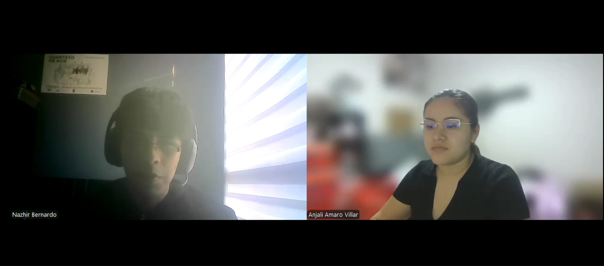 |
| Resumen |  Socio y administrador de una microempresa de soporte técnico para laptops, computadoras y celulares, a cargo de dos colaboradores y con un margen de ingresos mensual modesto de entre 2,000 y 4,000 soles. Gestiona el registro contable y las cuentas pendientes mediante hojas de cálculo manuales en Excel, enfrentando como principal obstáculo los desfases de liquidez derivados de clientes que demoran entre 15 y 30 días en liquidar sus servicios. Esta falta de caja inmediata lo ha obligado a recurrir a soluciones de emergencia poco convenientes, como microcréditos digitales con intereses cercanos al 20%, un costo financiero desproporcionado que además descarta la opción de adquirir deudas bancarias tradicionales de mayor escala. Valora de forma muy positiva la posibilidad de incorporar el factoring para anticipar el cobro de sus facturas a cambio de una comisión transparente y acotada, señalando que adoptaría esta solución si la plataforma demuestra procesos nítidos, directos y sin costos ocultos frente a las alternativas de endeudamiento rápido.                                                                                        |

<hr class="page-break">

#### Segmento 2: Inversionistas Minoristas (Personas Naturales)

**Entrevista 4**

| Atributo | Detalle                                                                                  |
| :---: |:-----------------------------------------------------------------------------------------|
| Nombre | Alessandro Hesse                                                                         |
| Edad | 22                                                                                       |
| Distrito | Surquillo                                                                                |
| Ocupación | Estudiante                                                                               |
| Fecha de entrevista | 08/09/2026                                                                               |
| Timing de inicio | 27:30 - 40:15                                                                            |
| Duración | 12:45                                                                                    |
| Enlace a la grabación | [*Ver en Microsoft Stream*](https://upcedupe-my.sharepoint.com/:v:/g/personal/u20221g044_upc_edu_pe/IQBH1rA-DTogSZAoQrPM1UIOAWCjy1cb2NoZaTQaVktAxrk?e=0XdsHP&nav=eyJyZWZlcnJhbEluZm8iOnsicmVmZXJyYWxBcHAiOiJTdHJlYW1XZWJBcHAiLCJyZWZlcnJhbFZpZXciOiJTaGFyZURpYWxvZy1MaW5rIiwicmVmZXJyYWxBcHBQbGF0Zm9ybSI6IldlYiIsInJlZmVycmFsTW9kZSI6InZpZXcifSwicGxheWJhY2tPcHRpb25zIjp7InN0YXJ0VGltZUluU2Vjb25kcyI6MTY1MC40OX19)                                                            |
| Captura de pantalla de la grabación |  |
| Resumen | Estudiante universitario de Ciencias de la Computación y aficionado a los mercados financieros, habituado a colocar tickets de entre 1,000 y 1,500 soles en vehículos tradicionales como depósitos a plazo fijo. Identifica como principal limitación el bajo rendimiento de la banca convencional frente a la rigidez de mantener su dinero inmovilizado por largos periodos, sumado a la desconfianza generada por experiencias negativas previas en fondos mutuos debido a la volatilidad imprevista. Considera que un rendimiento en torno al 8% anual justificaría la búsqueda de nuevos instrumentos. Valora de forma muy positiva incursionar en el factoring mediante la compra fraccionada de facturas por cobrar, siempre y cuando la plataforma tecnológica ofrezca respaldo institucional verificable, reglas claras sobre la gestión del riesgo de cobro y una estricta transparencia operativa que garantice el retorno puntual de los rendimientos pactados.                                                                                         |

**Entrevista 5**

| Atributo | Detalle                                                                                  |
| :---: |:-----------------------------------------------------------------------------------------|
| Nombre | Leicy Cahuana                                                                            |
| Edad | 22                                                                                       |
| Distrito | San Juan de Lurigancho                                                                   |
| Ocupación | Estudiante                                                                               |
| Fecha de entrevista | 07/09/2026                                                                               |
| Timing de inicio | 40:15 - 55:19                                                                            |
| Duración | 15:04                                                                                    |
| Enlace a la grabación | [*Ver en Microsoft Stream*](https://upcedupe-my.sharepoint.com/:v:/g/personal/u20221g044_upc_edu_pe/IQBH1rA-DTogSZAoQrPM1UIOAWCjy1cb2NoZaTQaVktAxrk?e=FHk57K&nav=eyJyZWZlcnJhbEluZm8iOnsicmVmZXJyYWxBcHAiOiJTdHJlYW1XZWJBcHAiLCJyZWZlcnJhbFZpZXciOiJTaGFyZURpYWxvZy1MaW5rIiwicmVmZXJyYWxBcHBQbGF0Zm9ybSI6IldlYiIsInJlZmVycmFsTW9kZSI6InZpZXcifSwicGxheWJhY2tPcHRpb25zIjp7InN0YXJ0VGltZUluU2Vjb25kcyI6MjQxNS45OX19)                                                            |
| Captura de pantalla de la grabación |  |
| Resumen |  Estudiante y administradora de un negocio del rubro de snacks, con un perfil de inversión orientado a la colocación directa de préstamos personales de envergadura relevante (de 30,000 a 150,000 soles) entre su red de contactos. Descarta las alternativas bancarias tradicionales por considerarlas poco rentables y tras haber enfrentado la incomodidad de mantener su capital retenido en depósitos a plazo sin suficiente flexibilidad; no obstante, reconoce que prestar a conocidos demanda un proceso de evaluación manual, largo y desgastante para mitigar el riesgo de impago. Constantemente informada a través de medios digitales especializados como podcasts y YouTube, valora de forma muy positiva la transición hacia una plataforma de factoring que fundamente la seguridad crediticia con evidencia técnica, ofrezca asignación automatizada de fondos para diversificar el riesgo de su cartera y demuestre transparencia rigurosa ante retrasos en la cobranza, respaldada por protocolos de solución claros y estructurados.                                                                                        |

**Entrevista 6**

| Atributo | Detalle                                                                                  |
| :---: |:-----------------------------------------------------------------------------------------|
| Nombre | Kalet Esteban                                                                            |
| Edad | 20                                                                                       |
| Distrito | Ate                                                                                      |
| Ocupación | Estudiante                                                                               |
| Fecha de entrevista | 07/09/2026                                                                               |
| Timing de inicio | 55:19 - 1:06:47                                                                          |
| Duración | 11:28                                                                                    |
| Enlace a la grabación | [*Ver en Microsoft Stream*](https://upcedupe-my.sharepoint.com/:v:/g/personal/u20221g044_upc_edu_pe/IQBH1rA-DTogSZAoQrPM1UIOAWCjy1cb2NoZaTQaVktAxrk?e=i6G1cy&nav=eyJyZWZlcnJhbEluZm8iOnsicmVmZXJyYWxBcHAiOiJTdHJlYW1XZWJBcHAiLCJyZWZlcnJhbFZpZXciOiJTaGFyZURpYWxvZy1MaW5rIiwicmVmZXJyYWxBcHBQbGF0Zm9ybSI6IldlYiIsInJlZmVycmFsTW9kZSI6InZpZXcifSwicGxheWJhY2tPcHRpb25zIjp7InN0YXJ0VGltZUluU2Vjb25kcyI6MzMyMC43NX19)                                                            |
| Captura de pantalla de la grabación |  |
| Resumen |  Estudiante de Ingeniería de Software y practicante que se encuentra dando sus primeros pasos en el ámbito de las inversiones con montos de entrada pequeños mediante fondos mutuos de banca tradicional. Señala como principal barrera la complejidad del lenguaje financiero técnico y la falta de claridad respecto al destino exacto y nivel de riesgo de su capital, lo que le genera desconfianza ante plataformas o instrumentos no regulados como el factoring. Valora de forma muy positiva la posibilidad de invertir desde montos mínimos accesibles con diversificación asistida, exigiendo trazabilidad continua del estado de las facturas, protocolos nítidos ante retrasos o impagos y una rentabilidad superior a la de una cuenta de ahorros que justifique el riesgo asumido.                                                                                        |

<hr class="page-break">

### 2.2.3. Análisis de entrevistas

<!-- Análisis por segmento con sustento estadístico (porcentajes) de características objetivas y subjetivas. -->

Las entrevistas en profundidad se llevaron a cabo entre el 7 y el 8 de septiembre de 2026 en Lima Metropolitana, contando con la participación de seis perfiles clave divididos equitativamente en dos grupos de interés: tres dueños/administradores de micro y pequeñas empresas (MYPES) y tres inversionistas minoristas (personas naturales). El propósito principal fue contrastar las dinámicas actuales de cobranza, liquidez e inversión, identificar las fricciones operativas más severas y validar la propuesta de valor de *Vankoo* como solución fintech orientada al adelanto y financiamiento participativo de facturas negociables.

---

**Segmento 1: Empresarios de Micro y Pequeñas Empresas (MYPES)**

**Características objetivas:**
* Emisión regular de facturación a crédito con plazos de cobro que oscilan entre 15 y 60 días: **3/3 (100%)**
* Empleo de herramientas manuales y desconectadas (hojas de cálculo en Excel y seguimiento por mensajería) para el control de cuentas por cobrar: **3/3 (100%)**
* Uso predominante del smartphone para la gestión comercial y coordinación del día a día: **3/3 (100%)**
* Recurrencia a mecanismos financieros costosos o de emergencia (tarjetas de crédito, préstamos personales o microcréditos digitales) ante la falta de caja: **3/3 (100%)**

**Características subjetivas:**
* Perciben el descalce de flujo de caja como una amenaza directa para asumir nuevos contratos y pagar nóminas/proveedores: **3/3 (100%)**
* Frustración ante la lentitud, requisitos excesivos o tasas abusivas de la banca tradicional y los créditos inmediatos: **3/3 (100%)**
* Alta disposición a adoptar el descuento de facturas si el desembolso es ágil (menor a 48 horas) y con comisiones claras: **3/3 (100%)**
* Exigen transparencia radical en el costo neto y seguimiento en tiempo real del ciclo de validación de cada comprobante: **3/3 (100%)**
* Desconocimiento previo sobre el funcionamiento técnico-legal del factoring, lo que genera cautela inicial frente a nuevos actores no bancarios: **2/3 (66.7%)**

---

**Segmento 2: Inversionistas Minoristas (Personas Naturales)**

**Características objetivas:**
* Uso habitual de canales y aplicaciones móviles (banca digital, billeteras electrónicas) para la administración de su dinero: **3/3 (100%)**
* Consumo recurrente de canales digitales (YouTube, redes sociales, podcasts) para informarse sobre finanzas y mercados: **3/3 (100%)**
* Experiencia previa con alternativas de inversión (depósitos a plazo, fondos mutuos o préstamos entre particulares): **3/3 (100%)**
* Respaldo por activos o empresas con historial crediticio formal como criterio clave de evaluación de riesgo: **3/3 (100%)**

**Características subjetivas:**
* Inconformidad con los bajos rendimientos de la banca tradicional frente a la falta de liquidez por inmovilización prolongada del capital: **3/3 (100%)**
* Reclaman claridad total sobre los escenarios de riesgo, solvencia del pagador y protocolos de cobranza ante demoras o impagos: **3/3 (100%)**
* Interés en participar del factoring mediante tickets accesibles o esquemas fraccionados con retorno a corto/mediano plazo (30 a 90 días): **3/3 (100%)**
* Inclinación por la diversificación automatizada de sus fondos para mitigar el riesgo sin complejizar la toma de decisiones: **3/3 (100%)**
* Escepticismo inicial hacia entidades no reguladas o plataformas fintech desconocidas, condicionando su ingreso a la fiabilidad de la plataforma: **3/3 (100%)**

---

A partir del cruce de hallazgos de ambos segmentos, se consolidan tres ejes estratégicos que fundamentan y orientan la construcción de *Vankoo*:

1. **La brecha de liquidez como freno sistémico:** Existe una clara complementariedad entre los dos frentes. Por un lado, las MYPES sufren asfixia financiera porque su capital queda atrapado en facturas por cobrar a 30, 45 o 60 días, perdiendo oportunidades de compra de insumos y crecimiento. Por el otro, los pequeños inversionistas cuentan con excedentes de liquidez pero se sienten estancados ante productos bancarios de escaso rendimiento y plazos rígidos. *Vankoo* actúa como puente directo entre ambas necesidades, inyectando liquidez ágil a la microempresa mediante el capital atomizado de la comunidad inversora.

2. **Validación de la propuesta de valor según segmento:**
    * **Para la MYPE:** *Vankoo* no representa un endeudamiento bancario asfixiante ni una tasa usurera de emergencia; es una herramienta ágil para convertir sus cuentas por cobrar en efectivo operativo en menos de 48 horas sin comprometer el balance del negocio.
    * **Para el Inversionista:** *Vankoo* no es un instrumento complejo de alto riesgo especulativo; es una alternativa tangible para rentabilizar ahorros a corto plazo, respaldada por comprobantes comerciales reales y con rendimientos superiores a los de las cuentas de ahorro tradicionales.

3. **Criterios técnicos y de diseño innegociables:**
    * **Cero fricción y automatización de datos:** La plataforma debe contar con lectura automática de facturas electrónicas (vía XML/SUNAT) para eliminar el tipeo manual en los empresarios y facilitar interfaces limpias y comprensibles para los inversionistas.
    * **Trazabilidad y estados en tiempo real:** Es imprescindible habilitar un panel visual donde la MYPE supervise cada hito del comprobante (validación, oferta, fondeo y desembolso) y el inversionista visualice el estado de su capital, rendimientos ganados y calendario estimado de retorno.
    * **Transparencia absoluta en costos y riesgos:** Desglose visible del costo total de la operación (comisiones netas y descuentos) sin letras pequeñas para el cedente, junto con métricas de riesgo explicadas en lenguaje sencillo y protocolos claros de cobranza para el inversionista.

**Conclusión:**
Los resultados validan sólidamente la viabilidad y necesidad de una plataforma como *Vankoo*. El núcleo del problema no reside en la falta de solvencia comercial ni en la ausencia de ahorristas dispuestos a invertir, sino en la **ineficiencia del sistema financiero tradicional para conectar ambas partes con agilidad, costos justos y tecnología accesible**. La solución debe priorizar la simplificación operativa, la transparencia informativa y una rigurosa gestión del riesgo crediticio para consolidar la confianza de ambos extremos del ecosistema.

<hr class="page-break">

## 2.3. Needfinding

El proceso de Needfinding se desarrolló a partir de la información recopilada en las entrevistas y del análisis de la competencia, con el objetivo de identificar los problemas, necesidades y oportunidades reales de los segmentos objetivo. A partir de estos hallazgos, se construyeron los siguientes artefactos que permiten comprender en profundidad a los usuarios de Vankoo, sus tareas, sus experiencias y sus emociones.

### 2.3.1. User Personas

<!-- Una ficha de User Persona por cada segmento objetivo. Herramienta: UXPressia. -->
<!-- Assets: ./assets/cap2-requirements-elicitation/user-personas/ -->

A partir del análisis de entrevistas, del estudio de la competencia y de los segmentos objetivo identificados, se definieron dos User Personas que representan a los principales usuarios de Vankoo. Cada ficha sintetiza los objetivos, frustraciones y comportamientos más recurrentes de su segmento, y sirve de referencia para la priorización de funcionalidades y el diseño de las historias de usuario.

**User Persona MYPE**

User persona del segmento objetivo MYPES: representada por **Carlos, el empresario MYPE**, dueño de una micro o pequeña empresa que busca obtener liquidez inmediata de forma rápida y simple para la operatividad de su negocio, sin necesidad de conocimientos financieros avanzados.


**User Persona Inversionista**

User persona del segmento de Inversionistas: representada por **Sofía, la inversionista**, profesional interesada en invertir su capital en MYPEs con la expectativa de obtener rentabilidad, y que valora la transparencia, la seguridad y la información confiable de cada oportunidad.


### 2.3.2. User Task Matrix

<!-- Columna por User Persona con sub-columnas Frecuencia e Importancia; filas: tareas identificadas. -->
<!-- Assets: ./assets/cap2-requirements-elicitation/user-task-matrix/ -->

A continuación, se presenta el User task matrix donde se compara las tareas de cada segmento.

| Tareas | Empresario MYPE (Carlos) Frecuencia | Empresario MYPE (Carlos) Importancia | Inversionista (Sofía) Frecuencia | Inversionista (Sofía) Importancia |
|---|---|---|---|---|
| Monitorear el flujo de caja disponible | Alta | Alta | Media | Media |
| Gestionar la cobranza de facturas | Alta | Alta | Baja | Baja |
| Buscar fuentes de financiamiento | Media | Alta | Baja | Baja |
| Evaluar oportunidades de inversión | Baja | Baja | Alta | Alta |
| Analizar el riesgo de contraparte | Media | Alta | Alta | Alta |
| Ejecutar pagos o transferencias | Alta | Alta | Media | Alta |
| Gestionar documentos tributarios | Alta | Media | Baja | Baja |
| Monitorear el retorno de capital | Baja | Baja | Alta | Alta |
| Buscar educación financiera | Baja | Media | Media | Media |

A partir de la matriz presentada, se identifican los siguientes puntos claves que fundamentan el diseño de Vankoo:  
Mientras Carlos (MYPE) concentra sus tareas de mayor frecuencia e importancia en la gestión reactiva de cobranza y flujo de caja para garantizar la operatividad de su negocio, Sofía (Inversionista) realiza tareas proactivas de evaluación y monitoreo de rentabilidad. A pesar de estas diferencias en sus objetivos, ambos perfiles coinciden en asignar una importancia crítica al análisis de riesgo y la ejecución segura de transacciones, lo que confirma que la propuesta de valor de Vankoo reside en conectar eficazmente la necesidad urgente de liquidez del primero con la demanda de inversión de la segunda, utilizando la tecnología para garantizar la confianza que ambos requieren.

### 2.3.3. User Journey Mapping

<!-- Un User Journey Map As-Is por cada User Persona. Herramienta: UXPressia. -->
<!-- Assets: ./assets/cap2-requirements-elicitation/user-journey-mapping/ -->

A continuación, se presenta el User task matrix donde se compara las tareas de cada segmento.

En esta sección se presentan los User Journey Maps en su versión As-Is para los dos segmentos de usuario identificados: Carlos (Empresario MYPE) y Sofía (Inversionista Minorista). Estos diagramas ilustran el viaje de extremo a extremo (end-to-end journey) que experimentan actualmente en el ecosistema financiero peruano. Se detallan los puntos de contacto, los procesos manuales, las barreras de entrada y las frustraciones derivadas de la exclusión bancaria y la falta de alternativas digitales ágiles, evidenciando la oportunidad de diseño antes de la existencia de Vankoo.

**User Journey Map - Empresario MYPE (Carlos)**

El journey de Carlos inicia con el registro de una venta y la emisión de su factura, continúa con la espera del pago que se extiende más allá de los plazos legales y termina con su frustración al enfrentar la falta de liquidez para cubrir sus gastos operativos. Durante el recorrido se evidencian puntos de dolor como el acceso limitado al crédito bancario, los requisitos de garantía rígidos y la dependencia de procesos manuales para gestionar sus cuentas por cobrar.


**User Journey Map - Inversionista (Sofía)**

El journey de Sofía inicia con la búsqueda de opciones de inversión rentables, pasa por la comparación de alternativas tradicionales y finaliza con la limitación de destinar su capital a productos con baja rentabilidad o altas barreras de entrada. Durante el recorrido se evidencian puntos de dolor como la poca transparencia de información, los montos mínimos elevados y la falta de herramientas digitales que le permitan monitorear sus inversiones en tiempo real.


### 2.3.4. Empathy Mapping

<!-- Un Empathy Map por cada User Persona. Herramienta: UXPressia. -->
<!-- Assets: ./assets/cap2-requirements-elicitation/empathy-mapping/ -->

Para profundizar en las emociones, pensamientos y contexto de cada User Persona más allá de sus tareas, se elaboraron dos Empathy Maps en UXPressia. Cada mapa documenta qué piensa, siente, ve, oye, dice y hace el usuario, además de sus pains y gains, orientando el diseño de la solución.

**Empathy Map - Empresario MYPE (Carlos)**

El mapa evidencia a un empresario racional y pragmático, motivado por dar estabilidad a su familia y a su equipo, frustrado por la burocracia bancaria y la incertidumbre del cobro a sus clientes, y que valora la liquidez inmediata sin comprometerse con deuda a largo plazo.


**Empathy Map - Inversionista (Sofía)**

El mapa evidencia a una profesional analítica y ordenada, motivada por alcanzar la libertad financiera, frustrada por la pérdida de valor real de sus ahorros y la falta de transparencia de la banca tradicional, y que valora invertir de forma 100% digital y con impacto positivo.


### 2.3.5. As-is Scenario Mapping

<!-- Filas: Phases, Doing, Thinking y Feeling. Herramienta: LucidChart / Miro. -->
<!-- Assets: ./assets/cap2-requirements-elicitation/as-is-scenario-mapping/ -->

El As-Is Scenario Map, elaborado en Miro para cada User Persona, ordena su recorrido actual en fases con las filas Doing, Thinking y Feeling, etiquetando además áreas positivas, negativas y blank areas que orientan qué aspectos del proceso el equipo necesita seguir investigando.

**As-Is Scenario Map - Empresario MYPE (Carlos)**

El mapa evidencia un recorrido mayormente negativo: solo la emisión de la factura resulta neutral, mientras que la espera del pago, la búsqueda de liquidez de emergencia y su alto costo generan ansiedad, frustración e insatisfacción.


**As-Is Scenario Map - Inversionista (Sofía)**

El mapa evidencia un recorrido que inicia positivo por la motivación de hacer crecer sus ahorros, pero se vuelve negativo al comparar alternativas rígidas y opacas, y cierra en una inversión conservadora con seguimiento limitado.


<hr class="page-break">

## 2.4. Ubiquitous Language

<!-- Glosario de términos del dominio (en inglés, con equivalente en español entre paréntesis). No incluir términos técnicos de ingeniería de software. -->

| Término (EN) | Término (ES) | Definición |
|--------------|--------------|------------|
| **MYPE** | Micro y Pequeña Empresa | Empresa de pequeña escala que utiliza la plataforma para obtener liquidez mediante el adelanto o financiamiento de sus facturas por cobrar. |
| **Investor** | Inversionista | Persona natural que aporta capital para financiar una o varias facturas con el objetivo de obtener un rendimiento en un plazo determinado. |
| **Invoice** | Factura | Comprobante de pago emitido por una MYPE a un cliente por la venta de un bien o servicio, que representa un derecho de cobro futuro. |
| **Negotiable Invoice** | Factura Negociable | Factura que puede ser transferida a un tercero para obtener liquidez antes de su fecha de vencimiento. |
| **Payer** | Pagador | Empresa o entidad obligada a realizar el pago de una factura en la fecha establecida. |
| **Invoice Assignment** | Cesión de Factura | Proceso mediante el cual los derechos de cobro de una factura son transferidos para obtener financiamiento. |
| **Factoring** | Factoring | Operación financiera mediante la cual una empresa obtiene liquidez anticipada a cambio de ceder sus facturas por cobrar. |
| **Crowdfactoring** | Crowdfactoring | Modalidad de financiamiento participativo en la que varios inversionistas aportan capital para financiar una factura o parte de ella. |
| **Funding** | Fondeo | Proceso mediante el cual una factura recibe los recursos necesarios por parte de uno o varios inversionistas hasta alcanzar el monto requerido. |
| **Risk Score** | Puntaje de Riesgo | Indicador generado a partir del análisis de información financiera y comercial para estimar el nivel de riesgo asociado a una operación. |
| **AI Risk Scoring** | Scoring de Riesgo mediante IA | Evaluación automatizada que utiliza inteligencia artificial para estimar la probabilidad de pago de una factura, considerando principalmente las características del pagador. |
| **Invoice Fraction** | Fracción de Factura | Parte de una factura que puede ser financiada individualmente por un inversionista, permitiendo reducir el monto mínimo de participación. |
| **Tokenization** | Tokenización | Mecanismo mediante el cual una factura puede representarse y dividirse digitalmente en participaciones de menor valor para facilitar su financiamiento colectivo. |
| **Funding Marketplace** | Marketplace de Financiamiento | Espacio digital donde se publican facturas disponibles para financiamiento y los inversionistas pueden seleccionar las operaciones en las que desean participar. |
| **Investment** | Inversión | Capital aportado por un inversionista para financiar una factura, con la expectativa de recuperar el monto aportado más el rendimiento correspondiente. |
| **Return** | Retorno | Monto que recibe el inversionista al finalizar una operación, incluyendo el capital invertido y el rendimiento generado según las condiciones establecidas. |
| **Maturity Date** | Fecha de Vencimiento | Fecha límite establecida para que el pagador cumpla con el pago de la factura. |
| **Liquidity** | Liquidez | Disponibilidad de dinero en efectivo que permite a una empresa cubrir sus obligaciones y continuar con sus operaciones. |
| **Early Payment** | Adelanto de Factura | Obtención anticipada del dinero correspondiente a una factura antes de su fecha de vencimiento. |
| **Traceability** | Trazabilidad | Capacidad de consultar y seguir el estado y los eventos asociados a una factura desde su registro hasta su pago. |
| **Event Sourcing** | Registro de Eventos | Arquitectura que conserva los eventos generados durante el ciclo de vida de una operación, permitiendo reconstruir y consultar su historial. |
| **Green Factoring** | Factoring Verde | Modalidad que incorpora criterios de sostenibilidad para identificar operaciones relacionadas con empresas o actividades que generan un impacto ambiental positivo. |
| **Digital Signature** | Firma Digital | Mecanismo electrónico utilizado para validar la identidad y expresar la aceptación de un usuario en una operación dentro de la plataforma. |
| **CAVALI** | CAVALI | Institución encargada de administrar el registro, compensación y liquidación de valores y otros instrumentos financieros, incluyendo procesos relacionados con facturas negociables. |
| **SUNAT** | SUNAT | Entidad encargada de la administración tributaria en el Perú, cuya información y sistemas intervienen en la emisión y validación de comprobantes electrónicos. |
| **Settlement** | Liquidación | Proceso mediante el cual se completa la transferencia de los fondos correspondientes a una operación de financiamiento. |
| **Default** | Incumplimiento | Situación en la que el pagador no cumple con el pago de la factura dentro del plazo establecido. |

<hr class="page-break">

# Capítulo III: Requirements Specification

Tomando como base las conclusiones de las entrevistas, el proceso de Needfinding y los perfiles de usuario del capítulo previo, en este apartado se transforman dichos hallazgos en la definición técnica y funcional de las soluciones digitales de Vankoo. El recorrido comienza proyectando el contexto operativo futuro de cada actor por medio del To-Be Scenario Mapping, el cual resalta las mejoras y transformaciones que la plataforma aporta en contraste con la situación actual (As-Is). A partir de este punto, se despliegan las historias de usuario que estructuran las capacidades del sistema, el mapeo de impacto (Impact Mapping) que vincula las metas comerciales con los cambios de comportamiento esperados en cada perfil, y finalmente el Product Backlog, encargado de ordenar y jerarquizar los elementos de cara a la fase de construcción.

## 3.1. To-Be Scenario Mapping

El diagrama de situación futura (To-Be Scenario Map), emplea idénticas etapas a las del modelo previo (As-Is) para cada perfil de usuario, evidenciando de qué manera Vankoo optimiza sus acciones, pensamientos y emociones en cada momento, mientras sintetiza en el lateral las mejoras prácticas que la herramienta introduce respecto al flujo tradicional.

**To-Be Scenario Map - Empresario MYPE (Carlos)**

El esquema ilustra una experiencia completamente favorable: gracias a Vankoo, Carlos deja atrás la larga espera de cobros y los créditos de altos intereses para obtener liquidez en un plazo inferior a dos días, respaldado por tarifas claras desde el primer instante.

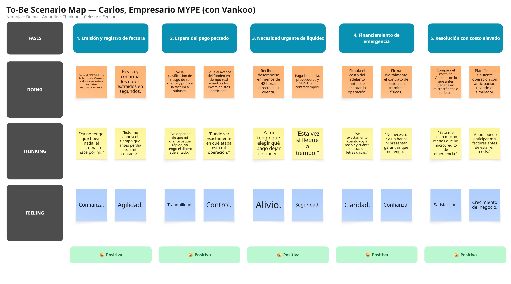

**To-Be Scenario Map - Inversionista (Sofia)**

El diagrama presenta una evolución totalmente favorable: mediante Vankoo, Sofía abandona las inversiones a ciegas en instrumentos rígidos para diversificar desde S/100 con riesgos claros y monitoreo en tiempo real.


<hr class="page-break">

## 3.2. User Stories

<!-- Un cuadro para todo el conjunto de Epics / User Stories. Incluir Technical Stories (rol Developer) y Spike Stories. Acceptance Criteria en formato Gherkin (Given-When-Then). -->

A partir de los segmentos objetivo, los User Personas (Carlos, el empresario MYPE; Sofía, la inversionista) y el To-Be Scenario Mapping, se especificaron los requisitos de Vankoo como un conjunto de Epics y User Stories. Las Epics agrupan las historias por producto y bounded context: Landing Page (visitante), gestión de acceso (IAM), gestión de facturas y publicación en subasta (aplicación web de la MYPE), billetera y mercado (aplicación móvil del inversionista), y las Technical Stories del backend de microservicios (rol Developer). El alcance de esta entrega corresponde al flujo mínimo usable de extremo a extremo: la MYPE inicia sesión, sube una factura, revisa su detalle y la publica en subasta; el inversionista inicia sesión, recarga su saldo, explora el mercado e invierte. Cada historia incluye sus criterios de aceptación en formato Gherkin (Given-When-Then), redactados en tiempo presente y sin referencia a detalles de interfaz.

| Story ID | User | Priority | Epic |
|----------|------|----------|------|
| **EP01** | Visitante | Alta | Landing Page |
| **Title** | Presentación de Vankoo a MYPES e inversionistas | | |
| **Description** | Como visitante, deseo conocer qué es Vankoo, cómo funciona y a quién está dirigido, para decidir si registrarme como empresario MYPE o como inversionista. | | |
| **Acceptance Criteria** | Se satisface cuando se cumplen los criterios de las User Stories que la componen. | | |
| **EP02** | Empresario MYPE / Inversionista | Alta | Gestión de acceso (IAM) |
| **Title** | Registro, inicio de sesión y recuperación de contraseña | | |
| **Description** | Como usuario de Vankoo, deseo crear una cuenta, iniciar sesión y recuperar mi contraseña, para acceder de forma segura a la aplicación que corresponde a mi rol. | | |
| **Acceptance Criteria** | Se satisface cuando se cumplen los criterios de las User Stories que la componen. | | |
| **EP03** | Empresario MYPE | Alta | Gestión de facturas (Invoicing) |
| **Title** | Carga y seguimiento de facturas electrónicas | | |
| **Description** | Como empresario MYPE, deseo subir mis facturas electrónicas y seguir su proceso de validación, para saber cuáles pueden salir a financiamiento. | | |
| **Acceptance Criteria** | Se satisface cuando se cumplen los criterios de las User Stories que la componen. | | |
| **EP04** | Empresario MYPE | Alta | Publicación en subasta (Investment) |
| **Title** | Oferta de financiamiento y publicación de la factura | | |
| **Description** | Como empresario MYPE, deseo revisar la oferta de financiamiento de una factura aprobada y aceptarla, para publicarla en el mercado y obtener liquidez. | | |
| **Acceptance Criteria** | Se satisface cuando se cumplen los criterios de las User Stories que la componen. | | |
| **EP05** | Inversionista | Alta | Billetera (Finance) |
| **Title** | Saldo y recargas del inversionista | | |
| **Description** | Como inversionista, deseo consultar mi saldo y recargarlo con tarjeta, para contar con fondos disponibles al momento de invertir. | | |
| **Acceptance Criteria** | Se satisface cuando se cumplen los criterios de las User Stories que la componen. | | |
| **EP06** | Inversionista | Alta | Mercado e inversión (Investment) |
| **Title** | Exploración del mercado e inversión en facturas | | |
| **Description** | Como inversionista, deseo explorar las facturas en subasta, entender su rendimiento y riesgo, e invertir en ellas, para rentabilizar mi capital a corto plazo. | | |
| **Acceptance Criteria** | Se satisface cuando se cumplen los criterios de las User Stories que la componen. | | |
| **EP07** | Developer | Alta | Plataforma y servicios (Technical Stories) |
| **Title** | Backend de microservicios, gateway y documentación | | |
| **Description** | Como developer, deseo contar con servicios RESTful documentados, un punto de entrada único y una infraestructura reproducible, para que las aplicaciones web y móvil consuman la plataforma de forma segura y consistente. | | |
| **Acceptance Criteria** | Se satisface cuando se cumplen los criterios de las User Stories que la componen. | | |
| **US01** | Visitante | Alta | EP01 – Landing Page |
| **Title** | Conocer la propuesta de valor de Vankoo | | |
| **Description** | Como visitante, deseo ver en la página principal qué es Vankoo y qué beneficio ofrece a cada segmento, para entender rápidamente si la plataforma resuelve mi necesidad. | | |
| **Acceptance Criteria** | **Escenario 1: Sección principal**<br>Given el visitante ingresa a la landing page<br>When carga la página<br>Then visualiza el mensaje principal de la propuesta de valor y una llamada a la acción para registrarse<br><br>**Escenario 2: Contenido por audiencia**<br>Given el visitante se encuentra en la sección de audiencias<br>When selecciona la pestaña de MYPE o de Inversionista<br>Then visualiza los beneficios y el flujo específico para ese segmento | | |
| **US02** | Visitante | Alta | EP01 – Landing Page |
| **Title** | Entender cómo funciona el financiamiento de facturas | | |
| **Description** | Como visitante, deseo ver los pasos del proceso (subir factura, validación, subasta, fondeo y cobro) y las preguntas frecuentes, para comprender cómo opera Vankoo antes de registrarme. | | |
| **Acceptance Criteria** | **Escenario 1: Pasos del proceso**<br>Given el visitante navega a la sección "Cómo funciona"<br>When recorre la sección<br>Then visualiza los pasos del proceso en orden, con una descripción breve de cada uno<br><br>**Escenario 2: Preguntas frecuentes**<br>Given el visitante se encuentra en la sección de preguntas frecuentes<br>When selecciona una pregunta<br>Then se muestra la respuesta correspondiente sin abandonar la página | | |
| **US03** | Visitante | Media | EP01 – Landing Page |
| **Title** | Simular el adelanto de una factura | | |
| **Description** | Como visitante del segmento MYPE, deseo ingresar el monto y plazo de una factura en la calculadora, para estimar cuánto recibiría y cuál sería el costo del financiamiento. | | |
| **Acceptance Criteria** | **Escenario 1: Cálculo del adelanto**<br>Given el visitante se encuentra en la calculadora<br>When ingresa el monto de la factura y el plazo<br>Then se muestra el monto estimado a recibir, el costo y la tasa efectiva anual (TCEA) del adelanto<br><br>**Escenario 2: Actualización inmediata**<br>Given el visitante ya realizó una simulación<br>When modifica el monto o el plazo<br>Then los resultados se recalculan sin recargar la página | | |
| **US04** | Visitante | Media | EP01 – Landing Page |
| **Title** | Navegar la landing page en mi idioma y desde cualquier dispositivo | | |
| **Description** | Como visitante, deseo cambiar el idioma entre español e inglés y navegar desde el móvil o escritorio, para consultar la información con comodidad. | | |
| **Acceptance Criteria** | **Escenario 1: Cambio de idioma**<br>Given el visitante se encuentra en cualquier sección de la landing page<br>When selecciona el idioma inglés<br>Then todo el contenido se muestra en inglés y la URL refleja el idioma seleccionado<br><br>**Escenario 2: Navegación responsive**<br>Given el visitante accede desde un dispositivo móvil<br>When abre el menú de navegación<br>Then puede desplazarse a cada sección de la página y el contenido se adapta al ancho de pantalla | | |
| **US05** | Empresario MYPE | Alta | EP02 – Gestión de acceso (IAM) |
| **Title** | Registrarme en la aplicación web | | |
| **Description** | Como empresario MYPE, deseo crear una cuenta con mi correo y contraseña, para acceder a la gestión de mis facturas. | | |
| **Acceptance Criteria** | **Escenario 1: Registro exitoso**<br>Given el empresario se encuentra en la pantalla de registro<br>When ingresa un correo válido no registrado y una contraseña que cumple la política<br>Then el sistema crea la cuenta con el rol MYPE e inicia la sesión automáticamente<br><br>**Escenario 2: Correo ya registrado**<br>Given el empresario se encuentra en la pantalla de registro<br>When ingresa un correo que ya existe<br>Then el sistema informa que el correo ya está en uso y no crea la cuenta | | |
| **US06** | Empresario MYPE | Alta | EP02 – Gestión de acceso (IAM) |
| **Title** | Iniciar sesión en la aplicación web | | |
| **Description** | Como empresario MYPE, deseo iniciar sesión con mi correo y contraseña, para acceder a mis facturas de forma segura. | | |
| **Acceptance Criteria** | **Escenario 1: Credenciales válidas**<br>Given el empresario tiene una cuenta activa<br>When ingresa su correo y contraseña correctos<br>Then el sistema inicia la sesión, emite un token de acceso y lo lleva a su bandeja de facturas<br><br>**Escenario 2: Credenciales inválidas**<br>Given el empresario se encuentra en la pantalla de inicio de sesión<br>When ingresa una contraseña incorrecta<br>Then el sistema muestra un mensaje de error y no inicia la sesión<br><br>**Escenario 3: Acceso protegido**<br>Given el empresario no tiene una sesión activa<br>When intenta abrir una ruta interna de la aplicación<br>Then el sistema lo redirige a la pantalla de inicio de sesión | | |
| **US08** | Inversionista | Alta | EP02 – Gestión de acceso (IAM) |
| **Title** | Registrarme en la aplicación móvil | | |
| **Description** | Como inversionista, deseo crear una cuenta desde mi celular, para empezar a invertir en facturas. | | |
| **Acceptance Criteria** | **Escenario 1: Registro exitoso**<br>Given el inversionista se encuentra en la pantalla de registro<br>When ingresa un correo válido no registrado y una contraseña que cumple la política<br>Then el sistema crea la cuenta con el rol Inversionista, inicia la sesión y lo lleva a la pantalla de inicio<br><br>**Escenario 2: Datos inválidos**<br>Given el inversionista se encuentra en la pantalla de registro<br>When ingresa un correo con formato inválido o una contraseña débil<br>Then el sistema señala el campo con error y no envía la solicitud | | |
| **US09** | Inversionista | Alta | EP02 – Gestión de acceso (IAM) |
| **Title** | Iniciar sesión en la aplicación móvil | | |
| **Description** | Como inversionista, deseo iniciar sesión con mi correo y contraseña, para acceder a mi billetera y al mercado. | | |
| **Acceptance Criteria** | **Escenario 1: Credenciales válidas**<br>Given el inversionista tiene una cuenta activa<br>When ingresa su correo y contraseña correctos<br>Then el sistema inicia la sesión, conserva el token en el dispositivo y muestra la pantalla de inicio<br><br>**Escenario 2: Sesión persistente**<br>Given el inversionista inició sesión previamente y no cerró sesión<br>When vuelve a abrir la aplicación<br>Then el sistema restaura la sesión sin pedir credenciales<br><br>**Escenario 3: Cerrar sesión**<br>Given el inversionista tiene una sesión activa<br>When selecciona cerrar sesión<br>Then el sistema elimina el token del dispositivo y vuelve a la pantalla de inicio de sesión | | |
| **US11** | Empresario MYPE | Alta | EP03 – Gestión de facturas (Invoicing) |
| **Title** | Subir una factura electrónica | | |
| **Description** | Como empresario MYPE, deseo subir el PDF de una factura electrónica emitida en SUNAT, para que Vankoo extraiga sus datos sin que yo tenga que digitarlos. | | |
| **Acceptance Criteria** | **Escenario 1: Carga exitosa**<br>Given el empresario tiene una sesión activa y se encuentra en la pantalla de carga<br>When selecciona o arrastra un archivo PDF de factura y confirma la carga<br>Then el sistema registra la factura en estado Recibida, inicia la lectura automática de datos y muestra el progreso del proceso<br><br>**Escenario 2: Archivo no válido**<br>Given el empresario se encuentra en la pantalla de carga<br>When selecciona un archivo que no es PDF<br>Then el sistema rechaza el archivo e indica el formato aceptado<br><br>**Escenario 3: Lectura de datos**<br>Given una factura fue recibida<br>When el proceso de lectura automática finaliza<br>Then la factura pasa al estado Validando con SUNAT y sus datos extraídos quedan disponibles en el detalle | | |
| **US12** | Empresario MYPE | Alta | EP03 – Gestión de facturas (Invoicing) |
| **Title** | Ver mis facturas | | |
| **Description** | Como empresario MYPE, deseo ver el listado de las facturas que subí con su estado actual, para hacer seguimiento a cada una. | | |
| **Acceptance Criteria** | **Escenario 1: Listado de facturas**<br>Given el empresario tiene facturas registradas<br>When abre la bandeja de facturas<br>Then el sistema muestra cada factura con su número, pagador, importe, fecha de vencimiento y estado<br><br>**Escenario 2: Sin facturas**<br>Given el empresario no ha subido ninguna factura<br>When abre la bandeja de facturas<br>Then el sistema muestra un estado vacío con la opción de subir la primera factura<br><br>**Escenario 3: Acceso al detalle**<br>Given el empresario se encuentra en la bandeja de facturas<br>When selecciona una factura<br>Then el sistema abre el detalle de esa factura | | |
| **US13** | Empresario MYPE | Alta | EP03 – Gestión de facturas (Invoicing) |
| **Title** | Ver el detalle y el progreso de una factura | | |
| **Description** | Como empresario MYPE, deseo ver los datos leídos de una factura, sus ítems y en qué paso del proceso se encuentra, para saber si necesita mi intervención. | | |
| **Acceptance Criteria** | **Escenario 1: Datos extraídos**<br>Given una factura ya fue leída<br>When el empresario abre su detalle<br>Then el sistema muestra emisor, RUC, pagador, fechas, moneda, importe, ítems y totales extraídos, y permite ver el PDF original<br><br>**Escenario 2: Progreso del proceso**<br>Given el empresario se encuentra en el detalle de una factura<br>When consulta el indicador de progreso<br>Then el sistema muestra el paso actual entre Recibida, Leyendo datos, Validando con SUNAT, Aprobada y En subasta, con una explicación de si avanza automáticamente o requiere acción<br><br>**Escenario 3: Factura observada**<br>Given una factura quedó en estado Requiere revisión o No elegible<br>When el empresario abre su detalle<br>Then el sistema muestra el motivo de la observación y la factura no continúa el proceso automáticamente | | |
| **US14** | Empresario MYPE | Alta | EP04 – Publicación en subasta (Investment) |
| **Title** | Revisar la oferta de financiamiento de una factura aprobada | | |
| **Description** | Como empresario MYPE, deseo ver la oferta de financiamiento generada para una factura aprobada, para conocer cuánto recibiría y en qué condiciones antes de publicarla. | | |
| **Acceptance Criteria** | **Escenario 1: Oferta disponible**<br>Given una factura fue aprobada y su subasta se encuentra en borrador<br>When el empresario abre el detalle de la factura<br>Then el sistema muestra la oferta vigente con importe de la factura, porcentaje de descuento, comisión de Vankoo, neto a recibir, TCEA, plazo y fecha de validez<br><br>**Escenario 2: Evaluación en curso**<br>Given una factura fue aprobada pero su evaluación de riesgo aún no concluye<br>When el empresario abre el detalle de la factura<br>Then el sistema indica que la oferta está en preparación y la actualiza automáticamente cuando queda disponible<br><br>**Escenario 3: Oferta vencida**<br>Given la oferta mostrada dejó de estar vigente<br>When el empresario intenta aceptarla<br>Then el sistema informa que la oferta ya no está vigente y muestra la oferta actual | | |
| **US15** | Empresario MYPE | Alta | EP04 – Publicación en subasta (Investment) |
| **Title** | Aceptar la oferta y publicar la factura en subasta | | |
| **Description** | Como empresario MYPE, deseo aceptar la oferta de financiamiento, para que mi factura se publique en el mercado y los inversionistas puedan fondearla. | | |
| **Acceptance Criteria** | **Escenario 1: Confirmación de publicación**<br>Given el empresario tiene una oferta vigente para una factura<br>When selecciona aceptar la oferta<br>Then el sistema solicita confirmación indicando el monto que recibirá en su billetera cuando la subasta se financie<br><br>**Escenario 2: Publicación exitosa**<br>Given el empresario confirmó la aceptación de la oferta<br>When el sistema procesa la aceptación<br>Then la subasta pasa al estado Publicada, la factura se muestra como En subasta con su fecha de publicación y el avance del fondeo<br><br>**Escenario 3: Factura próxima a vencer**<br>Given la factura vence en un plazo menor al mínimo permitido<br>When el empresario intenta publicarla<br>Then el sistema informa que la factura vence demasiado pronto para abrir una subasta y no la publica | | |
| **US16** | Inversionista | Alta | EP05 – Billetera (Finance) |
| **Title** | Ver el saldo y los movimientos de mi billetera | | |
| **Description** | Como inversionista, deseo ver cuánto saldo tengo disponible para invertir y el historial de movimientos, para controlar mis fondos. | | |
| **Acceptance Criteria** | **Escenario 1: Saldo disponible**<br>Given el inversionista tiene una sesión activa<br>When abre la pestaña Billetera<br>Then el sistema muestra el saldo disponible para invertir en soles y el listado de movimientos más recientes<br><br>**Escenario 2: Historial de movimientos**<br>Given el inversionista tiene más movimientos de los que se muestran<br>When selecciona ver más movimientos<br>Then el sistema carga los siguientes movimientos indicando tipo (recarga, inversión, retiro, comisión), monto y fecha<br><br>**Escenario 3: Billetera vacía**<br>Given el inversionista no tiene saldo ni movimientos<br>When abre la pestaña Billetera<br>Then el sistema indica que debe recargar para empezar y el monto mínimo de inversión por factura | | |
| **US17** | Inversionista | Alta | EP05 – Billetera (Finance) |
| **Title** | Recargar saldo con tarjeta | | |
| **Description** | Como inversionista, deseo recargar mi billetera pagando con tarjeta a través de un proveedor de pagos seguro, para disponer de fondos e invertir. | | |
| **Acceptance Criteria** | **Escenario 1: Inicio de recarga**<br>Given el inversionista se encuentra en la pantalla de recarga<br>When ingresa un monto válido y confirma<br>Then el sistema crea un depósito pendiente y abre la página de pago segura del proveedor (Stripe) en el navegador<br><br>**Escenario 2: Pago confirmado**<br>Given el inversionista completó el pago en la página del proveedor<br>When el proveedor notifica el pago exitoso<br>Then el sistema acredita el monto en la billetera, registra el movimiento como Recarga y actualiza el saldo mostrado<br><br>**Escenario 3: Pago no completado o rechazado**<br>Given el inversionista abandonó la página de pago o el pago fue rechazado<br>When vuelve a la aplicación<br>Then el sistema informa que el saldo no cambió, explica el motivo cuando existe y permite reintentar o volver a la billetera | | |
| **US18** | Inversionista | Alta | EP06 – Mercado e inversión (Investment) |
| **Title** | Explorar el mercado de facturas en subasta | | |
| **Description** | Como inversionista, deseo ver las facturas publicadas en subasta con su rendimiento, plazo y nivel de riesgo, para elegir en cuál invertir. | | |
| **Acceptance Criteria** | **Escenario 1: Listado del mercado**<br>Given existen subastas publicadas<br>When el inversionista abre la pestaña Mercado<br>Then el sistema muestra cada subasta con el pagador, importe objetivo, porcentaje fondeado, TEA, plazo, grado de riesgo y si es factura verde<br><br>**Escenario 2: Filtros**<br>Given el inversionista se encuentra en el mercado<br>When aplica el filtro Verdes o Vencen pronto<br>Then el sistema muestra únicamente las subastas que cumplen el criterio seleccionado<br><br>**Escenario 3: Mercado vacío**<br>Given no existen subastas publicadas<br>When el inversionista abre la pestaña Mercado<br>Then el sistema indica que ninguna factura está buscando financiación en ese momento | | |
| **US19** | Inversionista | Alta | EP06 – Mercado e inversión (Investment) |
| **Title** | Ver el detalle de una subasta | | |
| **Description** | Como inversionista, deseo ver el detalle de una subasta con cómo se reparte el importe, el rendimiento esperado y los datos de la factura, para evaluar la oportunidad. | | |
| **Acceptance Criteria** | **Escenario 1: Detalle de la subasta**<br>Given el inversionista se encuentra en el mercado<br>When selecciona una subasta<br>Then el sistema muestra el objetivo, lo fondeado, lo que falta por fondear, el reparto (importe, descuento, neto para la MYPE, comisión), el rendimiento esperado, el RUC del pagador y la fecha de vencimiento<br><br>**Escenario 2: Subasta ya no disponible**<br>Given la subasta fue fondeada por completo, vencida o cancelada<br>When el inversionista abre su detalle<br>Then el sistema informa el estado y ofrece volver al mercado sin permitir invertir | | |
| **US20** | Inversionista | Alta | EP06 – Mercado e inversión (Investment) |
| **Title** | Invertir en una subasta | | |
| **Description** | Como inversionista, deseo indicar el monto a invertir y confirmar la inversión, para que se descuente de mi billetera y participe en el fondeo de la factura. | | |
| **Acceptance Criteria** | **Escenario 1: Inversión exitosa**<br>Given el inversionista tiene saldo suficiente y la subasta está publicada<br>When ingresa un monto mayor o igual al mínimo, menor o igual al restante por fondear, y confirma<br>Then el sistema debita el monto de la billetera, registra la inversión en la subasta, actualiza el porcentaje fondeado y muestra la participación y la devolución esperada<br><br>**Escenario 2: Saldo insuficiente**<br>Given el inversionista tiene un saldo menor al monto ingresado<br>When intenta confirmar la inversión<br>Then el sistema informa cuánto le falta y no realiza la inversión<br><br>**Escenario 3: Monto fuera de rango**<br>Given el inversionista se encuentra en la pantalla de confirmación<br>When ingresa un monto menor al mínimo o mayor a lo que falta por fondear<br>Then el sistema señala el límite correspondiente y no habilita la confirmación<br><br>**Escenario 4: Reintento seguro**<br>Given una inversión se envió y la respuesta no llegó<br>When el inversionista vuelve a confirmar la misma inversión<br>Then el sistema no duplica el débito ni la inversión gracias a la clave de idempotencia | | |
| **TS01** | Developer | Alta | EP07 – Plataforma y servicios (Technical Stories) |
| **Title** | Registro y descubrimiento de servicios | | |
| **Description** | Como developer, deseo que cada microservicio se registre en un Discovery Server, para que el API Gateway los ubique dinámicamente sin direcciones fijas. | | |
| **Acceptance Criteria** | **Escenario 1: Registro de instancias**<br>Given el Discovery Server está en ejecución<br>When un microservicio arranca<br>Then se registra con su nombre lógico y aparece en el listado de instancias del Discovery Server<br><br>**Escenario 2: Resolución por nombre**<br>Given un servicio está registrado<br>When el API Gateway enruta una petición hacia ese servicio<br>Then resuelve la instancia por su nombre lógico y balancea entre las instancias disponibles | | |
| **TS02** | Developer | Alta | EP07 – Plataforma y servicios (Technical Stories) |
| **Title** | Punto de entrada único con validación de JWT | | |
| **Description** | Como developer, deseo un API Gateway que enrute las peticiones por prefijo y valide el token JWT, para que los servicios internos confíen en la identidad inyectada. | | |
| **Acceptance Criteria** | **Escenario 1: Enrutamiento por prefijo**<br>Given el gateway está en ejecución<br>When recibe una petición con prefijo /iam, /invoicing, /investment o /finance<br>Then elimina el prefijo y reenvía la petición al servicio correspondiente<br><br>**Escenario 2: Ruta protegida sin token**<br>Given una ruta requiere autenticación<br>When llega una petición sin token o con token inválido<br>Then el gateway responde 401 con un cuerpo problem+json y no reenvía la petición<br><br>**Escenario 3: Identidad inyectada**<br>Given llega una petición con un token válido a una ruta protegida<br>When el gateway la reenvía<br>Then agrega las cabeceras X-User-Id, X-User-Email y X-User-Roles para el servicio destino | | |
| **TS03** | Developer | Alta | EP07 – Plataforma y servicios (Technical Stories) |
| **Title** | Servicio de identidad y acceso (IAM) | | |
| **Description** | Como developer, deseo endpoints de registro, inicio de sesión, recuperación y restablecimiento de contraseña que emitan tokens JWT, para autenticar a los usuarios de la web y del móvil. | | |
| **Acceptance Criteria** | **Escenario 1: Emisión de token**<br>Given existe un usuario registrado<br>When se invoca sign-in con credenciales válidas<br>Then el servicio responde con un JWT firmado que incluye el identificador, correo y roles del usuario<br><br>**Escenario 2: Roles permitidos**<br>Given se invoca sign-up<br>When la solicitud indica un rol distinto de MYPE o Inversionista<br>Then el servicio rechaza la solicitud<br><br>**Escenario 3: Recuperación de contraseña**<br>Given se invoca forgot-password con un correo registrado<br>When el servicio procesa la solicitud<br>Then envía un correo con un enlace de restablecimiento con expiración configurable | | |
| **TS04** | Developer | Alta | EP07 – Plataforma y servicios (Technical Stories) |
| **Title** | Servicio de facturación con lectura automática (Invoicing) | | |
| **Description** | Como developer, deseo un servicio que reciba el PDF de la factura, extraiga sus datos mediante OCR, valide su consistencia y publique eventos de integración, para que otros servicios reaccionen a las facturas aprobadas. | | |
| **Acceptance Criteria** | **Escenario 1: Carga y OCR**<br>Given se recibe un PDF válido para una MYPE identificada por X-User-Id<br>When el servicio lo procesa<br>Then almacena el archivo, extrae los datos de la factura y registra el avance de estado (Subida, Leyendo datos, Validando, Aprobada)<br><br>**Escenario 2: Evento de integración**<br>Given una factura alcanza el estado Aprobada<br>When el servicio confirma el cambio de estado<br>Then publica un evento de integración en el broker de mensajería con los datos de la factura<br><br>**Escenario 3: Consulta por MYPE**<br>Given se invoca el listado de facturas con un X-User-Id<br>When el servicio responde<br>Then devuelve únicamente las facturas de esa MYPE, con paginación | | |
| **TS05** | Developer | Alta | EP07 – Plataforma y servicios (Technical Stories) |
| **Title** | Servicio de subastas e inversiones (Investment) | | |
| **Description** | Como developer, deseo un servicio que cree subastas a partir de facturas aprobadas, genere cotizaciones, exponga el marketplace y registre inversiones, para soportar los flujos de la MYPE y del inversionista. | | |
| **Acceptance Criteria** | **Escenario 1: Creación de subasta por evento**<br>Given llega el evento de factura aprobada<br>When el servicio lo consume<br>Then crea una subasta en estado Pendiente de verificación de riesgo asociada a la factura y a la MYPE<br><br>**Escenario 2: Cotización y publicación**<br>Given una subasta está en borrador<br>When la MYPE solicita y acepta la cotización activa<br>Then la subasta pasa a Publicada y aparece en el marketplace<br><br>**Escenario 3: Registro de inversión**<br>Given una subasta está publicada<br>When un inversionista registra una inversión con su identificador de transacción<br>Then el servicio valida el monto contra el mínimo y el restante, actualiza el fondeo y responde con la inversión creada | | |
| **TS06** | Developer | Alta | EP07 – Plataforma y servicios (Technical Stories) |
| **Title** | Servicio de billetera y pagos (Finance) | | |
| **Description** | Como developer, deseo un servicio de billetera basado en eventos que gestione depósitos vía proveedor de pagos y débitos idempotentes, para respaldar las recargas e inversiones del inversionista. | | |
| **Acceptance Criteria** | **Escenario 1: Depósito vía proveedor**<br>Given se solicita iniciar un depósito para una cuenta<br>When el servicio lo procesa<br>Then crea el depósito, genera una sesión de pago en el proveedor y devuelve la URL de checkout<br><br>**Escenario 2: Confirmación por webhook**<br>Given el proveedor envía un webhook firmado de pago exitoso<br>When el servicio verifica la firma<br>Then acredita el saldo en la billetera y registra el movimiento de recarga<br><br>**Escenario 3: Débito idempotente**<br>Given se solicita un débito con una clave de idempotencia ya procesada<br>When el servicio recibe la solicitud<br>Then responde con el resultado original sin volver a descontar saldo | | |
| **TS07** | Developer | Media | EP07 – Plataforma y servicios (Technical Stories) |
| **Title** | Documentación OpenAPI agregada | | |
| **Description** | Como developer, deseo que cada servicio exponga su especificación OpenAPI y que el gateway las agregue en una única interfaz Scalar, para consultar y probar todos los endpoints desde un solo lugar. | | |
| **Acceptance Criteria** | **Escenario 1: Especificación por servicio**<br>Given un servicio está en ejecución<br>When se consulta su ruta de OpenAPI<br>Then devuelve la especificación con todos sus endpoints, parámetros y esquemas<br><br>**Escenario 2: Vista agregada**<br>Given el gateway está en ejecución<br>When se abre la interfaz de documentación<br>Then permite seleccionar cada servicio y ejecutar peticiones de prueba a través del gateway | | |
| **TS08** | Developer | Media | EP07 – Plataforma y servicios (Technical Stories) |
| **Title** | Entorno local reproducible | | |
| **Description** | Como developer, deseo levantar toda la plataforma con Docker Compose, para desarrollar y probar los flujos completos sin configuración manual. | | |
| **Acceptance Criteria** | **Escenario 1: Arranque completo**<br>Given se cuenta con los repositorios clonados y el archivo de variables de entorno<br>When se ejecuta el comando de arranque<br>Then se construyen y levantan los servicios, sus bases de datos, el broker de mensajería y el event store, con verificaciones de salud<br><br>**Escenario 2: Arranque parcial**<br>Given se indica un subconjunto de servicios<br>When se ejecuta el comando de arranque<br>Then se levantan únicamente esos servicios y sus dependencias | | |

<hr class="page-break">

## 3.3. Product Backlog

<!-- Orden determinado por el valor para el negocio. Incluir captura y URL pública del backlog en la herramienta indicada. -->
<!-- Assets: ./assets/cap3-requirements-specification/product-backlog/ -->

El Product Backlog ordena las User Stories según su valor para el negocio. Se priorizan primero las historias que completan el flujo mínimo de la MYPE (iniciar sesión, subir factura, revisar su detalle y publicarla) y del inversionista (iniciar sesión, recargar saldo, explorar el mercado e invertir), seguidas de las Technical Stories que las soportan y, finalmente, las historias de la Landing Page y las de soporte (recuperación de contraseña, documentación, infraestructura). La estimación se realizó en Story Points con la escala 1 / 2 / 3 / 5 / 8, considerando complejidad técnica, incertidumbre y esfuerzo relativo.

El backlog se gestiona en Trello: _Pendiente: enlace público y captura del tablero._


| # Orden | User Story Id | Título | Descripción | Story Points (1 / 2 / 3 / 5 / 8) |
|---------|---------------|--------|-------------|----------------------------------|
| 1 | US06 | Iniciar sesión en la aplicación web | Como empresario MYPE, deseo iniciar sesión con mi correo y contraseña, para acceder a mis facturas de forma segura. | 3 |
| 2 | US11 | Subir una factura electrónica | Como empresario MYPE, deseo subir el PDF de una factura electrónica emitida en SUNAT, para que Vankoo extraiga sus datos sin que yo tenga que digitarlos. | 8 |
| 3 | US13 | Ver el detalle y el progreso de una factura | Como empresario MYPE, deseo ver los datos leídos de una factura, sus ítems y en qué paso del proceso se encuentra, para saber si necesita mi intervención. | 5 |
| 4 | US14 | Revisar la oferta de financiamiento de una factura aprobada | Como empresario MYPE, deseo ver la oferta de financiamiento generada para una factura aprobada, para conocer cuánto recibiría y en qué condiciones antes de publicarla. | 5 |
| 5 | US15 | Aceptar la oferta y publicar la factura en subasta | Como empresario MYPE, deseo aceptar la oferta de financiamiento, para que mi factura se publique en el mercado y los inversionistas puedan fondearla. | 5 |
| 6 | US09 | Iniciar sesión en la aplicación móvil | Como inversionista, deseo iniciar sesión con mi correo y contraseña, para acceder a mi billetera y al mercado. | 3 |
| 7 | US17 | Recargar saldo con tarjeta | Como inversionista, deseo recargar mi billetera pagando con tarjeta a través de un proveedor de pagos seguro, para disponer de fondos e invertir. | 8 |
| 8 | US18 | Explorar el mercado de facturas en subasta | Como inversionista, deseo ver las facturas publicadas en subasta con su rendimiento, plazo y nivel de riesgo, para elegir en cuál invertir. | 5 |
| 9 | US19 | Ver el detalle de una subasta | Como inversionista, deseo ver el detalle de una subasta con cómo se reparte el importe, el rendimiento esperado y los datos de la factura, para evaluar la oportunidad. | 3 |
| 10 | US20 | Invertir en una subasta | Como inversionista, deseo indicar el monto a invertir y confirmar la inversión, para que se descuente de mi billetera y participe en el fondeo de la factura. | 8 |
| 11 | TS03 | Servicio de identidad y acceso (IAM) | Como developer, deseo endpoints de registro, inicio de sesión, recuperación y restablecimiento de contraseña que emitan tokens JWT, para autenticar a los usuarios de la web y del móvil. | 5 |
| 12 | TS02 | Punto de entrada único con validación de JWT | Como developer, deseo un API Gateway que enrute las peticiones por prefijo y valide el token JWT, para que los servicios internos confíen en la identidad inyectada. | 5 |
| 13 | TS04 | Servicio de facturación con lectura automática (Invoicing) | Como developer, deseo un servicio que reciba el PDF de la factura, extraiga sus datos mediante OCR, valide su consistencia y publique eventos de integración, para que otros servicios reaccionen a las facturas aprobadas. | 8 |
| 14 | TS05 | Servicio de subastas e inversiones (Investment) | Como developer, deseo un servicio que cree subastas a partir de facturas aprobadas, genere cotizaciones, exponga el marketplace y registre inversiones, para soportar los flujos de la MYPE y del inversionista. | 8 |
| 15 | TS06 | Servicio de billetera y pagos (Finance) | Como developer, deseo un servicio de billetera basado en eventos que gestione depósitos vía proveedor de pagos y débitos idempotentes, para respaldar las recargas e inversiones del inversionista. | 8 |
| 16 | TS01 | Registro y descubrimiento de servicios | Como developer, deseo que cada microservicio se registre en un Discovery Server, para que el API Gateway los ubique dinámicamente sin direcciones fijas. | 2 |
| 17 | US12 | Ver mis facturas | Como empresario MYPE, deseo ver el listado de las facturas que subí con su estado actual, para hacer seguimiento a cada una. | 3 |
| 18 | US16 | Ver el saldo y los movimientos de mi billetera | Como inversionista, deseo ver cuánto saldo tengo disponible para invertir y el historial de movimientos, para controlar mis fondos. | 3 |
| 19 | US05 | Registrarme en la aplicación web | Como empresario MYPE, deseo crear una cuenta con mi correo y contraseña, para acceder a la gestión de mis facturas. | 3 |
| 20 | US08 | Registrarme en la aplicación móvil | Como inversionista, deseo crear una cuenta desde mi celular, para empezar a invertir en facturas. | 3 |
| 21 | US01 | Conocer la propuesta de valor de Vankoo | Como visitante, deseo ver en la página principal qué es Vankoo y qué beneficio ofrece a cada segmento, para entender rápidamente si la plataforma resuelve mi necesidad. | 3 |
| 22 | US02 | Entender cómo funciona el financiamiento de facturas | Como visitante, deseo ver los pasos del proceso (subir factura, validación, subasta, fondeo y cobro) y las preguntas frecuentes, para comprender cómo opera Vankoo antes de registrarme. | 2 |
| 23 | US03 | Simular el adelanto de una factura | Como visitante del segmento MYPE, deseo ingresar el monto y plazo de una factura en la calculadora, para estimar cuánto recibiría y cuál sería el costo del financiamiento. | 3 |
| 26 | TS07 | Documentación OpenAPI agregada | Como developer, deseo que cada servicio exponga su especificación OpenAPI y que el gateway las agregue en una única interfaz Scalar, para consultar y probar todos los endpoints desde un solo lugar. | 3 |
| 27 | TS08 | Entorno local reproducible | Como developer, deseo levantar toda la plataforma con Docker Compose, para desarrollar y probar los flujos completos sin configuración manual. | 3 |
| 28 | US04 | Navegar la landing page en mi idioma y desde cualquier dispositivo | Como visitante, deseo cambiar el idioma entre español e inglés y navegar desde el móvil o escritorio, para consultar la información con comodidad. | 2 |

Total de Story Points del backlog: **123**.

<hr class="page-break">

## 3.4. Impact Mapping

El Impact Mapping, elaborado en UXPressia, parte del objetivo de negocio de lograr que el 90% de las facturas se fondeen en menos de 24 horas y reducir el error manual al 15%, desglosándolo en los impactos esperados sobre Carlos y Sofía, sus entregables y las historias de usuario asociadas.


<hr class="page-break">

## Capítulo IV: Product Design
En esta sección se va poder abarcar diversos planteamientos para la propuesta del Software Architecture & Design, en las cuales se incluyen Domain-Driven Software, Object-Orientend Software Design, ademas del UX/UI Design para que se pueda tener una explicación de cada cosa que se evidencia en nuestra app web como móvil. Todo ello se basara del conjunto de User Stories identificados asi como el Impact Map.
### 4.1. Style Guidelines

En esta sección, se sienta las bases para contar con un repositorio central y
organizado de uso común para todo el proyecto, que incluye assets, fonts, etc. Esto con el
fin de mantener una presentación consistente y enfocada. Se incluye secciones para poder diferenciar nuestro producto de otros competidores, explicando el porque hemos escogido cada segmento para el proyecto a realizar.


#### 4.1.1. General Style Guidelines

En este segmento se va a explicar acerca de la guia de estilos generales, en la cual se van a establecer los principios visuales fundamentales, las referencias de marcas y las diversas decisiones conceptuales para que Yield Labs tenga una identidad propia.

##### Branding e Identidad de Marca

En Vankoo hemos podido integrar la seguridad de la banca tradicional con la agilidad digital. En este caso el diseño de nuestro proyecto refleja la fluidez y dinamismo del mercado. Facilitando el crecimiento y convirtiendo tus facturas en liquidez al instante.


##### Expresión y  Tono de Comunicación

El tono de comunicación de Vankoo se fundamenta en cuatro pilares esenciales proyectados a brindar seguridad técnica, precisión financiera y empatía con los fundadores e inversionistas:

* **Formal vs. Casual:** Orientado a un registro experto pero amigable, desterrando la opacidad y los tecnicismos excesivos de la banca convencional.
* **Respetuoso vs. Irreverente:** Estrictamente prudente con el resguardo del patrimonio y transparente al detallar la exposición al riesgo.
* **Entusiasta vs. Sereno:** Cálido y claro, priorizando la divulgación de métricas certeras, rendimientos reales y solidez económica.
* **Divertido vs. Serio:** Impecable en la protección operativa y el seguimiento de activos, complementado con una experiencia digital actual y fluida.


##### Paleta de Colores

El esquema de colores de Vankoo prioriza el confort visual y se complementa con acentos verdes vibrantes que representan la expansión financiera y el enfoque de **Factoring Verde**. Asimismo, contempla indicadores cromáticos intuitivos para la gestión de datos económicos (transacciones exitosas, alertas, riesgos y estados neutrales).

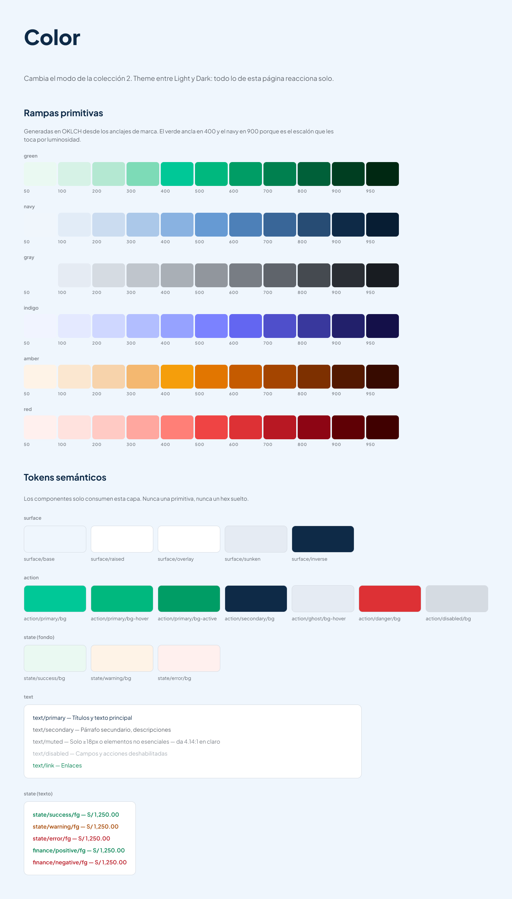

##### Tipografía (Typography System)

Esta tipografía de trazos limpios y geométricos ha sido especialmente diseñada para garantizar la máxima legibilidad en pantallas y facilitar la lectura rápida de cifras y métricas financieras. El sistema tipográfico establece niveles de jerarquía estructurados con precisión, distribuidos entre los títulos principales de los paneles de control, los encabezados de tarjetas informativas, los bloques de contenido general y las etiquetas de datos clave.


##### Sistema de Espaciado y Bordes

Para mantener alineación y ritmo visual consistente en todas las pantallas, se ha podido utilizar una grilla basada en múltiplos de 8px (8px Grid System) para márgenes y rellenos internos. Adicionalmente, el uso de radios de curvatura en los bordes aporta una estética fluida y ergonómica a los botones y contenedores de información.

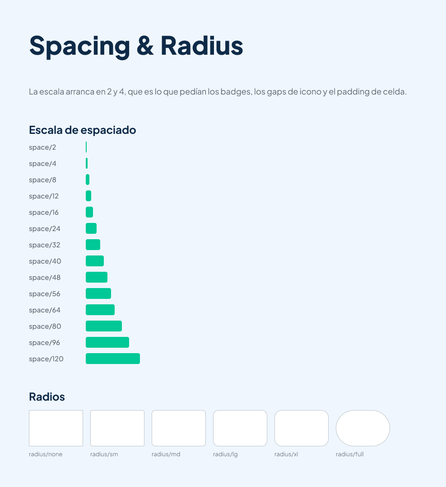

##### Elevación y Sombras (Elevation & Depth)

Para organizar la profundidad y el orden visual en el eje Z, se han implementado sombras sutiles que permiten distinguir con claridad los diferentes niveles de la interfaz, diferenciando el fondo, los contenedores principales, las tarjetas interactivas y los elementos flotantes como modales o menús desplegables.

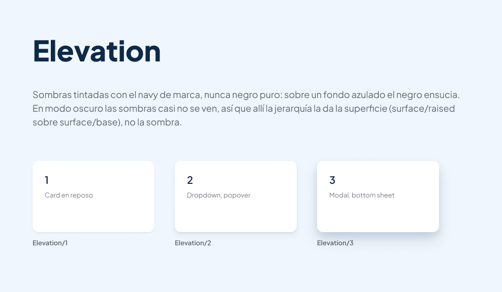

##### Iconografía (Icons System)

La colección de recursos gráficos vectoriales emplea un diseño de trazos limpios y unificados de espesor uniforme. Esto favorece la decodificación inmediata de funciones esenciales, tales como la importación de archivos PDF o XML, las evaluaciones de riesgo, el seguimiento del estado de cobranzas y las alternativas de inversión.


### 4.1.2. Web Style Guidelines

**Botones (Button Component)**

Se contemplan botones principales destinados a operaciones esenciales como "Descontar Factura" o "Confirmar Inversión", además de variantes secundarias para funciones alternas, botones de tipo contorno (Ghost) y estados visuales para elementos inhabilitados.

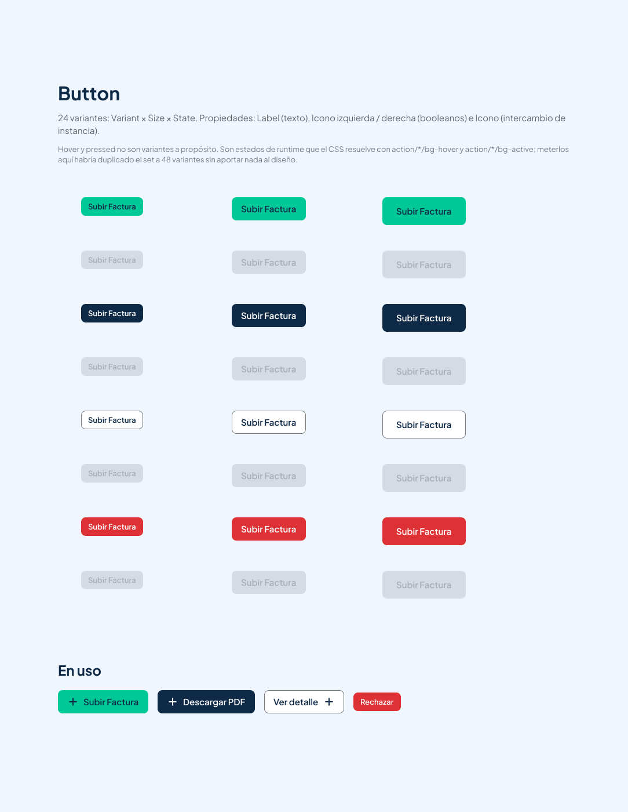

**Etiquetas de Estado (Badges & Chips)**

Elementos visuales de formato reducido pensados para categorizar la situación de las transacciones (tales como "Aprobada", "En Subasta" o "Cobrada"), las escalas de calificación de riesgo crediticio y el distintivo especial de "Factoring Verde".

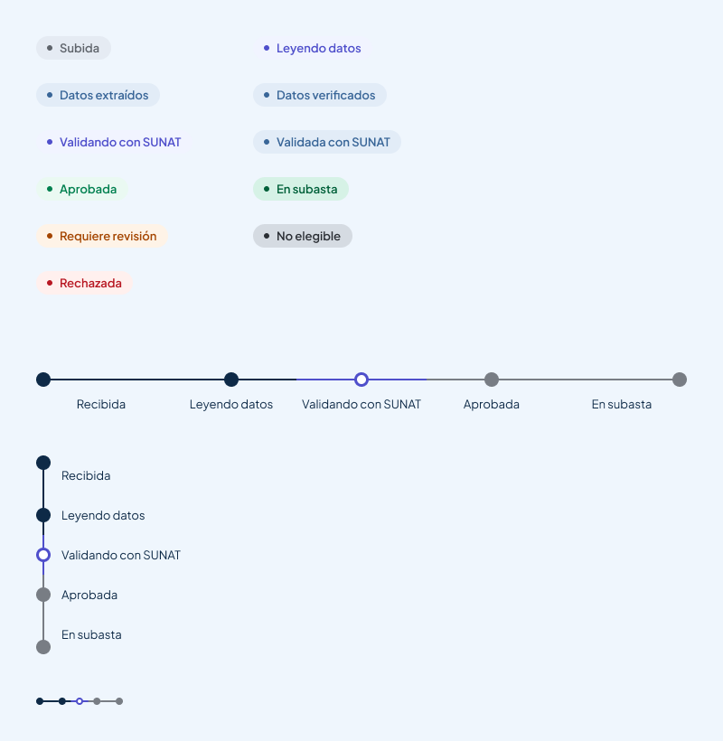

**Campos de Entrada (Input & Form Components)**

Herramientas destinadas al registro de información del usuario: cajas de texto tradicionales y complementadas con iconos, menús desplegables de selección, validación instantánea y un módulo de arrastrar y soltar (drag-and-drop) enfocado en la carga y procesamiento de facturas electrónicas.

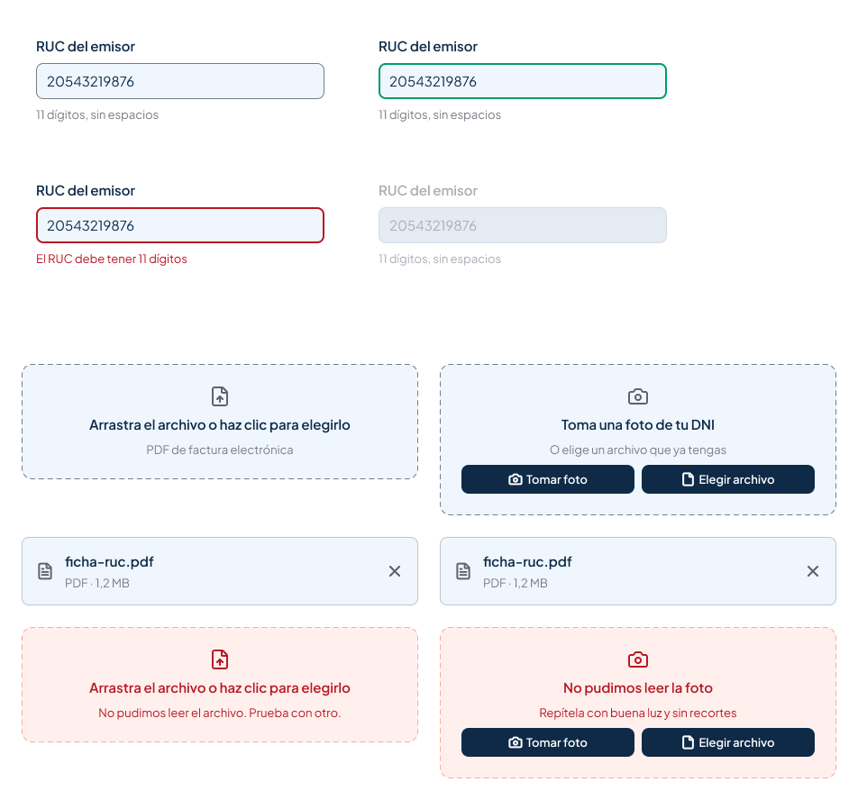

**Tarjetas e Indicadores (Cardas & KPI)**

Paneles organizados para presentar datos financieros resumidos: fichas de facturas disponibles para subasta, síntesis del portafolio de inversiones y tarjetas con indicadores clave de rendimiento (KPI) que reflejan la economía de la MYPE.

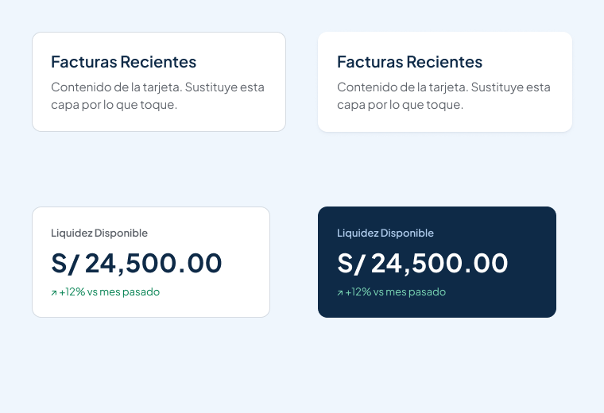

**Navegación Web (Navigation Components)**

Elementos de orientación orientados a guiar al usuario a través de la arquitectura de la plataforma y su página de presentación: cabecera o barra de navegación principal (Header/Navbar), panel lateral de opciones (Sidebar) y barras de pestañas (Tabs).


**Controles de Selección (Controls)**

Controles interactivos para selección y ajustes como interruptores de activación, casillas de verificación y botones de opción empleados en los filtros del mercado, las opciones de reinversión automática y la aceptación de normativas legales.

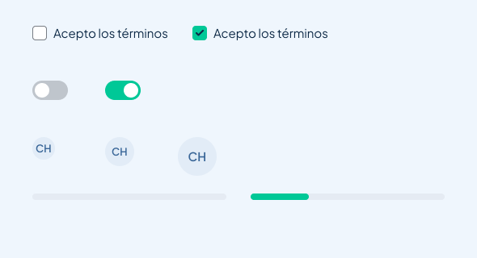

**Tablas de Datos (DataTable Controls)**

Componente de tabla tabular diseñado para procesar y mostrar amplios listados de facturas, registros de transacciones y estatus de cobranza, el cual cuenta con capacidades para ordenar columnas y navegar mediante paginación.


**Estructuras de Layout (Shells Component)**

Modelos estructurales de distribución que distribuyen las vistas de la aplicación web en secciones operativas permanentes como la barra superior, el menú de navegación lateral y el espacio central de contenidos.


**Retroalimentación y Notificaciones (Feedback Components)**

Mecanismos de aviso orientados a informar sobre el desenlace de los procedimientos o a orientar la navegación: cuadros flotantes de confirmación, notificaciones emergentes breves (Toast), indicadores de avance temporal y elementos visuales de espera giratorios (spinners).

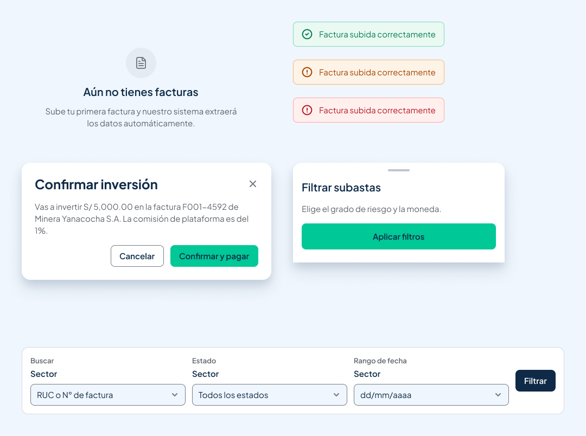

### 4.1.3. Mobile Style Guidelines

a. General Specs & Grid System

* **Frame Base (Canvas Viewport):** Android / iOS (`390px × 844px`)
* **Grid & Offsets:** Margen lateral de `16px` o `20px` según la densidad de la pantalla.
* **Border Radius:**
  * **Inputs / Fields:** `8px` - `12px` (Borde de `1px`).
  * **Botones Primarios:** `8px` o tipo *Pill/Capsule* según la variante.
  * **Cards & Containers:** `12px` - `16px`.
  * **Banners & Alertas:** `8px` - `12px`.

---

b). Color Palette & Tokens

* Brand / Primary
* **Menta Vankoo (Action / Primary CTA):** `#00D09C` — Botones de acción principal, estados activos de menú y tasas destacadas.
* **Azul Oscuro (Brand Header / Dark Base):** `#0B192C` — Cabecera de marca, fondo base en modo oscuro y tarjetas destacadas de saldo.

* Feedback & System States
* **Error / Destructive (Dark Mode):** Fondo `#7F1D1D` o `#991B1B` con borde `#FF3B30` y texto blanco (`#FFFFFF`).
* **Error / Destructive (Light Mode):** Fondo `#FEE2E2` con borde `#FCA5A5` y texto `#991B1B`.
* **Rendimiento / Descuento (Pill Success):** Fondo `#D1FAE5` con texto verde oscuro `#065F46` (ej. *4.2% de descuento*).
* **Alertas / Avisos:** Fondo beige/amarillo claro `#FEF3C7` con texto/borde ámbar `#B45309`.

* Neutrals & Surfaces
* **Dark Mode Base Background:** `#0B192C` / `#0F172A`.
* **Dark Mode Input / Card Background:** `#1E293B` o `#111827` con opacidad.
* **Light Mode Base Background:** `#FFFFFF` (Default) / `#F3F4F6` (Gris claro para contenedor e inputs deshabilitados).
* **Dark Text (Headings Light):** `#111827` — Titulares y textos principales.
* **Muted Text / Secondary:** `#6B7280` (Light) / `#94A3B8` (Dark) — Subtítulos, textos de ayuda y placeholders.

---

c) Typography Scale

* **Header Brand Text (Logo Slogan):**
  * **Font Family:** Sans-serif (Inter / SF Pro / Roboto).
  * **Size:** `28px` - `32px` Bold (Marca) / `14px` Regular (*"Tu liquidez, hoy."*).
* **Screen Titles (H1):**
  * **Size:** `22px` - `24px` | **Weight:** SemiBold / Bold | **Color:** `#111827` (Light) / `#FFFFFF` (Dark).
* **Section Headers (Form Groups & Cards):**
  * **Size:** `14px` - `16px` | **Weight:** SemiBold / Bold.
* **Body & Subtitles:**
  * **Body Regular:** `14px` | **Weight:** Regular | **Color:** `#6B7280` / `#94A3B8`.
  * **Field Labels:** `12px` - `14px` | **Weight:** Medium / SemiBold.
* **Microcopy & Captions:**
  * **Helper / Error Text:** `11px` - `12px` | **Weight:** Regular (*"Mínimo 8 caracteres"*, *"Correo o contraseña incorrectos"*).

---

d) UI Components & Navigation

* Header & Navigation Bar
* **Brand Header (Autenticación / Modales):** Fondo azul oscuro `#0B192C` con logo centrado, barra de estado nativa (`9:41`) y botón opcional de acción en esquina derecha (`[ Salir ]`).
* **App Top Bar (Dashboard / Mercado):** Fondo blanco `#FFFFFF`, isotipo **vankoo** alineado a la izquierda e icono de notificaciones a la derecha.
* **Bottom Navigation Bar (Tab Bar):**
  * **Altura:** `64px` - `72px`.
  * **Íconos:** *Inicio*, *Mercado*, *Mis Operaciones*, *Perfil*.
  * **Estado Activo:** Verde menta `#00D09C` con indicador circular.
  * **Estado Inactivo:** Gris neutro `#9CA3AF`.

* Form Inputs & Selectors
* **Field Default:** Borde gris claro (`1px`), alto `48px` - `52px`, icono interactivo a la derecha (ej. visibilidad de contraseña).
* **Field Error:** Borde rojo con banner/mensaje de ayuda en tipografía `11px - 12px`.
* **Selection Chips / Montos Rápidos:** Chips horizontales (`S/ 1,000`, `S/ 3,000`, `S/ 5,000`) en `#F3F4F6` con indicador activo al seleccionar.

* Cards & Data Display
* **Balance Primary Card:** Fondo azul `#0B192C` (Radius `12px - 16px`), saldo principal en `28px - 32px` Bold blanco y botón Pill verde menta (*"Recargar"*).
* **Inversión / Opportunity Cards:** Fondo blanco, borde `#E5E7EB`, título en `14px` SemiBold, monto en `14px` Bold y badges de grado/descuento (*• Grado A*, *5.8% de descuento*).
* **Historial de Movimientos:** Filas con icono circular transaccional, título en `14px` SemiBold, ID en `12px` y montos destacados (+ Verde para ingresos / - Rojo/Oscuro para egresos).

* Buttons & CTA
* **Primary Button:** Ancho completo (*Full Width*), alto `48px`, color verde menta `#00D09C` con texto centrado (`Medium` / `SemiBold`).
* **Disabled / Loading Button:** Opacidad al 50% con spinner o texto diferido (*"Ingresando..."*).
* **Secondary / Text Link:** Botón tipo enlace (*"¿Olvidaste tu contraseña?"*, *"Usar otra tarjeta"*).
  
#### 4.1.3.1. iOS Mobile Style Guidelines

* **Estrategia de UI:** Diseño unificado basado en los tokens generales de Vankoo.
* **Tipografía Nativa (Fallback):** SF Pro Display / SF Pro Text.
* **Consideraciones de Pantalla:**
  * Implementación de *Safe Area Insets* en Top Bar y Bottom Tab Bar.
  * Respeto del indicador de inicio nativo (*Home Indicator*) en pantallas completas.

#### 4.1.3.2. Android Mobile Style Guidelines

* **Estrategia de UI:** Identica a la versión de iOS para garantizar paridad visual en ambas tiendas.
* **Tipografía Nativa (Fallback):** Roboto / Inter.
* **Consideraciones de Pantalla:**
  * Soporte para barra de navegación por gestos y por 3 botones.
  * Renderizado de la barra de estado (*Status Bar*) transparente o con fondo `#0B192C` en modales de marca.


## 4.2. Information Architecture

En el presente apartado se detalla la arquitectura de información de la plataforma Vankoo, concebida para ordenar, clasificar y etiquetar los contenidos de forma que tanto los empresarios del segmento MYPE en busca de liquidez como los inversionistas orientados a la rentabilidad de su capital accedan sin fricciones a los datos financieros, técnicos y operativos. La finalidad central de este diseño consiste en disminuir la carga cognitiva por medio de una jerarquía rigurosa que optimice la toma de decisiones financieras y agilice la transformación de las cuentas por cobrar en efectivo disponible.

### 4.2.1. Organization Systems

Para garantizar que el contenido de Yield Labs sea accesible y lógico, se han aplicado diversos sistemas de organización adaptados a la naturaleza de los datos financieros y al perfil de cada segmento de usuario:

##### Visual Organization Systems (Sistemas de Organización Visual):
* **Organización Jerárquica (Visual Hierarchy):** Se aplica de forma predominante en los dashboards de la plataforma web. La información más crítica, como la disponibilidad de efectivo desembolsable, el Score de Riesgo del Pagador generado por IA, el porcentaje de fondeo acumulado de la factura y el distintivo de Factoring Verde, ocupa el nivel superior de la jerarquía visual mediante tarjetas (*cards*) destacadas y componentes KPI. Esto permite que el empresario e inversionista evalúen oportunidades de un vistazo.
* **Organización Secuencial (Step-by-step):** Este sistema es el eje central del flujo de descuento de facturas para la MYPE. El proceso se organiza como un flujo lineal guiado: Carga de factura PDF/XML → Lectura e extracción automática con IA (OCR+NLP) → Validación de constancia en SUNAT/CAVALI → Asignación de Score de Riesgo del Pagador → Publicación en el Marketplace.
* **Organización Matricial:** Se utiliza en las secciones de analítica avanzada y gestión de portafolios. Permite cruzar variables complejas como la tasa de rendimiento esperado (TCEA) frente a los plazos de vencimiento (30, 60, 90 o 120 días) y la concentración por sector industrial, facilitando la comparación de múltiples facturas en una sola vista.

##### Content Categorization Schemes (Esquemas de Categorización de Contenido):

* **Según Audiencia (Grupos de Usuarios):** Es el esquema troncal de la plataforma. Los contenidos se dividen rigurosamente según el rol: los empresarios MYPE operan la administración de cuentas por cobrar, la subida de archivos y los paneles de rendimiento económico; los inversionistas minoristas emplean la puja de facturas, la cartera virtual, las opciones de reinversión automatizada y los criterios ESG/Verdes; mientras que los administradores controlan las funciones de validación de riesgos y el registro inalterable de eventos.
* **Cronológico:** Destinado al monitoreo de cobranzas y la trazabilidad inalterable a través de *Event Sourcing*. Los títulos y operaciones se estructuran de acuerdo con su fecha de emisión, el plazo límite de pago y el orden temporal sucesivo (Registrada, Auditada por IA, Publicada, Fondeada, Desembolsada, Cobrada).
* **Por Tópicos:** Implementado dentro del mercado de inversión (*Marketplace*), agrupa las facturas tomando en cuenta la calificación de riesgo del pagador (A+, A, B, C), el horizonte de retorno (30, 60, 90 días), la industria o rubro comercial y el distintivo de impacto socioambiental (*Factoring Verde*).
* **Alfabético:** Este modelo funciona como recurso secundario dentro de los repertorios de entidades pagadoras corporativas, el directorio de compañías adquirentes y los inventarios de comprobantes tributarios.

### 4.2.2. Labeling Systems

En esta sección se precisan los rótulos empleados en la interfaz para denotar conjuntos de datos económicos mediante denominaciones concisas, nítidas y explícitas. El propósito consiste en garantizar una asociación mental directa entre cada concepto y su respectiva utilidad práctica, previniendo confusiones operativas en la administración de fondos.

* **Descontar Factura:** Principal botón de acción destinado al empresario del sector MYPE. Engloba el proceso de subida inteligente de comprobantes (en formatos PDF y XML), el análisis automatizado con inteligencia artificial y la petición de capital de trabajo en un plazo menor a dos días.
* **Marketplace (u Oportunidades):** Espacio que agrupa el directorio de títulos valores negociables ofertados para financiamiento colaborativo por parte de los inversores.
* **Score de Riesgo (Salud del Pagador):** Métrica que refleja la calificación de riesgo crediticio de la empresa adquirente, calculada a través de modelos predictivos avanzados para estimar la probabilidad real de cobro del documento.
* **Factoring Verde:** Distintivo asignado a transacciones de organizaciones con prácticas ecológicas o de triple impacto, el cual otorga beneficios como tasas preferenciales (una rebaja del 0.25%) y una mayor agilidad en el fondeo.
* **Billetera (Wallet):** Panel centralizador para el control del capital del inversor, donde se visualiza el saldo líquido, los intereses acumulados, las transferencias hacia cuentas bancarias y los parámetros de la "Billetera de Reinversión Automática".
* **Trazabilidad (Ledger):** Módulo que posibilita la visualización en directo del registro inalterable fundamentado en *Event Sourcing*, habilitando la auditoría de cada modificación de estado de la factura.
* **Salud Financiera:** Panel analítico diseñado para el segmento MYPE que expone estimaciones de flujo de caja, el ciclo de conversión de efectivo y el estatus de los comprobantes negociados ante CAVALI.
* **Soporte (Ayuda):** Sección que compila la normativa del modelo de *crowdfactoring*, el simulador de tasas, los manuales de emisión electrónica y las vías oficiales de asistencia al cliente.

### 4.2.3. SEO Tags and Meta Tags

Para potenciar el posicionamiento del ecosistema Yield Labs / Vankoo en los buscadores web y resguardar la seguridad dentro de la plataforma transaccional, se han establecido las especificaciones de etiquetas SEO y metadatos tanto para la página de presentación (*Landing Page*) como para la aplicación web (*Web Application*).

### Landing Page SEO Tags and Meta Tags
La página de aterrizaje busca captar tanto a empresarios MYPE que necesitan liquidez como a inversores que persiguen rentabilidad.

| Etiqueta | Contenido |
| :--- | :--- |
| **Title** | Vankoo - Crowdfactoring Inteligente y Liquidez Inmediata para MYPES |
| **Meta Description** | Convierte tus facturas por cobrar en efectivo en menos de 48 horas sin deuda bancaria. Crowdfactoring impulsado por IA y Factoring Verde en Perú. |
| **Meta Keywords** | crowdfactoring Perú, liquidez MYPES, descuento de facturas, factoring verde, inversión en facturas, capital de trabajo, Yield Labs, Vankoo |
| **Meta Author** | Yield Labs Team |
| **Meta Viewport** | width=device-width, initial-scale=1.0 |
| **Meta Charset** | UTF-8 |
| **Open Graph Title** | Yield Labs: Liquidez inmediata para MYPES y retorno atractivo para inversionistas |
| **Open Graph Description** | Transforma tus facturas en liquidez de forma rápida, transparente y segura con nuestra plataforma inteligente. |
| **Open Graph Image** | https://www.yieldlabs.pe/assets/images/yieldlabs-og-preview.png |
| **Open Graph URL** | https://www.yieldlabs.pe |

```html
<title>Vankoo - Crowdfactoring Inteligente y Liquidez Inmediata para MYPES</title>
<meta name="description" content="Convierte tus facturas por cobrar en efectivo en menos de 48 horas sin deuda bancaria. Crowdfactoring impulsado por IA y Factoring Verde en Perú.">
<meta name="keywords" content="crowdfactoring Perú, liquidez MYPES, descuento de facturas, factoring verde, inversión en facturas, capital de trabajo, Yield Labs, Vankoo">
<meta name="author" content="Yield Labs Team">
<meta property="og:title" content="Yield Labs: Liquidez inmediata para MYPES y retorno atractivo para inversionistas">
<meta property="og:description" content="Transforma tus facturas en liquidez de forma rápida, transparente y segura con nuestra plataforma inteligente.">
<meta property="og:image" content="https://www.yieldlabs.pe/assets/images/yieldlabs-og-preview.png">
<meta property="og:url" content="https://www.yieldlabs.pe">
```
**Web Application SEO Tags and Meta Tags**

La aplicación web es un entorno transaccional (SPA) seguro accesible por usuarios autenticados. Se configura para restringir la indexación privada de datos financieros.

| Etiqueta | Contenido |
| :--- | :--- |
| **Title** | Plataforma Vankoo - Gestión de Crowdfactoring y Portafolio |
| **Meta Description** | Sistema de gestión de facturas, scoring predictivo de pagadores y mercado de inversión descentralizado para MYPES e inversionistas. |
| **Meta Keywords** | dashboard factoring, scoring riesgo IA, mercado de facturas, billetera digital, trazabilidad event sourcing |
| **Meta Robots** | noindex, nofollow (para proteger el acceso a datos financieros internos) |

```html
<title>Plataforma Vankoo - Gestión de Crowdfactoring y Portafolio</title>
<meta name="description" content="Sistema de gestión de facturas, scoring predictivo de pagadores y mercado de inversión descentralizado para MYPES e inversionistas.">
<meta name="robots" content="noindex, nofollow">
```

### 4.2.4. Searching Systems

Para prevenir la saturación de datos, los mecanismos de búsqueda dentro de la plataforma Vankoo —desarrollada por Yield Labs— han sido concebidos para que los distintos usuarios localicen con agilidad comprobantes concretos, examinen la solvencia de las empresas adquirentes y filtren alternativas de colocación de capital conforme a parámetros de riesgo y criterios sostenibles.

##### Búsqueda en la Web App (Empresarios, Inversionistas y Administradores)

* **Búsqueda Global y Predictiva:** Campo de localización incorporado en la sección superior de la interfaz provisto de sugerencias automáticas inmediatas. Al teclear el número de RUC o la denominación social del pagador, el código del comprobante (por ejemplo, F001-00234) o el RUC de la MYPE emisora, la plataforma despliega opciones al instante.
* **Sistema de Filtros Avanzados:** Los inversores y gestores disponen de paneles especializados para afinar los catálogos de información:
  * **Por Score de Riesgo:** Permite aislar los títulos según la categoría evaluada por los algoritmos predictivos (Niveles A+, A, B, C).
  * **Por Impacto (Factoring Verde):** Facilita la selección exclusiva de operaciones que cuentan con el distintivo de sostenibilidad ambiental o social.
  * **Por Plazo de Retorno:** Agrupa las transacciones tomando como referencia su fecha de expiración (intervalos de 1 a 30 días, 31 a 60 días, 61 a 90 días, o superiores a 90 días).
  * **Por Rango de Monto de Entrada:** Posibilita la búsqueda de participaciones fraccionadas en facturas desde S/ 50 hasta volúmenes de carácter institucional.
  * **Por Tasa de Rendimiento (TCEA):** Ordena las oportunidades según el porcentaje de retorno o descuento planteado.
* **Visualización de Resultados:** Los registros se despliegan mediante dos modalidades alternables: un esquema de tarjetas (*Cards Grid*) enfocado en la revisión ágil de alternativas de inversión, y una estructura tabular (*DataTable*) orientada al manejo masivo, dotada de columnas configurables y realce visual de términos coincidentes.

### 4.2.5. Navigation Systems

La arquitectura de orientación de Yield Labs conduce a los usuarios hacia sus metas principales: la exposición de la propuesta comercial (*Landing Page*), la administración del capital de trabajo para la MYPE y la colocación de fondos por parte de los inversores (*Web App*), empleando enfoques de desplazamiento que reducen al mínimo las acciones necesarias para operar.

### Navegación en la Landing Page (Marketing y Captación)

* **Desplazamiento Continuo (*Scrolling Navigation*):** Diseño fluido de página única (*One-Page*) que conduce al visitante de forma secuencial a través de la propuesta de valor, los retos financieros del sector MYPE, el mecanismo de *crowdfactoring* potenciado por inteligencia artificial, la herramienta interactiva de simulación de tasas y los casos de éxito.
* **Menú Fijo (*Sticky Navigation*):** Cabecera superior persistente que acompaña el movimiento vertical de la pantalla, facilitando el acceso directo a los apartados de "Empresas", "Inversionistas", "Factoring Verde" y "Simulador", complementada con un botón principal de llamada a la acción (*CTA*) para "Descontar Mi Factura / Registrarse".

##### Navegación en la Web App (Dashboard Transaccional)

* **Barra Lateral Estática (*Side Navigation*):** Menú vertical anclado a la izquierda cuyo contenido varía según el perfil del usuario validado (empresario o inversor), posibilitando alternar con fluidez entre el panel principal (*Dashboard*), el mercado, la subida de documentos, la cartera virtual y los informes analíticos.
* **Migas de Pan (*Breadcrumbs*):** Ruta de rastreo que ayuda a ubicar al usuario dentro de los niveles internos de la plataforma (por ejemplo: Mercado > Facturas de Servicios > Factura F001-9842 > Reporte de Riesgo IA).
* **Navegación Contextual y Pestañas (*Tabs*):** Estructura interna dentro de la ficha de cada factura que permite alternar mediante solapas entre la "Información del Documento", el "Score del Pagador (IA)", el "Historial de Eventos (*Ledger*)" y los "Inversionistas Participantes".

##### Navegación entre Ecosistemas (Inter-product Navigation)

* **Alertas Dinámicas y Enlaces Directos (*Deep Linking*):** Avisos instantáneos dentro de la interfaz y correos electrónicos equipados con enlaces específicos que conducen directamente a comprobantes recién validados compatibles con las reglas de reinversión del inversor, o bien notificaciones de cierre cuando un título de la MYPE completa el total requerido para su respectivo desembolso.

<hr class="page-break">

## 4.3. Landing Page UI Design

En este apartado se exhiben los prototipos visuales y maquetas (wireframes y mock-ups) correspondientes a la página de presentación (Landing Page) de la plataforma Vankoo, integrando los criterios de diseño, los componentes estéticos, las directrices de inclusión y la estructura de información planteados anteriormente.

### 4.3.1. Landing Page Wireframe

A continuación, se presentan los prototipos preliminares del sitio de presentación (Landing Page) orientados a navegadores de escritorio (Desktop) y dispositivos móviles (Mobile), desarrollados en Figma. Estas maquetas de mediana fidelidad reflejan la materialización de los lineamientos estilísticos, los componentes gráficos, las pautas de accesibilidad universal y la organización de contenidos, garantizando así una vivencia de usuario armónica y sin barreras.

**Hero**

Encabezado principal con un mensaje claro y conciso que comunica la propuesta de valor de la plataforma Vankoo. Se incluyen elementos visuales atractivos y un llamado a la acción destacado.


**Flujo del Proceso**

Se detallan los cinco hitos por los que pasa cada factura, especificando mediante etiquetas qué acciones realiza el usuario y cuáles ejecuta el sistema de forma automatizada (lectura OCR, validación con SUNAT y scoring). En la parte inferior se transparentan los estados de excepción y rechazo para brindar claridad operativa.


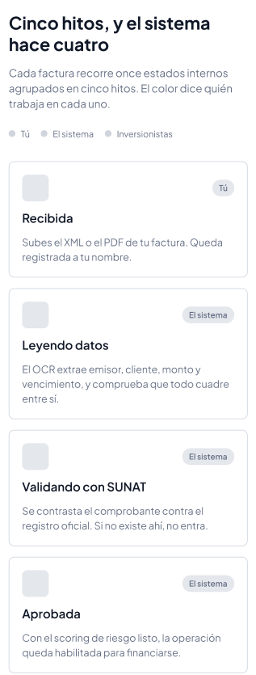

**Simulador de Costos**

Herramienta interactiva de cotización que permite al usuario seleccionar moneda, ajustar el monto mediante un control deslizante, elegir el plazo y asignar el nivel de riesgo. Al lado, una tarjeta desglosa el cálculo en tiempo real mostrando el monto a recibir, el costo financiero, la tasa mensual y la TCEA.

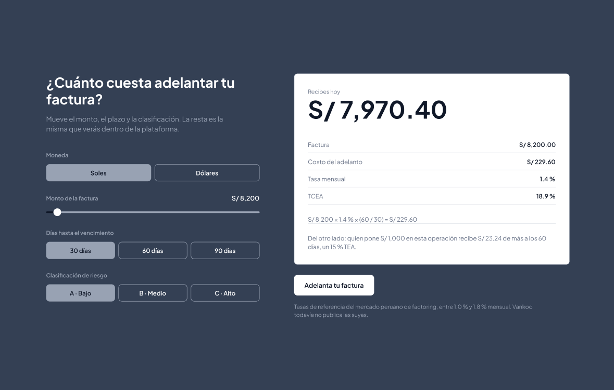


**Propuesta de valor por segmento**

Presenta los beneficios clave mediante un selector de rol (Para tu MYPE / Para invertir). Para las empresas, enfatiza la eliminación de brechas de crédito comercial a través de una cuadrícula de características con soporte visual que refuerza la trazabilidad y la agilidad de cobro.


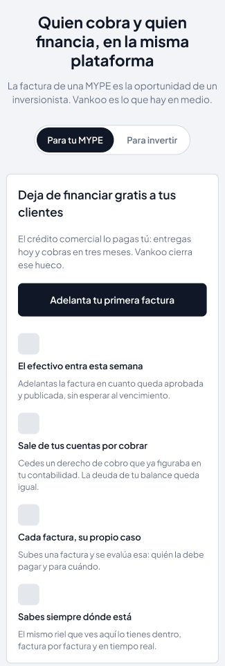

**Clasificación de riesgo**

Explica el sistema de scoring estandarizado mediante tres tarjetas comparativas (A, B y C). Cada bloque describe el perfil del deudor, el comportamiento de pago y el nivel de rentabilidad asociado, permitiendo que tanto emisores como inversionistas comprendan los criterios de evaluación.

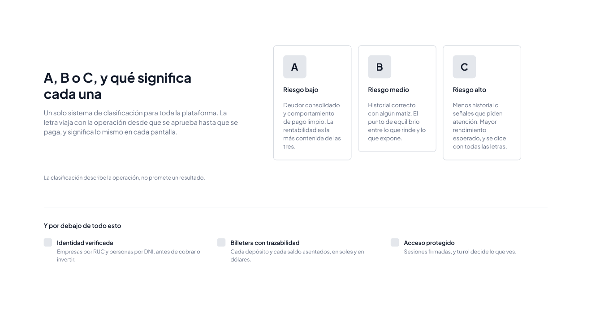
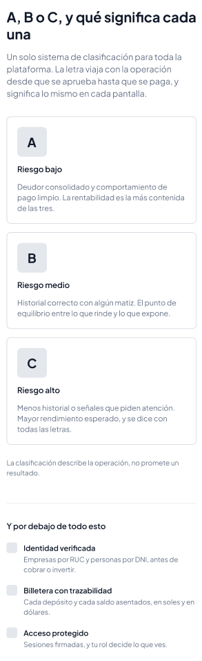

**Preguntas Frecuentes (FAQ)**

Estructura en acordeón desplegable que agrupa las dudas operativas y financieras más críticas (concepto de crowdfactoring, gestión de impagos, monedas admitidas y tiempos de respuesta) para resolver objeciones antes del registro


**Llamado a la acción Final y Footer**

Módulo de cierre que sintetiza la promesa de liquidez con accesos directos a registro e inicio de sesión. Finaliza con un pie de página corporativo que organiza la navegación secundaria, enlaces a políticas legales y el aviso regulatorio correspondiente.

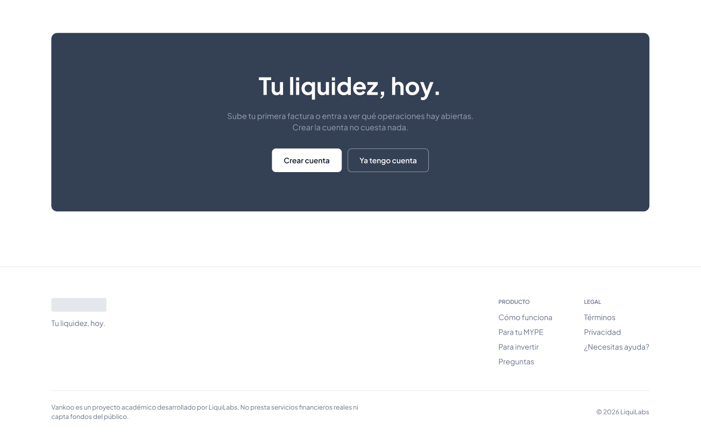
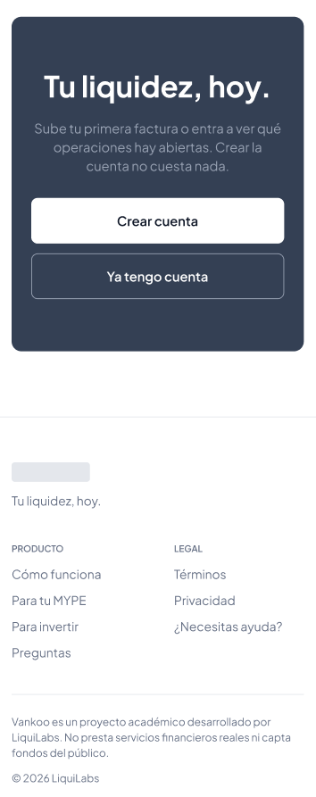


### 4.3.2. Landing Page Mock-up

A continuación, se presentan los mockups de alta fidelidad de la Landing Page tanto para Desktop Web Browser como para Mobile Web Browser. En esta fase se incorporan la identidad visual de Vankoo, paleta cromática corporativa, tipografía definitiva, microinteracciones, iconografía detallada y componentes visuales finales, consolidando los principios de accesibilidad, legibilidad y jerarquía visual.

**Hero**

Presentación de alta fidelidad con contrastes optimizados, tipografía de alto impacto y estilo visual consolidado. En desktop, la tarjeta preview emula la interfaz real del sistema con indicadores de estado cromáticos e importes destacados; en la variante móvil, los elementos se apilan verticalmente priorizando la legibilidad y el acceso táctil a los llamados a la acción primarios.


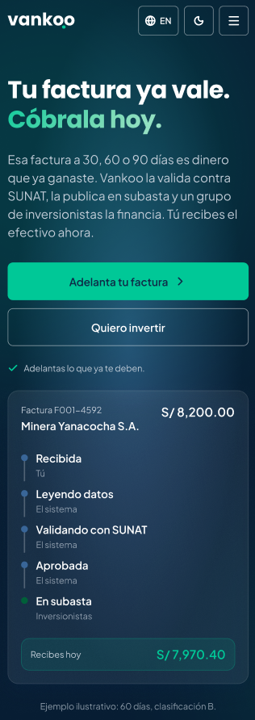

**Flujo del Proceso**

Representación visual de los cinco hitos operativos mediante una línea de tiempo limpia con badges de autoría diferenciados por color (Usuario, Sistema e Inversionistas). Los módulos inferiores de incidencias y excepciones utilizan estados cromáticos suaves de alerta para brindar transparencia operativa sin sobrecargar visualmente la pantalla.


**Simulador de Costos**

Diseño final e interactivo del panel de cotización con controles visuales pulidos (toggles segmentados, slider interactivo y chips de selección de plazo). El panel de resultados contrasta sobre fondo claro con números destacados, detallando visualmente el desglose financiero exacto de la operación tanto en escritorio como en navegación táctil móvil.


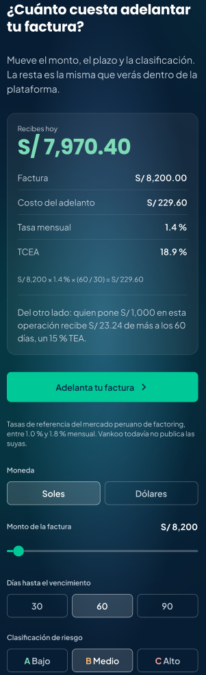

**Propuesta de Valor por Segmento**

Implementación del conmutador de audiencias para tu MYPE / para invertir con retroalimentación visual de estado activo. La cuadrícula de beneficios incorpora iconos finales representativos, espacios en blanco equilibrados y tarjetas con bordes suaves que jerarquizan las ventajas competitivas de la plataforma.


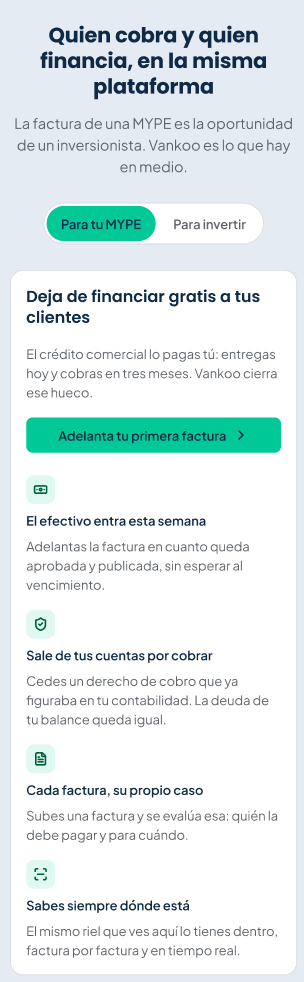

**Clasificación de Riesgo**

Tarjetas modulares de alta fidelidad para las categorías A, B y C con contenedores de badges diferenciados y jerarquía tipográfica definida. El diseño transmite confiabilidad y rigor financiero mediante microtextos concisos, facilitando la comprensión inmediata del riesgo y retorno esperado.


**Preguntas Frecuentes (FAQ)**

Componente de acordeón con tratamiento visual acabado, separadores sutiles e indicadores de apertura/cierre claros. En la versión mobile, la separación entre filas y el área táctil de interacción están optimizadas para facilitar la navegación con el pulgar.

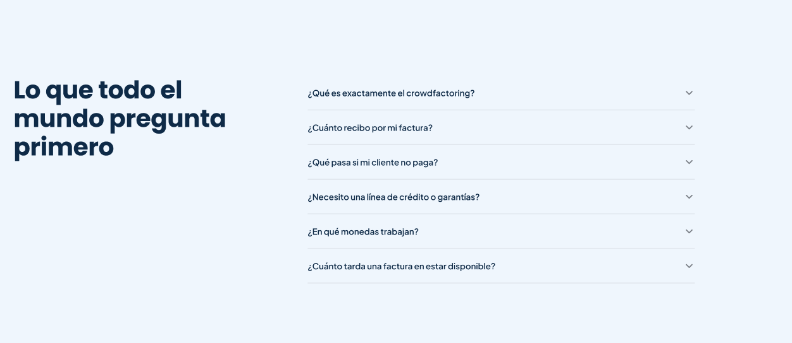


**Llamado a la acción final y Footer**

Bloque contenedor oscuro con contraste directo para guiar la conversión final del usuario hacia el registro o inicio de sesión. La sección culmina con un footer corporativo estructurado por columnas temáticas, tipografía de soporte en escala reducida y avisos legales dispuestos de forma equilibrada.


<hr class="page-break">

## 4.4. Mobile Applications UX/UI Design

En esta sección se definen los **Diagramas de Componentes** del sistema, detallando la arquitectura interna, módulos principales y la organización lógica de los elementos de software que conforman la plataforma **Vankoo**. Se ilustran las relaciones de dependencia, interfaces requeridas y provistas, así como la integración entre los servicios del backend, la capa de persistencia de datos y los clientes de interfaz (*Web MYPE* y *App Mobile Inversionista*), garantizando una estructura modular, escalable y mantenible.

### 4.4.1. Mobile Applications Wireframes

A continuación, se presentan todas las pantallas que conforman los wireframes de la aplicación móvil de **Vankoo** para la experiencia del usuario inversionista.

#### **1. Autenticación y Gestión de Cuenta**

<table>
  <tr>
    <td align="center" width="25%">
      <br />
      <sub><b>Crear Cuenta</b><br />Registro inicial de datos personales del usuario inversionista.</sub>
    </td>
    <td align="center" width="25%">
      <br />
      <sub><b>Recuperar Cuenta</b><br />Solicitud de restablecimiento de acceso mediante correo.</sub>
    </td>
    <td align="center" width="25%">
      <br />
      <sub><b>Nueva Contraseña</b><br />Ingreso y confirmación de nuevas credenciales de acceso.</sub>
    </td>
    <td align="center" width="25%">
      <br />
      <sub><b>Estados / Validación</b><br />Notificaciones de error o rechazo en proceso de verificación.</sub>
    </td>
  </tr>
</table>

---

#### **2. Dashboard Principal y Secciones**

<table>
  <tr>
    <td align="center" width="25%">
      <br />
      <sub><b>Inicio / Dashboard</b><br />Vista principal con saldo total, accesos rápidos y resumen de actividad.</sub>
    </td>
    <td align="center" width="25%">
      <br />
      <sub><b>Sección Mercado</b><br />Catálogo de facturas y oportunidades disponibles para fondear.</sub>
    </td>
    <td align="center" width="25%">
      <br />
      <sub><b>Mis Inversiones</b><br />Listado y seguimiento del estado de las facturas fondeadas.</sub>
    </td>
    <td align="center" width="25%">
      <br />
      <sub><b>Billetera</b><br />Detalle de saldo disponible, retenido e historial transaccional.</sub>
    </td>
  </tr>
</table>

---

#### **3. Flujo de Subasta e Inversión**

<table>
  <tr>
    <td align="center" width="33%">
      <br />
      <sub><b>Detalle de Subasta</b><br />Información de la factura, tasa de retorno y empresa emisora.</sub>
    </td>
    <td align="center" width="33%">
      <br />
      <sub><b>Saldo Insuficiente</b><br />Validación y aviso para recargar fondos antes de invertir.</sub>
    </td>
    <td align="center" width="33%">
      <br />
      <sub><b>Recargar Billetera</b><br />Módulo para abonar dinero a la cuenta mediante transferencia/tarjeta.</sub>
    </td>
  </tr>
</table>

---

#### **4. Perfil y Ajustes**

<table>
  <tr>
    <td align="center" width="50%">
      <br />
      <sub><b>Perfil</b><br />Información general del usuario y estado de la cuenta.</sub>
    </td>
    <td align="center" width="50%">
      <br />
      <sub><b>Configuración de Recarga/Perfil</b><br />Gestión de cuentas bancarias de retiro y ajustes.</sub>
    </td>
  </tr>
</table>

### 4.4.2. Mobile Applications Wireflow Diagrams

A continuación, se presentan los diagramas de flujo de pantallas (*Wireflow Diagrams*) de la aplicación móvil de **Vankoo**, desplegados a tamaño completo para garantizar la máxima legibilidad de los componentes y las conexiones entre pantallas.

---

#### **1. Autenticación, Registro e Identidad**

<p align="center">
  <br />
  <b>01. Portada / Front Page</b><br />
  <sub>Diagrama de inicio y flujo de bienvenida a la aplicación.</sub>
</p>

<br />

<p align="center">
  <br />
  <b>02. Acceso - Inicio de Sesión</b><br />
  <sub>Flujo de autenticación con credenciales principales.</sub>
</p>

<br />

<p align="center">
  <br />
  <b>03. Acceso - Recuperación</b><br />
  <sub>Ruta de recuperación de contraseña y enlaces de validación.</sub>
</p>

<br />

<p align="center">
  <br />
  <b>04. Acceso - Verificación</b><br />
  <sub>Flujo de estados de error y confirmación de identidad.</sub>
</p>

---

#### **2. Mercado de Oportunidades y Subastas**

<p align="center">
  <br />
  <b>05. Mercado - Exploración</b><br />
  <sub>Navegación general por las facturas y oportunidades disponibles.</sub>
</p>

<br />

<p align="center">
  <br />
  <b>06. Mercado - Detalle de Subasta</b><br />
  <sub>Flujo de consulta de detalles y simulación de inversión.</sub>
</p>

---

#### **3. Gestión de Inversiones y Billetera**

<p align="center">
  <br />
  <b>07. Inversiones - Resumen</b><br />
  <sub>Visualización general de operaciones en curso y fondeadas.</sub>
</p>

<br />

<p align="center">
  <br />
  <b>08. Inversiones - Detalle</b><br />
  <sub>Flujo de seguimiento de retornos y estado de pagos.</sub>
</p>

<br />

<p align="center">
  <br />
  <b>09. Billetera - Recarga</b><br />
  <sub>Navegación e ingreso del monto para abono de saldo.</sub>
</p>

<br />

<p align="center">
  <br />
  <b>10. Billetera - Confirmación</b><br />
  <sub>Pasarela bancaria y manejo de estados de rechazo/éxito.</sub>
</p>

---

#### **4. Perfil del Usuario y Configuración**

<p align="center">
  <br />
  <b>11. Perfil - General</b><br />
  <sub>Navegación por datos personales y estado de verificación.</sub>
</p>

<br />

<p align="center">
  <br />
  <b>12. Perfil - Cuentas Bancarias</b><br />
  <sub>Ajustes de cuentas para el retiro de fondos.</sub>
</p>

<br />

<p align="center">
  <br />
  <b>13. Perfil - Seguridad y Ajustes</b><br />
  <sub>Modificación de preferencias y seguridad de la cuenta.</sub>
</p>

### 4.4.3. Mobile Applications Mock-ups

Esta sección presenta las pantallas de la aplicación móvil de Vankoo organizadas por flujos de usuario y capacidades principales de la plataforma.

##### Autenticación e Inicios de Sesión (Login)


*Figura 4.4.3.1. Pantalla de inicio / bienvenida.*


*Figura 4.4.3.2. Formulario de inicio de sesión.*


*Figura 4.4.3.3. Selección de tipo de perfil / credenciales.*


*Figura 4.4.3.4. Confirmación de acceso / verificación.*


*Figura 4.4.3.5. Recuperación y validación de seguridad.*

---

##### Pantalla Principal (Home) y Mercado (Marketplace)


*Figura 4.4.3.6. Dashboard principal de la aplicación.*


*Figura 4.4.3.7. Vista general del Mercado de Oportunidades.*


*Figura 4.4.3.8. Detalle de subasta e inversión.*

---

##### Mis Inversiones y Billetera (Wallet)


*Figura 4.4.3.9. Portafolio de inversiones activas y rendimiento.*


*Figura 4.4.3.10. Saldo de la billetera y resumen transaccional.*


*Figura 4.4.3.11. Opciones de depósito y retiro de fondos.*

---

##### Perfil de Usuario y Deltas


*Figura 4.4.3.12. Información general del perfil de usuario.*


*Figura 4.4.3.13. Ajustes de la cuenta y preferencias.*


*Figura 4.4.3.14. Comparativa de variaciones y métricas del sistema (Deltas).*

---

##### Mantenimiento y Tema Oscuro (Night Mode)


*Figura 4.4.3.15. Vista principal en Modo Oscuro.*


*Figura 4.4.3.16. Mercado de Oportunidades en Modo Oscuro.*


*Figura 4.4.3.17. Vista del portafolio/billetera en Modo Oscuro.*


*Figura 4.4.3.18. Ajustes y perfil en Modo Oscuro.*

### 4.4.4. Mobile Applications User Flow Diagrams

Esta sección presenta los diagramas de flujo de usuario (User Flows) para la aplicación móvil de Vankoo, los cuales detallan los recorridos y la navegación paso a paso a través de las diferentes funcionalidades de la plataforma.

##### Flujo de Portada e Inicio (Front Page)


*Figura 4.4.4.1. Diagrama de flujo de la pantalla de bienvenida e inicio de la aplicación.*

---

##### Flujo de Autenticación y Acceso (Access)


*Figura 4.4.4.2. Diagrama de flujo para el registro, inicio de sesión y recuperación de credenciales.*

---

##### Flujo de Registro de Perfil y Verificación KYC (Profile KYC)


*Figura 4.4.4.3. Diagrama de flujo para el completado de perfil y el proceso de validación de identidad KYC.*

---

##### Flujo de Recarga de Billetera (Recharge Wallet)


*Figura 4.4.4.4. Diagrama de flujo para la recarga de fondos y gestión del saldo en la billetera.*

---

##### Flujo de Exploración del Mercado (Marketplace)


*Figura 4.4.4.5. Diagrama de flujo para la navegación y búsqueda de subastas en el mercado de oportunidades.*

---

##### Flujo de Gestión de Inversiones (Investments)


*Figura 4.4.4.6. Diagrama de flujo para la ejecución de inversiones y seguimiento del portafolio.*

## 4.5. Mobile Applications Prototyping

<!-- Assets: ./assets/cap4-product-design/mobile-app/prototyping/ — incluir enlace público al prototipo en Figma. -->

_Pendiente de elaboración._

### 4.5.1. Android Mobile Applications Prototyping

_Pendiente de elaboración._

### 4.5.2. iOS Mobile Applications Prototyping

_Pendiente de elaboración._

<hr class="page-break">

## 4.6. Web Applications UX/UI Design

En este segmento se exponen los esquemas visuales y prototipos interactivos correspondientes a los módulos operativos de la plataforma Vankoo. Asimismo, se detallan las interfaces principales, sus capacidades dinámicas y los componentes estéticos que conforman el sistema.

### 4.6.1. Web Applications Wireframes

**IAM**

**Inicio de Sesión**

Está pantalla permite a los usuarios autenticarse en la plataforma mediante correo electrónico y contraseña. Se incluyen opciones de recuperación de contraseña y enlaces a registro para nuevos usuarios.


**Creación de Cuenta**

Permite a los nuevos usuarios registrarse en la plataforma proporcionando información básica como nombre, correo electrónico y contraseña. Se incluyen validaciones de campos y mensajes de error.

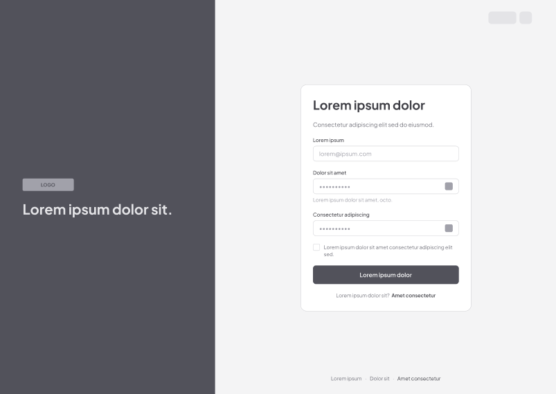

**Perfil**

**Completar Perfil**

Permite al usuario completar la información de su perfil, incluyendo ruc, nombre de la empresa, dirección y otros datos relevantes. Se incluyen validaciones de campos y mensajes de error.

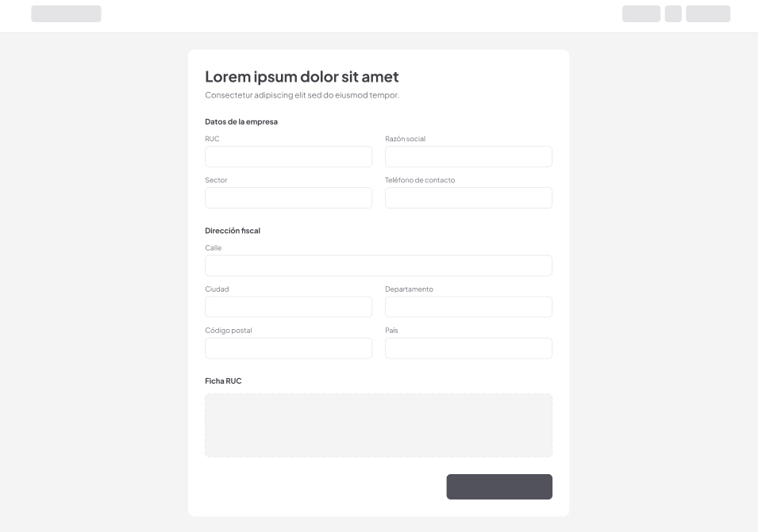

**Perfil Enviado**

Muestra un mensaje de confirmación al usuario indicando que su perfil ha sido enviado para revisión.

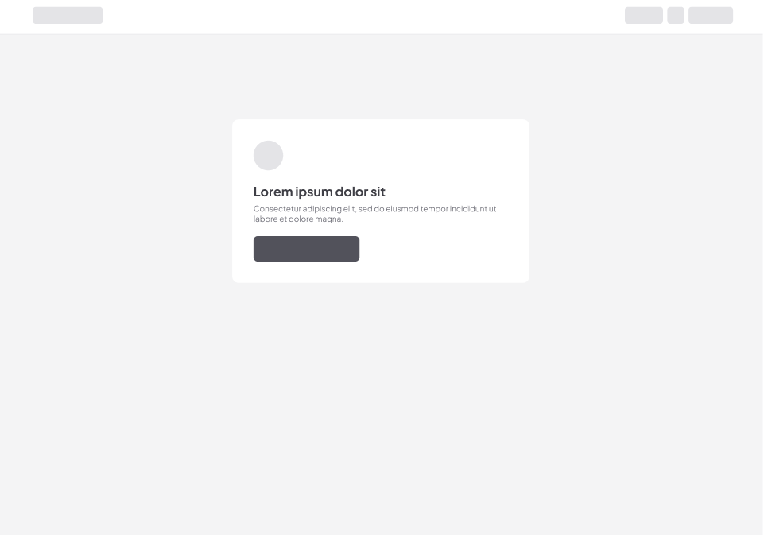

**Perfil Rechazado**

Muestra un mensaje de rechazo al usuario indicando que su perfil no cumple con los requisitos.


**DashBoard**

**DashBoard Principal**

Muestra un resumen, con el estado de las facturas.


**Perfil en Revisión**

Muestra un mensaje al usuario indicando que su perfil está en proceso de revisión y que no puede acceder a ciertas funcionalidades hasta que sea aprobado.

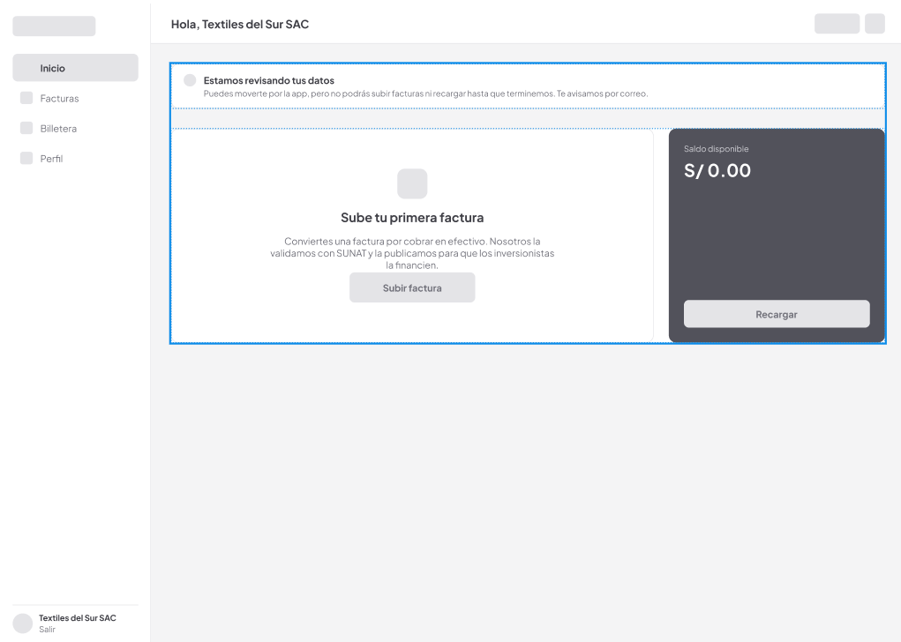

**Facturas**

**Subir Factura**

Permite al usuario subir una factura para su procesamiento y un botón para cargar el archivo de la factura.


**Facturas en Proceso**

Muestra un listado de las facturas que están siendo procesadas, con información relevante como el estado de la factura.

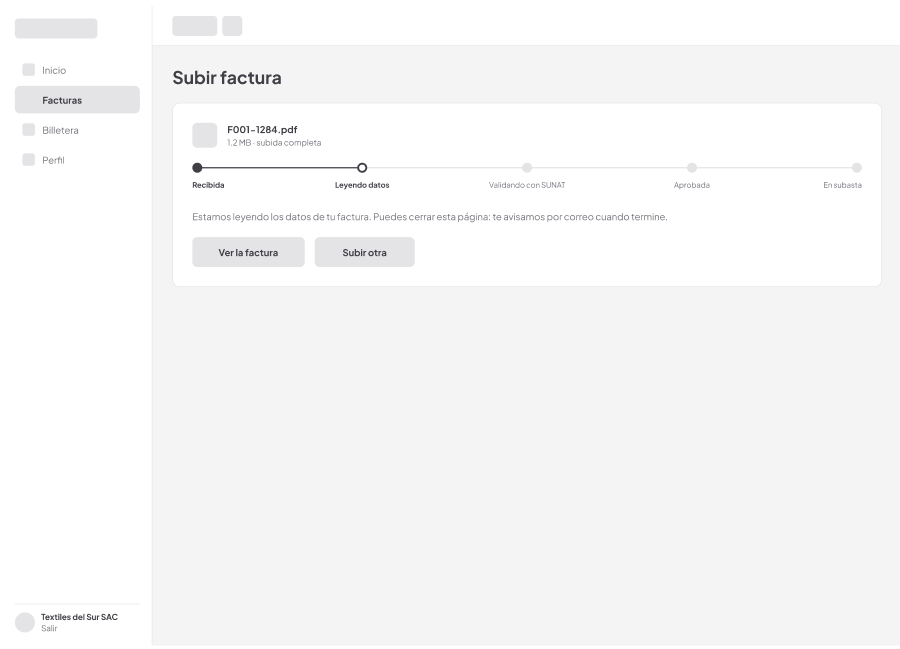

**Lista de Facturas**

Muestra un listado de todas las facturas del usuario, con información relevante como el estado de la factura.


**Detalle de Factura**

Muestra los detalles de una factura específica, incluyendo información como el estado de la factura, el monto y la fecha de vencimiento.


**Requiere Revisión**

Muestra un mensaje al usuario indicando que su factura requiere revisión y que no puede ser procesada hasta que se resuelvan los problemas.

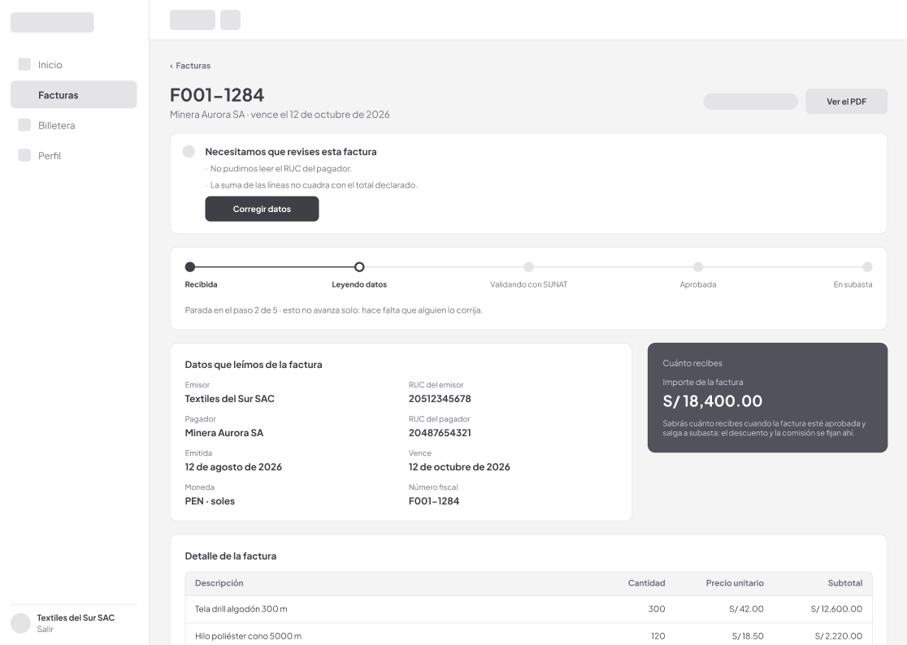

**Factura Rechazada**

Muestra un mensaje al usuario indicando que su factura ha sido rechazada y que no puede ser procesada.

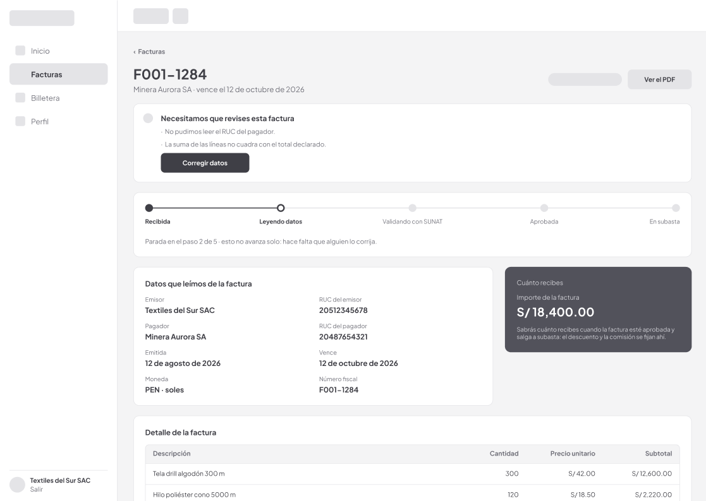

**Billetera y Perfil**

**Billetera**

Muestra un resumen del estado de la billetera del usuario, incluyendo el saldo disponible y las transacciones recientes.


**Billetera Vacía**

Muestra un mensaje al usuario indicando que su billetera está vacía y que no tiene saldo disponible.


**Retiro de Fondos**

Permite al usuario retirar fondos de su billetera a su cuenta bancaria, incluyendo campos para ingresar el monto y seleccionar la cuenta bancaria.

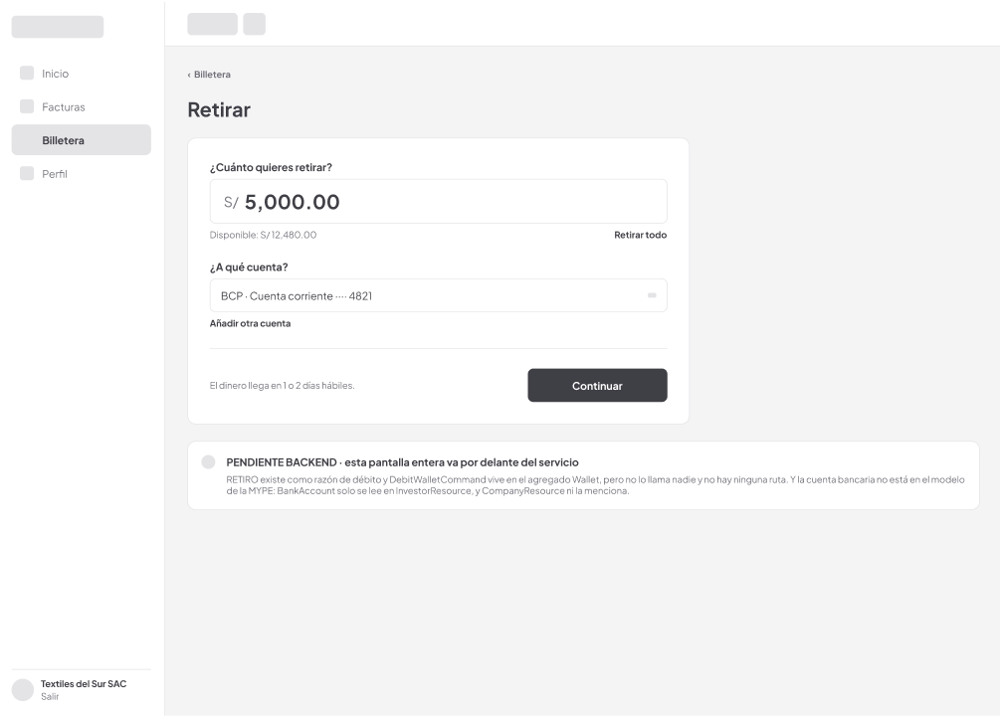

**Confirmar Retiro de Fondos**

Confirma la solicitud de retiro de fondos del usuario, mostrando un resumen de la transacción.


**Mi Perfil**

Permite al usuario ver de su perfil, su nombre, correo electrónico y contraseña.


**Perfil en Revisión**

Muestra un mensaje al usuario indicando que su perfil está en proceso de revisión y que no puede acceder a ciertas funcionalidades hasta que sea aprobado.

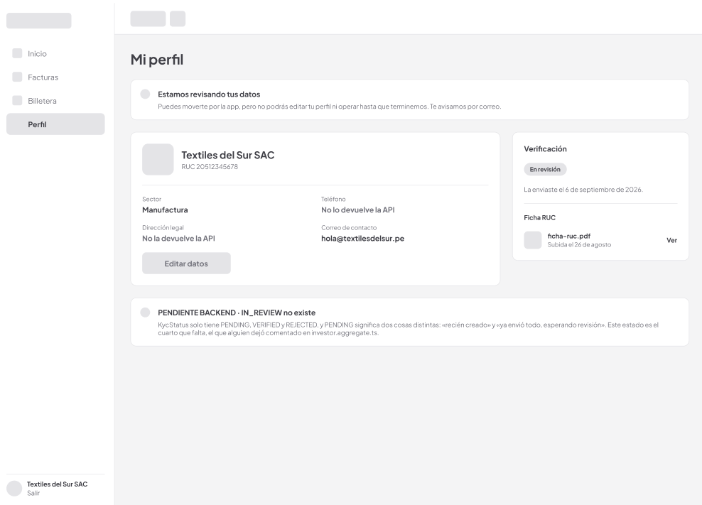

**Página no Encontrada (404)**

Muestra un mensaje al usuario indicando que la página solicitada no se encuentra disponible.

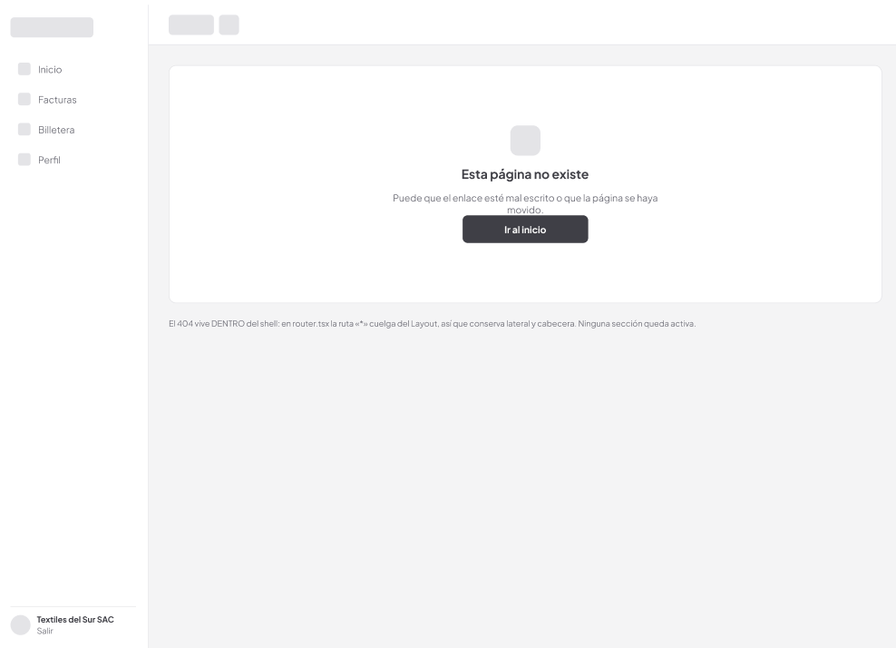


### 4.6.2. Web Applications Wireflow Diagrams

**Acceso y Recuperación**

User goal 01: Como responsable de una MYPE quiero crear mi cuenta o recuperar mi acceso para entrar a Vankoo con mi rol reconocido.

El recorrido principal ocupa solo dos pantallas: 01, donde se crea la cuenta, y 02, donde se inicia sesión. Como IAM emite el token y la web decodifica directamente el claim «roles», el sistema ya sabe que quien entra es una MYPE, y por eso no existe una pantalla de «elige tu perfil». Los dos rombos representan decisiones del sistema, no de la persona, y sus ramas «no» no tienen wireframe propio: el error se muestra sobre el mismo formulario, así que ambas ramas se cierran con una cápsula que regresa al paso de origen. La fila inferior corresponde al sub-flujo de recuperación, que se activa desde «¿Olvidaste tu contraseña?» y termina devolviendo a la persona a 02 con la contraseña ya renovada.


**Perfil y Validación**

User goal 02: Como responsable de una MYPE quiero registrar los datos de mi empresa y que se validen para poder operar en Vankoo.

Como el rol ya viaja en el token, este flujo no necesita preguntar quién es la MYPE, sino pedirle los datos de su empresa. 01 es un formulario que el agregado solo acepta completo —no admite actualizaciones parciales (PATCH)—, por lo que su rama «no» no avanza: devuelve a la persona al mismo paso con el campo inválido marcado. El segundo rombo resuelve el estado del KYC y tiene tres salidas posibles: si es aprobado, se abre el dashboard; si queda en revisión, se permite el ingreso pero con las acciones bloqueadas; y si es rechazado, esa es la única ruta del flujo que no tiene salida.

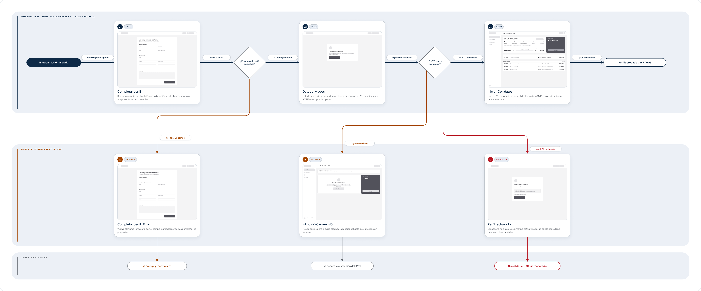

**Factura y Elegibilidad**

User goal 03: Como responsable de una MYPE quiero subir una factura y saber si es elegible para publicarla en subasta.

El flujo tiene cuatro pasos y un único rombo. 01 es el estado vacío desde el que parte la MYPE; 02 corresponde a la subida del documento, y 03 es ese mismo paso en su estado siguiente, mientras el pipeline —OCR, extracción de datos, verificación de consistencia y validación con SUNAT— se ejecuta de forma automática: en ese punto no hay interacción, solo espera. El rombo resuelve el enum InvoiceStatus: si la factura es aprobada, continúa a 04 y entra en subasta; si requiere revisión, el trabajo regresa a la MYPE; y si es no elegible o rechazada, el flujo se cierra sin salida.


**Seguimiento del fondeo**

User goal 04: Como responsable de una MYPE quiero seguir cómo avanza el fondeo de mi factura y saber cuándo el dinero está disponible.

Este flujo no crea nada, solo permite observar. 01 y 02 son dos formas de llegar a la misma factura —el resumen inicial y la tabla completa—, mientras que 03 es donde realmente se sigue el fondeo, porque el riel de hitos indica en cada momento quién está trabajando. El rombo es la única bifurcación: mientras la subasta no alcance el 100 %, el flujo permanece a la espera en 03, y en cuanto lo alcanza, el dinero queda disponible en 04. Las dos ramas alternativas no son errores, sino estados vacíos: el punto en el que la MYPE todavía no tiene nada publicado.


**Billetera y Retiro**

User goal 05: Como responsable de una MYPE quiero retirar a mi cuenta bancaria el dinero disponible en mi billetera.

El retiro es el último tramo del recorrido de la MYPE y el único que saca dinero de Vankoo, por lo que el rombo se ubica antes del formulario y no después: verifica las dos condiciones —saldo disponible y KYC aprobado— en el momento en que la persona pulsa «retirar», no cuando envía el importe. 02 y 03 son el mismo paso en dos estados distintos, que es la forma en que el wireflow representa el efecto de confirmar la operación. Las tres ramas inferiores no son errores, sino las tres razones por las que el botón no puede continuar, y cada una remite al lugar donde esa condición se resuelve.

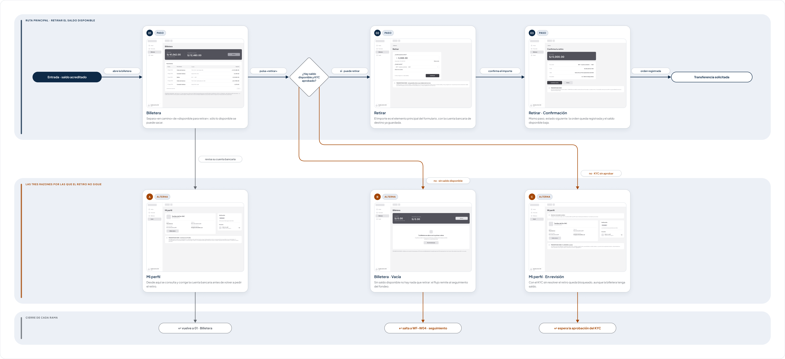

### 4.6.3. Web Applications Mock-ups

**IAM**

**Iniciar Sesión**

Pantalla de inicio de sesión con campos para correo electrónico y contraseña, botones de acción y enlaces a recuperación de contraseña y registro.

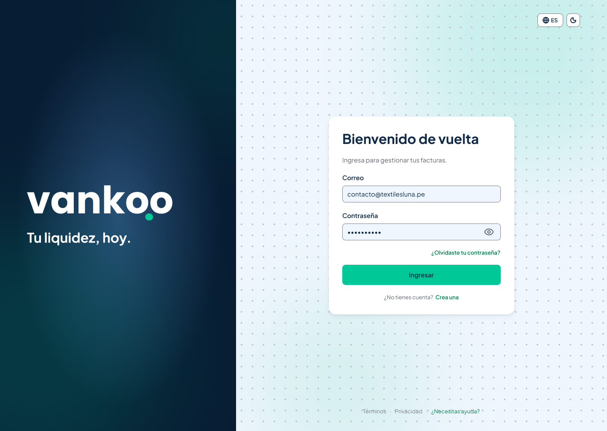

**Iniciar Sesión - Error

Pantalla de inicio de sesión con mensaje de error indicando que las credenciales son incorrectas.


**Iniciar Sesión - Cargando**

Pantalla de inicio de sesión con indicador de carga mientras se procesa la autenticación.


**Crear Cuenta**

Pantalla de registro de cuenta con campos para correo electrónico, contraseña y confirmación de contraseña, junto con botones de acción.

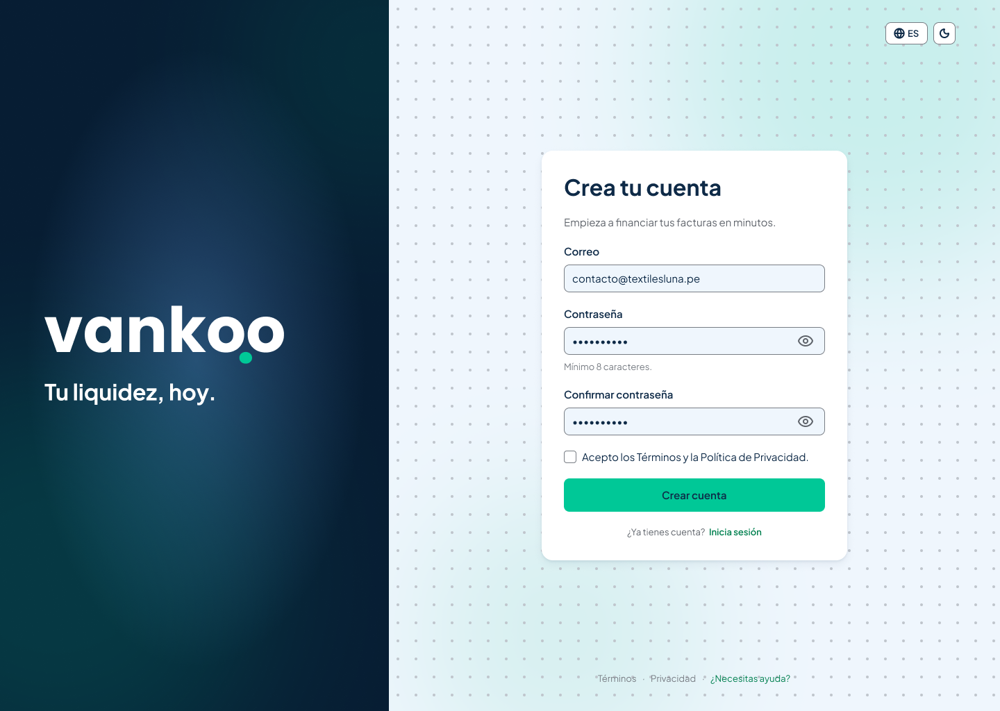

**Crear Cuenta - Error**

Pantalla de registro de cuenta con mensaje de error indicando que el correo electrónico ya está en uso.


**Crear Cuenta - Cargando**

Pantalla de registro de cuenta con indicador de carga mientras se procesa la creación de la cuenta.


**Recuperar Contraseña**

Pantalla de recuperación de contraseña con campos para correo electrónico y botones de acción.

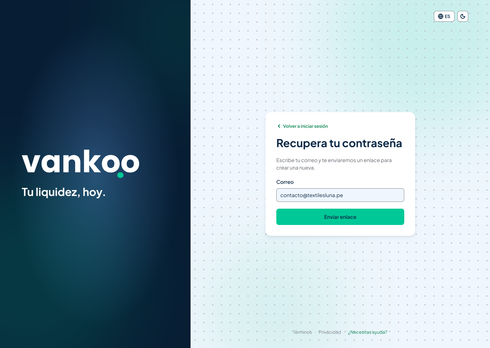

**Nueva Contraseña**

Pantalla para establecer una nueva contraseña con campos para la nueva contraseña y confirmación, junto con botones de acción.


**Nueva Contraseña - Enlace Incompleto**

Pantalla para establecer una nueva contraseña con mensaje de error indicando que el enlace de recuperación es inválido o ha expirado.


**Perfil**

**Completar Perfil**

Pantalla para completar el perfil de la empresa con campos para RUC, nombre de la empresa, dirección y otros datos relevantes, junto con botones de acción.


**Completar Perfil - Error**

Pantalla para completar el perfil de la empresa con mensaje de error indicando que algún campo es inválido o está incompleto.

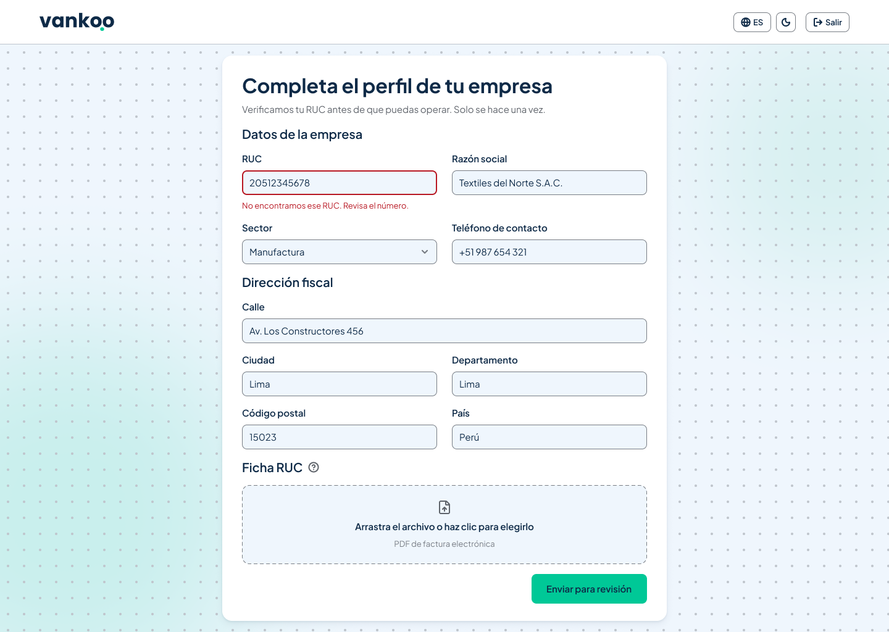

**Perfil en Revisión**

Pantalla que indica al usuario que su perfil está en proceso de revisión y que no puede acceder a ciertas funcionalidades hasta que sea aprobado.


**Rechazo de Perfil**

Pantalla que indica al usuario que su perfil ha sido rechazado y que no puede acceder a ciertas funcionalidades.

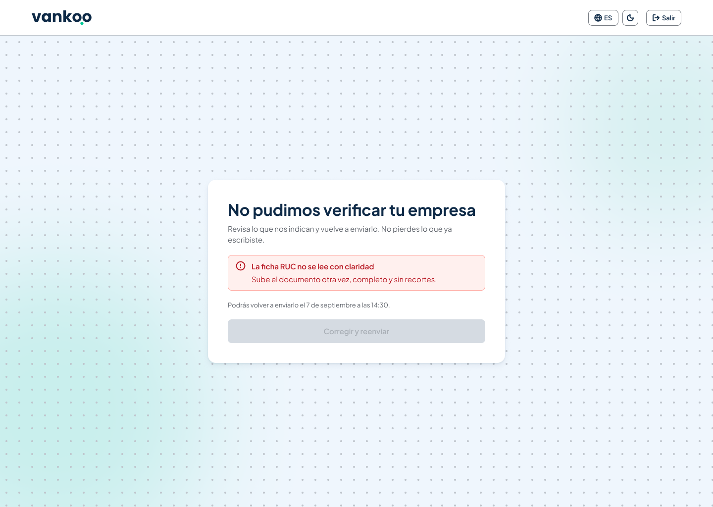

**DashBoard**

**Inicio con Datos**

Pantalla principal del dashboard que muestra un resumen del estado de las facturas y otras métricas relevantes para el usuario.


**Inicio sin Datos**

Pantalla principal del dashboard que indica al usuario que no tiene facturas registradas y le invita a subir su primera factura.


**KCY en Revisión**

Pantalla del dashboard que indica al usuario que su perfil está en proceso de revisión y que no puede acceder a ciertas funcionalidades hasta que sea aprobado.


**Facturas**

**Subir Facturas**

Pantalla para subir una factura con campos para seleccionar el archivo y botones de acción.

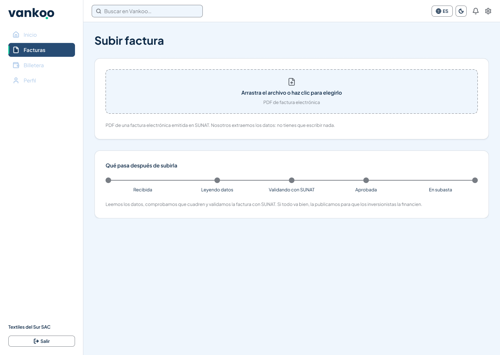

**Facturas en Proceso**

Pantalla que muestra un listado de las facturas que están siendo procesadas, con información relevante como el estado de la factura.

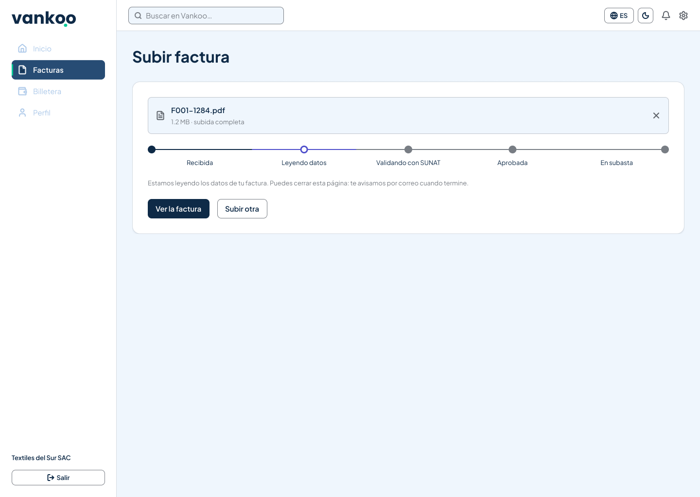

**Mi Lista de Facturas**

Pantalla que muestra un listado de todas las facturas del usuario, con información relevante como el estado de la factura.

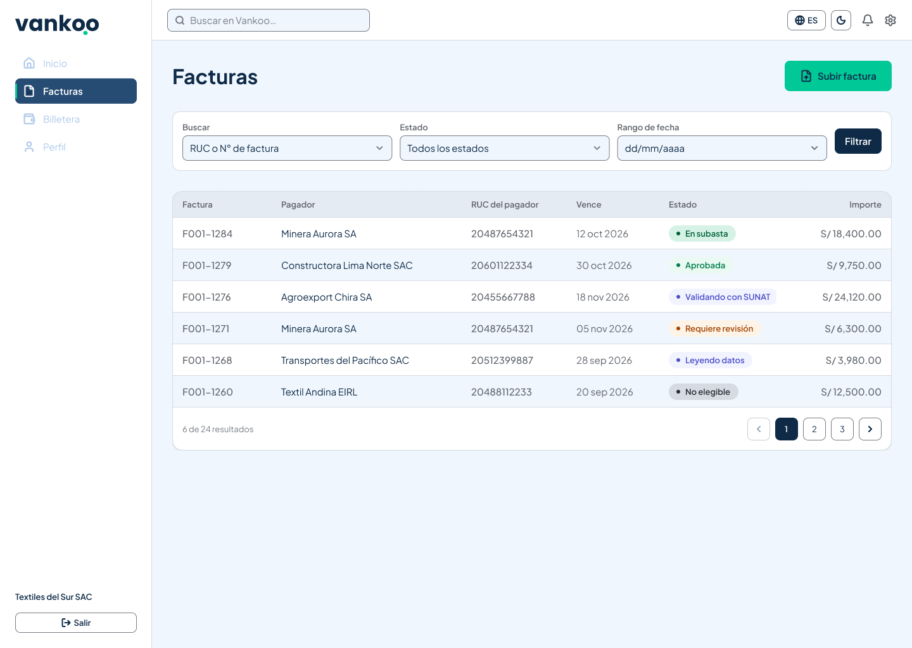

**Detalle de Factura**

Pantalla que muestra los detalles de una factura específica, incluyendo información como el estado de la factura, el monto y la fecha de vencimiento.

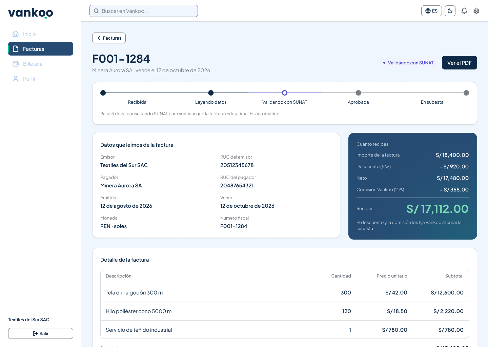

**Requiere Revisión**

Pantalla que indica al usuario que su factura requiere revisión y que no puede ser procesada hasta que se resuelvan los problemas.


**Factura Rechazada**

Pantalla que indica al usuario que su factura ha sido rechazada y que no puede ser procesada.


**Billetera y Perfil**

**Billetera**

Pantalla que muestra un resumen del estado de la billetera del usuario, incluyendo el saldo disponible y las transacciones recientes.

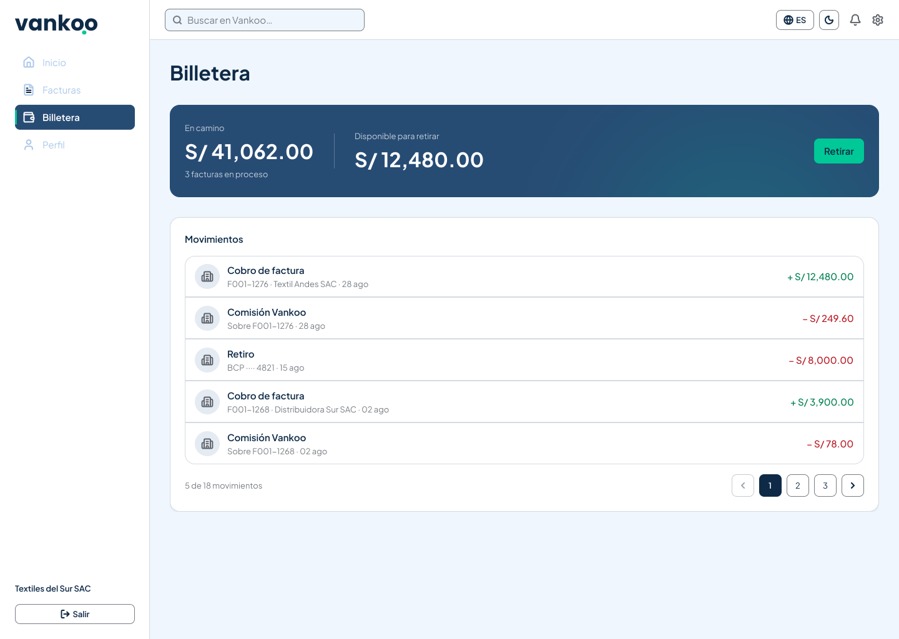

**Billetera Vacía**

Pantalla que indica al usuario que su billetera está vacía y que no tiene saldo disponible.


**Retiro de Fondos**

Pantalla que permite al usuario retirar fondos de su billetera a su cuenta bancaria, incluyendo campos para ingresar el monto y seleccionar la cuenta bancaria.


**Confirmar Retiro de Fondos**

Pantalla que confirma la solicitud de retiro de fondos del usuario, mostrando un resumen de la transacción.


**Mi Perfil**

Pantalla que permite al usuario ver su perfil, incluyendo campos para nombre, correo electrónico y contraseña.


**Mi Perfil en Revisión**

Pantalla que indica al usuario que su perfil está en proceso de revisión y que no puede acceder a ciertas funcionalidades hasta que sea aprobado.


**Pagina no encontrada (404)**

Pantalla que indica al usuario que la página solicitada no se encuentra disponible.


### 4.6.4. Web Applications User Flow Diagrams

**Acceso y Recuperación**

User goal 01: Como responsable de una MYPE quiero crear mi cuenta o recuperar mi acceso para entrar a Vankoo con mi rol reconocido.

El happy path recorre 01 → 02: la MYPE crea la cuenta, IAM emite el token y la web decodifica el claim «roles» para saber que entra como MYPE — no hace falta preguntárselo. Las dos rutas alternativas de la fila central son recuperables y devuelven al mismo paso del que salieron, sin sacar al usuario de la pantalla. La fila inferior es el sub-flujo de recuperación: se entra desde «¿Olvidaste tu contraseña?» y se vuelve a 02 con la contraseña nueva.


**Perfil y validación**

User goal 02: Como responsable de una MYPE quiero completar el perfil de mi empresa y conocer el estado de su validación para poder operar.

El onboarding va antes del dashboard: con el KYC en PENDING la MYPE no puede operar, así que ésta es la antesala de la casa. El happy path recorre 01 → 03: se completan los datos, el perfil pasa a revisión y el inicio queda navegable pero sin operar, con los botones visibles y deshabilitados. La ruta A es un error de campo recuperable en el momento; la ruta B es el rechazo, que se reintenta con espera creciente.

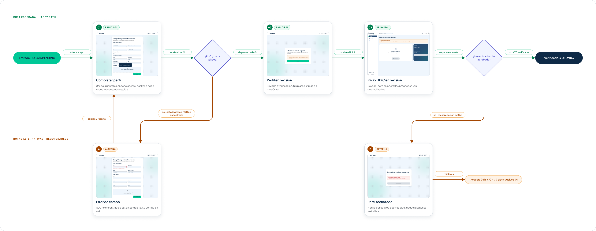

**Factura y elegibilidad**

User goal 03: Como responsable de una MYPE quiero subir una factura y saber si es elegible para publicarla en subasta.

La factura recorre el pipeline del servicio Invoicing: se sube, el sistema la lee y decide si es elegible. El happy path recorre 01 → 03 y termina con la factura publicada para el fondeo. El paso 02 no pide nada al usuario: el estado avanza solo. Las dos rutas alternativas comparten tono a propósito — ámbar cuando el pipeline necesita a una persona y todavía se puede corregir, rojo cuando la factura ya no tiene salida.

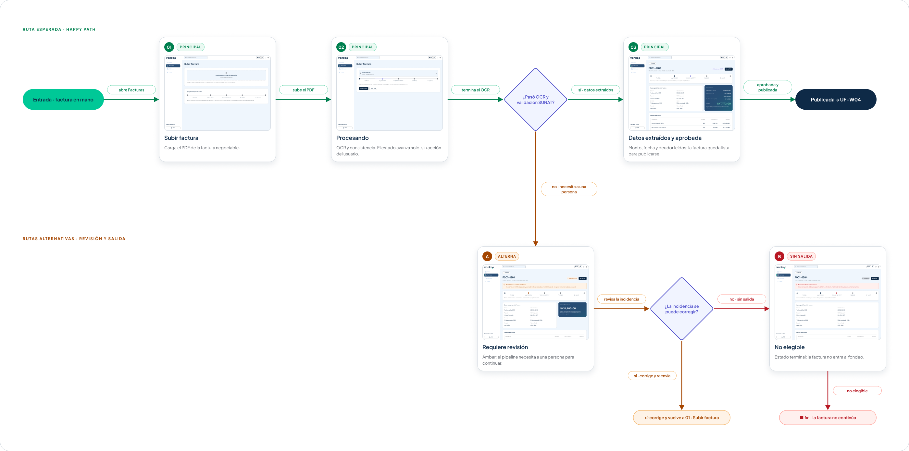

**Seguimiento del fondeo**

User goal 04: Como responsable de una MYPE quiero seguir cómo avanza el fondeo de mi factura y saber cuándo el dinero está disponible.

Este flujo no crea nada: consulta. El happy path recorre 01 → 03, de la lista al detalle y del detalle al inicio, que repite el avance del fondeo de cada factura. La primera bifurcación es el estado vacío —la lista sin facturas manda al flujo de carga— y la segunda es la factura no encontrada, que aparece con un enlace roto o cuando la factura no pertenece a la empresa de la sesión.

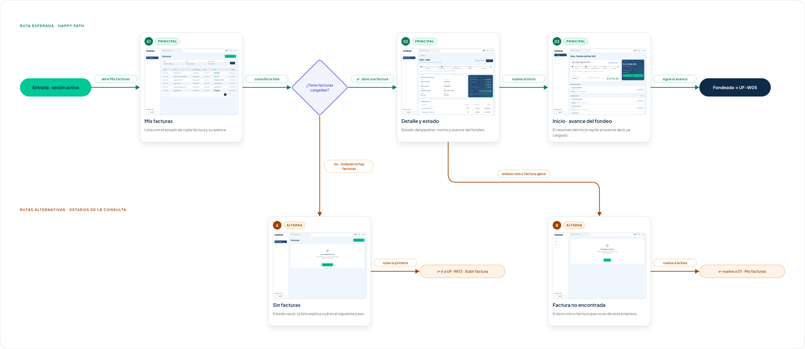

**Billetera y retiro**

User goal 05: Como responsable de una MYPE quiero retirar a mi cuenta bancaria el dinero disponible en mi billetera y conocer el estado de la operación.

El retiro es la última milla del producto para la MYPE: el dinero ya cobrado sale de la billetera hacia su cuenta. El happy path recorre 01 → 03 y termina con el saldo actualizado. Las dos rutas alternativas no son errores del usuario sino condiciones del estado de la cuenta: la billetera vacía manda al flujo de carga de facturas, y el KYC sin verificar manda al de perfil, porque no se paga a quien todavía no está verificado.


## 4.7. Web Applications Prototyping

En esta sección se presentan los prototipos de alta fidelidad de las aplicaciones web de la plataforma Vankoo, junto con enlaces a los videos demostrativos y capturas de pantalla representativas.

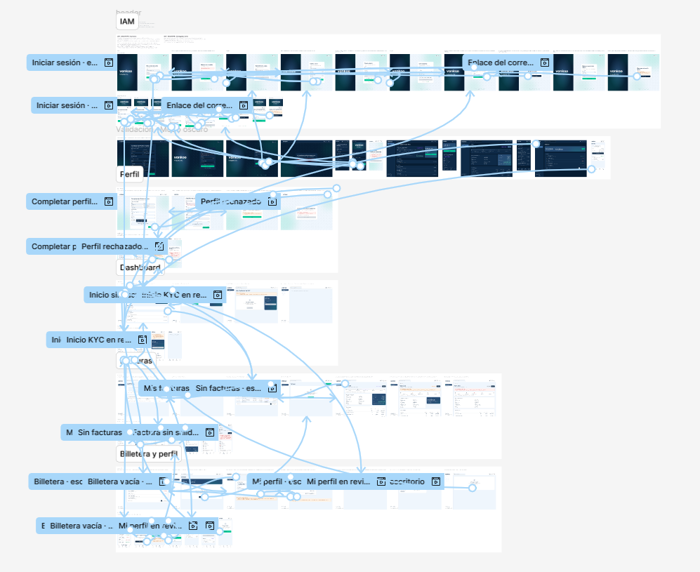

<hr class="page-break">

## 4.8. Domain-Driven Software Architecture

En esta sección se presenta el modelo físico de datos correspondiente a cada microservicio mediante sus respectivos diagramas entidad-relación (ERD). Se contemplan cuatro contextos relacionales (IAM y Profile en PostgreSQL, Finance mediante un read model en PostgreSQL sobre Axon Server Event Store, e Investment en Oracle) y un esquema de documentos NoSQL en MongoDB para el contexto de Invoicing. Cada diagrama refleja de forma fidedigna el estado real de la base de datos a partir de sus entidades (JPA/TypeORM/EF-Mongo) y scripts de migración. Destaca el caso particular de Finance, el cual aplica el patrón Axon Event Sourcing: los agregados de dominio no se mapean en tablas dedicadas, limitando el esquema de PostgreSQL a las tablas del modelo de lectura y a las estructuras de soporte operativo (idempotencia, inbox de webhooks y el token/saga store de Axon)

### 4.8.1. Software Architecture Context Diagram

En esta sección se presenta el **Diagrama de Contexto del Sistema (System Context View)** para **Vankoo**, el cual delimita las fronteras de la plataforma, identifica los tipos de usuarios principales y detalla sus interacciones con los servicios externos que complementan la arquitectura del software.

<p align="center">
  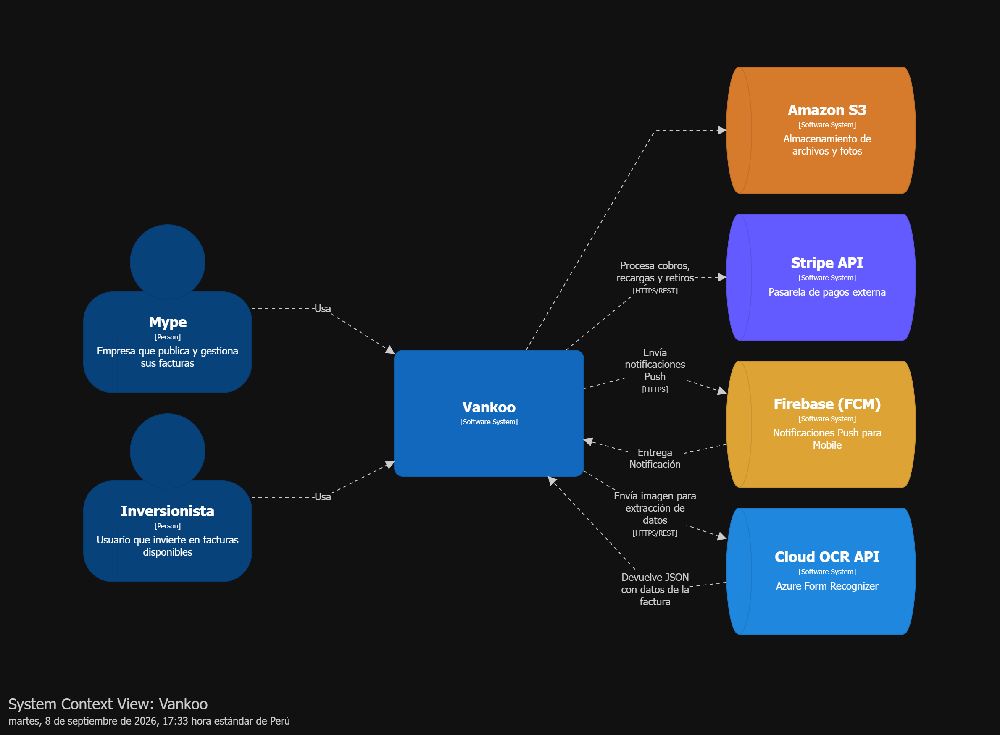<br />
  <b>Figura: Diagrama de Contexto del Sistema Vankoo</b>
</p>

---

#### **Componentes y Elementos del Diagrama**

1. **Usuarios del Sistema (Actores):**
   * **MYPE:** Empresa que publica y gestiona facturas electrónicas en la plataforma para obtener liquidez inmediata.
   * **Inversionista:** Usuario final que explora el mercado e invierte dinero en las facturas disponibles para obtener retornos por tasa de descuento.

2. **Core del Sistema (Vankoo):**
   * Núcleo del software que centraliza la lógica de negocio, procesamiento de subastas, administración de billeteras virtuales y orquestación de servicios.

3. **Servicios e Integraciones Externas:**
   * **Amazon S3:** Almacenamiento seguro en la nube para documentos y archivos adjuntos (facturas, DNI, sustentación legal).
   * **Stripe API:** Pasarela bancaria externa para el procesamiento de cobros, recargas de saldo y retiros de dinero de los usuarios.
   * **Firebase (FCM):** Servicio de notificaciones Push para el envío en tiempo real de alertas sobre el estado de subastas, recargas y operaciones.
   * **Cloud OCR API:** Servicio externo de reconocimiento óptico de caracteres para la extracción e intepretación automática de datos relevantes a partir de la imagen de las facturas.

### 4.8.2. Software Architecture Container Diagrams

En esta sección se presenta el **Diagrama de Contenedores (Container View)** bajo el modelo C4 para la plataforma **Vankoo**. Este nivel muestra la distribución de las aplicaciones ejecutables, los servicios de backend y los almacenes de datos que conforman el ecosistema técnico, detallando sus responsabilidades principales y los protocolos de comunicación utilizados.

<p align="center">
  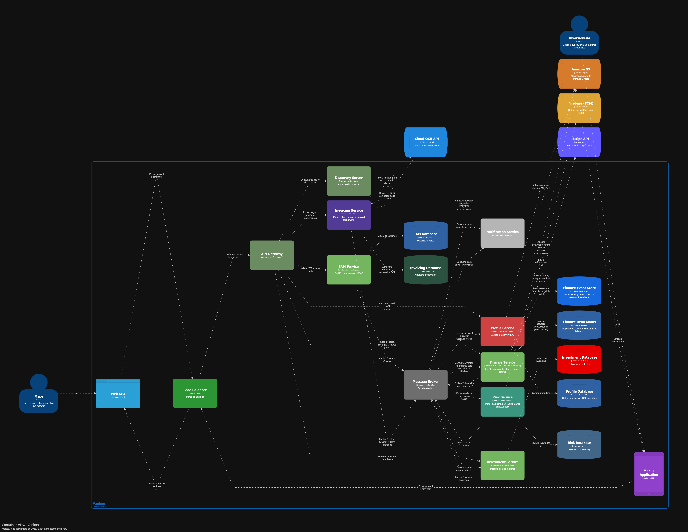<br /><br />
  <b>Figura: Diagrama de Contenedores de la Plataforma Vankoo</b>
</p>

---

#### **Descripción de Contenedores y Componentes**

1. **Aplicaciones de Cliente (Frontend):**
   * **Web MYPE (SPA):** Aplicación web dirigida a las micro y pequeñas empresas para la carga de facturas, seguimiento del estado de subastas y consulta de liquidez disponible.
   * **Mobile App Inversionista:** Aplicación móvil diseñada para que los inversionistas exploren el mercado de facturas, realicen pujas en tiempo real y gestionen su billetera virtual.

2. **Punto de Entrada (API Gateway / BFF):**
   * **API Gateway:** Enruta y gestiona el tráfico de peticiones entrantes vía HTTP/HTTPS, aplicando mecanismos de autenticación, autorización básica y limitación de tasa (*rate limiting*) hacia los microservicios correspondientes.

3. **Microservicios de Dominio (Core Backend):**
   * **IAM Service:** Gestiona la identidad, el registro, inicio de sesión y la emisión/validación de tokens de acceso (JWT).
   * **Profile Service:** Administra los perfiles de usuario, la validación de identidad KYC (*Know Your Customer*) y la información corporativa o personal.
   * **Invoicing Service:** Procesa la recepción de facturas electrónicas, extracción automática de datos mediante OCR y validación de reglas de emisión.
   * **Investment Service:** Orquesta la lógica del mercado de subastas, registro de ordenes de inversión/pujas y adjudicación de facturas.
   * **Finance Service:** Administra el estado de las billeteras digitales, procesamiento de movimientos financieros, recargas, retiros e historial de transacciones.

4. **Persistencia de Datos y Axon Server:**
   * **Bases de Datos Especializadas:** Almacenes independientes por microservicio (PostgreSQL para IAM y Profile; Oracle para Investment; MongoDB NoSQL para Invoicing).
   * **Axon Server (Event Store):** Motor centralizado de eventos para el microservicio de Finance, facilitando una arquitectura guiada por eventos (*Event Sourcing* y *CQRS*).

5. **Integraciones Externas:**
   * **Stripe API:** Pasarela de pago para la gestión de fondos y transferencias.
   * **Amazon S3:** Almacenamiento seguro de archivos digitales y documentos adjuntos.
   * **Firebase FCM:** Envío de notificaciones Push en tiempo real a los dispositivos móviles.
   * **Cloud OCR API:** Servicio de lectura e interpretación inteligente de documentos.

### 4.8.3. Software Architecture Components Diagrams

Los diagramas de componentes (C4 Nivel 3) profundizan en la organización interna y la estructura de módulos de cada *bounded context* de **Vankoo**. Fueron elaborados en **Structurizr** tomando como referencia el código fuente y la arquitectura de capas de cada microservicio. 

Actualmente, se han desarrollado los cinco *bounded contexts* implementados en el sistema —**IAM**, **Invoicing**, **Investment**, **Finance** y **Profile**—, siguiendo la convención de capas *Interface*, *Application*, *Domain* e *Infrastructure*, junto con adaptadores tipo *Anti-Corruption Layer (ACL)* para las integraciones con servicios externos (OCR, almacenamiento en la nube y pasarelas de pago).

---

#### **1. IAM Service Component Diagram**

El diagrama de componentes del **IAM Service** (Java / Spring Boot) se estructura en seis componentes principales:
* **IAM Interface Layer:** Compuesta por `AuthenticationController` y `UsersController`, actúa como punto de entrada REST expuesto al API Gateway.
* **IAM Application Layer:** Orquesta la lógica de registro de usuarios, inicio de sesión y gestión de credenciales.
* **IAM Domain Layer:** Modela las entidades centrales del dominio, compuestas por el agregado `User` y la entidad `Role`.
* **IAM Security Infrastructure:** Provee los mecanismos de cifrado (`BCrypt`) y gestión de tokens de autenticación (`JWT`).
* **IAM Persistence Infrastructure:** Administra la capa ORM (JPA) hacia la base de datos relacional `IAM Database` en PostgreSQL.
* **IAM Messaging Infrastructure:** Publica el evento `UserCreatedEvent` hacia el Message Broker tras la confirmación de la transacción.

* **Código fuente (Structurizr DSL):** [`iam-service-components.dsl`](./assets/cap4-product-design/software-architecture/components-diagrams/src/iam-service-components.dsl)

---

#### **2. Invoicing Service Component Diagram**

El diagrama de componentes del **Invoicing Service** (C# / .NET) organiza en ocho componentes el flujo de carga, procesamiento y validación de facturas utilizando el patrón MediatR/CQRS:
* **Invoicing Interface Layer:** Recibe las peticiones REST para la carga, consulta y descarga de archivos de facturas.
* **Invoicing Application Layer:** Coordina la ejecución de los *Command Handlers* y *Query Handlers*.
* **Invoicing Domain Layer:** Define el agregado `Invoice` como una máquina de estados y contiene el servicio de dominio `InvoiceConsistencyValidator`.
* **OCR Background Worker:** Proceso asíncrono en segundo plano que reclama tareas de facturas pendientes de procesamiento.
* **OCR ACL Adapter:** Adaptador de integración con la API externa **Azure Document Intelligence** para la extracción de datos de la factura.
* **Storage ACL Adapter:** Adaptador para la carga e integración directa con **Amazon S3**.
* **Invoicing Persistence Infrastructure:** Gestiona la persistencia de documentos en **MongoDB**.
* **Invoicing Messaging Infrastructure:** Publica el evento de integración `InvoiceEligibleForFundingIntegrationEvent` hacia el Message Broker.

* **Código fuente (Structurizr DSL):** [`invoicing-service-components.dsl`](./assets/cap4-product-design/software-architecture/components-diagrams/src/invoicing-service-components.dsl)

---

#### **3. Investment Service Component Diagram**

El diagrama de componentes del **Investment Service** (Java / Spring Boot) está estructurado en cinco componentes encargados de soportar el mercado de subastas:
* **Investment Interface Layer:** Modulo controller (`AuctionsController`) que expone endpoints para publicar subastas, realizar inversiones por fracciones y listar el catálogo del mercado.
* **Investment Application Layer:** Orquesta la ejecución de pujas y compras sobre el agregado `Auction` y sus particiones (`Partition`).
* **Investment Domain Layer:** Modela las entidades de negocio de las subastas y reglas de fraccionamiento.
* **Investment Persistence Infrastructure:** Gestiona las transacciones y la actualización de proyecciones de lectura (CQRS) sobre la base de datos **Oracle XE**.
* **Investment Messaging Infrastructure:** Consume el evento de facturas elegibles enviado por el Invoicing Service y lo transforma internamente en el comando `CreateAuctionCommand`.

> *Nota:* La integración con la publicación del evento "Inversión Realizada" y el cálculo del scoring de riesgo se incorporarán en versiones posteriores, por lo que no forman parte de este diagrama.

* **Código fuente (Structurizr DSL):** [`investment-service-components.dsl`](./assets/cap4-product-design/software-architecture/components-diagrams/src/investment-service-components.dsl)

---

#### **4. Finance Service Component Diagram**

El diagrama de componentes del **Finance Service** (Java / Spring Boot con Axon Framework) implementa el patrón **Event Sourcing / CQRS** dividido en nueve componentes:
* **Finance Command Application Layer:** Recibe y despacha comandos sobre los agregados `Wallet` y `Deposit` mediante el `CommandGateway` de Axon.
* **Finance Domain Layer:** Modela los agregados y reglas del dominio financiero.
* **Finance Event Store:** Motor **Axon Server** que almacena la secuencia inmutable de eventos de dominio.
* **Finance Event Reactors (Sagas):** Componente reactivo encargado de orquestar transacciones distribuidas para el saldo y coordinar cobros.
* **Stripe ACL Adapter:** Adaptador de integración con **Stripe API** para el procesamiento de pagos, recargas y retiros.
* **Finance Query / Projection Layer:** Proyecta y actualiza la información en tiempo real hacia el *Read Model*.
* **Finance Read Persistence Infrastructure:** Almacena el modelo de lectura de consultas (`finance_read_model`) en **PostgreSQL**.
* **Finance Operational Persistence Infrastructure:** Almacena registros de auditoría, control de idempotencia e *inbox* (`finance_ops`) en **PostgreSQL**.
* **Finance Integration Event Publisher:** Notifica los eventos financieros procesados hacia el Message Broker.

* **Código fuente (Structurizr DSL):** [`finance-service-components.dsl`](./assets/cap4-product-design/software-architecture/components-diagrams/src/finance-service-components.dsl)

---

#### **5. Profile Service Component Diagram**

El diagrama de componentes del **Profile Service** (TypeScript / NestJS) se divide en seis componentes para la gestión de usuarios y procesos KYC:
* **Profile Interface Layer:** Expone servicios REST para actualización de datos, carga de documentos de identidad y respuesta del estado del KYC.
* **Profile Application Layer:** Orquesta los flujos de negocio sobre los agregados `Company` (MYPE) y `Investor` (Inversionista).
* **Profile Domain Layer:** Contiene los agregados y la máquina de estados asociada a la verificación de identidad (KYC).
* **Storage ACL Adapter:** Encargado de generar URLs prefirmadas para la carga segura de archivos (DNI, RUC, logos) hacia **Amazon S3**.
* **Profile Messaging Infrastructure:** Escucha eventos de creación de usuarios publicados por el IAM Service para generar el perfil base, y emite los eventos `ProfileCompleted`, `KycVerified` y `KycRejected` hacia el Message Broker.
* **Profile Persistence Infrastructure:** Administra el acceso y persistencia de perfiles en la base de datos PostgreSQL.

* **Código fuente (Structurizr DSL):** [`profile-service-components.dsl`](./assets/cap4-product-design/software-architecture/components-diagrams/src/profile-service-components.dsl)


## 4.9. Software Object-Oriented Design

### 4.9.1. Class Diagrams

Se presentan a continuación los cinco diagramas de clases de la capa de dominio, uno por cada *Bounded Context*, bajo la paleta de estereotipos DDD acordada para el proyecto: **`«AggregateRoot»`** (`#1168BD`), **`«Entity»`** (`#438DD5`), **`«ValueObject»`** (`#85BBF0`), **`«DomainEvent»`** (`#F28FAD`), **`«DomainService»`** (`#6BA3DC`) y **`«Exception»`** (`#CDA1A1`).

---

#### **1. IAM Bounded Context**

El diagrama de clases del *Domain Layer* del *Bounded Context* **IAM** modela únicamente los conceptos centrales del dominio, sin las capas de aplicación e infraestructura. 

* El paquete `iam.domain.model.aggregates` contiene al Aggregate Root `User`.
* `iam.domain.model.entities` contiene a la Entity `Role`.
* `iam.domain.model.valueobjects` agrupa los Value Objects `UserId`, `Email`, `Password`, `RoleId` y el enumerado `RoleName`.
* `iam.domain.model.events` encapsula el único Domain Event publicado (`UserCreatedEvent`).
* `iam.domain.services` declara los Domain Services que orquestan el agregado.

Las líneas continuas marcan composición y las punteadas, dependencias semánticas (eventos publicados, servicios que orquestan). IAM no define excepciones de dominio propias: sus invariantes lanzan `IllegalArgumentException` nativo.

<p align="center">
  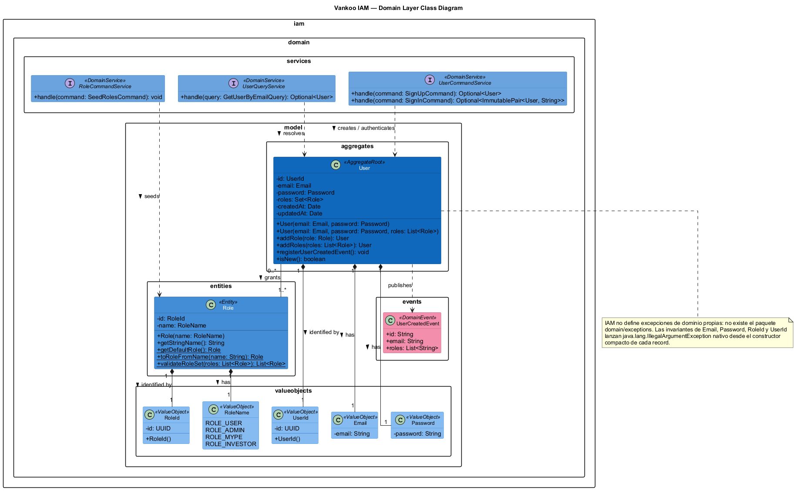<br />
  <b>Figura 4.9.1.1. Diagrama de clases del dominio del Bounded Context IAM.</b>
</p>

---

#### **2. Profile Bounded Context**

El diagrama de clases del *Domain Layer* del *Bounded Context* **Profile** modela dos Aggregate Roots independientes —`Company` (perfil de una Mype) e `Investor` (perfil de un inversionista)— y la Entity `BankAccount`, asociada opcionalmente a `Investor`. 

* El paquete `profile.domain.model.valueobjects` agrupa los dieciséis Value Objects que describen ambos perfiles (identificadores, contacto, dirección y evidencias de KYC).
* `profile.domain.services` declara los seis Domain Services que orquestan su creación, completado de perfil y verificación KYC. 

Las líneas continuas marcan la composición de cada agregado con sus Value Objects. Profile no define eventos ni excepciones de dominio como clases: las validaciones lanzan `Error` nativo y la integración se publica como payloads planos.

<p align="center">
  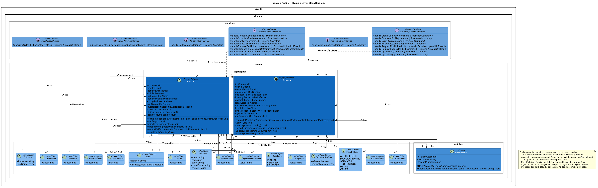<br />
  <b>Figura 4.9.1.2. Diagrama de clases del dominio del Bounded Context Profile.</b>
</p>

---

#### **3. Finance Bounded Context**

El diagrama de clases del *Domain Layer* del *Bounded Context* **Finance** modela dos Aggregate Roots *event-sourced* con Axon Framework —`Deposit` y `Wallet`—, reconstruidos por reproducción de eventos y sin tabla propia en la base de datos de consulta.

* El paquete `finance.domain.model.valueobjects` agrupa los Value Objects del núcleo transaccional (`Money`, `Currency`, `DepositId`, `WalletId`, `DepositStatus`) y los del adaptador de proveedor de pagos.
* `finance.domain.model.events` agrupa los diez Domain Events publicados.
* `finance.domain.exceptions` agrupa las dieciséis excepciones de negocio, incluida la jerarquía sellada `PaymentProviderException`. 

Las líneas punteadas marcan eventos y excepciones; los Domain Services despachan comandos hacia los agregados o resuelven consultas contra el *read model*.

<p align="center">
  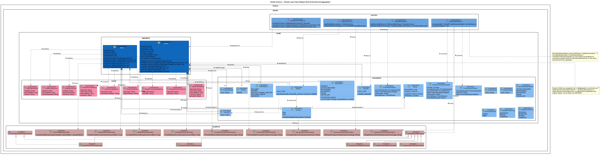<br />
  <b>Figura 4.9.1.3. Diagrama de clases del dominio del Bounded Context Finance.</b>
</p>

---

#### **4. Investment Bounded Context**

El diagrama de clases del *Domain Layer* del *Bounded Context* **Investment** modela al Aggregate Root `Auction` (subasta de financiamiento de una factura) y a la Entity `Partition`, la participación de un inversionista dentro de una subasta.

* El paquete `investment.domain.model.valueobjects` agrupa los Value Objects monetarios y de estado (`Money`, `Percentage`, `RiskScore`, `AuctionStatus`, `PartitionStatus`).
* `investment.domain.services` declara `AuctionCommandService` y `AuctionQueryService`.

Las líneas continuas marcan la composición de `Auction` con sus particiones; las punteadas, los tres Domain Events publicados. Investment tampoco define excepciones de dominio propias: sus invariantes lanzan `IllegalStateException` o `IllegalArgumentException` nativos.

<p align="center">
  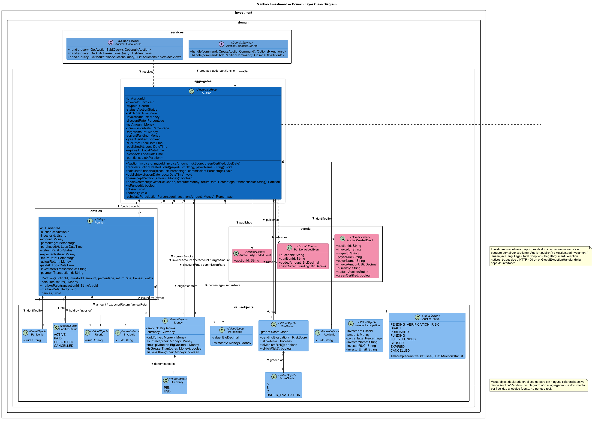<br />
  <b>Figura 4.9.1.4. Diagrama de clases del dominio del Bounded Context Investment.</b>
</p>

---

#### **5. Invoicing Bounded Context**

El diagrama de clases del *Domain Layer* del *Bounded Context* **Invoicing** modela dos Aggregate Roots —`Invoice` (la factura y su ciclo de extracción OCR/validación) y `OcrTask` (la cola de procesamiento asíncrono)—, cada uno con colección e identidad propias en MongoDB pese a que `OcrTask` reside físicamente en `Domain/Entities/`.

* El paquete `Invoicing.Domain.ValueObjects` agrupa los cerca de veinte Value Objects embebidos en `Invoice`.
* `Invoicing.Domain.Exceptions` contiene la jerarquía de excepciones de negocio.
* `Invoicing.Domain.Services` contiene el servicio `InvoiceConsistencyValidator`.

De los seis Domain Events declarados en el código, solo dos están realmente cableados a un manejador; los restantes se omiten del diagrama por no reflejar comportamiento real.

<p align="center">
  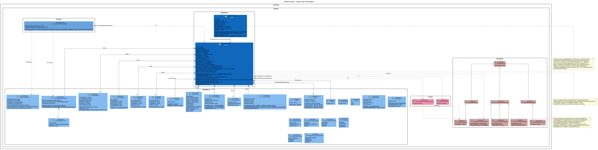<br />
  <b>Figura 4.9.1.5. Diagrama de clases del dominio del Bounded Context Invoicing.</b>
</p>


### 4.9.2. Class Dictionary

Se presenta a continuación el diccionario de clases de la capa de dominio organizado por *Bounded Context*, el cual especifica la responsabilidad, estereotipo DDD, atributos y métodos de negocio clave de cada elemento.

---

#### **1. IAM Bounded Context**

| Clase / Elemento | Estereotipo DDD | Responsabilidad / Descripción | Atributos Principales | Métodos de Negocio Clave |
| :--- | :--- | :--- | :--- | :--- |
| `User` | `«AggregateRoot»` | Representa la cuenta de acceso (credenciales y roles asignados) del sistema. | `id: UserId`, `email: Email`, `password: Password`, `roles: Set<Role>`, `createdAt/updatedAt: Date` | `User(email, password)`, `addRole(role)`, `addRoles(roles)`, `registerUserCreatedEvent()` |
| `Role` | `«Entity»` | Rol de autorización del catálogo fijo del sistema. | `id: RoleId`, `name: RoleName` | `getStringName()`, `getDefaultRole()` (static), `toRoleFromName(name)` (static), `validateRoleSet(roles)` (static) |
| `UserId` | `«ValueObject»` | Identidad única del agregado `User`. | `id: UUID` (UUIDv7) | `UserId()` — genera un nuevo UUIDv7 |
| `Email` | `«ValueObject»` | Dirección de correo validada por formato. | `email: String` | Validación por regex en el constructor compacto (`record`) |
| `Password` | `«ValueObject»` | Contraseña del usuario (hash aplicado fuera del VO). | `password: String` | Validación de no-vacío en el constructor compacto |
| `RoleId` | `«ValueObject»` | Identidad única de `Role`. | `id: UUID` (UUIDv7) | `RoleId()` — genera un nuevo UUIDv7 |
| `RoleName` | `«ValueObject»` (enum) | Catálogo cerrado de roles: `ROLE_USER`, `ROLE_ADMIN`, `ROLE_MYPE`, `ROLE_INVESTOR`. | — | — |
| `UserCreatedEvent` | `«DomainEvent»` | Notifica el alta de un `User`, propagado a otros Bounded Contexts vía Kafka (`vankoo.iam.events`). | `id: String`, `email: String`, `roles: List<String>` | — |
| `UserCommandService` | `«DomainService»` (interfaz) | Orquesta el alta (*Sign Up*) y el inicio de sesión (*Sign In*). | — | `handle(SignUpCommand): Optional<User>`, `handle(SignInCommand): Optional<ImmutablePair<User,String>>` |
| `UserQueryService` | `«DomainService»` (interfaz) | Resuelve la consulta de un usuario por email. | — | `handle(GetUserByEmailQuery): Optional<User>` |
| `RoleCommandService` | `«DomainService»` (interfaz) | Siembra (*seed*) el catálogo fijo de roles al iniciar el sistema. | — | `handle(SeedRolesCommand): void` |

> **Nota de fidelidad:** IAM no define excepciones de dominio propias; las invariantes de `Email`, `Password`, `RoleId` y `UserId` lanzan `IllegalArgumentException` nativo de Java.

---

#### **2. Profile Bounded Context**

| Clase / Elemento | Estereotipo DDD | Responsabilidad / Descripción | Atributos Principales | Métodos de Negocio Clave |
| :--- | :--- | :--- | :--- | :--- |
| `Company` | `«AggregateRoot»` | Perfil de una empresa (Mype) emisora, con su ciclo de verificación KYC. | `id: CompanyId`, `userId: UserId`, `contactEmail: Email`, `rucNumber`, `businessName`, `industrySector`, `contactPhone`, `legalAddress`, `sustainabilityStatus`, `kycStatus`, `kycRejectionReason`, `logoUrl/rucDocumentUrl: DocumentUrl` | `completeProfile(...)`, `verifyKyc()`, `rejectKyc(reason)`, `uploadRucDocument(url)`, `updateLogo(url)` |
| `Investor` | `«AggregateRoot»` | Perfil de un inversionista persona natural, con su ciclo de verificación KYC. | `id: InvestorId`, `userId: UserId`, `contactEmail: Email`, `dni`, `fullName`, `contactPhone`, `billingAddress`, `kycStatus`, `kycRejectionReason`, `photoUrl/dniDocumentUrl: DocumentUrl`, `bankAccount: BankAccount` | `completeProfile(...)`, `verifyKyc()`, `rejectKyc(reason)`, `updatePhoto(url)`, `updateDniDocument(url)` |
| `BankAccount` | `«Entity»` | Cuenta bancaria asociada a un `Investor` para retiros y depósitos. | `id: BankAccountId`, `bankName: string`, `accountNumber: string` | `updateAccountDetails(newBankName, newAccountNumber)` |
| `CompanyId` / `InvestorId` / `BankAccountId` | `«ValueObject»` | Identidad del agregado o entidad correspondiente (UUID como `string`). | `value: string` | Autogeneran `randomUUID()` si no se provee valor |
| `UserId` | `«ValueObject»` | Referencia a la identidad del usuario en IAM. | `value: string` | Valida no-vacío |
| `Email` | `«ValueObject»` | Correo de contacto. | `address: string` | `validate(email): boolean` |
| `RucNumber` | `«ValueObject»` | RUC de la empresa. | `value: string` | Sin validación de formato |
| `BusinessName` | `«ValueObject»` | Razón social. | `value: string` | — |
| `IndustrySector` | `«ValueObject»` (enum) | Sector económico: `AGRICULTURE`, `MANUFACTURING`, `SERVICES`, `TECHNOLOGY`, `RETAIL`, `OTHER`. | — | — |
| `PhoneNumber` | `«ValueObject»` | Teléfono de contacto. | `value: string` | — |
| `Address` | `«ValueObject»` | Dirección postal (legal o de facturación). | `street`, `city`, `state`, `postalCode`, `country: string` | Valida `street`, `city` y `country` no vacíos |
| `SustainabilityStatus` | `«ValueObject»` | Estado de certificación de sostenibilidad de una empresa. | `isGreen: boolean`, `verificationDate?: Date` | — |
| `KycStatus` | `«ValueObject»` (enum) | Estado del proceso KYC: `PENDING`, `VERIFIED`, `REJECTED`. | — | — |
| `KycRejectionReason` | `«ValueObject»` | Motivo de rechazo de un KYC. | `value: string` | Valida no-vacío |
| `DocumentUrl` | `«ValueObject»` | URL de un documento subido (logo, RUC, DNI, foto). | `url: string` | Valida que inicie con `'http'` |
| `DniNumber` | `«ValueObject»` | DNI del inversionista. | `value: string` | — |
| `FullName` | `«ValueObject»` | Nombre completo del inversionista. | `firstName`, `lastName: string` | — |
| `ICompanyCommandService` / `IInvestorCommandService` | `«DomainService»` (interfaz) | Orquestan alta, completado de perfil, KYC y carga de documentos. | — | `handleCreateX`, `handleCompleteProfile`, `handleVerifyKyc`, `handleRejectKyc`, `handleRequestXUploadUrl`, `handleUploadX` |
| `ICompanyQueryService` / `IInvestorQueryService` | `«DomainService»` (interfaz) | Resuelven consultas por id. | — | `handleGetXById(query)` |
| `IEventPublisherService` | `«DomainService»` (interfaz) | Puerto de publicación de eventos de integración hacia Kafka. | — | `publish(topic, payload): Promise<void>` |
| `IFileStorageService` | `«DomainService»` (interfaz) | Puerto de generación de URLs prefirmadas para carga de archivos (S3/MinIO). | — | `generateUploadUrl(objectKey): Promise<UploadUrlResult>` |

> **Nota de fidelidad:** Profile no define eventos ni excepciones de dominio tipados. Las validaciones lanzan `Error` nativo de TypeScript, y los eventos de integración (`ProfileCompleted`, `KycVerified`, `KycRejected`) son objetos planos publicados desde la capa de aplicación.

---

#### **3. Finance Bounded Context**

| Clase / Elemento | Estereotipo DDD | Responsabilidad / Descripción | Atributos Principales | Métodos de Negocio Clave |
| :--- | :--- | :--- | :--- | :--- |
| `Deposit` | `«AggregateRoot»` | Ciclo de vida de un depósito de fondos vía Stripe; agregado Axon reconstruido por *event sourcing*. | `depositId`, `accountId: String`, `amountMinor: long`, `currency`, `provider`, `providerDepositId`, `status`, `failureReason` | `Deposit(InitiateDepositCommand)`, `handle(RegisterDepositProviderReferenceCommand)`, `handle(ApplyProviderDepositUpdateCommand)` |
| `Wallet` | `«AggregateRoot»` | Saldo monetario de una cuenta en una moneda específica; agregado Axon con *snapshot* cada 100 eventos. | `walletId`, `accountId: String`, `currency`, `balanceMinor: long` | `Wallet(OpenWalletCommand)`, `handle(CreditWalletCommand)`, `handle(DebitWalletCommand)` |
| `DepositId` | `«ValueObject»` | Identidad de `Deposit` (UUIDv7). | `value: UUID` | `newId()` |
| `AccountId` | `«ValueObject»` | Identidad de cuenta, siempre originada fuera de Finance. | `value: UUID` | — |
| `WalletId` | `«ValueObject»` | Identidad de `Wallet`, derivada de (`accountId`, `currency`). | `value: UUID` | `derive(accountId, currency)` — UUIDv5 determinístico |
| `Money` | `«ValueObject»` | Monto monetario con su moneda. | `amountMinor: long`, `currency: Currency` | `add(other)`, `isPositive()` |
| `Currency` | `«ValueObject»` (enum) | Monedas soportadas: `PEN`, `USD`. | — | `fromIsoCode(isoCode)` |
| `Provider` | `«ValueObject»` (enum) | Proveedor de pagos: `STRIPE`. | — | — |
| `ProviderDepositId` | `«ValueObject»` | Identificador opaco del depósito en el proveedor externo. | `value: String` | — |
| `ProviderEventId` | `«ValueObject»` | Clave de deduplicación de eventos de webhook del proveedor. | `value: String` | — |
| `IdempotencyKey` | `«ValueObject»` | Clave de idempotencia de la solicitud de depósito. | `value: String` | — |
| `DepositStatus` | `«ValueObject»` (enum) | Estados de `Deposit`: `PENDING`, `ACTION_REQUIRED`, `PROCESSING`, `SUCCEEDED`, `FAILED`, `CANCELLED`. | — | `isTerminal()`, `canTransitionTo(target)` |
| `NormalizedDepositStatus` | `«ValueObject»` (enum) | Taxonomía normalizada del adaptador de proveedor (sin `PENDING`). | — | — |
| `FailureReason` | `«ValueObject»` (enum) | Motivo de falla: `DECLINED`, `EXPIRED`, `INVALID_PAYMENT_METHOD`, `PROVIDER_ERROR`, `UNKNOWN`. | — | — |
| `MovementDirection` | `«ValueObject»` (enum) | Dirección de un movimiento de wallet: `CREDIT`, `DEBIT`. | — | — |
| `WalletMovementType` | `«ValueObject»` (enum) | Motivos de débito del wallet: `INVERSION`, `RETIRO`, `COMISION`. | — | — |
| `WalletMovementKind` | `«ValueObject»` (enum) | Vocabulario completo del *read model* de movimientos: `RECARGA`, `INVERSION`, `RETIRO`, `COMISION`. | — | — |
| `ProviderDepositCreated` | `«ValueObject»` | Resultado de creación de un depósito en el proveedor externo. | `providerDepositId`, `actionUrl`, `status` | — |
| `ProviderDepositStatus` | `«ValueObject»` | Estado observado de un depósito reportado por el proveedor. | `providerDepositId`, `status`, `observedAt`, `failureReason` | — |
| `VerifiedProviderDepositUpdate` | `«ValueObject»` | Actualización de proveedor ya verificada (firma de webhook validada). | `provider`, `providerDepositId`, `providerEventId`, `status`, `observedAt`, `failureReason`, `cancellationReason` | — |
| `DepositInitiatedEvent` … `DepositCancelledEvent` (7 eventos) | `«DomainEvent»` | Hitos del ciclo de vida de `Deposit` (iniciado, requiere acción, en proceso, exitoso, fallido, cancelado y registro de referencia del proveedor). | `depositId`, `accountId`, `amountMinor`, `currency`, `provider` + campos específicos | — |
| `WalletOpenedEvent`, `WalletCreditedEvent`, `WalletDebitedEvent` | `«DomainEvent»` | Hitos del ciclo de vida de `Wallet` (apertura, abono, cargo). | `walletId`, `amountMinor`, `currency` + `sourceDepositId/reason` | — |
| `InvalidDepositAmountException` | `«Exception»` | Monto de depósito $\le 0$. | `amountMinor: long` | — |
| `UnsupportedCurrencyException` | `«Exception»` | Código ISO de moneda no soportado. | `isoCode: String` | — |
| `ProviderReferenceMismatchException` | `«Exception»` | La referencia del proveedor no coincide con la ya registrada. | `message: String` | — |
| `TerminalStateTransitionException` | `«Exception»` | Transición inválida desde un estado terminal de `Deposit`. | `message: String` | — |
| `InvalidCreditAmountException` / `InvalidDebitAmountException` | `«Exception»` | Monto de abono o cargo $\le 0$ en `Wallet`. | `amountMinor: long` | — |
| `InsufficientBalanceException` | `«Exception»` | Saldo insuficiente para un débito de `Wallet`. | `walletId`, `balanceMinor`, `requestedMinor` | — |
| `IdempotencyKeyConflictException` | `«Exception»` | Conflicto de idempotencia en `POST /v1/deposits`. | `message: String` | — |
| `IntegrationEventPublicationException` | `«Exception»` | Falla al publicar un evento de integración. | `message: String` | — |
| `PaymentProviderException` (+ 5 subclases selladas, `RetryablePaymentProviderException`) | `«Exception»` | Jerarquía de errores del adaptador de proveedor de pagos (rechazo, timeout, no disponible, firma inválida, evento no soportado). | — | — |
| `DepositCommandService` | `«DomainService»` (interfaz) | Orquesta la iniciación y actualización de depósitos. | — | `handle(InitiateDepositCommand): DepositId`, `handle(RegisterDepositProviderReferenceCommand)`, `handle(ApplyProviderDepositUpdateCommand)` |
| `DepositQueryService` / `WalletQueryService` | `«DomainService»` (interfaz) | Resuelven consultas contra el *read model* (nunca contra el agregado). | — | `getDepositById`, `listDepositsByAccount`, `getWalletBalance`, `listWalletMovements` |
| `WebhookInboxService` | `«DomainService»` (interfaz) | Admite y aplica actualizaciones de webhook de forma idempotente. | — | `accept(VerifiedProviderDepositUpdate): InboxAdmission`, `resolveAndApply()` |

> **Nota de fidelidad:** `Deposit` y `Wallet` son agregados Axon 4 (*event-sourced*): no tienen tabla propia ni operación `save()`; se reconstruyen por reproducción de eventos desde Axon Server.

---

#### **4. Investment Bounded Context**

| Clase / Elemento | Estereotipo DDD | Responsabilidad / Descripción | Atributos Principales | Métodos de Negocio Clave |
| :--- | :--- | :--- | :--- | :--- |
| `Auction` | `«AggregateRoot»` | Subasta de financiamiento de una factura (*invoice factoring*); administra sus particiones de inversión. | `id: AuctionId`, `invoiceId`, `mypeId: UserId`, `status`, `riskScore`, `invoiceAmount/netAmount/targetAmount/currentFunding: Money`, `discountRate/commissionRate: Percentage`, `greenCertified`, `partitions: List<Partition>` | `registerAuctionCreatedEvent(...)`, `calculateFinancials(discount, commission)`, `publish(expirationDate)`, `canAcceptPartition(amount)`, `addInvestment(investorId, amount, returnRate, transactionId)`, `isFunded()`, `close()`, `cancel()` |
| `Partition` | `«Entity»` | Participación de un inversionista dentro de una `Auction`. | `id: PartitionId`, `auctionId`, `investorId: UserId`, `amount/expectedReturn/actualReturn: Money`, `percentage/returnRate: Percentage`, `status` | `calculateReturn()`, `markAsPaid(transactionId)`, `markAsDefaulted()`, `cancel()` |
| `AuctionId` / `PartitionId` | `«ValueObject»` | Identidad del agregado o entidad correspondiente (UUID como `string`). | `uuid: String` | Autogeneran UUID si no se provee valor |
| `InvoiceId` | `«ValueObject»` | Referencia a la factura de origen (Bounded Context Invoicing). | `uuid: String` | — |
| `UserId` | `«ValueObject»` | Referencia a la identidad del emisor (Mype) o inversionista (Bounded Context Profile). | `uuid: String` | — |
| `Money` | `«ValueObject»` | Monto monetario con su moneda. | `amount: BigDecimal`, `currency: Currency` | `add`, `subtract`, `multiply`, `isGreaterThan`, `isLessThan`, `requireSameCurrency` |
| `Percentage` | `«ValueObject»` | Porcentaje de descuento, comisión o retorno. | `value: BigDecimal` | `of(money): Money` |
| `RiskScore` | `«ValueObject»` | Calificación crediticia de una `Auction`. | `grade: ScoreGrade` | `pendingEvaluation()` (static), `isLowRisk()`, `isMediumRisk()`, `isHighRisk()` |
| `InvestorParticipation` | `«ValueObject»` | Snapshot de datos de un inversionista sobre su participación. | `investorId`, `amount`, `percentage`, `investorName`, `investorRUC`, `investorEmail` | — |
| `Currency` | `«ValueObject»` (enum) | Monedas soportadas: `PEN`, `USD`. | — | — |
| `AuctionStatus` | `«ValueObject»` (enum) | Estados de `Auction`: `PENDING_VERIFICATION_RISK`, `DRAFT`, `PUBLISHED`, `FUNDING`, `FULLY_FUNDED`, `CLOSED`, `EXPIRED`, `CANCELLED`. | — | `marketplaceActiveStatuses()` (static) |
| `PartitionStatus` | `«ValueObject»` (enum) | Estados de `Partition`: `ACTIVE`, `PAID`, `DEFAULTED`, `CANCELLED`. | — | — |
| `ScoreGrade` | `«ValueObject»` (enum) | Grados de riesgo: `A`, `B`, `C`, `UNDER_EVALUATION`. | — | — |
| `AuctionCreatedEvent` | `«DomainEvent»` | Notifica la creación de una subasta (incluye datos del pagador). | `auctionId`, `invoiceId`, `mypeId`, `payerRuc`, `payerName`, `invoiceAmount`, `currency`, `status`, `greenCertified` | — |
| `PartitionAddedEvent` | `«DomainEvent»` | Notifica la incorporación de una nueva partición/inversión. | `auctionId`, `partitionId`, `addedAmount`, `newCurrentFunding` | — |
| `AuctionFullyFundedEvent` | `«DomainEvent»` | Notifica que la subasta alcanzó su monto objetivo. | `auctionId` | — |
| `AuctionCommandService` | `«DomainService»` (interfaz) | Orquesta la creación de subastas y la incorporación de particiones. | — | `handle(CreateAuctionCommand): Optional<AuctionId>`, `handle(AddPartitionCommand): Optional<PartitionId>` |
| `AuctionQueryService` | `«DomainService»` (interfaz) | Resuelve consultas de subastas (detalle, activas, marketplace). | — | `handle(GetAuctionByIdQuery)`, `handle(GetAllActiveAuctionsQuery)`, `handle(GetMarketplaceAuctionsQuery)` |

> **Nota de fidelidad:** Investment no define excepciones de dominio propias; `Auction.publish()` y `Auction.addInvestment()` lanzan `IllegalStateException` o `IllegalArgumentException` nativos.

---

#### **5. Invoicing Bounded Context**

| Clase / Elemento | Estereotipo DDD | Responsabilidad / Descripción | Atributos Principales | Métodos de Negocio Clave |
| :--- | :--- | :--- | :--- | :--- |
| `Invoice` | `«AggregateRoot»` | Factura cargada por una Mype, su extracción OCR, validación de consistencia y elegibilidad para financiamiento. | `Id: InvoiceId`, `MypeId`, `Status`, `Document: InvoiceDocument`, `TotalAmount/SubtotalAmount/TaxAmount/DiscountAmount: Money`, `Items: IReadOnlyList<InvoiceLineItem>`, `ConsistencyResult`, `SunatValidation` | `Create(mypeId, document)` (static), `StartOcrProcessing()`, `SetOcrOperationId(id)`, `Reject(reason)`, `RegisterOcrResults(result, consistencyResult)`, `MarkIntegrationEventPublished()` |
| `OcrTask` | `«AggregateRoot»` | Tarea de cola para el procesamiento OCR asíncrono de una factura, con reintentos y *lease*. | `Id: string`, `InvoiceId: string`, `Status`, `AttemptCount/MaxAttempts: int`, `NextRetryAtUtc`, `LockExpiresAtUtc` | `Create(invoiceId, maxAttempts=5)` (static), `MarkProcessing(leaseDuration)`, `MarkCompleted()`, `MarkFailure(error, retryDelay)` |
| `InvoiceId` / `MypeId` / `OcrOperationId` | `«ValueObject»` | Identificadores de dominio (`string`). | `Value: string` | `NewId()`, `Of(value)` |
| `RucNumber` | `«ValueObject»` | RUC peruano validado (11 dígitos, prefijo 10/15/20, módulo 11). | `Value: string` | `Of(value)`, `IsNaturalPerson()`, `IsLegalEntity()` |
| `FileKey` | `«ValueObject»` | Clave de objeto en almacenamiento (S3/MinIO). | `Value: string` | `Generate()` (static) |
| `Currency` | `«ValueObject»` (enum) | Monedas soportadas: `PEN=1`, `USD=2`. | — | — |
| `Money` | `«ValueObject»` | Monto monetario con su moneda. | `Amount: decimal`, `Currency` | `Add`, `Subtract`, `Multiply`, `Divide` |
| `IssuerData` / `PayerData` | `«ValueObject»` | Datos fiscales del emisor / pagador de la factura. | `Ruc: RucNumber`, `LegalName`, `TradeName?`, `Address?` | `Create(...)`, `GetDisplayName()` |
| `InvoiceDocument` | `«ValueObject»` | Metadatos del archivo de factura cargado. | `Key: FileKey`, `OriginalName`, `ContentType`, `FileSizeBytes`, `ContentHash` | `Upload(...)` (static) |
| `InvoiceMetadata` | `«ValueObject»` | Serie, número, fechas, moneda y confianza OCR extraídos. | `InvoiceSeries`, `InvoiceNumber`, `IssueDate`, `DueDate`, `Currency`, `OcrConfidence` | `GetFullInvoiceNumber()`, `IsExpired()`, `HasAcceptableConfidence(threshold)` |
| `InvoiceLineItem` | `«ValueObject»` | Línea de detalle de la factura. | `Description`, `Quantity`, `UnitPrice/Subtotal: Money` | `Create(...)`, `CreateFromOcr(...)`, `CalculateTotal()` |
| `InvoiceAmounts` | `«ValueObject»` | Conjunto de montos extraídos para validar consistencia. | `Subtotal/Tax/Discount/Total: Money` | `Create(...)`, `IsConsistent(tolerance)` |
| `OcrFieldConfidence` | `«ValueObject»` | Confianza de extracción de un campo OCR individual. | `Field`, `Confidence: float`, `Critical: bool` | — |
| `OcrExtractionResult` | `«ValueObject»` | Resultado íntegro de una extracción OCR. | `IssuerData`, `PayerData`, `Metadata`, `Amounts`, `Items`, `FieldConfidences`, `ExtractionWarnings` | `HasConsistentLineSubtotal(tolerance)` |
| `InvoiceConsistencyResult` (`+ InvoiceValidationIssue`) | `«ValueObject»` | Resultado consolidado de las reglas de consistencia de una factura. | `Status`, `Issues: IReadOnlyList<InvoiceValidationIssue>`, `CheckedAt?` | `NotChecked()` (static), `FromIssues(issues, checkedAt)` (static) |
| `RejectionReason` | `«ValueObject»` | Motivo de rechazo de una factura. | `Reason`, `RejectedAt`, `RejectedBy?` | `Create(...)` |
| `SunatValidation` | `«ValueObject»` | Resultado de validación contra SUNAT. | `IsValid`, `ValidatedAt?`, `CdrUrl?`, `ResponseCode?` | `CreateValid(...)`, `CreateInvalid(...)`, `IsApproved()` |
| `InvoiceStatus` / `OcrTaskStatus` / `SunatVerificationStatus` / `IntegrationEventPublicationStatus` | `«ValueObject»` (enum) | Máquinas de estado de factura, tarea OCR, verificación SUNAT y publicación. | — | — |
| `InvoiceCreatedEvent` | `«DomainEvent»` | Notifica la creación de una factura (publicado vía `IMediator.Publish`). | `Invoice: Invoice` | — |
| `InvoiceEligibleForFundingDomainEvent` | `«DomainEvent»` | Notifica que una factura es elegible para financiamiento. | `Invoice: Invoice` | — |
| `DomainException` | `«Exception»` (abstracta) | Base de toda excepción de dominio con código de error. | `ErrorCode: string` | — |
| `BusinessRuleViolationException` / `EntityNotFoundException` / `InvalidValueException` | `«Exception»` | Categorías base de excepción (violación de regla, no encontrado, valor inválido). | — | — |
| `InvalidInvoiceStateException` | `«Exception»` | Transición de estado inválida sobre `Invoice`. | `CurrentStatus`, `ExpectedStatus?` | — |
| `InvalidRucException` | `«Exception»` | RUC con formato o dígito verificador inválido. | `InvalidRuc: string` | — |
| `InvoiceNotFoundException` | `«Exception»` | Factura no encontrada. | `InvoiceId: string` | — |
| `LowOcrConfidenceException` | `«Exception»` | Confianza OCR bajo el umbral requerido. | `Confidence`, `MinimumRequired: float` | — |
| `IncompleteOcrDataException` | `«Exception»` | Dato obligatorio ausente en la extracción OCR. | `InvoiceId`, `MissingField: string` | — |
| `InvoiceConsistencyValidator` | `«DomainService»` | Valida la consistencia de una extracción OCR (emisor, pagador, fechas, montos, ítems, duplicados, confianza). | `MoneyTolerance=0.02`, `CriticalConfidenceThreshold=0.75` | `Validate(extraction, checkedAt, duplicateFiscalIdentity): InvoiceConsistencyResult` |

> **Nota de fidelidad:** De los 6 eventos de dominio declarados en el código de Invoicing, solo `InvoiceCreatedEvent` e `InvoiceEligibleForFundingDomainEvent` implementan `INotification` y tienen un manejador asociado.

## 4.10. Database Design

Esta sección documenta el modelo físico de datos de cada microservicio: modelos entidad-relación (ERD) para los cuatro contextos relacionales (IAM y Profile sobre PostgreSQL, Finance sobre PostgreSQL como read model de un Event Store en Axon Server, Investment sobre Oracle) y un modelo de documentos en MongoDB para el contexto NoSQL (Invoicing). Los diagramas se construyeron a partir de las entidades JPA/TypeORM/EF-Mongo y las migraciones o configuraciones de persistencia realmente presentes en cada repositorio, no de un diseño ideal; en particular, Finance despliega un modelo poco convencional (Axon Event Sourcing) en el que los agregados de dominio no poseen tabla propia y el esquema PostgreSQL solo contiene el read model de consulta y las tablas operativas de soporte (idempotencia, inbox de webhooks, token/saga store de Axon).

#### 4.10.1. Database Diagram

##### IAM

El esquema físico del Bounded Context IAM (PostgreSQL) consta de la tabla `users` (credenciales y auditoría), la tabla de catálogo `roles` y la tabla de unión `user_roles` que materializa la relación N:M entre ambas. El único índice adicional es la restricción de unicidad sobre `email`; el esquema se genera automáticamente vía Hibernate, sin migraciones versionadas. IAM es el Bounded Context raíz de identidad: no declara referencias hacia otros contextos, sino que su clave `users.id` es la que Profile e Investment referencian lógicamente a través del evento `UserCreatedEvent`.


*Figura 4.10.1.1. Diagrama entidad-relación del Bounded Context IAM.*

---

##### Profile

El esquema físico del Bounded Context Profile (PostgreSQL) consta de las tablas `companies` e `investors` —con sus Value Objects de dirección y sostenibilidad aplanados como columnas con prefijo— y de `bank_accounts`, en relación 1 a 1 con `investors` mediante una foreign key con `ON DELETE CASCADE`. Ambas tablas principales declaran unicidad sobre su identificador fiscal (`ruc_number`, `dni_number`) y una referencia lógica, sin FK física, hacia `users.id` de IAM. El esquema se sincroniza automáticamente desde las entidades TypeORM, sin carpeta de migraciones.


*Figura 4.10.1.2. Diagrama entidad-relación del Bounded Context Profile.*

---

##### Finance

El esquema físico del Bounded Context Finance (PostgreSQL) no almacena los agregados `Deposit` y `Wallet` como tablas: al ser event-sourced con Axon Framework, el Event Store real reside en Axon Server, un producto externo. PostgreSQL solo contiene el read model de consulta (`finance_read_model`), las tablas operativas de idempotencia y borde (`finance_ops`) y las tablas de soporte propias de Axon (token store, saga store y dead-letter queue). Todas las referencias a cuentas son lógicas hacia el `UserId` de IAM propagado a través de Profile, ya que Finance no mantiene una tabla local de cuentas.


*Figura 4.10.1.3. Diagrama entidad-relación del Bounded Context Finance.*

---

##### Investment

El esquema físico del Bounded Context Investment reside en Oracle (no PostgreSQL) y consta de las tablas `auctions` y `partitions` —en relación 1 a N mediante una foreign key gestionada desde el lado padre— más la vista de lectura `auction_marketplace_view_entities`, poblada de forma asíncrona por el evento `AuctionCreatedEvent` para servir el marketplace bajo CQRS sin tocar el agregado transaccional. El esquema se genera vía Hibernate, sin migraciones ni índices adicionales; `mype_id`, `investor_id` e `invoice_id` son referencias lógicas hacia Profile e Invoicing.


*Figura 4.10.1.4. Diagrama entidad-relación del Bounded Context Investment.*

---

##### Invoicing

El modelo de datos del Bounded Context Invoicing es documental (MongoDB) y consta de dos colecciones: `Invoices`, donde el propio agregado de dominio se persiste como documento —sin un modelo de persistencia separado— con sus Value Objects embebidos; y `OcrTasks`, la cola de reintentos de OCR, que la referencia por un identificador simple (`InvoiceId`), sin unión física entre colecciones. Ninguna de las dos define Shard Key ni índices TTL; `Invoices` no tiene ningún índice secundario declarado, mientras que `OcrTasks` sí declara tres, incluido el que soporta su patrón de cola con lease.


*Figura 4.10.1.5. Diagrama del modelo de datos documental del Bounded Context Invoicing.*

### 4.10.2. Relational/Non-Relational Database Diagram

<!-- Herramienta: LucidChart / Vertabelo. -->
<!-- Assets: ./assets/cap4-product-design/database-design/ -->

_Pendiente de elaboración._

<hr class="page-break">

# Capítulo V: Product Implementation

## 5.1. Software Configuration Management

En esta sección el equipo establece las decisiones y convenciones que permiten mantener la consistencia del código y la documentación durante el ciclo de vida de Vankoo: los productos de software utilizados en cada actividad del proyecto, el esquema de control de versiones sobre GitHub y las convenciones de estilo de código adoptadas para cada lenguaje de la solución.

### 5.1.1. Software Development Environment Configuration

A continuación se detallan los productos de software utilizados por el equipo en cada actividad del ciclo de vida de Vankoo, indicando su propósito y el enlace de acceso (para herramientas SaaS) o de descarga (para software instalado localmente).

| Categoría | Producto | Propósito de uso | Ruta de referencia / descarga |
|---|---|---|---|
| Project Management | Trello | Gestión ágil del Product Backlog y seguimiento de tareas del equipo mediante tableros Kanban. | [https://trello.com](https://trello.com) |
| Requirements Management | UXPressia | Elaboración de los Empathy Maps y el Impact Mapping. | [https://uxpressia.com](https://uxpressia.com) |
| Requirements Management | Miro | Elaboración del Lean UX Canvas y los As-Is / To-Be Scenario Mapping. | [https://miro.com](https://miro.com) |
| Product UX/UI Design | Figma | Diseño de wireframes, mockups y prototipos interactivos de alta fidelidad de la landing page y las aplicaciones web. | [https://figma.com](https://figma.com) |
| Software Architecture Design | Structurizr | Elaboración de los diagramas C4 (contexto, contenedores y componentes) mediante un modelo DSL versionado. | [https://structurizr.com](https://structurizr.com) |
| Software Architecture Design | PlantUML | Elaboración de los diagramas de clases de dominio y de base de datos mediante Diagrams-as-Code. | [https://plantuml.com](https://plantuml.com) |
| Software Development | JetBrains IntelliJ IDEA | Desarrollo de los microservicios Java / Spring Boot: IAM, Finance, Investment, API Gateway y Discovery Server. | [https://www.jetbrains.com/idea](https://www.jetbrains.com/idea) |
| Software Development | JetBrains WebStorm | Desarrollo de la Landing Page, del Web SPA de la Mype (React) y del servicio Profile (NestJS / TypeScript). | [https://www.jetbrains.com/webstorm](https://www.jetbrains.com/webstorm) |
| Software Development | JetBrains Rider | Desarrollo del servicio Invoicing (.NET / C#). | [https://www.jetbrains.com/rider](https://www.jetbrains.com/rider) |
| Software Development | Android Studio | Desarrollo de la aplicación móvil del Inversionista (Kotlin Multiplatform + Jetpack Compose). | [https://developer.android.com/studio](https://developer.android.com/studio) |
| Software Development | Docker & Docker Compose | Contenerización y orquestación local de los microservicios, sus bases de datos, Kafka y MinIO para el entorno de desarrollo. | [https://www.docker.com](https://www.docker.com) |
| Software Testing | JUnit 5, Mockito, AssertJ | Pruebas unitarias de los microservicios Java / Spring Boot. | [https://junit.org/junit5](https://junit.org/junit5) |
| Software Testing | Testcontainers | Pruebas de integración contra Kafka y Axon Server reales, usadas en el servicio Finance. | [https://testcontainers.com](https://testcontainers.com) |
| Software Testing | Jest & Supertest | Pruebas unitarias y end-to-end del servicio Profile (NestJS). | [https://jestjs.io](https://jestjs.io) |
| Software Testing | xUnit.net | Pruebas unitarias del servicio Invoicing (.NET). | [https://xunit.net](https://xunit.net) |
| Software Deployment |  |  |  |
| Software Documentation | Markdown | Lenguaje de marcado ligero usado para todo el informe y la documentación técnica del proyecto. | [https://www.markdownguide.org](https://www.markdownguide.org) |
| Software Documentation | Scalar (sobre OpenAPI) | Documentación interactiva autogenerada de los endpoints REST de cada microservicio. | [https://scalar.com](https://scalar.com) |
| Software Documentation | Visual Studio Code | Edición y previsualización del informe en Markdown. | [https://code.visualstudio.com](https://code.visualstudio.com) |


### 5.1.2. Source Code Management

El equipo utiliza **GitHub** como plataforma de alojamiento y **Git** como sistema de control de versiones para todos los repositorios del proyecto, aplicando **GitFlow** (Vincent Driessen, *"A successful Git branching model"*) como workflow de ramificación, **Semantic Versioning 2.0.0** para nombrar los releases y **Conventional Commits** para los mensajes de commit.

| Producto | Repositorio                                                                                                                                                                                                                                                                                                                                                                                                                                                                                                                                                                                                                                                                                                                                                                                                                                                         |
|---|---------------------------------------------------------------------------------------------------------------------------------------------------------------------------------------------------------------------------------------------------------------------------------------------------------------------------------------------------------------------------------------------------------------------------------------------------------------------------------------------------------------------------------------------------------------------------------------------------------------------------------------------------------------------------------------------------------------------------------------------------------------------------------------------------------------------------------------------------------------------|
| Landing Page | [liquilabshq/vankoo-landing-page](https://github.com/liquilabshq/vankoo-landing-page)                                                                                                                                                                                                                                                                                                                                                                                                                                                                                                                                                                                                                                                                                                                                                                                 |
| Frontend Web Application | [liquilabshq/vankoo-mype-web](https://github.com/liquilabshq/vankoo-mype-web)                                                                                                                                                                                                                                                                                                                                                                                                                                                                                                                                                                                                                                                                                                                                                                                         |
| Frontend Mobile Application | [liquilabshq/vankoo-investor-mobile](https://github.com/liquilabshq/vankoo-investor-mobile)                                                                                                                                                                                                                                                                                                                                                                                                                                                                                                                                                                                                                                                                                                                                                                         |
| Web Services | [liquilabshq/vankoo-iam-service](https://github.com/liquilabshq/vankoo-iam-service)<br>[liquilabshq/vankoo-profile-service](https://github.com/liquilabshq/vankoo-profile-service)<br>[liquilabshq/vankoo-finance-service](https://github.com/liquilabshq/vankoo-finance-service)<br>[liquilabshq/vankoo-investment-service](https://github.com/liquilabshq/vankoo-investment-service)<br>[liquilabshq/vankoo-invoicing-service](https://github.com/liquilabshq/vankoo-invoicing-service)<br>[liquilabshq/vankoo-api-gateway](https://github.com/liquilabshq/vankoo-api-gateway) |
| Informe del proyecto | [yieldlabshq/report](https://github.com/yieldlabshq/report)                                                                                                                                                                                                                                                                                                                                                                                                                                                                                                                                                                                                                                                                                                                                                                                                   |

**GitFlow Workflow**


Se sigue el modelo propuesto por Vincent Driessen, con dos ramas permanentes:

- **main**: contiene únicamente las versiones estables ya liberadas.
- **develop**: rama de integración donde convergen las nuevas funcionalidades antes de pasar a producción.

Sobre estas ramas permanentes se crean ramas temporales según el tipo de trabajo:

| Tipo de rama | Propósito | Convención de nombres | Ejemplo real del proyecto |
|---|---|---|---|
| **feature** | Desarrollo de una nueva funcionalidad; nace de `develop` y se integra de vuelta a `develop` mediante Pull Request. | `feature/<nombre-descriptivo>` | `feature/deposit-aggregate`, `feature/amazon-s3-integration` |
| **release** | Estabilización de una nueva versión antes de publicarla; nace de `develop` y se integra a `main` y `develop`. | `release/vX.Y.Z` | `release/v1.0.0` |
| **hotfix** | Corrección urgente sobre una versión ya en producción; nace de `main` y se integra a `main` y `develop`. | `hotfix/<problema>` | `hotfix/fix-webhook-signature-validation` |


**Semantic Versioning 2.0.0**

Los releases se nombran siguiendo el esquema `vMAJOR.MINOR.PATCH`:

- **MAJOR**: cambios incompatibles con versiones anteriores de la API o el contrato del servicio.
- **MINOR**: nuevas funcionalidades compatibles con versiones anteriores.
- **PATCH**: correcciones de errores o mejoras menores retrocompatibles.

**Conventional Commits**

Todos los mensajes de commit siguen el formato `<tipo>(<scope-opcional>): <descripción breve>`, ya adoptado de forma consistente en los repositorios del proyecto (por ejemplo, `feat(kyc): ...`, `fix(storage): ...`, `docs(finance): ...`, `test(finance): ...`). Los tipos utilizados son:

- `feat`: una nueva funcionalidad.
- `fix`: corrección de un error.
- `docs`: cambios exclusivamente de documentación.
- `style`: cambios de formato que no afectan la lógica (espacios, punto y coma, etc.).
- `refactor`: cambios de código que no corrigen errores ni agregan funcionalidades.
- `test`: se agregan o corrigen pruebas.
- `chore`: tareas de mantenimiento que no modifican código de producción ni pruebas.

### 5.1.3. Source Code Style Guide & Conventions

Para asegurar un código legible, mantenible y coherente entre los distintos lenguajes y servicios de Vankoo, el equipo adopta las siguientes convenciones de estilo. En todos los lenguajes, la nomenclatura de variables, funciones, clases, archivos y comentarios se escribe en **inglés**.

**HTML & CSS**

Basado en el *Google HTML/CSS Style Guide* y la documentación de HTML/CSS de MDN, aplicado en la Landing Page:

- Atributos en minúsculas y comillas dobles (`class="hero-section"`).
- Nombres de clases CSS en **kebab-case** (`hero-section`, `pricing-card`).
- Sangría de 2 espacios; una declaración por línea.
- Estructura semántica (`<header>`, `<nav>`, `<main>`, `<section>`, `<footer>`) en lugar de `<div>` genéricos.
- Estilos construidos con **Tailwind CSS**, agrupando utilidades por orden lógico (layout → espaciado → color → tipografía).

**JavaScript & TypeScript (Landing Page y Web SPA de la Mype)**

Basado en el *Google TypeScript Style Guide*, aplicado sobre React:

- **camelCase** para variables, funciones y parámetros; **PascalCase** para clases, tipos, interfaces y componentes React.
- Constantes globales en `UPPER_CASE_WITH_UNDERSCORES`.
- Preferir `const` sobre `let`; nunca `var`.
- Imports explícitos, agrupados primero externos y luego internos.
- Un componente React por archivo, nombrado igual que el componente (`InvoiceCard.tsx`).
- Tipado estricto: evitar `any`; preferir tipos e interfaces explícitos.

**TypeScript & NestJS (Profile Service)**

Basado en el *Angular coding style guide*, cuyas convenciones de organización adopta NestJS (módulos, controladores y proveedores inyectables mediante decoradores, al estilo Angular):

- Sufijos por responsabilidad en el nombre de archivo: `*.controller.ts`, `*.service.ts`, `*.module.ts`, `*.entity.ts`, `*.aggregate.ts`.
- **PascalCase** para clases decoradas (`@Controller`, `@Injectable`, `@Entity`); **camelCase** para sus miembros.
- Inyección de dependencias por constructor, nunca por propiedad.
- Un archivo por clase; carpetas organizadas por capa DDD (`domain`, `application`, `infrastructure`, `interfaces`), consistente con el diseño de dominio del servicio.

**Java & Spring Boot (IAM, Finance, Investment, API Gateway, Discovery Server)**

Basado en el *Google Java Style Guide* y en *Spring Boot Features* (documentación oficial de Spring):

- **camelCase** para variables, métodos y parámetros; **PascalCase** para clases e interfaces.
- Paquetes en minúsculas, separados por puntos, reflejando la capa DDD (`com.liquilabs.vankoo.<contexto>.domain.model.aggregates`).
- Constantes en `UPPER_CASE_WITH_UNDERSCORES`.
- Value Objects implementados como `record` de Java, con validación de invariantes en el constructor compacto.
- Inyección de dependencias por constructor; anotaciones de Spring (`@Service`, `@RestController`, `@Repository`) para declarar responsabilidades.
- Manejo centralizado de errores mediante `@ControllerAdvice` / `@ExceptionHandler`.
- Documentación de la API REST autogenerada con springdoc-openapi y expuesta mediante Scalar.

**C# & .NET (Invoicing Service)**

Basado en las *C# Coding Conventions* de Microsoft:

- **PascalCase** para clases, métodos y propiedades públicas; **camelCase** para variables locales y parámetros.
- Value Objects implementados como `sealed record`, inmutables, con validación en factory methods estáticos (`Of(...)`, `Create(...)`).
- Un archivo por clase, organizado por capa (`Domain`, `Application`, `Infrastructure`, `Interfaces`) según Clean Architecture.
- Comandos y queries bajo el patrón CQRS con MediatR, un handler por caso de uso.
- Documentación de la API con OpenAPI nativo de ASP.NET Core y UI Scalar.

**Kotlin & Jetpack Compose (Investor Mobile App)**

Basado en las *Kotlin Coding Conventions* oficiales y las *Jetpack Compose API Guidelines*:

- **camelCase** para variables y funciones; **PascalCase** para clases, objetos y funciones `@Composable`.
- Paquetes en minúsculas, separados por puntos.
- Funciones `@Composable` en PascalCase, cortas y enfocadas en un solo elemento de UI.
- Estado elevado a un `ViewModel`; los composables no contienen lógica de negocio.

**Gherkin**

Basado en las convenciones de Gherkin de Cucumber, adoptadas para cuando el equipo incorpore especificaciones ejecutables sobre los criterios de aceptación de las User Stories (al cierre de este informe, los repositorios de Vankoo aún no contienen archivos `.feature`):

- Archivos `.feature` en inglés, uno por funcionalidad.
- Estructura `Given-When-Then`, con un escenario por comportamiento observable.
- Nombres de features y escenarios descriptivos, en modo indicativo (`Given the deposit is pending`).

### 5.1.4. Software Deployment Configuration

Se utilizarán las siguientes plataformas para el despliegue de los diferentes productos del proyecto:

| **Producto** | **Plataforma de Despliegue** | **Propósito** | **Enlace / Ruta de Acceso** |
|---|---|---|---|
| **Landing Page** | **Netlify** | Plataforma utilizada para el despliegue automático y continuo de la landing page estática. | [https://www.netlify.com](https://www.netlify.com) |
| **Frontend Web Application** | **Netlify** | Alojamiento y despliegue continuo de la aplicación web cliente, con soporte para rutas y variables de entorno. | [https://www.netlify.com](https://www.netlify.com) |
| **Microservices** | **Microsoft Azure (Azure Container Instances / ACR)** | Ejecución de microservicios contenedorizados sin servidor (serverless containers), alimentados desde imágenes privadas en Azure Container Registry. | [https://portal.azure.com](https://portal.azure.com) |
| **Discovery Server** | **Microsoft Azure (Dapr / Azure Container Apps)** | Descubrimiento de servicios y resolución dinámica de nombres entre componentes mediante la integración de Dapr en Azure. | [https://dapr.io](https://dapr.io) |
| **Message Broker** | **Microsoft Azure (Azure Event Hubs)** | Plataforma de transmisión masiva de datos y desacoplamiento de eventos asíncronos en tiempo real entre microservicios. | [https://azure.microsoft.com/services/event-hubs](https://azure.microsoft.com/services/event-hubs) |
| **Kotlin Multiplatform Mobile App (Android)** | **Google Play Console** | Publicación, gestión de versiones y distribución del artefacto Android generado desde la base de código compartida. | [https://play.google.com/console](https://play.google.com/console) |

**Netlify (Landing Page & Frontend Web Application)**

Netlify es una plataforma de nube especializada en la automatización del ciclo de vida de aplicaciones frontend y sitios web modernos. Ofrece integración nativa con repositorios Git, facilitando la integración continua (CI/CD) mediante webhooks que ejecutan pipelines de build y publicación instantánea con invalidación automática de caché en su CDN global.

Para configurar el despliegue tanto de la Landing Page como del Frontend Web Application en Netlify, se siguen los siguientes pasos:
1. Iniciar sesión en [Netlify](https://www.netlify.com) y conectar la cuenta de GitHub de la organización o proyecto.
2. Seleccionar la opción **"Add new site" > "Import an existing project"** y vincular el repositorio correspondiente.
3. Especificar la rama de producción (`main`) o de pruebas (`develop`) según el entorno a configurar.
4. Definir los parámetros de compilación:
  - **Build command:** Por ejemplo, `npm run build` o `pnpm build`.
  - **Publish directory:** El directorio generado por el empaquetador (por ejemplo, `dist/` o `build/`).
5. Configurar las variables de entorno necesarias (API Gateway URLs, tokens públicos de autenticación) en la sección **Site configuration > Environment variables**.
6. Añadir las reglas de redirección en un archivo `_redirects` o `netlify.toml` para asegurar el correcto enrutamiento SPA (*Single Page Application*).
7. Desplegar el sitio y verificar la generación del subdominio provisto por Netlify o la configuración de un dominio personalizado con certificado SSL automático.


**Microsoft Azure (Ecosistema Backend y Mensajería)**

Microsoft Azure centraliza la infraestructura de backend del proyecto, garantizando alta disponibilidad, seguridad por aislamiento y escalabilidad mediante soluciones gestionadas y serverless.

Los microservicios son empaquetados como imágenes Docker y gestionados mediante dos servicios complementarios:
* **Azure Container Registry (ACR):** Repositorio privado y seguro administrado en la nube donde se compilan y almacenan las imágenes de cada microservicio a través de pipelines de CI/CD.
* **Azure Container Instances (ACI):** Entorno de ejecución serverless que permite inicializar contenedores de forma aislada, rápida y sin necesidad de gestionar la infraestructura de un clúster de máquinas virtuales subyacente.

**Flujo de despliegue:**
1. Crear un recurso de Azure Container Registry en el grupo de recursos del proyecto.
2. Construir la imagen Docker de cada microservicio y publicarla (`docker push`) en ACR utilizando credenciales administradas o un Service Principal.
3. Crear y configurar instancias en Azure Container Instances vinculando la imagen correspondiente desde ACR.
4. Definir las variables de entorno (cadenas de conexión a bases de datos, perfiles de entorno) y especificaciones de cómputo (CPU y memoria).
5. Asignar redes virtuales (VNet) o puertos públicos para permitir la comunicación entre servicios.

**Discovery Server (Azure con Dapr)**
Para la orquestación, resolución de endpoints y comunicación directa service-to-service, se utiliza **Dapr (Distributed Application Runtime)** integrado en el entorno de Azure (Azure Container Apps / ACI con sidecars).
* Dapr actúa como capa de abstracción desacoplada, permitiendo que cada microservicio descubra y consuma a otros componentes mediante llamadas seguras gRPC/HTTP utilizando identificadores lógicos (`app-id`), eliminando el acoplamiento a direcciones IP o puertos dinámicos.
* Proporciona resiliencia automática mediante políticas de reintento, balanceo de carga en el lado del cliente y cifrado mutuo TLS (mTLS).

**Message Broker (Azure Event Hubs)**
Azure Event Hubs es el motor de ingesta y mensajería distribuida de baja latencia utilizado para habilitar una arquitectura orientada a eventos (Event-Driven Architecture):
* Permite el desacoplamiento asíncrono entre productores y consumidores de eventos del dominio.
* Cuenta con particionamiento de datos para procesamiento paralelo concurrente y compatibilidad nativa con el protocolo AMQP y la API de Apache Kafka.
* Se aprovisiona un espacio de nombres (*Event Hubs Namespace*) donde se crean los temas/hubs requeridos por los distintos flujos de negocio del proyecto.


**Google Play Console (Kotlin Multiplatform - Android)**

Google Play Console es la consola oficial para publicar y gestionar el artefacto Android generado a partir de la lógica compartida y la interfaz de Kotlin Multiplatform.

Para publicar la versión de Android en Google Play Console, se siguen los siguientes pasos:
1. Acceder a la cuenta de desarrollador en [Google Play Console](https://play.google.com/console).
2. Crear una nueva aplicación ingresando el nombre oficial, idioma predeterminado y tipo de distribución (gratuita o de pago).
3. Generar el paquete firmado en formato Android App Bundle (`.aab`) mediante Gradle en el proyecto (`./gradlew :composeApp:bundleRelease`).
4. Crear un lanzamiento en el canal de pruebas internas o producción y cargar el archivo `.aab`.
5. Completar la ficha de Play Store (descripción breve y completa, capturas de pantalla de la app en móvil y tablet, e icono en alta resolución).
6. Configurar la clasificación de contenido, la política de privacidad y la declaración de permisos de la app.
7. Enviar la versión a revisión para su posterior publicación en Google Play Store.


**Apple App Store Connect (Kotlin Multiplatform - iOS)**

Apple App Store Connect administra el ciclo de vida, distribución de compilaciones y publicación de la versión para iOS generada a partir del proyecto Kotlin Multiplatform.

Para publicar la versión de iOS en Apple App Store Connect, se siguen los siguientes pasos:
1. Iniciar sesión con la cuenta de desarrollador en [Apple App Store Connect](https://appstoreconnect.apple.com).
2. Crear un nuevo registro de aplicación asociándolo al Bundle ID registrado previamente en el Apple Developer Portal.
3. Compilar el target de iOS desde el entorno de desarrollo y generar el archivo binario empaquetado (`.ipa`) con los perfiles de aprovisionamiento correspondientes.
4. Subir la compilación a App Store Connect utilizando Xcode Cloud, la herramienta Transporter o pipelines de CI/CD automatizados (Fastlane/GitHub Actions).
5. (Opcional) Distribuir la versión a través de TestFlight para validaciones de pruebas internas y beta testers externos.
6. Completar la ficha de la App Store: metadatos, palabras clave de búsqueda, URLs de soporte y capturas de pantalla para los tamaños de pantalla requeridos.
7. Enviar la compilación final al equipo de revisión de Apple (App Review).

> **Nota:**  La publicación en Apple App Store está considerada fuera del alcance de este proyecto debido a limitaciones de recursos.

<hr class="page-break"

## 5.2. Product Implementation & Deployment

### 5.2.1. Sprint Backlogs

<!-- Un Sprint Backlog por sprint, con work-items redactados en texto (no capturas de la herramienta). -->
<!-- Assets: ./assets/cap5-product-implementation/sprint-backlogs/ -->

Para esta entrega el equipo ejecutó un único Sprint orientado a tener usable, de extremo a extremo, el flujo mínimo del negocio: la MYPE inicia sesión, sube una factura, revisa su detalle y la publica en subasta; el inversionista inicia sesión, recarga su saldo, explora el mercado e invierte. El Sprint incluye también las Technical Stories del backend que hacen posible ese flujo (IAM, Invoicing, Investment, Finance, Discovery Server y API Gateway) y la Landing Page. Los work-items se derivan de las User Stories del Product Backlog (3.3) y se gestionaron en Trello.

**Sprint 1**

| Sprint # | Sprint 1 |
|----------|----------|
| **Sprint Planning Background** | |
| Date | _Pendiente_ |
| Time | _Pendiente_ |
| Location | _Pendiente_ |
| Prepared By | Amaro Villar, Anjali |
| Attendees (to planning meeting) | Acuache Lucas, Mathias Joaquin / Amaro Villar, Anjali / García Bernal, Daniela / Pillaca Vidal, Luis Angel |
| Sprint n - 1 Review Summary | No aplica: es el primer Sprint del proyecto. |
| Sprint n - 1 Retrospective Summary | No aplica: es el primer Sprint del proyecto. |
| **Sprint Goal & User Stories** | |
| Sprint 1 Goal | Tener operativo el flujo mínimo de Vankoo de extremo a extremo: en la web, una MYPE inicia sesión, sube una factura, revisa su detalle y acepta la oferta para publicarla en subasta; en el móvil, un inversionista inicia sesión, recarga su saldo, explora el mercado e invierte en una subasta. Métrica: los flujos de US06→US15 y US09→US20 se completan contra el backend desplegado localmente sin intervención manual. |
| Sprint 1 Velocity | 115 |
| Sum of Story Points | 115 |

| User Story Id | Work-Item / Task Id | Título | Descripción | Estimación (Hours) | Asignado a | Estado |
|---------------|---------------------|--------|-------------|--------------------|------------|--------|
| US06 | WI01 | Vista de inicio de sesión (web) | Implementar la vista SignIn, el store de sesión (Zustand) y el loader que protege las rutas internas. | 5 | Acuache Lucas, Mathias Joaquin | Done |
| US06 | WI02 | Interceptor de autenticación | Configurar el interceptor de Axios que adjunta el JWT a cada petición al gateway. | 2 | García Bernal, Daniela | Done |
| US11 | WI03 | Vista de carga de factura | Implementar UploadInvoice con dropzone de PDF, tarjeta del archivo y barra de progreso. | 6 | Amaro Villar, Anjali | Done |
| US11 | WI04 | Integración de carga en invoicing-api | Integrar el endpoint multipart de carga de facturas y el manejo de errores (problem+json). | 3 | Pillaca Vidal, Luis Angel | Done |
| US12 | WI05 | Vista Mis facturas | Implementar MyInvoices con listado paginado, InvoiceRow y StatusPill por estado. | 5 | Acuache Lucas, Mathias Joaquin | Done |
| US13 | WI06 | Vista de detalle de factura | Implementar InvoiceDetail con datos extraídos, ítems, totales y apertura del PDF original. | 6 | Amaro Villar, Anjali | Done |
| US13 | WI07 | Riel de progreso y alertas | Implementar InvoiceRail con los cinco hitos y las alertas de Requiere revisión / No elegible. | 4 | Pillaca Vidal, Luis Angel | Done |
| US14 | WI08 | Store de inversión (web) | Implementar la búsqueda de la subasta por factura, la obtención o creación de la cotización activa y el polling mientras se evalúa el riesgo. | 4 | García Bernal, Daniela | Done |
| US14 | WI09 | Panel de oferta | Implementar SettlementPanel con importe, descuento, comisión, neto a recibir, TCEA, plazo y validez. | 4 | Amaro Villar, Anjali | Done |
| US15 | WI10 | Aceptar y publicar | Implementar AcceptQuoteDialog y la aceptación de la cotización con manejo de oferta vencida y factura próxima a vencer. | 4 | Acuache Lucas, Mathias Joaquin | Done |
| US09 | WI11 | Pantalla de inicio de sesión (móvil) | Implementar SignInScreen, el caso de uso SignIn y la persistencia de la sesión en DataStore. | 5 | García Bernal, Daniela | Done |
| US09 | WI12 | Cierre y observación de sesión | Implementar SignOut y ObserveSession para restaurar la sesión al abrir la app. | 2 | Pillaca Vidal, Luis Angel | Done |
| US16 | WI13 | Pantalla Billetera | Implementar WalletScreen con saldo disponible, estado vacío y movimientos paginados. | 5 | García Bernal, Daniela | Done |
| US17 | WI14 | Pantalla de recarga | Implementar TopUpScreen y el caso de uso InitiateDeposit que abre Stripe Checkout en el navegador. | 5 | Pillaca Vidal, Luis Angel | Done |
| US17 | WI15 | Resultado de la recarga | Implementar TopUpPending / TopUpFailed y el retorno a la app mediante el deep link vankoo://. | 5 | Amaro Villar, Anjali | Done |
| US18 | WI16 | Pantalla Mercado | Implementar MarketScreen con listado de subastas, filtros Todas / Verdes / Vencen pronto y paginación. | 6 | Acuache Lucas, Mathias Joaquin | Done |
| US19 | WI17 | Pantalla de detalle de subasta | Implementar AuctionDetailScreen con reparto del importe, rendimiento esperado, datos de la factura y estados no disponibles. | 5 | Pillaca Vidal, Luis Angel | Done |
| US20 | WI18 | Pantalla de confirmación de inversión | Implementar ConfirmInvestmentScreen con validaciones de mínimo, restante por fondear y saldo disponible. | 5 | García Bernal, Daniela | Done |
| US20 | WI19 | Caso de uso InvestInAuction | Implementar el débito de billetera seguido del registro de la inversión, con clave de idempotencia y manejo del caso debitado-no-invertido. | 5 | Amaro Villar, Anjali | Done |
| TS01 | WI20 | Discovery Server | Configurar Eureka Server y el registro de cada microservicio como cliente. | 3 | Acuache Lucas, Mathias Joaquin | Done |
| TS02 | WI21 | Rutas del API Gateway | Configurar las rutas por prefijo /iam, /invoicing, /investment y /finance con StripPrefix y balanceo por Eureka. | 4 | Pillaca Vidal, Luis Angel | Done |
| TS02 | WI22 | Filtro de autorización | Implementar BearerAuthorizationRequest: validación del JWT, respuesta 401 problem+json e inyección de cabeceras X-User-*. | 5 | Acuache Lucas, Mathias Joaquin | Done |
| TS03 | WI23 | Autenticación en IAM | Implementar sign-up / sign-in con emisión de JWT, roles MYPE e Inversionista y política de contraseñas. | 5 | García Bernal, Daniela | Done |
| TS03 | WI24 | Recuperación de contraseña | Implementar forgot-password / reset-password con envío de correo (SMTP) y enlaces con expiración. | 4 | Amaro Villar, Anjali | Done |
| TS04 | WI25 | Carga y estados de factura | Implementar la recepción del PDF, su almacenamiento y la máquina de estados de la factura en Invoicing (.NET + MongoDB). | 6 | García Bernal, Daniela | Done |
| TS04 | WI26 | OCR y validación de consistencia | Integrar Azure Document Intelligence para extraer los datos y validar que los totales cuadren. | 6 | Pillaca Vidal, Luis Angel | Done |
| TS04 | WI27 | Eventos de integración | Publicar en Kafka los eventos de factura procesada / aprobada. | 3 | Amaro Villar, Anjali | Done |
| TS05 | WI28 | Creación de subasta por evento | Implementar el consumidor de eventos de Invoicing que crea la subasta en estado Pendiente de verificación de riesgo. | 4 | Acuache Lucas, Mathias Joaquin | Done |
| TS05 | WI29 | Cotizaciones y publicación | Implementar crear cotización, obtener la activa y aceptarla, pasando la subasta a Publicada. | 6 | Acuache Lucas, Mathias Joaquin | Done |
| TS05 | WI30 | Marketplace e inversiones | Implementar el listado del marketplace, el detalle de subasta y el registro de inversiones con validación de montos. | 6 | Pillaca Vidal, Luis Angel | Done |
| TS06 | WI31 | Agregado Wallet con Axon | Implementar el agregado Wallet con event sourcing (Axon Server) y su read model en PostgreSQL. | 6 | García Bernal, Daniela | Done |
| TS06 | WI32 | Depósitos con Stripe | Implementar la creación de depósitos con Stripe Checkout y la verificación de firma de los webhooks. | 6 | Amaro Villar, Anjali | Done |
| TS06 | WI33 | Débitos idempotentes | Implementar el endpoint de débito de billetera con clave de idempotencia. | 3 | Acuache Lucas, Mathias Joaquin | Done |
| TS07 | WI34 | Documentación OpenAPI / Scalar | Configurar springdoc y Scalar en cada servicio y registrar las fuentes en el agregador del gateway. | 3 | Amaro Villar, Anjali | Done |
| TS08 | WI35 | Docker Compose de la plataforma | Elaborar docker-compose.yaml con servicios, bases de datos, Kafka, Axon Server, Mailpit y healthchecks. | 5 | García Bernal, Daniela | Done |
| US05 | WI36 | Vista de registro (web) | Implementar la vista SignUp y el assembler de registro que envía el rol MYPE al IAM. | 4 | Pillaca Vidal, Luis Angel | Done |
| US08 | WI37 | Pantalla de registro (móvil) | Implementar SignUpScreen y el caso de uso SignUp con validación de correo y contraseña. | 4 | Pillaca Vidal, Luis Angel | Done |
| US01 | WI38 | Hero y audiencias de la Landing | Implementar la sección principal con la propuesta de valor y las pestañas de audiencia MYPE / Inversionista (Astro, i18n es/en). | 4 | García Bernal, Daniela | Done |
| US02 | WI39 | Cómo funciona y FAQ | Implementar las secciones de pasos del proceso y de preguntas frecuentes con despliegue de respuestas. | 3 | Acuache Lucas, Mathias Joaquin | Done |
| US03 | WI40 | Calculadora de adelanto | Implementar la calculadora interactiva de monto y plazo con cálculo de neto a recibir, costo y TCEA. | 5 | Amaro Villar, Anjali | Done |

Total de horas estimadas del Sprint: **181**.

### 5.2.2. Implemented Landing Page Evidence

En este apartado se va a poder evidenciar la landing page realizada, en la cual se van a mostrar diversos funcionamientos acerca del proyecto.
A continuación las evidencias:

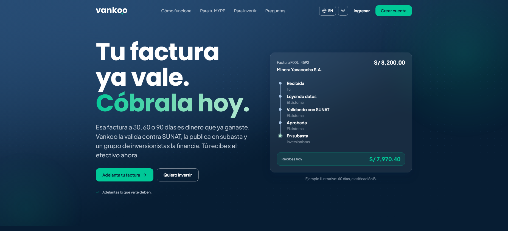

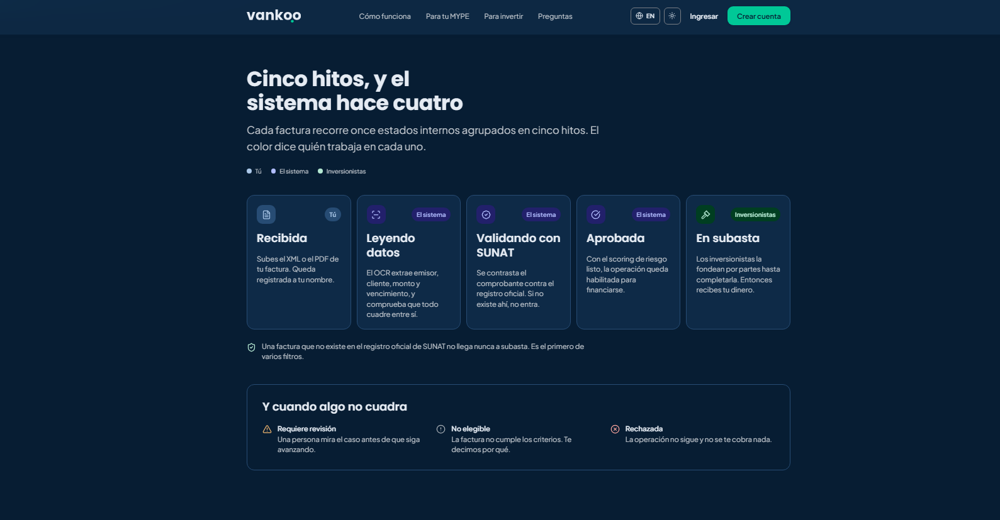

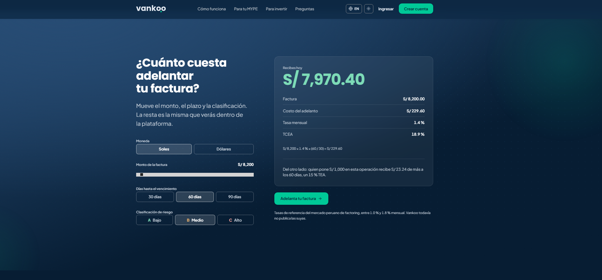

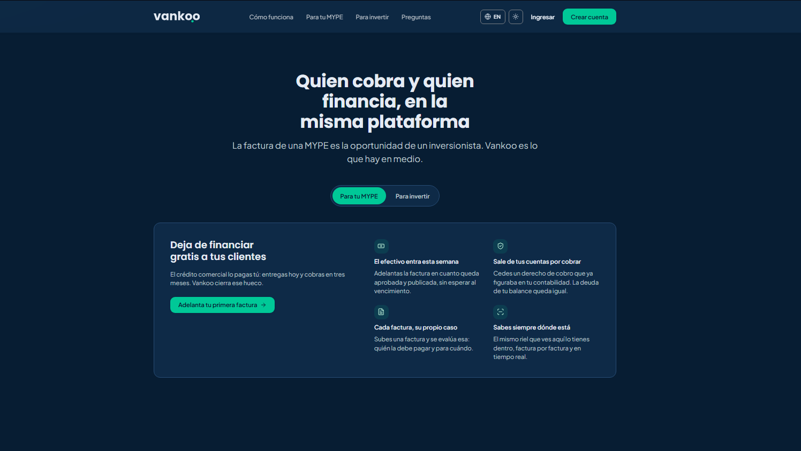

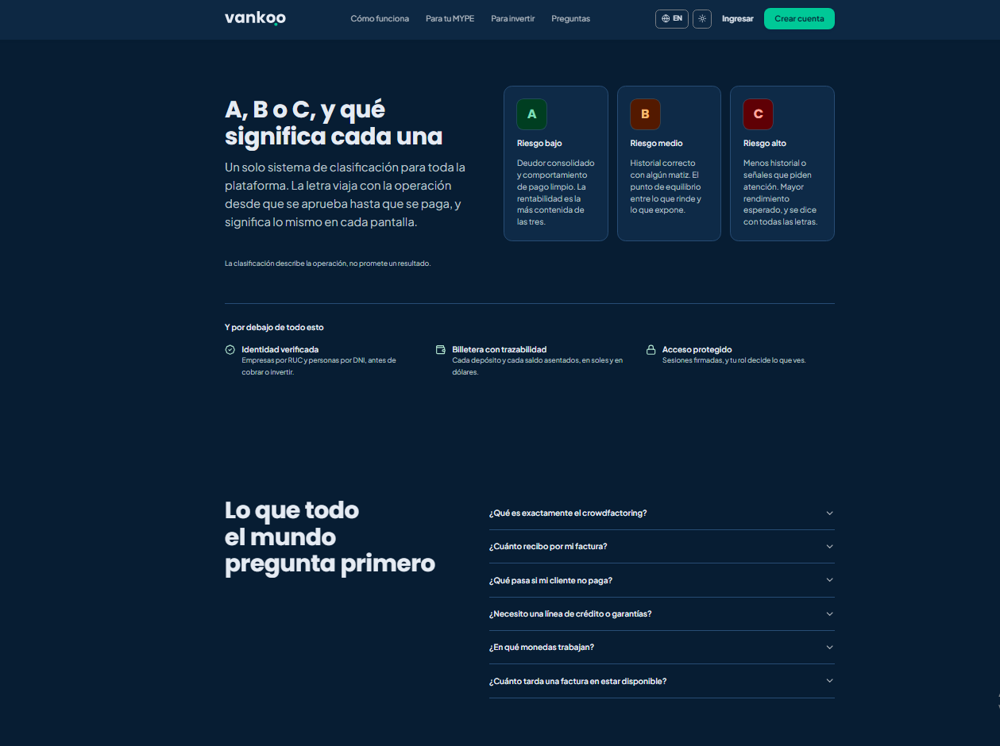


Enlace a landing page del equipo: https://vankoo-landing-page.netlify.app

Enlace al video demostrativo de landing page:[Enlace Video](https://upcedupe-my.sharepoint.com/:v:/g/personal/u202314898_upc_edu_pe/IQBlPSSaIUvkQ7e5EzI-LYk8AdsSo6qTEpX8WajnAgcPELA?nav=eyJyZWZlcnJhbEluZm8iOnsicmVmZXJyYWxBcHAiOiJPbmVEcml2ZUZvckJ1c2luZXNzIiwicmVmZXJyYWxBcHBQbGF0Zm9ybSI6IldlYiIsInJlZmVycmFsTW9kZSI6InZpZXciLCJyZWZlcnJhbFZpZXciOiJNeUZpbGVzTGlua0NvcHkifX0&e=YUPgVh)

### 5.2.3. Implemented Frontend-Web Application Evidence

<!-- React + TypeScript + Vite. Assets: ./assets/cap5-product-implementation/web-app-evidence/ -->

En este apartado se evidencia el avance de la aplicación web de la MYPE (`vankoo-mype-web`), construida con **React + TypeScript + Vite**, que consume los servicios a través del API Gateway. Para esta entrega se muestra el bounded context de **IAM** (registro, inicio de sesión y recuperación de contraseña) y el de **Invoicing** (carga de facturas, listado y detalle), que constituyen el flujo principal del empresario para publicar sus facturas por cobrar.

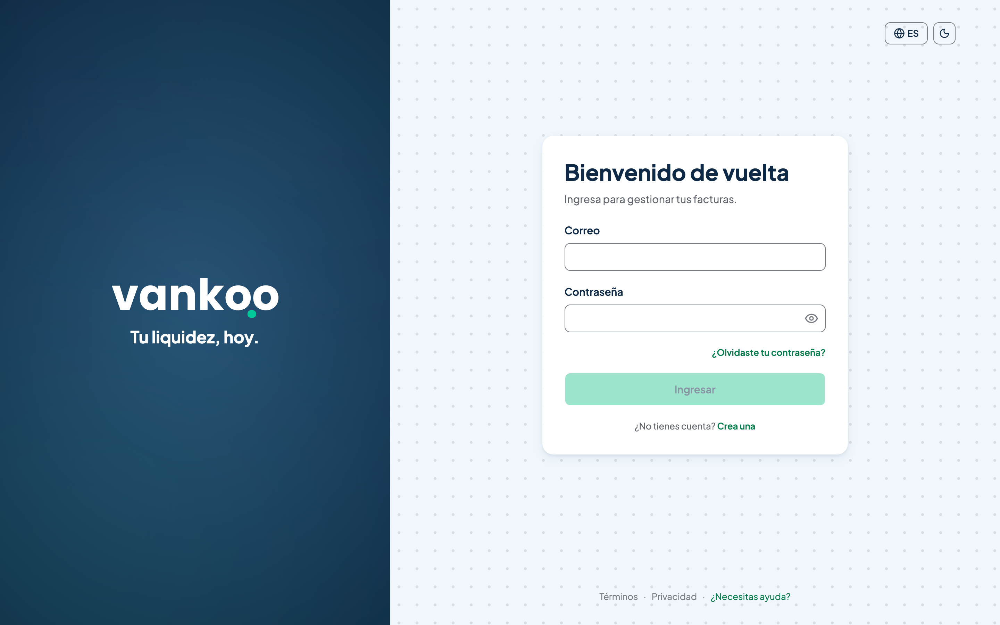

.png)

.png)

%201.png)

%202.png)

Enlace al repositorio: [/vankoo-mype-web](https://github.com/liquilabshq/vankoo-mype-web)


### 5.2.4. Implemented Native-Mobile Application Evidence

<!-- Kotlin Multiplatform + Compose. Assets: ./assets/cap5-product-implementation/mobile-app-evidence/ -->

En este apartado se evidencia el avance de la aplicación móvil del Inversionista (`vankoo-investor-mobile`), desarrollada con **Kotlin Multiplatform y Compose Multiplatform**, ejecutada sobre Android. Para esta entrega se presentan los flujos de **autenticación** (IAM), **mercado de subastas** (Investment) y **billetera** (Finance), que en conjunto permiten al inversionista registrarse, explorar oportunidades y confirmar una inversión.

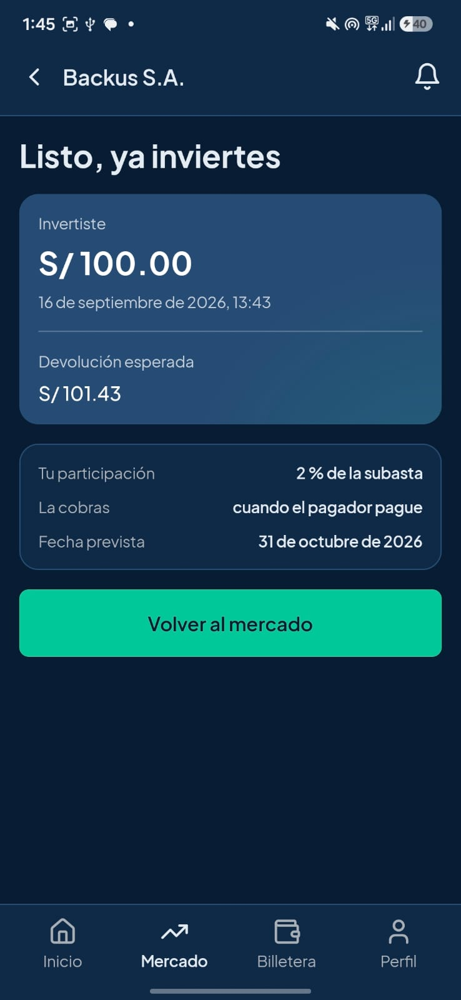

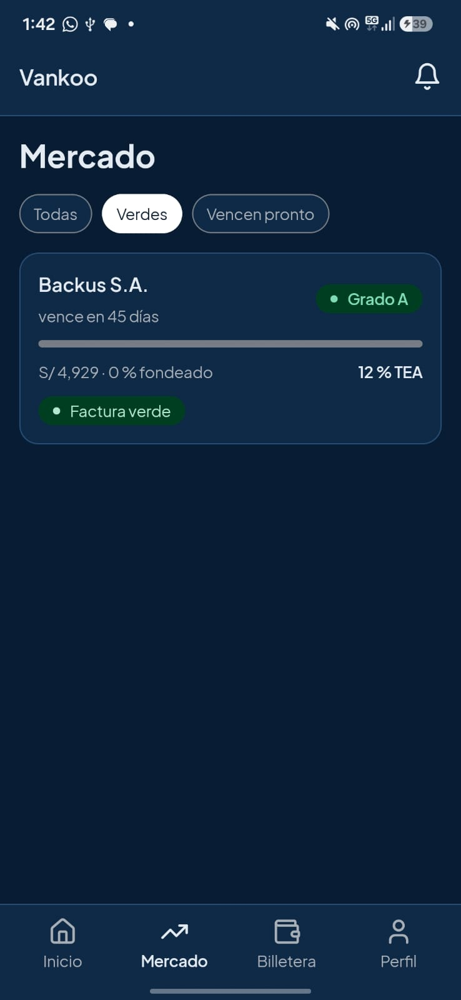

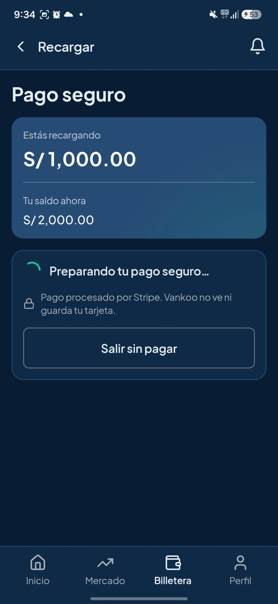

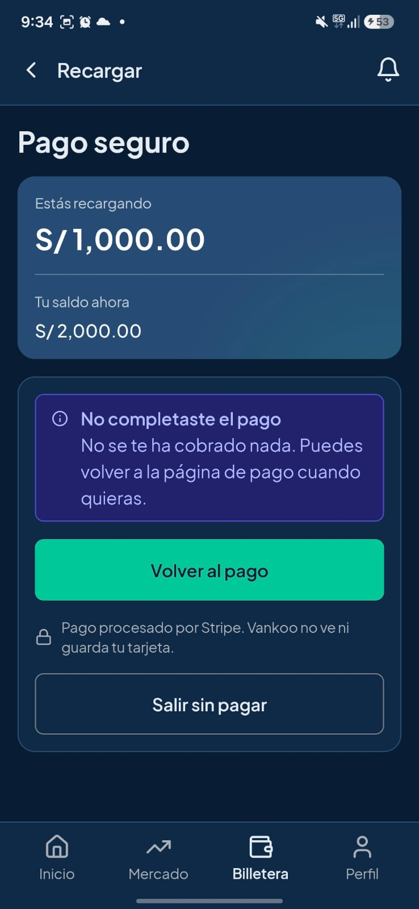

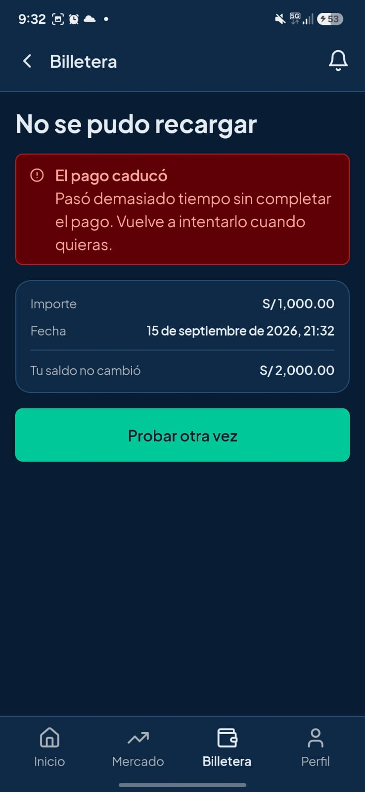
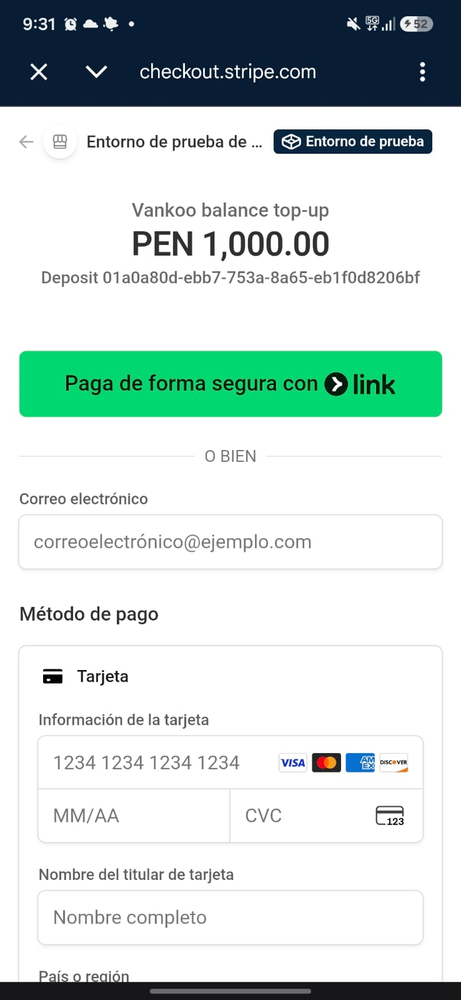

Enlace al repositorio: [vankoo-investor-mobile](https://github.com/liquilabshq/vankoo-investor-mobile)

### 5.2.5. Implemented RESTful API and/or Serverless Backend Evidence

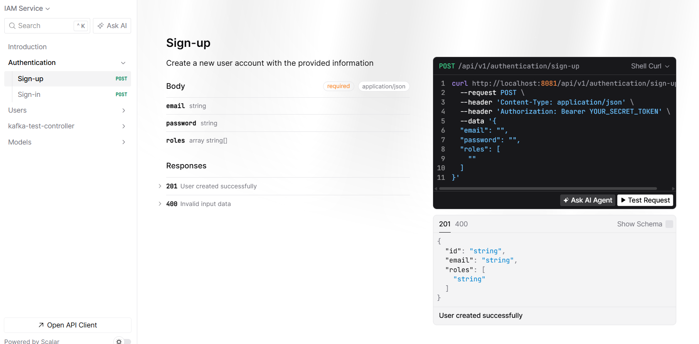

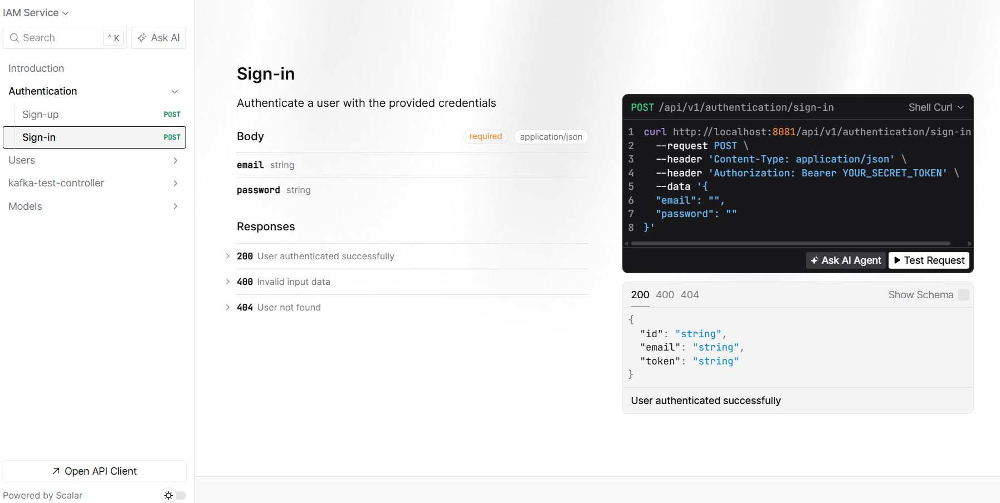

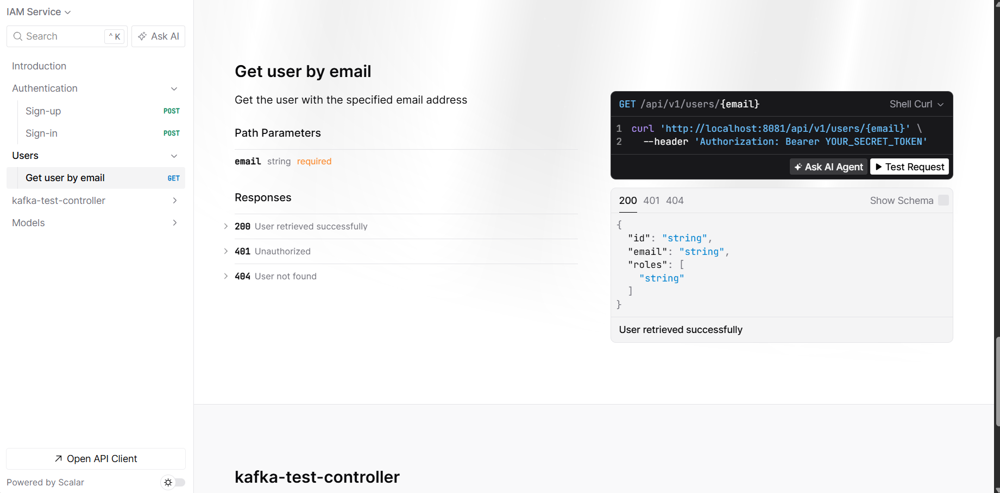

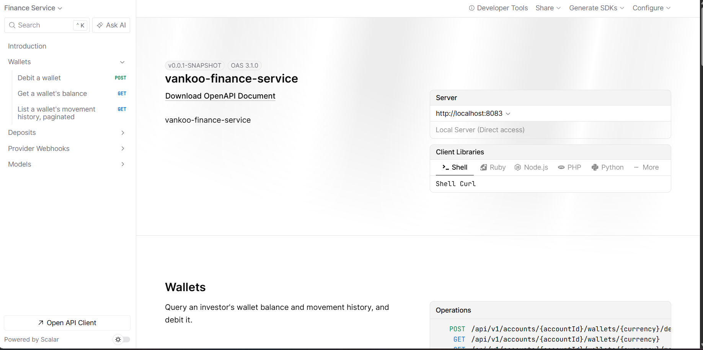

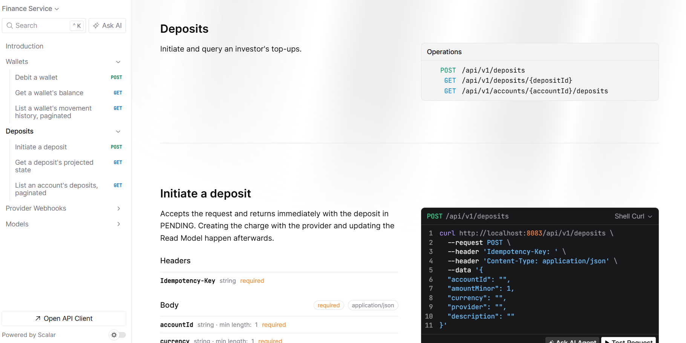


Enlaces a los repositorios:

| Servicio | Repositorio |
|---|---|
| Discovery Server | [liquilabshq/vankoo-discovery-server](https://github.com/liquilabshq/vankoo-discovery-server) |
| API Gateway | [liquilabshq/vankoo-api-gateway](https://github.com/liquilabshq/vankoo-api-gateway) |
| IAM Service | [liquilabshq/vankoo-iam-service](https://github.com/liquilabshq/vankoo-iam-service) |
| Investment Service | [liquilabshq/vankoo-investment-service](https://github.com/liquilabshq/vankoo-investment-service) |
| Finance Service | [liquilabshq/vankoo-finance-service](https://github.com/liquilabshq/vankoo-finance-service) |
| Invoicing Service | [liquilabshq/vankoo-invoicing-service](https://github.com/liquilabshq/vankoo-invoicing-service) |
| Infraestructura local (Docker Compose) | [liquilabshq/vankoo-infra](https://github.com/liquilabshq/vankoo-infra) |


## 5.3. Video About-the-Product

[https://goo.su/h0GAv](https://goo.su/h0GAv)

<hr class="page-break">

# Conclusiones

**Conclusiones y recomendaciones**

<!-- Avance de conclusiones para AV1. Se expande en cada entrega. -->

**Avance de conclusiones (AV1)**

1. **Sobre el Problem Statement.** Las entrevistas confirman el problema planteado: el 100% de las MYPES entrevistadas emite facturas a crédito con plazos de 15 a 60 días, gestiona sus cuentas por cobrar con herramientas manuales y recurre a financiamiento de emergencia costoso ante la falta de caja. La brecha de liquidez no obedece a una mala gestión sino a la asimetría frente a los grandes adquirentes, tal como se asumió en el Lean UX Canvas.

2. **Sobre los Business Assumptions.** Se validó que los clientes iniciales son empresarios de comercio y servicios con plazos de pago extendidos, y que el valor más apreciado es la rapidez del desembolso (menos de 48 horas) con comisiones transparentes (3/3). Por el lado del inversionista, se confirmó la disposición a participar mediante tickets accesibles con retorno a corto plazo (3/3), lo que respalda el enfoque de fraccionamiento de facturas.

3. **Sobre los User Assumptions.** El uso predominante del smartphone en ambos segmentos (3/3 en cada uno) confirma la decisión de arquitectura de producto: aplicación web para la gestión administrativa de la MYPE y aplicación móvil nativa para el inversionista. El principal riesgo identificado —escepticismo frente a plataformas no bancarias (3/3 inversionistas, 2/3 MYPES)— refuerza la prioridad de la transparencia y la trazabilidad como atributos de diseño.

4. **Sobre las Hypothesis Statements.** En esta entrega aún no se dispone de mediciones sobre las hipótesis 01 a 05; la implementación alcanzada (registro y autenticación, carga de facturas, subastas en el marketplace y billetera) constituye la base sobre la cual se ejecutarán las validaciones en las siguientes entregas. La hipótesis 04 (transparencia mediante Event Sourcing) se encuentra materializada a nivel técnico en el Finance Service con Axon Framework.

5. **Sobre la implementación.** La arquitectura de microservicios por bounded context (IAM, Invoicing, Investment, Finance) con API Gateway y Discovery Server permitió que el equipo trabajara en paralelo con bajo acoplamiento, y la documentación OpenAPI agregada en Scalar facilitó la integración de las aplicaciones web y móvil contra un único punto de entrada.

**Recomendaciones**

* Ejecutar las entrevistas de validación con usuarios reales sobre las aplicaciones implementadas, para obtener las primeras mediciones de las hipótesis 01 (tiempo de carga de factura) y 03 (velocidad de fondeo).
* Priorizar en el roadmap el despliegue en la nube de los servicios y la publicación de la documentación de la API, de modo que la validación no dependa de un entorno local.
* Completar el flujo end-to-end (factura → subasta → inversión → débito de billetera) e incorporar el scoring de riesgo, que es el diferenciador central de la propuesta de valor.

<hr class="page-break">

# Bibliografía

<div>
<p class="ref">CAVALI. (2024). <em>Reporte de desempeño de facturas negociables</em>. <a href="https://www.cavali.com.pe/factrack/uploads/shares/home/Reporte_Estadistico_FN_2024__1_.pdf">https://www.cavali.com.pe/factrack/uploads/shares/home/Reporte_Estadistico_FN_2024__1_.pdf</a></p>
<p class="ref">ComexPerú. (2025). <em>Inclusión financiera de las MYPE: avances y retos</em>. <a href="https://www.comexperu.org.pe/articulo/inclusion-financiera-de-las-mypes-avances-y-retos">https://www.comexperu.org.pe/articulo/inclusion-financiera-de-las-mypes-avances-y-retos</a></p>
<p class="ref">Contadores y Empresas. (2025). <em>Operaciones de factoring crecieron 14% en 2024</em>. <a href="https://www.contadoresyempresas.com.pe/operaciones-de-factoring-crecieron-14-en-2024/">https://www.contadoresyempresas.com.pe/operaciones-de-factoring-crecieron-14-en-2024/</a></p>
<p class="ref">Innova Funding. (2022). <em>Ley de pago de facturas para MYPE a 30 días en Perú</em>. <a href="https://innova-funding.com/claves-del-pago-de-facturas-mype-a-treinta-dias/">https://innova-funding.com/claves-del-pago-de-facturas-mype-a-treinta-dias/</a></p>
<p class="ref">LP. (2021). <em>Ley 31362, MYPE podrán cobrar facturas en un plazo máximo de 30 días</em>. <a href="https://lpderecho.pe/ley-31362-pago-facturas-mype-treinta-dias/">https://lpderecho.pe/ley-31362-pago-facturas-mype-treinta-dias/</a></p>
<p class="ref">PRODUCE. (2025). <em>Estado de la inclusión financiera - MYPE</em>. <a href="https://www.producempresarial.pe/wp-content/uploads/2025/03/268-Reporte-de-Factoring-DIC-2024.pdf">https://www.producempresarial.pe/wp-content/uploads/2025/03/268-Reporte-de-Factoring-DIC-2024.pdf</a></p>
</div>
<hr class="page-break">

# Anexos

<!-- Enumerar con letra mayúscula: Anexo A, Anexo B, etc. Assets: ./assets/anexos/ -->

**Anexo A. Videos de Exposiciones**

[https://goo.su/h0GAv](https://goo.su/h0GAv)


<hr class="page-break">

**Anexo B. Enlaces a repositorios**

| Producto | Repositorio                                                                                       |
|---|---------------------------------------------------------------------------------------------------|
| Informe del proyecto | [yieldlabshq/report](https://github.com/yieldlabshq/report)                                       |
| Landing Page | [vankoo-landing-page](https://github.com/liquilabshq/vankoo-landing-page)                         |
| Frontend Web Application (MYPE) | [vankoo-mype-web](https://github.com/liquilabshq/vankoo-mype-web)                                 |
| Native Mobile Application (Inversionista) | [vankoo-investor-mobile](https://github.com/liquilabshq/vankoo-investor-mobile)                   |
| Discovery Server | [vankoo-discovery-server](https://github.com/liquilabshq/vankoo-discovery-server)                 |
| API Gateway | [vankoo-api-gateway](https://github.com/liquilabshq/vankoo-api-gateway)                           |
| IAM Service | [vankoo-iam-service](https://github.com/liquilabshq/vankoo-iam-service)                           |
| Investment Service | [vankoo-investment-service](https://github.com/liquilabshq/vankoo-investment-service)             |
| Finance Service | [vankoo-finance-service](https://github.com/liquilabshq/vankoo-finance-service)                   |
| Invoicing Service | [vankoo-invoicing-service](https://github.com/liquilabshq/vankoo-invoicing-service)               |
| Infraestructura local (Docker Compose) | [vankoo-infra](https://github.com/liquilabshq/vankoo-infra)                                       |

<hr class="page-break">

**Anexo C. Videos de entrevistas**

<!-- Consolidar aquí los enlaces ya registrados en 2.2.2. Registro de entrevistas. -->

| Segmento | Entrevistado | Fecha | Timing | Duración | Enlace |
|---|---|---|---|---|---|
| MYPE | Irving Vergara | 08/09/2026 | 00:00 - 8:58 | 8:58 minutos | [Ver en Microsoft Stream](https://upcedupe-my.sharepoint.com/:v:/g/personal/u20221g044_upc_edu_pe/IQBH1rA-DTogSZAoQrPM1UIOAWCjy1cb2NoZaTQaVktAxrk?e=WJmOfj&nav=eyJyZWZlcnJhbEluZm8iOnsicmVmZXJyYWxBcHAiOiJTdHJlYW1XZWJBcHAiLCJyZWZlcnJhbFZpZXciOiJTaGFyZURpYWxvZy1MaW5rIiwicmVmZXJyYWxBcHBQbGF0Zm9ybSI6IldlYiIsInJlZmVycmFsTW9kZSI6InZpZXcifSwicGxheWJhY2tPcHRpb25zIjp7InN0YXJ0VGltZUluU2Vjb25kcyI6MC42OX19) |
| MYPE | Diego Melendez | 08/09/2026 | 8:58 - 17:30 | 8:32 | [Ver en Microsoft Stream](https://upcedupe-my.sharepoint.com/:v:/g/personal/u20221g044_upc_edu_pe/IQBH1rA-DTogSZAoQrPM1UIOAWCjy1cb2NoZaTQaVktAxrk?e=Guig5U&nav=eyJyZWZlcnJhbEluZm8iOnsicmVmZXJyYWxBcHAiOiJTdHJlYW1XZWJBcHAiLCJyZWZlcnJhbFZpZXciOiJTaGFyZURpYWxvZy1MaW5rIiwicmVmZXJyYWxBcHBQbGF0Zm9ybSI6IldlYiIsInJlZmVycmFsTW9kZSI6InZpZXcifSwicGxheWJhY2tPcHRpb25zIjp7InN0YXJ0VGltZUluU2Vjb25kcyI6NTM5LjF9fQ%3D%3D) |
| MYPE | Thomas Bernardo | 08/09/2026 | 17:30 - 27:30 | 9:58 | [Ver en Microsoft Stream](https://upcedupe-my.sharepoint.com/:v:/g/personal/u20221g044_upc_edu_pe/IQBH1rA-DTogSZAoQrPM1UIOAWCjy1cb2NoZaTQaVktAxrk?e=RYPQOg&nav=eyJyZWZlcnJhbEluZm8iOnsicmVmZXJyYWxBcHAiOiJTdHJlYW1XZWJBcHAiLCJyZWZlcnJhbFZpZXciOiJTaGFyZURpYWxvZy1MaW5rIiwicmVmZXJyYWxBcHBQbGF0Zm9ybSI6IldlYiIsInJlZmVycmFsTW9kZSI6InZpZXcifSwicGxheWJhY2tPcHRpb25zIjp7InN0YXJ0VGltZUluU2Vjb25kcyI6MTA1MS40M319) |
| Inversionista | Alessandro Hesse | 08/09/2026 | 27:30 - 40:15 | 12:45 | [Ver en Microsoft Stream](https://upcedupe-my.sharepoint.com/:v:/g/personal/u20221g044_upc_edu_pe/IQBH1rA-DTogSZAoQrPM1UIOAWCjy1cb2NoZaTQaVktAxrk?e=0XdsHP&nav=eyJyZWZlcnJhbEluZm8iOnsicmVmZXJyYWxBcHAiOiJTdHJlYW1XZWJBcHAiLCJyZWZlcnJhbFZpZXciOiJTaGFyZURpYWxvZy1MaW5rIiwicmVmZXJyYWxBcHBQbGF0Zm9ybSI6IldlYiIsInJlZmVycmFsTW9kZSI6InZpZXcifSwicGxheWJhY2tPcHRpb25zIjp7InN0YXJ0VGltZUluU2Vjb25kcyI6MTY1MC40OX19) |
| Inversionista | Leicy Cahuana | 07/09/2026 | 40:15 - 55:19 | 15:04 | [Ver en Microsoft Stream](https://upcedupe-my.sharepoint.com/:v:/g/personal/u20221g044_upc_edu_pe/IQBH1rA-DTogSZAoQrPM1UIOAWCjy1cb2NoZaTQaVktAxrk?e=FHk57K&nav=eyJyZWZlcnJhbEluZm8iOnsicmVmZXJyYWxBcHAiOiJTdHJlYW1XZWJBcHAiLCJyZWZlcnJhbFZpZXciOiJTaGFyZURpYWxvZy1MaW5rIiwicmVmZXJyYWxBcHBQbGF0Zm9ybSI6IldlYiIsInJlZmVycmFsTW9kZSI6InZpZXcifSwicGxheWJhY2tPcHRpb25zIjp7InN0YXJ0VGltZUluU2Vjb25kcyI6MjQxNS45OX19) |
| Inversionista | Kalet Esteban | 07/09/2026 | 55:19 - 1:06:47 | 11:28 | [Ver en Microsoft Stream](https://upcedupe-my.sharepoint.com/:v:/g/personal/u20221g044_upc_edu_pe/IQBH1rA-DTogSZAoQrPM1UIOAWCjy1cb2NoZaTQaVktAxrk?e=i6G1cy&nav=eyJyZWZlcnJhbEluZm8iOnsicmVmZXJyYWxBcHAiOiJTdHJlYW1XZWJBcHAiLCJyZWZlcnJhbFZpZXciOiJTaGFyZURpYWxvZy1MaW5rIiwicmVmZXJyYWxBcHBQbGF0Zm9ybSI6IldlYiIsInJlZmVycmFsTW9kZSI6InZpZXcifSwicGxheWJhY2tPcHRpb25zIjp7InN0YXJ0VGltZUluU2Vjb25kcyI6MzMyMC43NX19) |
