

  

<h2 style="text-align: center;"> Universidad Peruana de Ciencias Aplicadas </h2>

<h4 style="text-align: center"> Ingeniería de Software </h4>

<h4 style="text-align: center"> Periodo: 202620 </h4>

<h4 style="text-align: center"> 1ASI0732 | Diseño de Experimentos de Ingeniería de Software </h4>

<h4 style="text-align: center"> NRC: &lt;NRC&gt; </h4>

<h4 style="text-align: center"> Docente: &lt;Apellidos, Nombres del docente&gt; </h4>

 

<h3 style="text-align: center;"> Informe de Trabajo Final </h3>

<h4 style="text-align: center"> Startup: YieldLabs </h4>

<h4 style="text-align: center"> Producto: Vankoo </h4>

<h4 style="text-align: center">Integrantes:</h4>

  
&lt;Código&gt; — Acuache Lucas, Mathias Joaquin

  
&lt;Código&gt; — Amaro Villar, Anjali

  
&lt;Código&gt; — García Bernal, Daniela

  
&lt;Código&gt; — Pillaca Vidal, Luis Angel

 

<h5 style="text-align: center; font-style: italic;"> Setiembre 2026 </h5>

# Registro de Versiones del Informe

| Versión | Fecha    | Autor                | Descripción de modificación                                   |
|---------|----------|----------------------|---------------------------------------------------------------|
| 1.0     | 02/09/26 | Amaro Villar, Anjali | Organización inicial del informe y estructura del repositorio |
|         |          |                      |                                                               |

# Project Report Collaboration Insights

Enlace del repositorio del Project Report: [*Ver en GitHub*](https://github.com/yieldlabshq/report)

**GitHub Collaboration Insights**

_Pendiente de elaboración._

Los integrantes del equipo son:

| Integrante                     | Usuario GitHub |
|--------------------------------|----------------|
| Acuache Lucas, Mathias Joaquin | MathiasA25     |
| Amaro Villar, Anjali           | njlmrvllr      |
| García Bernal, Daniela         | danygbernal |
| Pillaca Vidal, Luis Angel      | luispillacavidal |

Las principales ramas del repositorio, gestionadas bajo **GitFlow Workflow**, **Conventional Commits** y **Semantic Versioning 2.0.0**, son:

* `main`: rama principal que contiene la versión estable del informe.
* `develop`: rama de integración de las secciones antes de fusionarse a `main`.
* `feature/X-mathias`: rama utilizada por Mathias para las tareas correspondientes a una determinada entrega (av1, tb1, av2, tb2).
* `feature/X-anjali`: rama utilizada por Anjali para las tareas correspondientes a una determinada entrega (av1, tb1, av2, tb2).
* `feature/X-daniela`: rama utilizada por Daniela para las tareas correspondientes a una determinada entrega (av1, tb1, av2, tb2).
* `feature/X-luis`: rama utilizada por Luis para las tareas correspondientes a una determinada entrega (av1, tb1, av2, tb2).
* `release/vX.X.X`: rama de preparación de versiones candidatas del informe.
* `hotfix/<descripcion>`: rama para correcciones urgentes sobre `main`.

**AV1**

<!-- Assets: ./assets/github-insights/ — capturas de Insights > Contributors e Insights > Network. -->

_Pendiente: capturas de los analíticos de colaboración y commits en GitHub._

# Contenido

- [Registro de Versiones del Informe](#registro-de-versiones-del-informe)
- [Project Report Collaboration Insights](#project-report-collaboration-insights)
- [Contenido](#contenido)
- [Student Outcome](#student-outcome)
- [Capítulo I: Introducción](#capítulo-i-introducción)
  - [1.1. Startup Profile](#11-startup-profile)
    - [1.1.1. Descripción de la Startup](#111-descripción-de-la-startup)
    - [1.1.2. Perfiles de integrantes del equipo](#112-perfiles-de-integrantes-del-equipo)
  - [1.2. Solution Profile](#12-solution-profile)
    - [1.2.1. Antecedentes y problemática](#121-antecedentes-y-problemática)
    - [1.2.2. Lean UX Process](#122-lean-ux-process)
      - [1.2.2.1. Lean UX Problem Statements](#1221-lean-ux-problem-statements)
      - [1.2.2.2. Lean UX Assumptions](#1222-lean-ux-assumptions)
      - [1.2.2.3. Lean UX Hypothesis Statements](#1223-lean-ux-hypothesis-statements)
      - [1.2.2.4. Lean UX Canvas](#1224-lean-ux-canvas)
  - [1.3. Segmentos objetivo](#13-segmentos-objetivo)
- [Capítulo II: Requirements Elicitation \& Analysis](#capítulo-ii-requirements-elicitation--analysis)
  - [2.1. Competidores](#21-competidores)
    - [2.1.1. Análisis competitivo](#211-análisis-competitivo)
    - [2.1.2. Estrategias y tácticas frente a competidores](#212-estrategias-y-tácticas-frente-a-competidores)
  - [2.2. Entrevistas](#22-entrevistas)
    - [2.2.1. Diseño de entrevistas](#221-diseño-de-entrevistas)
    - [2.2.2. Registro de entrevistas](#222-registro-de-entrevistas)
    - [2.2.3. Análisis de entrevistas](#223-análisis-de-entrevistas)
  - [2.3. Needfinding](#23-needfinding)
    - [2.3.1. User Personas](#231-user-personas)
    - [2.3.2. User Task Matrix](#232-user-task-matrix)
    - [2.3.3. User Journey Mapping](#233-user-journey-mapping)
    - [2.3.4. Empathy Mapping](#234-empathy-mapping)
    - [2.3.5. As-is Scenario Mapping](#235-as-is-scenario-mapping)
  - [2.4. Ubiquitous Language](#24-ubiquitous-language)
- [Capítulo III: Requirements Specification](#capítulo-iii-requirements-specification)
  - [3.1. To-Be Scenario Mapping](#31-to-be-scenario-mapping)
  - [3.2. User Stories](#32-user-stories)
  - [3.3. Product Backlog](#33-product-backlog)
  - [3.4. Impact Mapping](#34-impact-mapping)
- [Capítulo IV: Product Design](#capítulo-iv-product-design)
  - [4.1. Style Guidelines](#41-style-guidelines)
    - [4.1.1. General Style Guidelines](#411-general-style-guidelines)
    - [4.1.2. Web Style Guidelines](#412-web-style-guidelines)
    - [4.1.3. Mobile Style Guidelines](#413-mobile-style-guidelines)
      - [4.1.3.1. iOS Mobile Style Guidelines](#4131-ios-mobile-style-guidelines)
      - [4.1.3.2. Android Mobile Style Guidelines](#4132-android-mobile-style-guidelines)
  - [4.2. Information Architecture](#42-information-architecture)
    - [4.2.1. Organization Systems](#421-organization-systems)
    - [4.2.2. Labeling Systems](#422-labeling-systems)
    - [4.2.3. SEO Tags and Meta Tags](#423-seo-tags-and-meta-tags)
    - [4.2.4. Searching Systems](#424-searching-systems)
    - [4.2.5. Navigation Systems](#425-navigation-systems)
  - [4.3. Landing Page UI Design](#43-landing-page-ui-design)
    - [4.3.1. Landing Page Wireframe](#431-landing-page-wireframe)
    - [4.3.2. Landing Page Mock-up](#432-landing-page-mock-up)
  - [4.4. Mobile Applications UX/UI Design](#44-mobile-applications-uxui-design)
    - [4.4.1. Mobile Applications Wireframes](#441-mobile-applications-wireframes)
    - [4.4.2. Mobile Applications Wireflow Diagrams](#442-mobile-applications-wireflow-diagrams)
    - [4.4.3. Mobile Applications Mock-ups](#443-mobile-applications-mock-ups)
    - [4.4.4. Mobile Applications User Flow Diagrams](#444-mobile-applications-user-flow-diagrams)
  - [4.5. Mobile Applications Prototyping](#45-mobile-applications-prototyping)
    - [4.5.1. Android Mobile Applications Prototyping](#451-android-mobile-applications-prototyping)
    - [4.5.2. iOS Mobile Applications Prototyping](#452-ios-mobile-applications-prototyping)
  - [4.6. Web Applications UX/UI Design](#46-web-applications-uxui-design)
    - [4.6.1. Web Applications Wireframes](#461-web-applications-wireframes)
    - [4.6.2. Web Applications Wireflow Diagrams](#462-web-applications-wireflow-diagrams)
    - [4.6.3. Web Applications Mock-ups](#463-web-applications-mock-ups)
    - [4.6.4. Web Applications User Flow Diagrams](#464-web-applications-user-flow-diagrams)
  - [4.7. Web Applications Prototyping](#47-web-applications-prototyping)
  - [4.8. Domain-Driven Software Architecture](#48-domain-driven-software-architecture)
    - [4.8.1. Software Architecture Context Diagram](#481-software-architecture-context-diagram)
    - [4.8.2. Software Architecture Container Diagrams](#482-software-architecture-container-diagrams)
    - [4.8.3. Software Architecture Components Diagrams](#483-software-architecture-components-diagrams)
  - [4.9. Software Object-Oriented Design](#49-software-object-oriented-design)
    - [4.9.1. Class Diagrams](#491-class-diagrams)
    - [4.9.2. Class Dictionary](#492-class-dictionary)
  - [4.10. Database Design](#410-database-design)
    - [4.10.1. Relational/Non-Relational Database Diagram](#4101-relationalnon-relational-database-diagram)
- [Capítulo V: Product Implementation](#capítulo-v-product-implementation)
  - [5.1. Software Configuration Management](#51-software-configuration-management)
    - [5.1.1. Software Development Environment Configuration](#511-software-development-environment-configuration)
    - [5.1.2. Source Code Management](#512-source-code-management)
    - [5.1.3. Source Code Style Guide \& Conventions](#513-source-code-style-guide--conventions)
    - [5.1.4. Software Deployment Configuration](#514-software-deployment-configuration)
  - [5.2. Product Implementation \& Deployment](#52-product-implementation--deployment)
    - [5.2.1. Sprint Backlogs](#521-sprint-backlogs)
    - [5.2.2. Implemented Landing Page Evidence](#522-implemented-landing-page-evidence)
    - [5.2.3. Implemented Frontend-Web Application Evidence](#523-implemented-frontend-web-application-evidence)
    - [5.2.4. Implemented Native-Mobile Application Evidence](#524-implemented-native-mobile-application-evidence)
    - [5.2.5. Implemented RESTful API and/or Serverless Backend Evidence](#525-implemented-restful-api-andor-serverless-backend-evidence)
    - [5.2.6. RESTful API documentation](#526-restful-api-documentation)
    - [5.2.7. Team Collaboration Insights](#527-team-collaboration-insights)
  - [5.3. Video About-the-Product](#53-video-about-the-product)
- [Conclusiones](#conclusiones)
- [Bibliografía](#bibliografía)
- [Anexos](#anexos)

# Student Outcome

Cada participante del equipo debe sustentar evidencia de cómo las actividades realizadas en el trabajo final han ayudado a desarrollar las dimensiones del student outcome. Por ello en esta sección debe haber una subsección por cada alumno donde éste describa por escrito la relación entre el outcome, sus dimensiones y el trabajo que ha realizado. 

El curso contribuye al cumplimiento del Student Outcome ABET:

**ABET – EAC - Student Outcome 4**

**Criterio:** La capacidad de reconocer responsabilidades éticas y profesionales en situaciones de ingeniería y hacer juicios informados, que deben considerar el impacto de las soluciones de ingeniería en contextos globales, económicos, ambientales y sociales.

En el siguiente cuadro se describe las acciones realizadas y enunciados de conclusiones por parte del grupo, que permiten sustentar el haber alcanzado el logro del ABET – EAC - Student Outcome 4.

| Criterio específico | Acciones realizadas | Conclusiones |
|:--------------------|:--------------------|:-------------|
| **4.c.1** Reconoce responsabilidad ética y profesional en situaciones de ingeniería de software | **Acuache Lucas, Mathias Joaquin** **AV1** _Pendiente._  **Amaro Villar, Anjali** **AV1** _Pendiente._  **García Bernal, Daniela** **AV1** _Pendiente._  **Pillaca Vidal, Luis Angel** **AV1** _Pendiente._ | **AV1** _Pendiente._ |
| **4.c.2** Emite juicios informados considerando el impacto de las soluciones de ingeniería de software en contextos globales, económicos, ambientales y sociales | **Acuache Lucas, Mathias Joaquin** **AV1** _Pendiente._  **Amaro Villar, Anjali** **AV1** _Pendiente._  **García Bernal, Daniela** **AV1** _Pendiente._  **Pillaca Vidal, Luis Angel** **AV1** _Pendiente._ | **AV1** _Pendiente._ |

# Capítulo I: Introducción

## 1.1. Startup Profile

### 1.1.1. Descripción de la Startup

<!-- Nombre, origen del nombre, misión, visión y propuesta de valor de YieldLabs. -->
<!-- Assets: ./assets/logos/ -->

_Pendiente de elaboración._

### 1.1.2. Perfiles de integrantes del equipo

<!-- Por integrante: foto, nombres y apellidos, código de estudiante, carrera y párrafo de resumen con los principales conocimientos técnicos y habilidades que aporta al equipo. -->
<!-- Assets: ./assets/profiles/ -->

|  | **Acuache Lucas, Mathias Joaquin** Código: &lt;Código&gt; Carrera: Ingeniería de Software  _Pendiente de elaboración._ |
|---|---|

|  | **Amaro Villar, Anjali** Código: &lt;Código&gt; Carrera: Ingeniería de Software  _Pendiente de elaboración._ |
|---|---|

|  | **García Bernal, Daniela** Código: &lt;Código&gt; Carrera: Ingeniería de Software  _Pendiente de elaboración._ |
|---|---|

|  | **Pillaca Vidal, Luis Angel** Código: &lt;Código&gt; Carrera: Ingeniería de Software  _Pendiente de elaboración._ |
|---|---|

## 1.2. Solution Profile

_Pendiente de elaboración: párrafo introductorio de la sección._

### 1.2.1. Antecedentes y problemática

<!-- Aplicar The 5 'W's y 2 'H's: Who, What, Where, When, Why, How & How Much. -->

_Pendiente de elaboración._

| Pregunta | Respuesta |
|----------|-----------|
| **What?** (¿Qué?) |  |
| **When?** (¿Cuándo?) |  |
| **Where?** (¿Dónde?) |  |
| **Who?** (¿Quién?) |  |
| **Why?** (¿Por qué?) |  |
| **How?** (¿Cómo?) |  |
| **How much?** (¿Cuánto?) |  |

### 1.2.2. Lean UX Process

_Pendiente de elaboración: párrafo introductorio del Lean UX Process._

#### 1.2.2.1. Lean UX Problem Statements

<!-- Incluir domain, customer segments, pain points, gap, vision/strategy e initial segment. -->

_Pendiente de elaboración._

#### 1.2.2.2. Lean UX Assumptions

**Business Assumptions**

_Pendiente de elaboración._

**Business Outcomes**

_Pendiente de elaboración._

**User Assumptions**

_Pendiente de elaboración._

**User Outcomes & Benefits**

_Pendiente de elaboración._

**Feature Assumptions**

_Pendiente de elaboración._

#### 1.2.2.3. Lean UX Hypothesis Statements

_Pendiente de elaboración._

#### 1.2.2.4. Lean UX Canvas

<!-- Assets: ./assets/cap1-introduccion/lean-ux-canvas/ -->

_Pendiente de elaboración._

## 1.3. Segmentos objetivo

<!-- Características demográficas e información estadística de sustento por cada segmento. -->
<!-- Assets: ./assets/cap1-introduccion/segmentos-objetivo/ -->

_Pendiente de elaboración._

# Capítulo II: Requirements Elicitation & Analysis

## 2.1. Competidores

<!-- Identificar y describir mínimo 3 competidores directos. -->
<!-- Assets: ./assets/cap2-requirements-elicitation/competidores/ -->

_Pendiente de elaboración._

### 2.1.1. Análisis competitivo

<!-- Competitive Analysis Landscape según el formato del enunciado. -->

_Pendiente de elaboración._

| **Competitive Analysis Landscape** | | | | | |
|---|---|---|---|---|---|
| **¿Por qué llevar a cabo este análisis?** | | | | | |
| | | **YieldLabs (Vankoo)** | **Competidor 1** | **Competidor 2** | **Competidor 3** |
| **Perfil** | Overview | | | | |
| | Ventaja competitiva ¿Qué valor ofrece a los clientes? | | | | |
| **Perfil de Marketing** | Mercado objetivo | | | | |
| | Estrategias de marketing | | | | |
| **Perfil de Producto** | Productos & Servicios | | | | |
| | Precios & Costos | | | | |
| | Canales de distribución (Web y/o Móvil) | | | | |
| **Análisis SWOT** | Fortalezas | | | | |
| | Debilidades | | | | |
| | Oportunidades | | | | |
| | Amenazas | | | | |

### 2.1.2. Estrategias y tácticas frente a competidores

_Pendiente de elaboración._

## 2.2. Entrevistas

_Pendiente de elaboración: párrafo introductorio de la sección._

### 2.2.1. Diseño de entrevistas

<!-- Preguntas principales y complementarias por cada segmento objetivo. -->

_Pendiente de elaboración._

### 2.2.2. Registro de entrevistas

<!-- De 3 a 5 entrevistas por segmento. Por cada una: nombres, apellidos, edad, distrito, screenshot del video, URL del video en Microsoft Stream / Clipchamp, timing de inicio, duración y resumen. -->
<!-- Assets: ./assets/cap2-requirements-elicitation/entrevistas/ -->

#### Segmento A: &lt;nombre del segmento&gt;

#### Entrevista 1:

| Atributo | Detalle |
| :---: | :--- |
| Nombre | Jorge Retuerto |
| Edad | 20 años |
| Distrito | La Victoria |
| Ocupación | Estudiante |
| Fecha de entrevista | 15 de abril del 2026 |
| Timing | 5:13 |
| Enlace a la grabación | [*Ver en Microsoft Stream*](https://upcedupe-my.sharepoint.com/:f:/g/personal/u20221g044_upc_edu_pe/IgA0-fbBN0_9RYPf_IwX4Ow1ActGMcNR2dDxP1jXcOMP96c?e=fB4axV) |
| Captura de pantalla de la grabación |  |
| Resumen | Jorge comenta que vive como estudiante foráneo en Lima junto a su hermano y cuenta con un presupuesto mensual limitado para los gastos del hogar, lo que lo obliga a ser muy metódico y buscar siempre el establecimiento que le permita ahorrar. Su mayor molestia es la pérdida de tiempo que implica preguntar precios en múltiples puestos de manera presencial. Al comprar, prioriza la calidad sobre el precio y no tiene lealtad a marcas específicas, optando usualmente por productos genéricos, a menos que una marca ofrezca un valor único. Actualmente, no utiliza ninguna herramienta digital más allá de una aplicación de notas básica y señala que le gustaría recibir ofertas directamente a través de sus redes sociales. Para Jorge, sería indispensable que una aplicación incluya métricas sobre la calidad de los productos, ya sea mediante reseñas de otros usuarios o indicadores de confianza del establecimiento, para reducir la incertidumbre al momento de elegir dónde comprar. |

#### Entrevista 2:

| Atributo | Detalle |
| :---: | :--- |
| Nombre |  |
| Edad |  |
| Distrito |  |
| Ocupación |  |
| Fecha de entrevista |  |
| Timing |  |
| Enlace a la grabación | [*Ver en Microsoft Stream*]() |
| Captura de pantalla de la grabación |  |
| Resumen |  |

#### Entrevista 3:

| Atributo | Detalle |
| :---: | :--- |
| Nombre |  |
| Edad |  |
| Distrito |  |
| Ocupación |  |
| Fecha de entrevista |  |
| Timing |  |
| Enlace a la grabación | [*Ver en Microsoft Stream*]() |
| Captura de pantalla de la grabación |  |
| Resumen |  |

#### Segmento B: &lt;nombre del segmento&gt;

#### Entrevista 4:

| Atributo | Detalle |
| :---: | :--- |
| Nombre |  |
| Edad |  |
| Distrito |  |
| Ocupación |  |
| Fecha de entrevista |  |
| Timing |  |
| Enlace a la grabación | [*Ver en Microsoft Stream*]() |
| Captura de pantalla de la grabación |  |
| Resumen |  |

#### Entrevista 5:

| Atributo | Detalle |
| :---: | :--- |
| Nombre |  |
| Edad |  |
| Distrito |  |
| Ocupación |  |
| Fecha de entrevista |  |
| Timing |  |
| Enlace a la grabación | [*Ver en Microsoft Stream*]() |
| Captura de pantalla de la grabación |  |
| Resumen |  |

#### Entrevista 6:

| Atributo | Detalle |
| :---: | :--- |
| Nombre |  |
| Edad |  |
| Distrito |  |
| Ocupación |  |
| Fecha de entrevista |  |
| Timing |  |
| Enlace a la grabación | [*Ver en Microsoft Stream*]() |
| Captura de pantalla de la grabación |  |
| Resumen |  |

### 2.2.3. Análisis de entrevistas

<!-- Análisis por segmento con sustento estadístico (porcentajes) de características objetivas y subjetivas. -->

_Pendiente de elaboración._

## 2.3. Needfinding

_Pendiente de elaboración: párrafo introductorio de la sección._

### 2.3.1. User Personas

<!-- Una ficha de User Persona por cada segmento objetivo. Herramienta: UXPressia. -->
<!-- Assets: ./assets/cap2-requirements-elicitation/user-personas/ -->

_Pendiente de elaboración._

### 2.3.2. User Task Matrix

<!-- Columna por User Persona con sub-columnas Frecuencia e Importancia; filas: tareas identificadas. -->
<!-- Assets: ./assets/cap2-requirements-elicitation/user-task-matrix/ -->

_Pendiente de elaboración._

### 2.3.3. User Journey Mapping

<!-- Un User Journey Map As-Is por cada User Persona. Herramienta: UXPressia. -->
<!-- Assets: ./assets/cap2-requirements-elicitation/user-journey-mapping/ -->

_Pendiente de elaboración._

### 2.3.4. Empathy Mapping

<!-- Un Empathy Map por cada User Persona. Herramienta: UXPressia. -->
<!-- Assets: ./assets/cap2-requirements-elicitation/empathy-mapping/ -->

_Pendiente de elaboración._

### 2.3.5. As-is Scenario Mapping

<!-- Filas: Phases, Doing, Thinking y Feeling. Herramienta: LucidChart / Miro. -->
<!-- Assets: ./assets/cap2-requirements-elicitation/as-is-scenario-mapping/ -->

_Pendiente de elaboración._

## 2.4. Ubiquitous Language

<!-- Glosario de términos del dominio (en inglés, con equivalente en español entre paréntesis). No incluir términos técnicos de ingeniería de software. -->

_Pendiente de elaboración._

| Término (EN) | Término (ES) | Definición |
|--------------|--------------|------------|
|  |  |  |

# Capítulo III: Requirements Specification

_Pendiente de elaboración: párrafo introductorio del capítulo._

## 3.1. To-Be Scenario Mapping

<!-- Un To-Be Scenario Map por cada User Persona, comparado contra el As-Is. -->
<!-- Assets: ./assets/cap3-requirements-specification/to-be-scenario-mapping/ -->

_Pendiente de elaboración._

## 3.2. User Stories

<!-- Un cuadro para todo el conjunto de Epics / User Stories. Incluir Technical Stories (rol Developer) y Spike Stories. Acceptance Criteria en formato Gherkin (Given-When-Then). -->

_Pendiente de elaboración._

| Story ID | User | Priority | Epic |
|----------|------|----------|------|
| EP01 | | | |
| **Title** | | | |
| | | | |
| **Description** | | | |
| | | | |
| **Acceptance Criteria** | | | |
| | | | |

## 3.3. Product Backlog

<!-- Orden determinado por el valor para el negocio. Incluir captura y URL pública del backlog en la herramienta indicada. -->
<!-- Assets: ./assets/cap3-requirements-specification/product-backlog/ -->

_Pendiente de elaboración._

| # Orden | User Story Id | Título | Descripción | Story Points (1 / 2 / 3 / 5 / 8) |
|---------|---------------|--------|-------------|----------------------------------|
| 1 | US01 | | Como… deseo… para… | |

## 3.4. Impact Mapping

<!-- Business Goals con criterios SMART, Actors/Personas, Impacts, Deliverables y User Stories. Herramienta: UXPressia. -->
<!-- Assets: ./assets/cap3-requirements-specification/impact-mapping/ -->

_Pendiente de elaboración._

# Capítulo IV: Product Design

_Pendiente de elaboración: párrafo introductorio del capítulo._

## 4.1. Style Guidelines

En esta sección se establecen los lineamientos de diseño visual, estándares de interfaz y principios estéticos que rigen el producto. El objetivo de esta guía de estilo es garantizar la consistencia, usabilidad y coherencia visual en todas las plataformas y componentes del sistema, facilitando una experiencia de usuario fluida e intuitiva.

### 4.1.1. General Style Guidelines

<!-- Branding, Typography, Colors y Spacing; tono de comunicación y lenguaje aplicado. -->
<!-- Assets: ./assets/cap4-product-design/style-guidelines/ -->

_Pendiente de elaboración._

### 4.1.2. Web Style Guidelines

<!-- Estándares visuales y de interacción para responsive web interfaces. Material Design + PrimeVue. -->

_Pendiente de elaboración._

### 4.1.3. Mobile Style Guidelines

a. General Specs & Grid System

* **Frame Base (Canvas Viewport):** Android / iOS (`390px × 844px`)
* **Grid & Offsets:** Margen lateral de `16px` o `20px` según la densidad de la pantalla.
* **Border Radius:**
  * **Inputs / Fields:** `8px` - `12px` (Borde de `1px`).
  * **Botones Primarios:** `8px` o tipo *Pill/Capsule* según la variante.
  * **Cards & Containers:** `12px` - `16px`.
  * **Banners & Alertas:** `8px` - `12px`.

---

b). Color Palette & Tokens

* Brand / Primary
* **Menta Vankoo (Action / Primary CTA):** `#00D09C` — Botones de acción principal, estados activos de menú y tasas destacadas.
* **Azul Oscuro (Brand Header / Dark Base):** `#0B192C` — Cabecera de marca, fondo base en modo oscuro y tarjetas destacadas de saldo.

* Feedback & System States
* **Error / Destructive (Dark Mode):** Fondo `#7F1D1D` o `#991B1B` con borde `#FF3B30` y texto blanco (`#FFFFFF`).
* **Error / Destructive (Light Mode):** Fondo `#FEE2E2` con borde `#FCA5A5` y texto `#991B1B`.
* **Rendimiento / Descuento (Pill Success):** Fondo `#D1FAE5` con texto verde oscuro `#065F46` (ej. *4.2% de descuento*).
* **Alertas / Avisos:** Fondo beige/amarillo claro `#FEF3C7` con texto/borde ámbar `#B45309`.

* Neutrals & Surfaces
* **Dark Mode Base Background:** `#0B192C` / `#0F172A`.
* **Dark Mode Input / Card Background:** `#1E293B` o `#111827` con opacidad.
* **Light Mode Base Background:** `#FFFFFF` (Default) / `#F3F4F6` (Gris claro para contenedor e inputs deshabilitados).
* **Dark Text (Headings Light):** `#111827` — Titulares y textos principales.
* **Muted Text / Secondary:** `#6B7280` (Light) / `#94A3B8` (Dark) — Subtítulos, textos de ayuda y placeholders.

---

c) Typography Scale

* **Header Brand Text (Logo Slogan):**
  * **Font Family:** Sans-serif (Inter / SF Pro / Roboto).
  * **Size:** `28px` - `32px` Bold (Marca) / `14px` Regular (*"Tu liquidez, hoy."*).
* **Screen Titles (H1):**
  * **Size:** `22px` - `24px` | **Weight:** SemiBold / Bold | **Color:** `#111827` (Light) / `#FFFFFF` (Dark).
* **Section Headers (Form Groups & Cards):**
  * **Size:** `14px` - `16px` | **Weight:** SemiBold / Bold.
* **Body & Subtitles:**
  * **Body Regular:** `14px` | **Weight:** Regular | **Color:** `#6B7280` / `#94A3B8`.
  * **Field Labels:** `12px` - `14px` | **Weight:** Medium / SemiBold.
* **Microcopy & Captions:**
  * **Helper / Error Text:** `11px` - `12px` | **Weight:** Regular (*"Mínimo 8 caracteres"*, *"Correo o contraseña incorrectos"*).

---

d) UI Components & Navigation

* Header & Navigation Bar
* **Brand Header (Autenticación / Modales):** Fondo azul oscuro `#0B192C` con logo centrado, barra de estado nativa (`9:41`) y botón opcional de acción en esquina derecha (`[ Salir ]`).
* **App Top Bar (Dashboard / Mercado):** Fondo blanco `#FFFFFF`, isotipo **vankoo** alineado a la izquierda e icono de notificaciones a la derecha.
* **Bottom Navigation Bar (Tab Bar):**
  * **Altura:** `64px` - `72px`.
  * **Íconos:** *Inicio*, *Mercado*, *Mis Operaciones*, *Perfil*.
  * **Estado Activo:** Verde menta `#00D09C` con indicador circular.
  * **Estado Inactivo:** Gris neutro `#9CA3AF`.

* Form Inputs & Selectors
* **Field Default:** Borde gris claro (`1px`), alto `48px` - `52px`, icono interactivo a la derecha (ej. visibilidad de contraseña).
* **Field Error:** Borde rojo con banner/mensaje de ayuda en tipografía `11px - 12px`.
* **Selection Chips / Montos Rápidos:** Chips horizontales (`S/ 1,000`, `S/ 3,000`, `S/ 5,000`) en `#F3F4F6` con indicador activo al seleccionar.

* Cards & Data Display
* **Balance Primary Card:** Fondo azul `#0B192C` (Radius `12px - 16px`), saldo principal en `28px - 32px` Bold blanco y botón Pill verde menta (*"Recargar"*).
* **Inversión / Opportunity Cards:** Fondo blanco, borde `#E5E7EB`, título en `14px` SemiBold, monto en `14px` Bold y badges de grado/descuento (*• Grado A*, *5.8% de descuento*).
* **Historial de Movimientos:** Filas con icono circular transaccional, título en `14px` SemiBold, ID en `12px` y montos destacados (+ Verde para ingresos / - Rojo/Oscuro para egresos).

* Buttons & CTA
* **Primary Button:** Ancho completo (*Full Width*), alto `48px`, color verde menta `#00D09C` con texto centrado (`Medium` / `SemiBold`).
* **Disabled / Loading Button:** Opacidad al 50% con spinner o texto diferido (*"Ingresando..."*).
* **Secondary / Text Link:** Botón tipo enlace (*"¿Olvidaste tu contraseña?"*, *"Usar otra tarjeta"*).
  
#### 4.1.3.1. iOS Mobile Style Guidelines

* **Estrategia de UI:** Diseño unificado basado en los tokens generales de Vankoo.
* **Tipografía Nativa (Fallback):** SF Pro Display / SF Pro Text.
* **Consideraciones de Pantalla:**
  * Implementación de *Safe Area Insets* en Top Bar y Bottom Tab Bar.
  * Respeto del indicador de inicio nativo (*Home Indicator*) en pantallas completas.

#### 4.1.3.2. Android Mobile Style Guidelines

* **Estrategia de UI:** Identica a la versión de iOS para garantizar paridad visual en ambas tiendas.
* **Tipografía Nativa (Fallback):** Roboto / Inter.
* **Consideraciones de Pantalla:**
  * Soporte para barra de navegación por gestos y por 3 botones.
  * Renderizado de la barra de estado (*Status Bar*) transparente o con fondo `#0B192C` en modales de marca.

## 4.2. Information Architecture

_Pendiente de elaboración: párrafo introductorio de la sección._
<!-- Assets: ./assets/cap4-product-design/information-architecture/ -->

### 4.2.1. Organization Systems

_Pendiente de elaboración._

### 4.2.2. Labeling Systems

_Pendiente de elaboración._

### 4.2.3. SEO Tags and Meta Tags

<!-- Como mínimo: Title, Description, Keywords y Author, para Landing Page y Web Application. -->

_Pendiente de elaboración._

| Página | Title | Description | Keywords | Author |
|--------|-------|-------------|----------|--------|
|  |  |  |  |  |

### 4.2.4. Searching Systems

_Pendiente de elaboración._

### 4.2.5. Navigation Systems

_Pendiente de elaboración._

## 4.3. Landing Page UI Design

_Pendiente de elaboración: párrafo introductorio de la sección._

### 4.3.1. Landing Page Wireframe

<!-- Versiones Desktop Web Browser y Mobile Web Browser. Herramienta: Figma / Adobe XD. -->
<!-- Assets: ./assets/cap4-product-design/landing-page/wireframes/ -->

_Pendiente de elaboración._

### 4.3.2. Landing Page Mock-up

<!-- Versiones Desktop Web Browser y Mobile Web Browser. -->
<!-- Assets: ./assets/cap4-product-design/landing-page/mockups/ -->

_Pendiente de elaboración._

## 4.4. Mobile Applications UX/UI Design

En esta sección se definen los **Diagramas de Componentes** del sistema, detallando la arquitectura interna, módulos principales y la organización lógica de los elementos de software que conforman la plataforma **Vankoo**. Se ilustran las relaciones de dependencia, interfaces requeridas y provistas, así como la integración entre los servicios del backend, la capa de persistencia de datos y los clientes de interfaz (*Web MYPE* y *App Mobile Inversionista*), garantizando una estructura modular, escalable y mantenible.

### 4.4.1. Mobile Applications Wireframes

A continuación, se presentan todas las pantallas que conforman los wireframes de la aplicación móvil de **Vankoo** para la experiencia del usuario inversionista.

#### **1. Autenticación y Gestión de Cuenta**

<table>
  <tr>
    <td align="center" width="25%">
      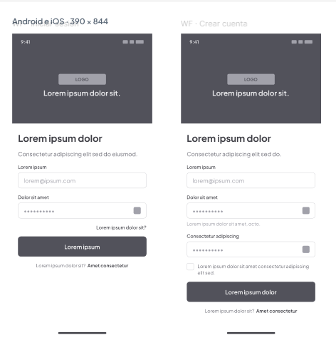 
      <b>Crear Cuenta</b> Registro inicial de datos personales del usuario inversionista.
    </td>
    <td align="center" width="25%">
      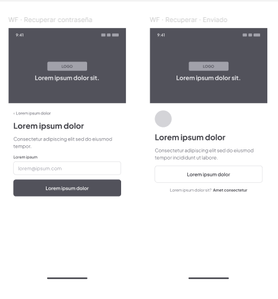 
      <b>Recuperar Cuenta</b> Solicitud de restablecimiento de acceso mediante correo.
    </td>
    <td align="center" width="25%">
      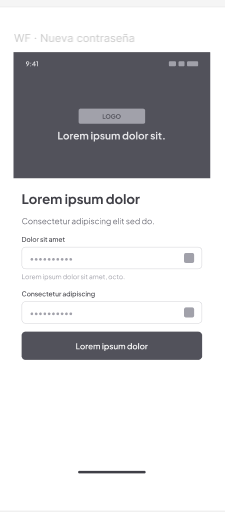 
      <b>Nueva Contraseña</b> Ingreso y confirmación de nuevas credenciales de acceso.
    </td>
    <td align="center" width="25%">
      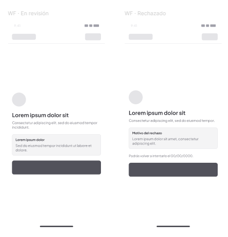 
      <b>Estados / Validación</b> Notificaciones de error o rechazo en proceso de verificación.
    </td>
  </tr>
</table>

---

#### **2. Dashboard Principal y Secciones**

<table>
  <tr>
    <td align="center" width="25%">
      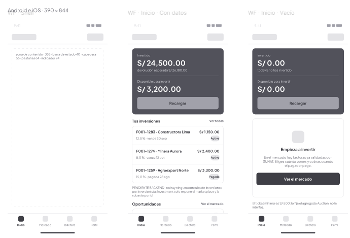 
      <b>Inicio / Dashboard</b> Vista principal con saldo total, accesos rápidos y resumen de actividad.
    </td>
    <td align="center" width="25%">
      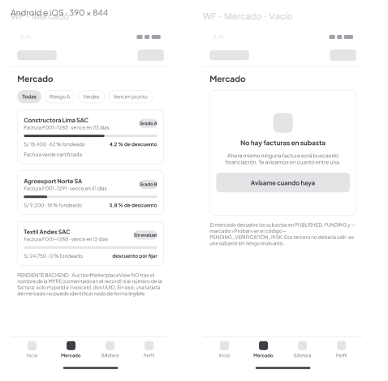 
      <b>Sección Mercado</b> Catálogo de facturas y oportunidades disponibles para fondear.
    </td>
    <td align="center" width="25%">
      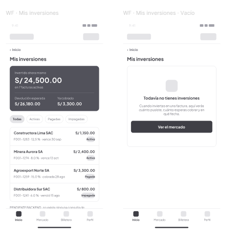 
      <b>Mis Inversiones</b> Listado y seguimiento del estado de las facturas fondeadas.
    </td>
    <td align="center" width="25%">
      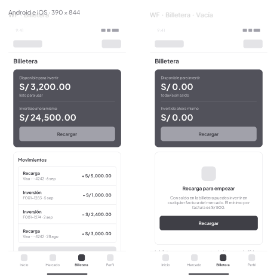 
      <b>Billetera</b> Detalle de saldo disponible, retenido e historial transaccional.
    </td>
  </tr>
</table>

---

#### **3. Flujo de Subasta e Inversión**

<table>
  <tr>
    <td align="center" width="33%">
      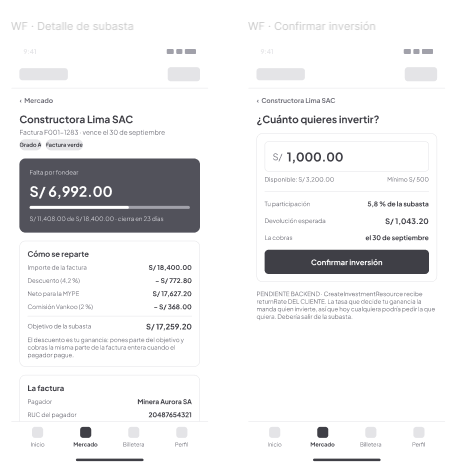 
      <b>Detalle de Subasta</b> Información de la factura, tasa de retorno y empresa emisora.
    </td>
    <td align="center" width="33%">
      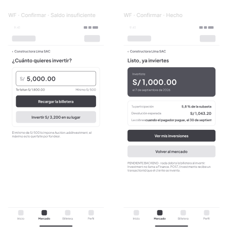 
      <b>Saldo Insuficiente</b> Validación y aviso para recargar fondos antes de invertir.
    </td>
    <td align="center" width="33%">
      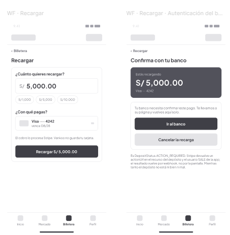 
      <b>Recargar Billetera</b> Módulo para abonar dinero a la cuenta mediante transferencia/tarjeta.
    </td>
  </tr>
</table>

---

#### **4. Perfil y Ajustes**

<table>
  <tr>
    <td align="center" width="50%">
      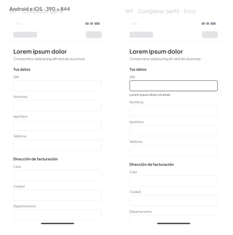 
      <b>Perfil</b> Información general del usuario y estado de la cuenta.
    </td>
    <td align="center" width="50%">
      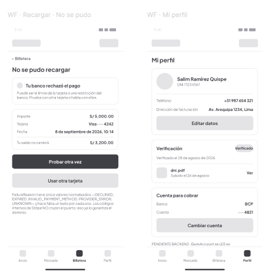 
      <b>Configuración de Recarga/Perfil</b> Gestión de cuentas bancarias de retiro y ajustes.
    </td>
  </tr>
</table>

### 4.4.2. Mobile Applications Wireflow Diagrams

A continuación, se presentan los diagramas de flujo de pantallas (*Wireflow Diagrams*) de la aplicación móvil de **Vankoo**, desplegados a tamaño completo para garantizar la máxima legibilidad de los componentes y las conexiones entre pantallas.

---

#### **1. Autenticación, Registro e Identidad**

  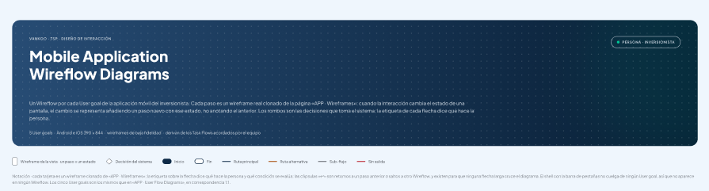 
  <b>01. Portada / Front Page</b> 
  Diagrama de inicio y flujo de bienvenida a la aplicación.

 

  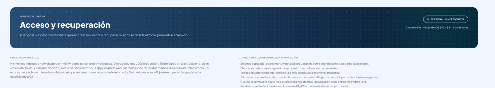 
  <b>02. Acceso - Inicio de Sesión</b> 
  Flujo de autenticación con credenciales principales.

 

  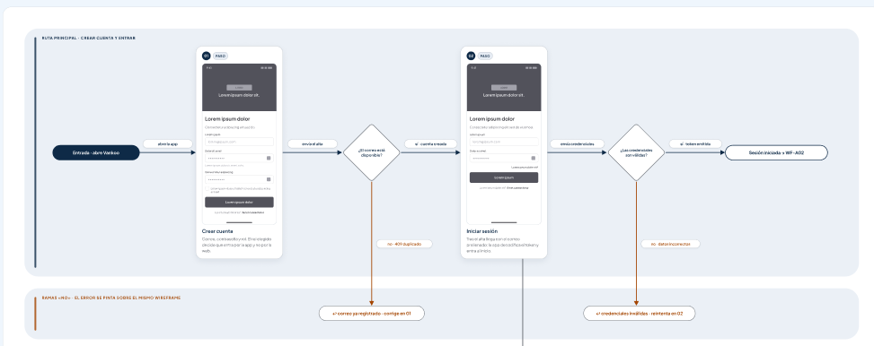 
  <b>03. Acceso - Recuperación</b> 
  Ruta de recuperación de contraseña y enlaces de validación.

 

  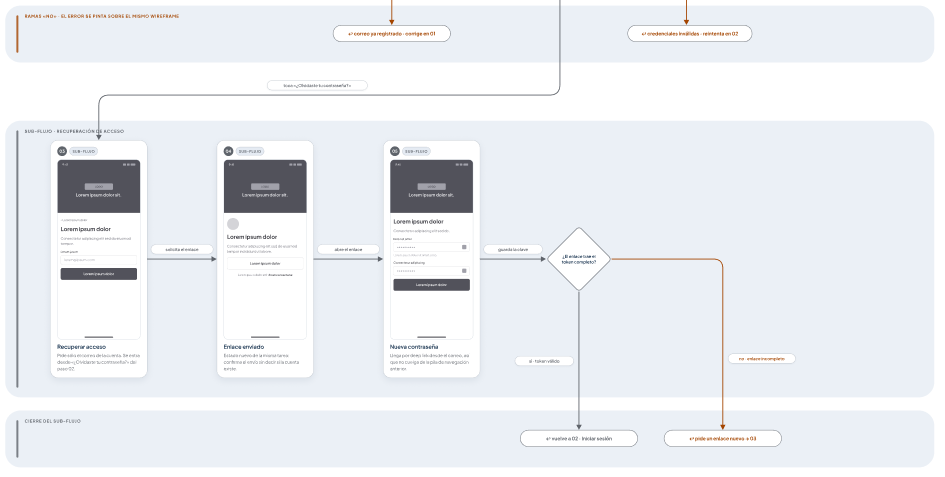 
  <b>04. Acceso - Verificación</b> 
  Flujo de estados de error y confirmación de identidad.

---

#### **2. Mercado de Oportunidades y Subastas**

  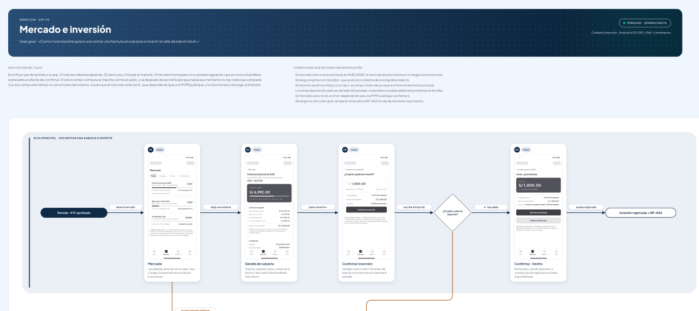 
  <b>05. Mercado - Exploración</b> 
  Navegación general por las facturas y oportunidades disponibles.

 

  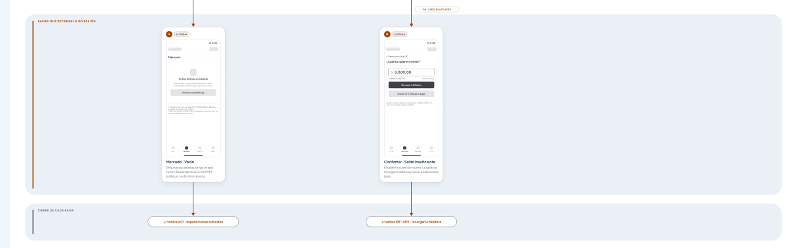 
  <b>06. Mercado - Detalle de Subasta</b> 
  Flujo de consulta de detalles y simulación de inversión.

---

#### **3. Gestión de Inversiones y Billetera**

  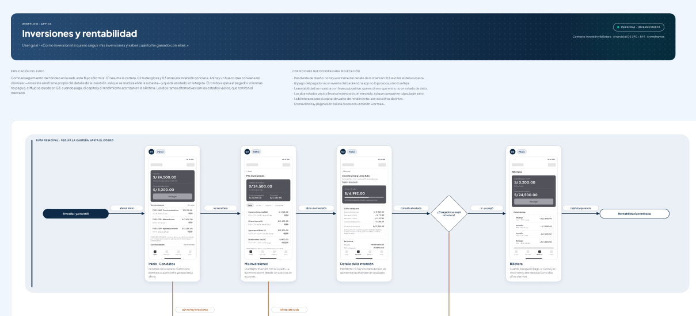 
  <b>07. Inversiones - Resumen</b> 
  Visualización general de operaciones en curso y fondeadas.

 

  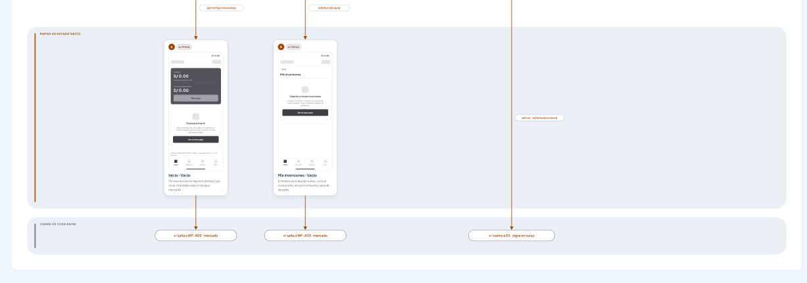 
  <b>08. Inversiones - Detalle</b> 
  Flujo de seguimiento de retornos y estado de pagos.

 

  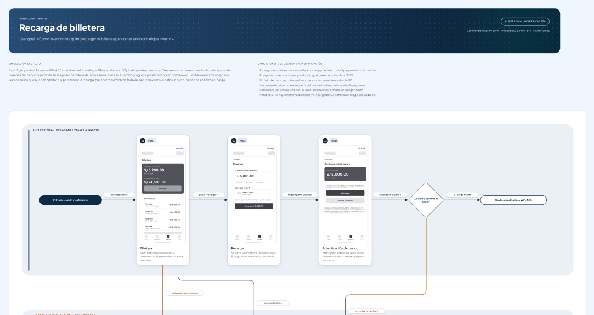 
  <b>09. Billetera - Recarga</b> 
  Navegación e ingreso del monto para abono de saldo.

 

  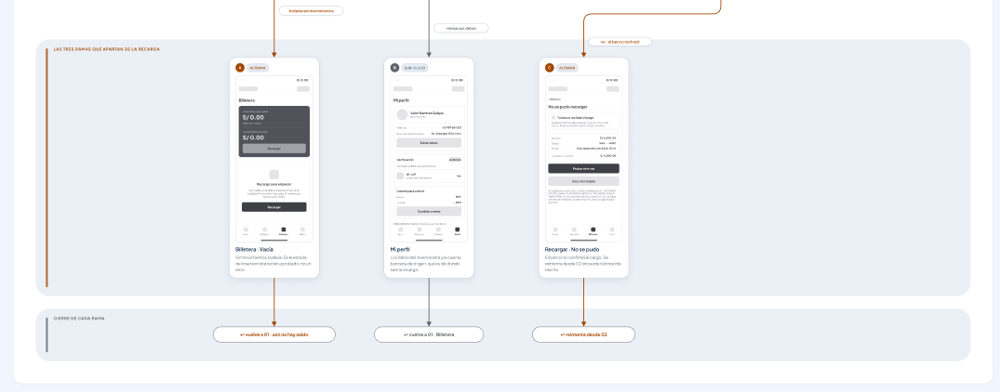 
  <b>10. Billetera - Confirmación</b> 
  Pasarela bancaria y manejo de estados de rechazo/éxito.

---

#### **4. Perfil del Usuario y Configuración**

  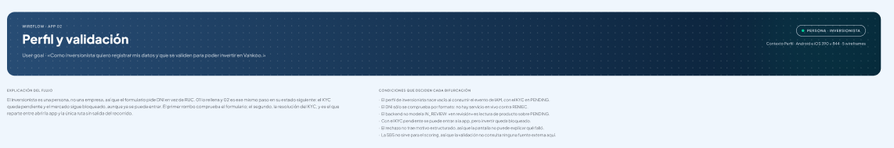 
  <b>11. Perfil - General</b> 
  Navegación por datos personales y estado de verificación.

 

  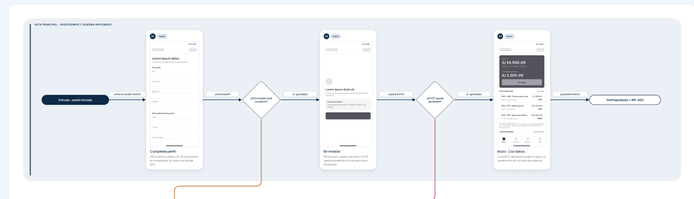 
  <b>12. Perfil - Cuentas Bancarias</b> 
  Ajustes de cuentas para el retiro de fondos.

 

  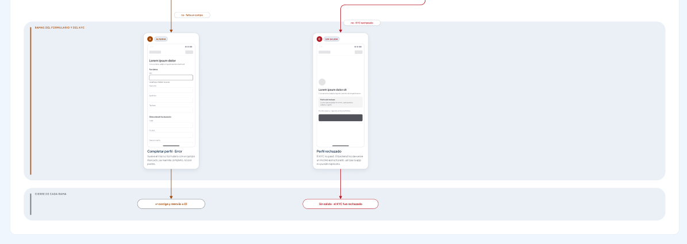 
  <b>13. Perfil - Seguridad y Ajustes</b> 
  Modificación de preferencias y seguridad de la cuenta.

### 4.4.3. Mobile Applications Mock-ups

<!-- Assets: ./assets/cap4-product-design/mobile-app/mockups/ -->

_Pendiente de elaboración._

### 4.4.4. Mobile Applications User Flow Diagrams

<!-- Assets: ./assets/cap4-product-design/mobile-app/user-flow-diagrams/ -->

_Pendiente de elaboración._

## 4.5. Mobile Applications Prototyping

<!-- Assets: ./assets/cap4-product-design/mobile-app/prototyping/ — incluir enlace público al prototipo en Figma. -->

_Pendiente de elaboración._

### 4.5.1. Android Mobile Applications Prototyping

_Pendiente de elaboración._

### 4.5.2. iOS Mobile Applications Prototyping

_Pendiente de elaboración._

## 4.6. Web Applications UX/UI Design

_Pendiente de elaboración: párrafo introductorio de la sección._

### 4.6.1. Web Applications Wireframes

<!-- Assets: ./assets/cap4-product-design/web-app/wireframes/ -->

_Pendiente de elaboración._

### 4.6.2. Web Applications Wireflow Diagrams

<!-- Assets: ./assets/cap4-product-design/web-app/wireflow-diagrams/ -->

_Pendiente de elaboración._

### 4.6.3. Web Applications Mock-ups

<!-- Assets: ./assets/cap4-product-design/web-app/mockups/ -->

_Pendiente de elaboración._

### 4.6.4. Web Applications User Flow Diagrams

<!-- Assets: ./assets/cap4-product-design/web-app/user-flow-diagrams/ -->

_Pendiente de elaboración._

## 4.7. Web Applications Prototyping

<!-- Assets: ./assets/cap4-product-design/web-app/prototyping/ — incluir enlace público al prototipo en Figma. -->

_Pendiente de elaboración._

## 4.8. Domain-Driven Software Architecture

_Pendiente de elaboración: párrafo introductorio de la sección._

### 4.8.1. Software Architecture Context Diagram

<!-- C4 Model - Nivel 1. Herramienta: Structurizr (o Structurizr DSL como Diagram-as-Code). -->
<!-- Assets: ./assets/cap4-product-design/software-architecture/context-diagram/ -->

_Pendiente de elaboración._

### 4.8.2. Software Architecture Container Diagrams

<!-- C4 Model - Nivel 2. -->
<!-- Assets: ./assets/cap4-product-design/software-architecture/container-diagrams/ -->

_Pendiente de elaboración._

### 4.8.3. Software Architecture Components Diagrams

<!-- C4 Model - Nivel 3. -->
<!-- Assets: ./assets/cap4-product-design/software-architecture/components-diagrams/ -->

_Pendiente de elaboración._

## 4.9. Software Object-Oriented Design

### 4.9.1. Class Diagrams

<!-- UML. Herramienta: LucidChart o PlantUML (Diagram-as-Code). -->
<!-- Assets: ./assets/cap4-product-design/class-diagrams/ -->

_Pendiente de elaboración._

### 4.9.2. Class Dictionary

_Pendiente de elaboración._

## 4.10. Database Design

### 4.10.1. Relational/Non-Relational Database Diagram

<!-- Herramienta: LucidChart / Vertabelo. -->
<!-- Assets: ./assets/cap4-product-design/database-design/ -->

_Pendiente de elaboración._

# Capítulo V: Product Implementation

## 5.1. Software Configuration Management

_Pendiente de elaboración: párrafo introductorio de la sección._

### 5.1.1. Software Development Environment Configuration

<!-- Assets: ./assets/cap5-product-implementation/configuration-management/ -->

_Pendiente de elaboración._

| Producto | Herramienta | Propósito | Enlace |
|----------|-------------|-----------|--------|
|  |  |  |  |

### 5.1.2. Source Code Management

<!-- GitFlow Workflow, Conventional Commits y Semantic Versioning. Incluir URLs de los repositorios del producto. -->

_Pendiente de elaboración._

| Repositorio | Producto | URL |
|-------------|----------|-----|
|  |  |  |

### 5.1.3. Source Code Style Guide & Conventions

_Pendiente de elaboración._

### 5.1.4. Software Deployment Configuration

_Pendiente de elaboración._

## 5.2. Product Implementation & Deployment

### 5.2.1. Sprint Backlogs

<!-- Un Sprint Backlog por sprint, con work-items redactados en texto (no capturas de la herramienta). -->
<!-- Assets: ./assets/cap5-product-implementation/sprint-backlogs/ -->

_Pendiente de elaboración._

**Sprint 1**

| Sprint # | Sprint 1 |
|----------|----------|
| **Sprint Planning Background** | |
| Date | |
| Time | |
| Location | |
| Prepared By | |
| Attendees (to planning meeting) | |
| Sprint n - 1 Review Summary | |
| Sprint n - 1 Retrospective Summary | |
| **Sprint Goal & User Stories** | |
| Sprint n Goal | |
| Sprint n Velocity | |
| Sum of Story Points | |

| User Story Id | Work-Item / Task Id | Título | Descripción | Estimación (Hours) | Asignado a | Estado |
|---------------|---------------------|--------|-------------|--------------------|------------|--------|
|  |  |  |  |  |  |  |

### 5.2.2. Implemented Landing Page Evidence

<!-- Assets: ./assets/cap5-product-implementation/landing-page-evidence/ — incluir URL de despliegue. -->

_Pendiente de elaboración._

### 5.2.3. Implemented Frontend-Web Application Evidence

<!-- Vue Framework + PrimeVue. Assets: ./assets/cap5-product-implementation/web-app-evidence/ -->

_Pendiente de elaboración._

### 5.2.4. Implemented Native-Mobile Application Evidence

<!-- Assets: ./assets/cap5-product-implementation/mobile-app-evidence/ -->

_Pendiente de elaboración._

### 5.2.5. Implemented RESTful API and/or Serverless Backend Evidence

<!-- ASP.NET Core. Assets: ./assets/cap5-product-implementation/backend-api-evidence/ -->

_Pendiente de elaboración._

### 5.2.6. RESTful API documentation

<!-- OpenAPI Specification vía Swagger. Assets: ./assets/cap5-product-implementation/api-documentation/ -->

_Pendiente de elaboración._

### 5.2.7. Team Collaboration Insights

<!-- Assets: ./assets/cap5-product-implementation/collaboration-insights/ -->

_Pendiente de elaboración._

## 5.3. Video About-the-Product

<!-- Incluir enlace del video en Microsoft Stream y screenshot. Assets: ./assets/videos/ -->

_Pendiente de elaboración._

| Entrega | Título del video | Enlace | Duración |
|---------|------------------|--------|----------|
| AV1 |  |  |  |

# Conclusiones

**Conclusiones y recomendaciones**

<!-- Avance de conclusiones para AV1. Se expande en cada entrega. -->

_Pendiente de elaboración._

**Video App Validation**

_Pendiente de elaboración._

**Video About-the-Team**

_Pendiente de elaboración._

# Bibliografía

<!-- Formato APA. Usar la clase .ref para sangría francesa: 
Autor, A. (año). Título...
 -->

_Pendiente de elaboración._

# Anexos

<!-- Enumerar con letra mayúscula: Anexo A, Anexo B, etc. Assets: ./assets/anexos/ -->

**Anexo A. Videos de Exposiciones**

| Entrega | Enlace del video |
|---------|------------------|
| AV1 |  |

**Anexo B. Enlaces de artefactos y herramientas**

| Artefacto | Herramienta | Enlace |
|-----------|-------------|--------|
| Lean UX Canvas | UXPressia |  |
| User Personas / Empathy Maps / Journey Maps / Impact Map | UXPressia |  |
| As-Is / To-Be Scenario Maps | LucidChart / Miro |  |
| Wireframes / Mock-ups / Prototypes | Figma |  |
| Wireflows / User Flows | LucidChart / Overflow |  |
| Software Architecture (C4) | Structurizr |  |
| Database Design | LucidChart / Vertabelo |  |
| Product Backlog | Trello / Jira / Pivotal Tracker |  |
