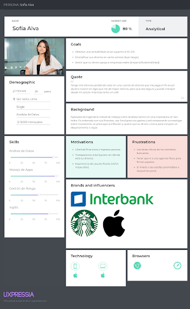
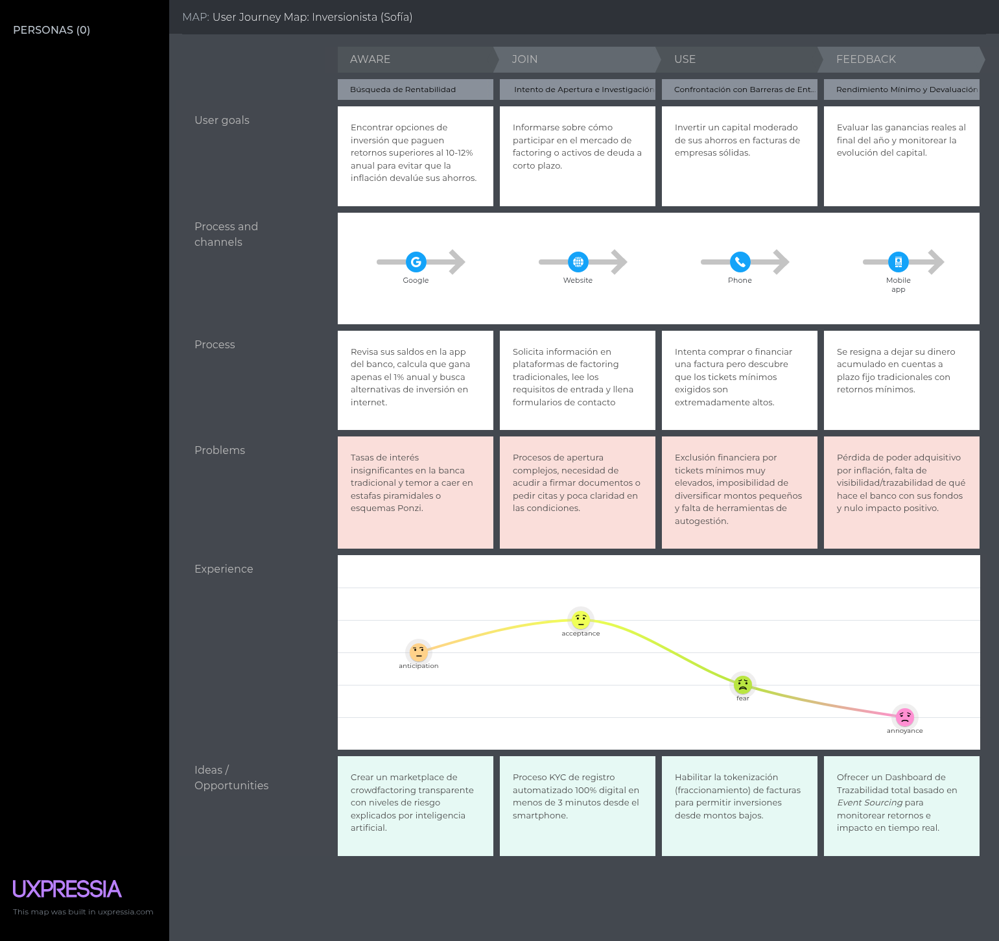
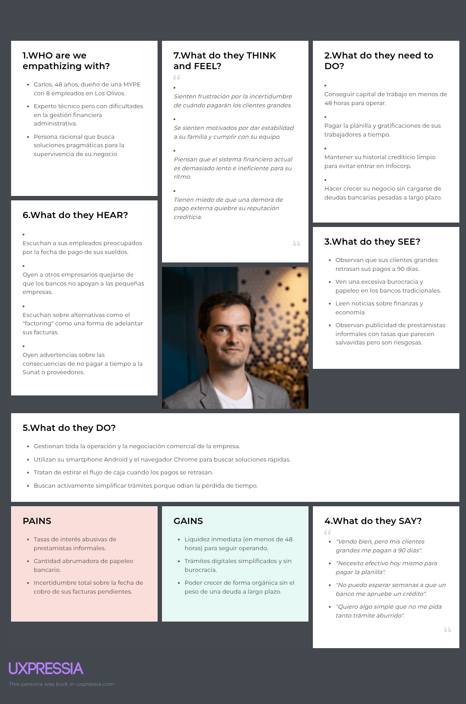

  

<h2 style="text-align: center;"> Universidad Peruana de Ciencias Aplicadas </h2>

<h4 style="text-align: center"> Ingeniería de Software </h4>

<h4 style="text-align: center"> Periodo: 202620 </h4>

<h4 style="text-align: center"> 1ASI0732 | Diseño de Experimentos de Ingeniería de Software </h4>

<h4 style="text-align: center"> NRC: &lt;NRC&gt; </h4>

<h4 style="text-align: center"> Docente: &lt;Apellidos, Nombres del docente&gt; </h4>

 

<h3 style="text-align: center;"> Informe de Trabajo Final </h3>

<h4 style="text-align: center"> Startup: YieldLabs </h4>

<h4 style="text-align: center"> Producto: Vankoo </h4>

<h4 style="text-align: center">Integrantes:</h4>

  
&lt;Código&gt; — Acuache Lucas, Mathias Joaquin

  
&lt;Código&gt; — Amaro Villar, Anjali

  
&lt;Código&gt; — García Bernal, Daniela

  
&lt;Código&gt; — Pillaca Vidal, Luis Angel

 

<h5 style="text-align: center; font-style: italic;"> Setiembre 2026 </h5>

# Registro de Versiones del Informe

| Versión | Fecha    | Autor                | Descripción de modificación                                   |
|---------|----------|----------------------|---------------------------------------------------------------|
| 1.0     | 02/09/26 | Amaro Villar, Anjali | Organización inicial del informe y estructura del repositorio |
|         |          |                      |                                                               |

# Project Report Collaboration Insights

Enlace del repositorio del Project Report: [*Ver en GitHub*](https://github.com/yieldlabshq/report)

**GitHub Collaboration Insights**

_Pendiente de elaboración._

Los integrantes del equipo son:

| Integrante                     | Usuario GitHub |
|--------------------------------|----------------|
| Acuache Lucas, Mathias Joaquin | MathiasA25     |
| Amaro Villar, Anjali           | njlmrvllr      |
| García Bernal, Daniela         | danygbernal |
| Pillaca Vidal, Luis Angel      | luispillacavidal |

Las principales ramas del repositorio, gestionadas bajo **GitFlow Workflow**, **Conventional Commits** y **Semantic Versioning 2.0.0**, son:

* `main`: rama principal que contiene la versión estable del informe.
* `develop`: rama de integración de las secciones antes de fusionarse a `main`.
* `feature/X-mathias`: rama utilizada por Mathias para las tareas correspondientes a una determinada entrega (av1, tb1, av2, tb2).
* `feature/X-anjali`: rama utilizada por Anjali para las tareas correspondientes a una determinada entrega (av1, tb1, av2, tb2).
* `feature/X-daniela`: rama utilizada por Daniela para las tareas correspondientes a una determinada entrega (av1, tb1, av2, tb2).
* `feature/X-luis`: rama utilizada por Luis para las tareas correspondientes a una determinada entrega (av1, tb1, av2, tb2).
* `release/vX.X.X`: rama de preparación de versiones candidatas del informe.
* `hotfix/<descripcion>`: rama para correcciones urgentes sobre `main`.

**AV1**

<!-- Assets: ./assets/github-insights/ — capturas de Insights > Contributors e Insights > Network. -->

_Pendiente: capturas de los analíticos de colaboración y commits en GitHub._

# Contenido

- [Registro de Versiones del Informe](#registro-de-versiones-del-informe)
- [Project Report Collaboration Insights](#project-report-collaboration-insights)
- [Contenido](#contenido)
- [Student Outcome](#student-outcome)
- [Capítulo I: Introducción](#capítulo-i-introducción)
  - [1.1. Startup Profile](#11-startup-profile)
    - [1.1.1. Descripción de la Startup](#111-descripción-de-la-startup)
    - [1.1.2. Perfiles de integrantes del equipo](#112-perfiles-de-integrantes-del-equipo)
  - [1.2. Solution Profile](#12-solution-profile)
    - [1.2.1. Antecedentes y problemática](#121-antecedentes-y-problemática)
    - [1.2.2. Lean UX Process](#122-lean-ux-process)
      - [1.2.2.1. Lean UX Problem Statements](#1221-lean-ux-problem-statements)
      - [1.2.2.2. Lean UX Assumptions](#1222-lean-ux-assumptions)
      - [1.2.2.3. Lean UX Hypothesis Statements](#1223-lean-ux-hypothesis-statements)
      - [1.2.2.4. Lean UX Canvas](#1224-lean-ux-canvas)
  - [1.3. Segmentos objetivo](#13-segmentos-objetivo)
- [Capítulo II: Requirements Elicitation \& Analysis](#capítulo-ii-requirements-elicitation--analysis)
  - [2.1. Competidores](#21-competidores)
    - [2.1.1. Análisis competitivo](#211-análisis-competitivo)
    - [2.1.2. Estrategias y tácticas frente a competidores](#212-estrategias-y-tácticas-frente-a-competidores)
  - [2.2. Entrevistas](#22-entrevistas)
    - [2.2.1. Diseño de entrevistas](#221-diseño-de-entrevistas)
    - [2.2.2. Registro de entrevistas](#222-registro-de-entrevistas)
    - [2.2.3. Análisis de entrevistas](#223-análisis-de-entrevistas)
  - [2.3. Needfinding](#23-needfinding)
    - [2.3.1. User Personas](#231-user-personas)
    - [2.3.2. User Task Matrix](#232-user-task-matrix)
    - [2.3.3. User Journey Mapping](#233-user-journey-mapping)
    - [2.3.4. Empathy Mapping](#234-empathy-mapping)
    - [2.3.5. As-is Scenario Mapping](#235-as-is-scenario-mapping)
  - [2.4. Ubiquitous Language](#24-ubiquitous-language)
- [Capítulo III: Requirements Specification](#capítulo-iii-requirements-specification)
  - [3.1. To-Be Scenario Mapping](#31-to-be-scenario-mapping)
  - [3.2. User Stories](#32-user-stories)
  - [3.3. Product Backlog](#33-product-backlog)
  - [3.4. Impact Mapping](#34-impact-mapping)
- [Capítulo IV: Product Design](#capítulo-iv-product-design)
  - [4.1. Style Guidelines](#41-style-guidelines)
    - [4.1.1. General Style Guidelines](#411-general-style-guidelines)
    - [4.1.2. Web Style Guidelines](#412-web-style-guidelines)
    - [4.1.3. Mobile Style Guidelines](#413-mobile-style-guidelines)
      - [4.1.3.1. iOS Mobile Style Guidelines](#4131-ios-mobile-style-guidelines)
      - [4.1.3.2. Android Mobile Style Guidelines](#4132-android-mobile-style-guidelines)
  - [4.2. Information Architecture](#42-information-architecture)
    - [4.2.1. Organization Systems](#421-organization-systems)
    - [4.2.2. Labeling Systems](#422-labeling-systems)
    - [4.2.3. SEO Tags and Meta Tags](#423-seo-tags-and-meta-tags)
    - [4.2.4. Searching Systems](#424-searching-systems)
    - [4.2.5. Navigation Systems](#425-navigation-systems)
  - [4.3. Landing Page UI Design](#43-landing-page-ui-design)
    - [4.3.1. Landing Page Wireframe](#431-landing-page-wireframe)
    - [4.3.2. Landing Page Mock-up](#432-landing-page-mock-up)
  - [4.4. Mobile Applications UX/UI Design](#44-mobile-applications-uxui-design)
    - [4.4.1. Mobile Applications Wireframes](#441-mobile-applications-wireframes)
    - [4.4.2. Mobile Applications Wireflow Diagrams](#442-mobile-applications-wireflow-diagrams)
    - [4.4.3. Mobile Applications Mock-ups](#443-mobile-applications-mock-ups)
    - [4.4.4. Mobile Applications User Flow Diagrams](#444-mobile-applications-user-flow-diagrams)
  - [4.5. Mobile Applications Prototyping](#45-mobile-applications-prototyping)
    - [4.5.1. Android Mobile Applications Prototyping](#451-android-mobile-applications-prototyping)
    - [4.5.2. iOS Mobile Applications Prototyping](#452-ios-mobile-applications-prototyping)
  - [4.6. Web Applications UX/UI Design](#46-web-applications-uxui-design)
    - [4.6.1. Web Applications Wireframes](#461-web-applications-wireframes)
    - [4.6.2. Web Applications Wireflow Diagrams](#462-web-applications-wireflow-diagrams)
    - [4.6.3. Web Applications Mock-ups](#463-web-applications-mock-ups)
    - [4.6.4. Web Applications User Flow Diagrams](#464-web-applications-user-flow-diagrams)
  - [4.7. Web Applications Prototyping](#47-web-applications-prototyping)
  - [4.8. Domain-Driven Software Architecture](#48-domain-driven-software-architecture)
    - [4.8.1. Software Architecture Context Diagram](#481-software-architecture-context-diagram)
    - [4.8.2. Software Architecture Container Diagrams](#482-software-architecture-container-diagrams)
    - [4.8.3. Software Architecture Components Diagrams](#483-software-architecture-components-diagrams)
  - [4.9. Software Object-Oriented Design](#49-software-object-oriented-design)
    - [4.9.1. Class Diagrams](#491-class-diagrams)
    - [4.9.2. Class Dictionary](#492-class-dictionary)
  - [4.10. Database Design](#410-database-design)
    - [4.10.1. Relational/Non-Relational Database Diagram](#4101-relationalnon-relational-database-diagram)
- [Capítulo V: Product Implementation](#capítulo-v-product-implementation)
  - [5.1. Software Configuration Management](#51-software-configuration-management)
    - [5.1.1. Software Development Environment Configuration](#511-software-development-environment-configuration)
    - [5.1.2. Source Code Management](#512-source-code-management)
    - [5.1.3. Source Code Style Guide \& Conventions](#513-source-code-style-guide--conventions)
    - [5.1.4. Software Deployment Configuration](#514-software-deployment-configuration)
  - [5.2. Product Implementation \& Deployment](#52-product-implementation--deployment)
    - [5.2.1. Sprint Backlogs](#521-sprint-backlogs)
    - [5.2.2. Implemented Landing Page Evidence](#522-implemented-landing-page-evidence)
    - [5.2.3. Implemented Frontend-Web Application Evidence](#523-implemented-frontend-web-application-evidence)
    - [5.2.4. Implemented Native-Mobile Application Evidence](#524-implemented-native-mobile-application-evidence)
    - [5.2.5. Implemented RESTful API and/or Serverless Backend Evidence](#525-implemented-restful-api-andor-serverless-backend-evidence)
    - [5.2.6. RESTful API documentation](#526-restful-api-documentation)
    - [5.2.7. Team Collaboration Insights](#527-team-collaboration-insights)
  - [5.3. Video About-the-Product](#53-video-about-the-product)
- [Conclusiones](#conclusiones)
- [Bibliografía](#bibliografía)
- [Anexos](#anexos)

# Student Outcome

Cada participante del equipo debe sustentar evidencia de cómo las actividades realizadas en el trabajo final han ayudado a desarrollar las dimensiones del student outcome. Por ello en esta sección debe haber una subsección por cada alumno donde éste describa por escrito la relación entre el outcome, sus dimensiones y el trabajo que ha realizado. 

El curso contribuye al cumplimiento del Student Outcome ABET:

**ABET – EAC - Student Outcome 4**

**Criterio:** La capacidad de reconocer responsabilidades éticas y profesionales en situaciones de ingeniería y hacer juicios informados, que deben considerar el impacto de las soluciones de ingeniería en contextos globales, económicos, ambientales y sociales.

En el siguiente cuadro se describe las acciones realizadas y enunciados de conclusiones por parte del grupo, que permiten sustentar el haber alcanzado el logro del ABET – EAC - Student Outcome 4.

| Criterio específico | Acciones realizadas | Conclusiones |
|:--------------------|:--------------------|:-------------|
| **4.c.1** Reconoce responsabilidad ética y profesional en situaciones de ingeniería de software | **Acuache Lucas, Mathias Joaquin** **AV1** _Pendiente._  **Amaro Villar, Anjali** **AV1** _Pendiente._  **García Bernal, Daniela** **AV1** _Pendiente._  **Pillaca Vidal, Luis Angel** **AV1** _Pendiente._ | **AV1** _Pendiente._ |
| **4.c.2** Emite juicios informados considerando el impacto de las soluciones de ingeniería de software en contextos globales, económicos, ambientales y sociales | **Acuache Lucas, Mathias Joaquin** **AV1** _Pendiente._  **Amaro Villar, Anjali** **AV1** _Pendiente._  **García Bernal, Daniela** **AV1** _Pendiente._  **Pillaca Vidal, Luis Angel** **AV1** _Pendiente._ | **AV1** _Pendiente._ |

# Capítulo I: Introducción

## 1.1. Startup Profile

### 1.1.1. Descripción de la Startup

<!-- Nombre, origen del nombre, misión, visión y propuesta de valor de YieldLabs. -->
<!-- Assets: ./assets/logos/ -->

_Pendiente de elaboración._

### 1.1.2. Perfiles de integrantes del equipo

<!-- Por integrante: foto, nombres y apellidos, código de estudiante, carrera y párrafo de resumen con los principales conocimientos técnicos y habilidades que aporta al equipo. -->
<!-- Assets: ./assets/profiles/ -->

|  | **Acuache Lucas, Mathias Joaquin** Código: &lt;Código&gt; Carrera: Ingeniería de Software  _Pendiente de elaboración._ |
|---|---|

|  | **Amaro Villar, Anjali** Código: &lt;Código&gt; Carrera: Ingeniería de Software  _Pendiente de elaboración._ |
|---|---|

|  | **García Bernal, Daniela** Código: &lt;Código&gt; Carrera: Ingeniería de Software  _Pendiente de elaboración._ |
|---|---|

|  | **Pillaca Vidal, Luis Angel** Código: &lt;Código&gt; Carrera: Ingeniería de Software  _Pendiente de elaboración._ |
|---|---|

## 1.2. Solution Profile

_Pendiente de elaboración: párrafo introductorio de la sección._

### 1.2.1. Antecedentes y problemática

<!-- Aplicar The 5 'W's y 2 'H's: Who, What, Where, When, Why, How & How Much. -->

_Pendiente de elaboración._

| Pregunta | Respuesta |
|----------|-----------|
| **What?** (¿Qué?) |  |
| **When?** (¿Cuándo?) |  |
| **Where?** (¿Dónde?) |  |
| **Who?** (¿Quién?) |  |
| **Why?** (¿Por qué?) |  |
| **How?** (¿Cómo?) |  |
| **How much?** (¿Cuánto?) |  |

### 1.2.2. Lean UX Process

_Pendiente de elaboración: párrafo introductorio del Lean UX Process._

#### 1.2.2.1. Lean UX Problem Statements

<!-- Incluir domain, customer segments, pain points, gap, vision/strategy e initial segment. -->

_Pendiente de elaboración._

#### 1.2.2.2. Lean UX Assumptions

**Business Assumptions**

_Pendiente de elaboración._

**Business Outcomes**

_Pendiente de elaboración._

**User Assumptions**

_Pendiente de elaboración._

**User Outcomes & Benefits**

_Pendiente de elaboración._

**Feature Assumptions**

_Pendiente de elaboración._

#### 1.2.2.3. Lean UX Hypothesis Statements

_Pendiente de elaboración._

#### 1.2.2.4. Lean UX Canvas

<!-- Assets: ./assets/cap1-introduccion/lean-ux-canvas/ -->

_Pendiente de elaboración._

## 1.3. Segmentos objetivo

<!-- Características demográficas e información estadística de sustento por cada segmento. -->
<!-- Assets: ./assets/cap1-introduccion/segmentos-objetivo/ -->

_Pendiente de elaboración._

# Capítulo II: Requirements Elicitation & Analysis

En este capítulo se presenta el trabajo realizado por el equipo de YieldLabs para identificar y analizar los requerimientos que orientan el desarrollo de Vankoo. Como punto de partida, se realiza una evaluación de las principales soluciones existentes en el mercado peruano de factoring y crowdfactoring, comparándolas con Vankoo para reconocer oportunidades de diferenciación y establecer cómo responder ante las fortalezas y limitaciones de sus competidores. Posteriormente, se lleva a cabo una etapa de needfinding mediante entrevistas semiestructuradas dirigidas a los dos grupos de usuarios considerados como público objetivo: empresarios MYPE e inversionistas minoristas. La información recopilada permite construir diferentes herramientas de análisis y representación de usuarios, entre ellas las user personas, user task matrix, user journey mapping, empathy mapping y as-is scenario mapping. En conjunto, los hallazgos obtenidos durante este proceso proporcionan el sustento necesario para definir y especificar los requisitos que serán desarrollados en el Capítulo III.

## 2.1. Competidores

<!-- Identificar y describir mínimo 3 competidores directos. -->
<!-- Assets: ./assets/cap2-requirements-elicitation/competidores/ -->

Para evaluar el entorno competitivo de Vankoo, se seleccionaron tres empresas que ofrecen soluciones vinculadas al factoring y/o crowdfactoring dentro del mercado peruano: Prestamype, Finsmart e Innova Funding. Cada una presenta características particulares en cuanto a su propuesta, público objetivo y estrategias para captar clientes e inversionistas.

**Prestamype**

Prestamype se posiciona como una de las principales Fintech peruanas especializadas en préstamos y factoring. Su oferta comprende diversos servicios financieros, como factoring, préstamos respaldados por garantía hipotecaria, cambio de divisas y financiamiento para capital de trabajo. Gracias a su reconocimiento en el mercado, elevada liquidez y extensa cartera de clientes, cuenta con una capacidad de financiamiento que le permite continuar operando incluso en situaciones donde la participación de inversionistas minoristas resulta insuficiente. Su propuesta está principalmente dirigida a PYMES con mayor nivel de consolidación y necesidades de financiamiento de montos elevados, además de inversionistas de perfil conservador e institucional. Para alcanzar estos segmentos, utiliza canales de gran alcance como televisión, radio, publicidad exterior, Google Ads e influencers reconocidos.

**Finsmart**

Finsmart representa el competidor cuya propuesta guarda mayor similitud con el enfoque de crowdfactoring planteado por Vankoo. Su principal fortaleza se encuentra en una plataforma completamente digital, orientada a facilitar y agilizar la experiencia tanto de los inversionistas como de las empresas que requieren adelantar el cobro de sus facturas. Esta orientación tecnológica permite realizar la conexión entre las facturas y los inversionistas en períodos reducidos. La empresa dirige su propuesta principalmente a MYPES con presencia digital y trabajadores independientes, mientras que para el lado de la inversión busca captar especialmente a usuarios jóvenes, pertenecientes a los grupos millennials y generación Z. Su estrategia de captación se apoya principalmente en redes sociales como LinkedIn e Instagram, programas de referidos y campañas automatizadas de email marketing.

**Innova Funding**

Innova Funding cuenta con una trayectoria pionera dentro del factoring participativo peruano y presenta una orientación predominantemente institucional y B2B. Una de sus principales características es el énfasis que otorga a la educación financiera, acompañado de un sólido dominio de la normativa relacionada con las facturas negociables. Asimismo, mantiene alianzas estratégicas que permiten integrar la facturación electrónica con CAVALI, reforzando su posicionamiento como una especie de "bolsa de facturas". Su público objetivo está conformado principalmente por proveedores de grandes empresas y organismos estatales. Para relacionarse con estos segmentos, emplea estrategias basadas en alianzas con cámaras de comercio, participación en eventos empresariales y presencia en medios especializados en negocios.

### 2.1.1. Análisis competitivo

<!-- Competitive Analysis Landscape según el formato del enunciado. -->

<table style="width:100%; table-layout:fixed; font-size:8pt; line-height:1.3; border-collapse:collapse;">
<colgroup>
<col style="width:8%">
<col style="width:15%">
<col style="width:19.25%">
<col style="width:19.25%">
<col style="width:19.25%">
<col style="width:19.25%">
</colgroup>
<thead>
<tr>
<th colspan="6" style="text-align:left; background:#f2f2f2; border:1px solid #999; padding:4pt;">Competitive Analysis Landscape</th>
</tr>
<tr>
<th colspan="6" style="text-align:left; border:1px solid #999; padding:4pt;">¿Por qué llevar a cabo este análisis?</th>
</tr>
<tr>
<td colspan="6" style="border:1px solid #999; padding:4pt; text-align:left;">Este análisis permite comprender el posicionamiento de Vankoo frente a los actores relevantes del mercado peruano de factoring y crowdfactoring, identificando las ventajas competitivas y los vacíos de valor que la propuesta puede capitalizar, así como las fortalezas de la competencia que representan una amenaza directa para su adopción. Sus resultados retroalimentan las estrategias de diferenciación y las decisiones de producto y marketing que se abordan en la sección 2.1.2.</td>
</tr>
<tr>
<th style="border:1px solid #999; padding:4pt;"></th>
<th style="border:1px solid #999; padding:4pt;"></th>
<th style="border:1px solid #999; padding:4pt; text-align:left; vertical-align:bottom;">
   
  YieldLabs (Vankoo)
</th>
<th style="border:1px solid #999; padding:4pt; text-align:left; vertical-align:bottom;">
   
  Prestamype
</th>
<th style="border:1px solid #999; padding:4pt; text-align:left; vertical-align:bottom;">
   
  Finsmart
</th>
<th style="border:1px solid #999; padding:4pt; text-align:left; vertical-align:bottom;">
   
  Innova Funding
</th>
</tr>
</thead>
<tbody>
<tr>
<th rowspan="2" style="border:1px solid #999; padding:4pt; text-align:left; vertical-align:top;">Perfil</th>
<td style="border:1px solid #999; padding:4pt; vertical-align:top;">Overview</td>
<td style="border:1px solid #999; padding:4pt; vertical-align:top;">La nueva propuesta disruptiva que busca democratizar la liquidez mediante tecnología avanzada (Event-Driven Architecture), reducción de riesgo con IA y un enfoque único de sostenibilidad (Factoring Verde).</td>
<td style="border:1px solid #999; padding:4pt; vertical-align:top;">Es la Fintech líder en préstamos y factoring en Perú. Tienen una marca muy fuerte y ofrecen un ecosistema de productos (préstamos con garantía hipotecaria, cambio de divisas, factoring). Son el "banco" de las Fintech.</td>
<td style="border:1px solid #999; padding:4pt; vertical-align:top;">Competidor directo en el modelo de crowdfactoring. Se destacan por una plataforma muy digital, ágil y enfocada en la experiencia de usuario (UX) tanto para el inversionista como para la empresa.</td>
<td style="border:1px solid #999; padding:4pt; vertical-align:top;">Pioneros en el sector. Se enfocan mucho en la educación financiera y tienen alianzas fuertes para la integración de facturas electrónicas. Su perfil es más institucional/B2B.</td>
</tr>
<tr>
<td style="border:1px solid #999; padding:4pt; vertical-align:top;">Ventaja competitiva ¿Qué valor ofrece a los clientes?</td>
<td style="border:1px solid #999; padding:4pt; vertical-align:top;">Uso de IA real para scoring predictivo del pagador (no solo historial crediticio), arquitectura de eventos (trazabilidad total) y el distintivo de Factoring Verde (menores tasas por sostenibilidad).</td>
<td style="border:1px solid #999; padding:4pt; vertical-align:top;">Reputación y solidez. Al ser los líderes, generan confianza inmediata. Tienen un fondo grande para financiar operaciones si no hay inversionistas retail.</td>
<td style="border:1px solid #999; padding:4pt; vertical-align:top;">User Experience (UX). Su plataforma es extremadamente sencilla de usar. Conectan facturas muy rápido.</td>
<td style="border:1px solid #999; padding:4pt; vertical-align:top;">Integración B2B. Tienen una conexión muy fuerte con el ecosistema de facturación electrónica y CAVALI. Se posicionan como "La bolsa de facturas".</td>
</tr>
<tr>
<th rowspan="2" style="border:1px solid #999; padding:4pt; text-align:left; vertical-align:top;">Perfil de Marketing</th>
<td style="border:1px solid #999; padding:4pt; vertical-align:top;">Mercado objetivo</td>
<td style="border:1px solid #999; padding:4pt; vertical-align:top;">MYPES del sector servicios/comercio excluidas por la banca tradicional y el inversionista "consciente" (retail y ESG).</td>
<td style="border:1px solid #999; padding:4pt; vertical-align:top;">PYMES más consolidadas (que buscan tickets altos) e inversionistas conservadores/institucionales.</td>
<td style="border:1px solid #999; padding:4pt; vertical-align:top;">MYPES digitales y profesionales independientes. Inversionistas jóvenes (millennials/Gen Z).</td>
<td style="border:1px solid #999; padding:4pt; vertical-align:top;">Proveedores de grandes corporaciones y entidades del Estado.</td>
</tr>
<tr>
<td style="border:1px solid #999; padding:4pt; vertical-align:top;">Estrategias de marketing</td>
<td style="border:1px solid #999; padding:4pt; vertical-align:top;">Marketing de contenidos (Inbound) sobre educación financiera, SEO técnico y alianzas con certificadoras verdes.</td>
<td style="border:1px solid #999; padding:4pt; vertical-align:top;">Publicidad masiva (TV, radio, paneles), Google Ads agresivo, influencers de alto perfil.</td>
<td style="border:1px solid #999; padding:4pt; vertical-align:top;">Fuerte presencia en redes sociales (LinkedIn, Instagram), programa de referidos, email marketing automatizado.</td>
<td style="border:1px solid #999; padding:4pt; vertical-align:top;">Alianzas estratégicas con cámaras de comercio, eventos corporativos, PR en medios de negocios.</td>
</tr>
<tr>
<th rowspan="3" style="border:1px solid #999; padding:4pt; text-align:left; vertical-align:top;">Perfil de Producto</th>
<td style="border:1px solid #999; padding:4pt; vertical-align:top;">Productos &amp; Servicios</td>
<td style="border:1px solid #999; padding:4pt; vertical-align:top;">Crowdfactoring inteligente, dashboard de salud financiera, tokenización de facturas (fraccionamiento).</td>
<td style="border:1px solid #999; padding:4pt; vertical-align:top;">Factoring, préstamos con garantía hipotecaria, gestor de divisas, préstamos para capital de trabajo.</td>
<td style="border:1px solid #999; padding:4pt; vertical-align:top;">Crowdfactoring puro, adelanto de facturas.</td>
<td style="border:1px solid #999; padding:4pt; vertical-align:top;">Subasta de facturas, factoring electrónico.</td>
</tr>
<tr>
<td style="border:1px solid #999; padding:4pt; vertical-align:top;">Precios &amp; Costos</td>
<td style="border:1px solid #999; padding:4pt; vertical-align:top;">Modelo de comisión por éxito (aprox. 1% - 1.5% al empresario) + spread de rendimiento al inversionista. Costos operativos bajos por automatización (IA).</td>
<td style="border:1px solid #999; padding:4pt; vertical-align:top;">Tasas competitivas pero con costos de estructuración a veces elevados para la MYPE.</td>
<td style="border:1px solid #999; padding:4pt; vertical-align:top;">Comisiones transparentes, ticket de entrada bajo para inversionistas.</td>
<td style="border:1px solid #999; padding:4pt; vertical-align:top;">Modelo de subasta (la tasa la define el mercado/inversionista), lo que puede ser muy barato o muy caro según la demanda.</td>
</tr>
<tr>
<td style="border:1px solid #999; padding:4pt; vertical-align:top;">Canales de distribución (Web y/o Móvil)</td>
<td style="border:1px solid #999; padding:4pt; vertical-align:top;">Web App (PWA) responsiva.</td>
<td style="border:1px solid #999; padding:4pt; vertical-align:top;">Plataforma Web robusta y fuerza de ventas telefónica.</td>
<td style="border:1px solid #999; padding:4pt; vertical-align:top;">Plataforma Web y App Móvil.</td>
<td style="border:1px solid #999; padding:4pt; vertical-align:top;">Plataforma Web.</td>
</tr>
<tr>
<th rowspan="4" style="border:1px solid #999; padding:4pt; text-align:left; vertical-align:top;">Análisis SWOT</th>
<td style="border:1px solid #999; padding:4pt; vertical-align:top;">Fortalezas</td>
<td style="border:1px solid #999; padding:4pt; vertical-align:top;">Stack tecnológico moderno (escalable), propuesta de valor ética (Green), automatización de procesos.</td>
<td style="border:1px solid #999; padding:4pt; vertical-align:top;">Gran liquidez, marca reconocida, base de datos de clientes inmensa.</td>
<td style="border:1px solid #999; padding:4pt; vertical-align:top;">Agilidad tecnológica, comunidad de inversionistas muy activa, marca "cool" y cercana.</td>
<td style="border:1px solid #999; padding:4pt; vertical-align:top;">Conocimiento profundo de la normativa de facturas negociables, red de partners.</td>
</tr>
<tr>
<td style="border:1px solid #999; padding:4pt; vertical-align:top;">Debilidades</td>
<td style="border:1px solid #999; padding:4pt; vertical-align:top;">Marca nueva sin reputación (trust issue), base de inversionistas inicial nula (problema del huevo y la gallina).</td>
<td style="border:1px solid #999; padding:4pt; vertical-align:top;">Procesos pueden volverse lentos por el volumen; menos enfoque en micro-inversionistas (tickets de entrada más altos).</td>
<td style="border:1px solid #999; padding:4pt; vertical-align:top;">Dependencia alta del crowdfactoring (si los inversionistas se asustan, se seca la liquidez), riesgo de impago en facturas de menor calidad.</td>
<td style="border:1px solid #999; padding:4pt; vertical-align:top;">Interfaz de usuario (UI) menos moderna que Finsmart/LiquiLabs, curva de aprendizaje para el usuario nuevo.</td>
</tr>
<tr>
<td style="border:1px solid #999; padding:4pt; vertical-align:top;">Oportunidades</td>
<td style="border:1px solid #999; padding:4pt; vertical-align:top;">Creciente interés en inversiones de impacto (ESG), saturación de la banca tradicional.</td>
<td style="border:1px solid #999; padding:4pt; vertical-align:top;">Expansión internacional, compra de competidores pequeños.</td>
<td style="border:1px solid #999; padding:4pt; vertical-align:top;">Alianzas con software de contabilidad o facturación electrónica.</td>
<td style="border:1px solid #999; padding:4pt; vertical-align:top;">Convertirse en el motor de factoring de otros bancos (SaaS).</td>
</tr>
<tr>
<td style="border:1px solid #999; padding:4pt; vertical-align:top;">Amenazas</td>
<td style="border:1px solid #999; padding:4pt; vertical-align:top;">Regulaciones estrictas de la SBS/SMV sobre "tokenización", reacción agresiva de bancos bajando tasas.</td>
<td style="border:1px solid #999; padding:4pt; vertical-align:top;">Fintechs de nicho que ofrezcan mejor UX o procesos más rápidos (como LiquiLabs).</td>
<td style="border:1px solid #999; padding:4pt; vertical-align:top;">Entrada de bancos digitales al sector de factoring con tasas subsidiadas.</td>
<td style="border:1px solid #999; padding:4pt; vertical-align:top;">Que la competencia simplifique tanto el proceso que su modelo de "subasta" parezca complejo.</td>
</tr>
</tbody>
</table>

### 2.1.2. Estrategias y tácticas frente a competidores

**Diferenciación mediante Scoring Predictivo e Inteligencia Artificial**

* **Estrategia:** Posicionar a YieldLabs como una plataforma especializada en gestión y evaluación de riesgo financiero, utilizando inteligencia artificial para brindar a los inversionistas información que les permita tomar decisiones con mayor seguridad frente a las alternativas tradicionales de crowdfactoring.
* **Tácticas:**
  * Generar para cada factura un Reporte de Salud del Pagador basado en IA, que presente de manera sencilla una evaluación del riesgo asociado y proporcione al inversionista un indicador adicional para decidir dónde colocar su capital.
  * Incorporar alertas instantáneas que notifiquen a los inversionistas cuando se publiquen nuevas oportunidades de financiamiento, reduciendo el tiempo entre la disponibilidad de una factura y la posibilidad de invertir en ella.
  
**Factoring orientado a la sostenibilidad**

* **Estrategia:** Desarrollar un nicho enfocado en inversión responsable y criterios ESG, conectando a inversionistas interesados en sostenibilidad con MYPES que desarrollen actividades o prácticas favorables para el medio ambiente.
* **Tácticas:**
  * Crear una certificación digital de Empresa de Impacto que identifique a las MYPES cuyas facturas correspondan a actividades o sectores considerados sostenibles.
  * Establecer una Tasa Preferencial Verde, mediante la cual las operaciones que cumplan con los criterios ambientales definidos puedan obtener una reducción de 0.25 % en la comisión de éxito, buscando incentivar su financiamiento entre inversionistas interesados en proyectos ESG.

**Democratización de la inversión mediante fraccionamiento**

* **Estrategia:** Facilitar la participación de inversionistas minoristas mediante el fraccionamiento de las facturas, reduciendo el monto mínimo necesario para invertir y permitiendo que LiquiLabs alcance usuarios que normalmente no participan en este mercado.
* **Tácticas:**
  * Dividir las facturas en participaciones de menor valor para establecer montos mínimos de inversión, como S/ 50 o S/ 100, haciendo que el acceso sea más sencillo para inversionistas retail.
  * Implementar una Billetera de Reinversión Automática que utilice IA para distribuir el dinero disponible entre diferentes microfracciones de facturas, favoreciendo la diversificación automática del portafolio.

**Transparencia y trazabilidad de las operaciones**

* **Estrategia:** Utilizar la transparencia tecnológica como mecanismo para generar confianza y compensar la falta de trayectoria de LiquiLabs frente a competidores que cuentan con una presencia consolidada en el mercado.
* **Tácticas:**
  * Desarrollar un Dashboard de Trazabilidad que permita consultar el estado de una factura durante todo su ciclo, incluyendo etapas como la validación en SUNAT, la confirmación en CAVALI, el fondeo y el pago.
  * Proporcionar información resumida sobre los principales criterios considerados por el sistema de IA en la evaluación de riesgo, permitiendo que los usuarios comprendan mejor el funcionamiento del scoring y fortaleciendo la confianza en la plataforma.

**Crecimiento mediante alianzas tecnológicas**

* **Estrategia:** Priorizar la integración de LiquiLabs con herramientas que las MYPES ya utilizan para administrar sus negocios, en lugar de competir directamente con los grandes actores del mercado mediante un elevado gasto publicitario.
* **Tácticas:**
  * Desarrollar APIs para sistemas ERP y plataformas contables, de manera que las MYPES puedan iniciar el proceso de financiamiento de sus facturas directamente desde las herramientas que utilizan para gestionar su negocio.
  * Organizar webinars sobre finanzas sostenibles para MYPES, utilizando contenido educativo para explicar cómo la adopción de prácticas sostenibles puede contribuir a obtener mejores condiciones de financiamiento y, simultáneamente, atraer nuevos usuarios a la plataforma.

## 2.2. Entrevistas

Para validar las suposiciones e hipótesis planteadas en el Lean UX Process, el equipo llevó a cabo entrevistas semiestructuradas con representantes de los dos segmentos objetivo de Vankoo: los empresarios de micro y pequeñas empresas que requieren liquidez y los inversionistas minoristas que aportan el capital. Se realizaron 3 entrevistas por segmento, todas registradas en video previo consentimiento del participante.

### 2.2.1. Diseño de entrevistas

<!-- Preguntas principales y complementarias por cada segmento objetivo. -->

A continuación se presenta el guión de preguntas elaborado para cada segmento objetivo. Cada uno consta de 12 preguntas principales, organizadas en cuatro bloques: contexto y perfil, problemática, perfil digital y objetivos, y validación de solución. Las preguntas complementarias que acompañan a cada una se utilizan como repregunta según lo amerite la respuesta del entrevistado.

**Segmento 1: Empresarios de Micro y Pequeñas Empresas (MYPES)**

**Preguntas de contexto y perfil (1-3)**

1. ¿Cuál es su nombre, edad y en qué distrito vive actualmente?
   - ¿Con quién vive? ¿Tiene pareja o hijos que dependan del negocio?
   - ¿Cuál es su formación académica y cuántos años lleva al frente de su empresa?

2. ¿A qué se dedica su empresa y cómo está organizada? ¿Cuántos trabajadores tiene, hace cuánto opera formalmente y cuál es su facturación mensual aproximada?
   - ¿Quiénes son sus principales clientes: empresas grandes, entidades del Estado, consumidor final?
   - ¿Qué porcentaje de sus ventas cobra al contado y qué porcentaje al crédito?

3. ¿Cómo lleva hoy el control de sus cuentas por cobrar y de su facturación electrónica?
   - ¿Usa algún sistema, un Excel, o lo maneja un contador externo?
   - ¿Quién decide en su empresa cuándo y cómo conseguir dinero: usted solo, un socio, su contador?

**Preguntas sobre la problemática (4-8)**

4. Cuénteme la última vez que se quedó sin efectivo para cubrir un pago importante —planilla, proveedores, SUNAT—. ¿Qué ocurrió exactamente y cómo lo resolvió?
   - ¿Cuánto tiempo le tomó conseguir ese dinero?
   - ¿Qué dejó de hacer en el negocio mientras tanto?

5. ¿Cuál es el plazo de pago real que le imponen sus principales clientes y qué tan seguido se atrasan respecto a lo pactado?
   - ¿Ha podido negociar ese plazo alguna vez? ¿Qué pasó cuando lo intentó?
   - ¿Qué hace cuando un cliente importante se atrasa: le insiste, lo deja pasar, deja de venderle?

6. ¿Ha intentado obtener financiamiento formal en los últimos dos años? ¿Con quién, qué le pidieron, cuánto demoró y cómo terminó?
   - Si se lo negaron, ¿le explicaron por qué?
   - ¿Ha recurrido a préstamos de familiares, tarjetas de crédito o prestamistas informales? ¿En qué circunstancias?

7. ¿Ha usado alguna vez factoring o descuento de facturas?
   - Si lo usó: ¿qué parte del proceso le resultó más engorrosa —la conformidad del cliente, el registro en CAVALI, la firma de documentos, la espera del desembolso—?
   - Si nunca lo usó: ¿qué lo ha detenido? ¿Le preocupa que su cliente se entere de que cedió la factura?

8. La última vez que consiguió dinero rápido, ¿cuánto le costó en total —tasa, comisiones, tiempo invertido— y cómo se enteró de esas condiciones?
   - ¿Sintió que entendía completamente lo que iba a pagar antes de firmar?
   - ¿Con qué comparó ese costo para decidir si le convenía?

**Preguntas de perfil digital y objetivos (9-10)**

9. ¿Qué dispositivos usa para gestionar su negocio y por qué canal prefiere que le respondan un tema financiero: WhatsApp, llamada, correo, una aplicación?
   - ¿Qué aplicaciones bancarias o de gestión usa a diario y cuál le parece la mejor hecha?
   - Cuando evalúa un servicio financiero nuevo, ¿en quién confía para que se lo recomiende: su contador, su gremio o cámara de comercio, otros empresarios, redes sociales?

10. ¿Cuáles son sus objetivos para la empresa en los próximos 12 meses y qué es lo que más lo frustra hoy de manejar el dinero del negocio?
    - ¿Qué oportunidad concreta ha tenido que rechazar por falta de capital de trabajo?

**Preguntas de validación de solución (11-12)**

11. Si pudiera convertir una factura ya emitida en efectivo en menos de 48 horas, sin tomar deuda y siendo evaluado por la solvencia de su cliente en lugar de la suya, ¿en qué situación concreta de los últimos meses la habría usado?
    - ¿Qué porcentaje del monto de la factura consideraría razonable ceder por ese servicio y a partir de qué porcentaje ya no le convendría?
    - ¿Preferiría registrar la factura usted mismo o que el sistema la lea automáticamente del PDF de SUNAT? ¿Cuánto tiempo le dedica hoy a ese tipo de trámite?

12. ¿Qué le generaría desconfianza al operar con una plataforma nueva que no es un banco y qué necesitaría ver antes de hacer su primera operación?
    - ¿Le serviría poder ver en pantalla en qué etapa exacta está su factura —validación, conformidad, fondeo, pago— o le basta con que le avisen al final?
    - Si le ofrecieran una comisión menor por acreditar prácticas sostenibles en su empresa, ¿lo consideraría un beneficio real o un requisito adicional? ¿Qué tendría que hacer para que le valga la pena?

**Segmento 2: Inversionistas Minoristas (Personas Naturales)**

**Preguntas de contexto y perfil (1-3)**

1. ¿Cuál es su nombre, edad y en qué distrito vive actualmente?
   - ¿Con quién vive? ¿Tiene pareja o hijos?
   - ¿Cuál es su formación académica y a qué se dedica actualmente?

2. ¿Cómo distribuye hoy sus ahorros? ¿Qué instrumentos usa —cuenta de ahorros, depósito a plazo, fondos mutuos, bolsa, criptomonedas, préstamos a conocidos, negocio propio—?
   - ¿Desde hace cuánto invierte y qué monto suele destinar a una sola operación?
   - ¿Qué porcentaje de sus ingresos logra ahorrar al mes?

3. Cuénteme cómo tomó su última decisión de inversión: ¿qué revisó, cuánto tiempo le dedicó y a quién consultó antes de decidir?
   - ¿Qué información terminó siendo determinante?
   - ¿Sigue a alguna marca, creador de contenido o comunidad de finanzas personales? ¿Cuál y por qué le da credibilidad?

**Preguntas sobre la problemática (4-8)**

4. ¿Qué es lo que más le molesta de las opciones de inversión que usa hoy?
   - ¿Le incomoda más el rendimiento bajo, el monto mínimo de entrada, el plazo en que su dinero queda inmovilizado o no entender en qué está invertido?
   - ¿Qué rendimiento anual considera que "vale la pena" para mover su dinero de donde está hoy?

5. Cuénteme una vez en que una inversión no salió como esperaba o perdió dinero. ¿Cómo se enteró, qué le explicaron y qué hizo después?
   - ¿Qué habría necesitado saber antes para evitarlo?

6. ¿Ha invertido alguna vez en factoring, crowdfunding o alguna plataforma fintech?
   - Si sí: ¿en cuál, cuánto puso la primera vez y qué lo hizo confiar lo suficiente para poner ese primer monto?
   - Si no: ¿qué lo ha detenido? ¿Conoce a alguien que lo haya hecho?

7. Antes de poner su dinero en algo, ¿cómo evalúa el riesgo? ¿Qué datos concretos busca y cuáles nunca logra encontrar?
   - Si una plataforma le mostrara una calificación de riesgo, ¿le creería? ¿Qué necesitaría que le explicaran sobre cómo se calcula?

8. ¿Con qué frecuencia revisa el estado de sus inversiones y qué es lo primero que mira?
   - ¿Qué haría si pasaran dos semanas sin poder ver en qué estado está su dinero?
   - ¿Cómo esperaría que le comuniquen una mala noticia, por ejemplo un retraso en un pago?

**Preguntas de perfil digital y objetivos (9-10)**

9. ¿Desde qué dispositivo maneja su dinero y qué aplicaciones financieras usa con más frecuencia?
   - ¿Prefiere gestionar una inversión desde el celular o desde una computadora? ¿Por qué?
   - ¿En qué canales se informa sobre finanzas: YouTube, LinkedIn, TikTok, podcasts, grupos de WhatsApp, su banco?

10. ¿Cuál es su objetivo financiero para los próximos uno a tres años y cuánto dinero estaría dispuesto a mantener inmovilizado para lograrlo?
    - ¿Por cuánto tiempo como máximo aceptaría no disponer de ese dinero?
    - ¿Qué lo haría sentir que está invirtiendo bien y no solamente "guardando" su dinero?

**Preguntas de validación de solución (11-12)**

11. Si pudiera invertir desde S/ 100 comprando fracciones de facturas de distintas empresas, con retorno del capital entre 30 y 90 días, ¿cuánto destinaría en su primera operación y qué tendría que pasar para que repita?
    - ¿Preferiría elegir usted mismo cada factura o que el sistema distribuya automáticamente su dinero entre varias para diversificar el riesgo?
    - ¿Qué información necesitaría ver de cada factura antes de invertir: el nombre de la empresa que paga, su historial, el sector, el plazo, la calificación de riesgo?

12. ¿Qué esperaría que ocurra si la empresa que debe pagar la factura no paga a tiempo y qué tan claro debería estar eso antes de invertir?
    - ¿Le daría más confianza poder rastrear cada movimiento de su dinero paso a paso en la plataforma o le resulta indiferente mientras le paguen?
    - Si una factura correspondiera a una empresa con prácticas sostenibles certificadas, ¿aceptaría un rendimiento algo menor por financiarla o esperaría exactamente el mismo retorno?

### 2.2.2. Registro de entrevistas

<!-- De 3 a 5 entrevistas por segmento. Por cada una: nombres, apellidos, edad, distrito, screenshot del video, URL del video en Microsoft Stream / Clipchamp, timing de inicio, duración y resumen. -->
<!-- Assets: ./assets/cap2-requirements-elicitation/entrevistas/ -->

#### Segmento A: &lt;nombre del segmento&gt;

#### Entrevista 1:

| Atributo | Detalle |
| :---: | :--- |
| Nombre | Jorge Retuerto |
| Edad | 20 años |
| Distrito | La Victoria |
| Ocupación | Estudiante |
| Fecha de entrevista | 15 de abril del 2026 |
| Timing | 5:13 |
| Enlace a la grabación | [*Ver en Microsoft Stream*](https://upcedupe-my.sharepoint.com/:f:/g/personal/u20221g044_upc_edu_pe/IgA0-fbBN0_9RYPf_IwX4Ow1ActGMcNR2dDxP1jXcOMP96c?e=fB4axV) |
| Captura de pantalla de la grabación |  |
| Resumen | Jorge comenta que vive como estudiante foráneo en Lima junto a su hermano y cuenta con un presupuesto mensual limitado para los gastos del hogar, lo que lo obliga a ser muy metódico y buscar siempre el establecimiento que le permita ahorrar. Su mayor molestia es la pérdida de tiempo que implica preguntar precios en múltiples puestos de manera presencial. Al comprar, prioriza la calidad sobre el precio y no tiene lealtad a marcas específicas, optando usualmente por productos genéricos, a menos que una marca ofrezca un valor único. Actualmente, no utiliza ninguna herramienta digital más allá de una aplicación de notas básica y señala que le gustaría recibir ofertas directamente a través de sus redes sociales. Para Jorge, sería indispensable que una aplicación incluya métricas sobre la calidad de los productos, ya sea mediante reseñas de otros usuarios o indicadores de confianza del establecimiento, para reducir la incertidumbre al momento de elegir dónde comprar. |

#### Entrevista 2:

| Atributo | Detalle |
| :---: | :--- |
| Nombre |  |
| Edad |  |
| Distrito |  |
| Ocupación |  |
| Fecha de entrevista |  |
| Timing |  |
| Enlace a la grabación | [*Ver en Microsoft Stream*]() |
| Captura de pantalla de la grabación |  |
| Resumen |  |

#### Entrevista 3:

| Atributo | Detalle |
| :---: | :--- |
| Nombre |  |
| Edad |  |
| Distrito |  |
| Ocupación |  |
| Fecha de entrevista |  |
| Timing |  |
| Enlace a la grabación | [*Ver en Microsoft Stream*]() |
| Captura de pantalla de la grabación |  |
| Resumen |  |

#### Segmento B: &lt;nombre del segmento&gt;

#### Entrevista 4:

| Atributo | Detalle |
| :---: | :--- |
| Nombre |  |
| Edad |  |
| Distrito |  |
| Ocupación |  |
| Fecha de entrevista |  |
| Timing |  |
| Enlace a la grabación | [*Ver en Microsoft Stream*]() |
| Captura de pantalla de la grabación |  |
| Resumen |  |

#### Entrevista 5:

| Atributo | Detalle |
| :---: | :--- |
| Nombre |  |
| Edad |  |
| Distrito |  |
| Ocupación |  |
| Fecha de entrevista |  |
| Timing |  |
| Enlace a la grabación | [*Ver en Microsoft Stream*]() |
| Captura de pantalla de la grabación |  |
| Resumen |  |

#### Entrevista 6:

| Atributo | Detalle |
| :---: | :--- |
| Nombre |  |
| Edad |  |
| Distrito |  |
| Ocupación |  |
| Fecha de entrevista |  |
| Timing |  |
| Enlace a la grabación | [*Ver en Microsoft Stream*]() |
| Captura de pantalla de la grabación |  |
| Resumen |  |

### 2.2.3. Análisis de entrevistas

<!-- Análisis por segmento con sustento estadístico (porcentajes) de características objetivas y subjetivas. -->

Las entrevistas en profundidad se llevaron a cabo entre el 7 y el 8 de septiembre de 2026 en Lima Metropolitana, contando con la participación de seis perfiles clave divididos equitativamente en dos grupos de interés: tres dueños/administradores de micro y pequeñas empresas (MYPES) y tres inversionistas minoristas (personas naturales). El propósito principal fue contrastar las dinámicas actuales de cobranza, liquidez e inversión, identificar las fricciones operativas más severas y validar la propuesta de valor de *Vankoo* como solución fintech orientada al adelanto y financiamiento participativo de facturas negociables.

---

**Segmento 1: Empresarios de Micro y Pequeñas Empresas (MYPES)**

**Características objetivas:**
* Emisión regular de facturación a crédito con plazos de cobro que oscilan entre 15 y 60 días: **3/3 (100%)**
* Empleo de herramientas manuales y desconectadas (hojas de cálculo en Excel y seguimiento por mensajería) para el control de cuentas por cobrar: **3/3 (100%)**
* Uso predominante del smartphone para la gestión comercial y coordinación del día a día: **3/3 (100%)**
* Recurrencia a mecanismos financieros costosos o de emergencia (tarjetas de crédito, préstamos personales o microcréditos digitales) ante la falta de caja: **3/3 (100%)**

**Características subjetivas:**
* Perciben el descalce de flujo de caja como una amenaza directa para asumir nuevos contratos y pagar nóminas/proveedores: **3/3 (100%)**
* Frustración ante la lentitud, requisitos excesivos o tasas abusivas de la banca tradicional y los créditos inmediatos: **3/3 (100%)**
* Alta disposición a adoptar el descuento de facturas si el desembolso es ágil (menor a 48 horas) y con comisiones claras: **3/3 (100%)**
* Exigen transparencia radical en el costo neto y seguimiento en tiempo real del ciclo de validación de cada comprobante: **3/3 (100%)**
* Desconocimiento previo sobre el funcionamiento técnico-legal del factoring, lo que genera cautela inicial frente a nuevos actores no bancarios: **2/3 (66.7%)**

---

**Segmento 2: Inversionistas Minoristas (Personas Naturales)**

**Características objetivas:**
* Uso habitual de canales y aplicaciones móviles (banca digital, billeteras electrónicas) para la administración de su dinero: **3/3 (100%)**
* Consumo recurrente de canales digitales (YouTube, redes sociales, podcasts) para informarse sobre finanzas y mercados: **3/3 (100%)**
* Experiencia previa con alternativas de inversión (depósitos a plazo, fondos mutuos o préstamos entre particulares): **3/3 (100%)**
* Respaldo por activos o empresas con historial crediticio formal como criterio clave de evaluación de riesgo: **3/3 (100%)**

**Características subjetivas:**
* Inconformidad con los bajos rendimientos de la banca tradicional frente a la falta de liquidez por inmovilización prolongada del capital: **3/3 (100%)**
* Reclaman claridad total sobre los escenarios de riesgo, solvencia del pagador y protocolos de cobranza ante demoras o impagos: **3/3 (100%)**
* Interés en participar del factoring mediante tickets accesibles o esquemas fraccionados con retorno a corto/mediano plazo (30 a 90 días): **3/3 (100%)**
* Inclinación por la diversificación automatizada de sus fondos para mitigar el riesgo sin complejizar la toma de decisiones: **3/3 (100%)**
* Escepticismo inicial hacia entidades no reguladas o plataformas fintech desconocidas, condicionando su ingreso a la fiabilidad de la plataforma: **3/3 (100%)**

---

A partir del cruce de hallazgos de ambos segmentos, se consolidan tres ejes estratégicos que fundamentan y orientan la construcción de *Vankoo*:

1. **La brecha de liquidez como freno sistémico:** Existe una clara complementariedad entre los dos frentes. Por un lado, las MYPES sufren asfixia financiera porque su capital queda atrapado en facturas por cobrar a 30, 45 o 60 días, perdiendo oportunidades de compra de insumos y crecimiento. Por el otro, los pequeños inversionistas cuentan con excedentes de liquidez pero se sienten estancados ante productos bancarios de escaso rendimiento y plazos rígidos. *Vankoo* actúa como puente directo entre ambas necesidades, inyectando liquidez ágil a la microempresa mediante el capital atomizado de la comunidad inversora.

2. **Validación de la propuesta de valor según segmento:**
    * **Para la MYPE:** *Vankoo* no representa un endeudamiento bancario asfixiante ni una tasa usurera de emergencia; es una herramienta ágil para convertir sus cuentas por cobrar en efectivo operativo en menos de 48 horas sin comprometer el balance del negocio.
    * **Para el Inversionista:** *Vankoo* no es un instrumento complejo de alto riesgo especulativo; es una alternativa tangible para rentabilizar ahorros a corto plazo, respaldada por comprobantes comerciales reales y con rendimientos superiores a los de las cuentas de ahorro tradicionales.

3. **Criterios técnicos y de diseño innegociables:**
    * **Cero fricción y automatización de datos:** La plataforma debe contar con lectura automática de facturas electrónicas (vía XML/SUNAT) para eliminar el tipeo manual en los empresarios y facilitar interfaces limpias y comprensibles para los inversionistas.
    * **Trazabilidad y estados en tiempo real:** Es imprescindible habilitar un panel visual donde la MYPE supervise cada hito del comprobante (validación, oferta, fondeo y desembolso) y el inversionista visualice el estado de su capital, rendimientos ganados y calendario estimado de retorno.
    * **Transparencia absoluta en costos y riesgos:** Desglose visible del costo total de la operación (comisiones netas y descuentos) sin letras pequeñas para el cedente, junto con métricas de riesgo explicadas en lenguaje sencillo y protocolos claros de cobranza para el inversionista.

**Conclusión:**
Los resultados validan sólidamente la viabilidad y necesidad de una plataforma como *Vankoo*. El núcleo del problema no reside en la falta de solvencia comercial ni en la ausencia de ahorristas dispuestos a invertir, sino en la **ineficiencia del sistema financiero tradicional para conectar ambas partes con agilidad, costos justos y tecnología accesible**. La solución debe priorizar la simplificación operativa, la transparencia informativa y una rigurosa gestión del riesgo crediticio para consolidar la confianza de ambos extremos del ecosistema.

## 2.3. Needfinding

El proceso de Needfinding se desarrolló a partir de la información recopilada en las entrevistas y del análisis de la competencia, con el objetivo de identificar los problemas, necesidades y oportunidades reales de los segmentos objetivo. A partir de estos hallazgos, se construyeron los siguientes artefactos que permiten comprender en profundidad a los usuarios de Vankoo, sus tareas, sus experiencias y sus emociones.

### 2.3.1. User Personas

<!-- Una ficha de User Persona por cada segmento objetivo. Herramienta: UXPressia. -->
<!-- Assets: ./assets/cap2-requirements-elicitation/user-personas/ -->

A partir del análisis de entrevistas, del estudio de la competencia y de los segmentos objetivo identificados, se definieron dos User Personas que representan a los principales usuarios de Vankoo. Cada ficha sintetiza los objetivos, frustraciones y comportamientos más recurrentes de su segmento, y sirve de referencia para la priorización de funcionalidades y el diseño de las historias de usuario.

**User Persona MYPE**

User persona del segmento objetivo MYPES: representada por **Carlos, el empresario MYPE**, dueño de una micro o pequeña empresa que busca obtener liquidez inmediata de forma rápida y simple para la operatividad de su negocio, sin necesidad de conocimientos financieros avanzados.

**User Persona Inversionista**

User persona del segmento de Inversionistas: representada por **Sofía, la inversionista**, profesional interesada en invertir su capital en MYPEs con la expectativa de obtener rentabilidad, y que valora la transparencia, la seguridad y la información confiable de cada oportunidad.

### 2.3.2. User Task Matrix

<!-- Columna por User Persona con sub-columnas Frecuencia e Importancia; filas: tareas identificadas. -->
<!-- Assets: ./assets/cap2-requirements-elicitation/user-task-matrix/ -->

A continuación, se presenta el User task matrix donde se compara las tareas de cada segmento.

| Tareas | Empresario MYPE (Carlos) Frecuencia | Empresario MYPE (Carlos) Importancia | Inversionista (Sofía) Frecuencia | Inversionista (Sofía) Importancia |
|---|---|---|---|---|
| Monitorear el flujo de caja disponible | Alta | Alta | Media | Media |
| Gestionar la cobranza de facturas | Alta | Alta | Baja | Baja |
| Buscar fuentes de financiamiento | Media | Alta | Baja | Baja |
| Evaluar oportunidades de inversión | Baja | Baja | Alta | Alta |
| Analizar el riesgo de contraparte | Media | Alta | Alta | Alta |
| Ejecutar pagos o transferencias | Alta | Alta | Media | Alta |
| Gestionar documentos tributarios | Alta | Media | Baja | Baja |
| Monitorear el retorno de capital | Baja | Baja | Alta | Alta |
| Buscar educación financiera | Baja | Media | Media | Media |

A partir de la matriz presentada, se identifican los siguientes puntos claves que fundamentan el diseño de Vankoo:  
Mientras Carlos (MYPE) concentra sus tareas de mayor frecuencia e importancia en la gestión reactiva de cobranza y flujo de caja para garantizar la operatividad de su negocio, Sofía (Inversionista) realiza tareas proactivas de evaluación y monitoreo de rentabilidad. A pesar de estas diferencias en sus objetivos, ambos perfiles coinciden en asignar una importancia crítica al análisis de riesgo y la ejecución segura de transacciones, lo que confirma que la propuesta de valor de Vankoo reside en conectar eficazmente la necesidad urgente de liquidez del primero con la demanda de inversión de la segunda, utilizando la tecnología para garantizar la confianza que ambos requieren.

### 2.3.3. User Journey Mapping

<!-- Un User Journey Map As-Is por cada User Persona. Herramienta: UXPressia. -->
<!-- Assets: ./assets/cap2-requirements-elicitation/user-journey-mapping/ -->

A continuación, se presenta el User task matrix donde se compara las tareas de cada segmento.

En esta sección se presentan los User Journey Maps en su versión As-Is para los dos segmentos de usuario identificados: Carlos (Empresario MYPE) y Sofía (Inversionista Minorista). Estos diagramas ilustran el viaje de extremo a extremo (end-to-end journey) que experimentan actualmente en el ecosistema financiero peruano. Se detallan los puntos de contacto, los procesos manuales, las barreras de entrada y las frustraciones derivadas de la exclusión bancaria y la falta de alternativas digitales ágiles, evidenciando la oportunidad de diseño antes de la existencia de Vankoo.

**User Journey Map - Empresario MYPE (Carlos)**

El journey de Carlos inicia con el registro de una venta y la emisión de su factura, continúa con la espera del pago que se extiende más allá de los plazos legales y termina con su frustración al enfrentar la falta de liquidez para cubrir sus gastos operativos. Durante el recorrido se evidencian puntos de dolor como el acceso limitado al crédito bancario, los requisitos de garantía rígidos y la dependencia de procesos manuales para gestionar sus cuentas por cobrar.

**User Journey Map - Inversionista (Sofía)**

El journey de Sofía inicia con la búsqueda de opciones de inversión rentables, pasa por la comparación de alternativas tradicionales y finaliza con la limitación de destinar su capital a productos con baja rentabilidad o altas barreras de entrada. Durante el recorrido se evidencian puntos de dolor como la poca transparencia de información, los montos mínimos elevados y la falta de herramientas digitales que le permitan monitorear sus inversiones en tiempo real.

### 2.3.4. Empathy Mapping

<!-- Un Empathy Map por cada User Persona. Herramienta: UXPressia. -->
<!-- Assets: ./assets/cap2-requirements-elicitation/empathy-mapping/ -->

Para profundizar en las emociones, pensamientos y contexto de cada User Persona más allá de sus tareas, se elaboraron dos Empathy Maps en UXPressia. Cada mapa documenta qué piensa, siente, ve, oye, dice y hace el usuario, además de sus pains y gains, orientando el diseño de la solución.

**Empathy Map - Empresario MYPE (Carlos)**

El mapa evidencia a un empresario racional y pragmático, motivado por dar estabilidad a su familia y a su equipo, frustrado por la burocracia bancaria y la incertidumbre del cobro a sus clientes, y que valora la liquidez inmediata sin comprometerse con deuda a largo plazo.

**Empathy Map - Inversionista (Sofía)**

El mapa evidencia a una profesional analítica y ordenada, motivada por alcanzar la libertad financiera, frustrada por la pérdida de valor real de sus ahorros y la falta de transparencia de la banca tradicional, y que valora invertir de forma 100% digital y con impacto positivo.

### 2.3.5. As-is Scenario Mapping

<!-- Filas: Phases, Doing, Thinking y Feeling. Herramienta: LucidChart / Miro. -->
<!-- Assets: ./assets/cap2-requirements-elicitation/as-is-scenario-mapping/ -->

El As-Is Scenario Map, elaborado en Miro para cada User Persona, ordena su recorrido actual en fases con las filas Doing, Thinking y Feeling, etiquetando además áreas positivas, negativas y blank areas que orientan qué aspectos del proceso el equipo necesita seguir investigando.

**As-Is Scenario Map - Empresario MYPE (Carlos)**

El mapa evidencia un recorrido mayormente negativo: solo la emisión de la factura resulta neutral, mientras que la espera del pago, la búsqueda de liquidez de emergencia y su alto costo generan ansiedad, frustración e insatisfacción.

**As-Is Scenario Map - Inversionista (Sofía)**

El mapa evidencia un recorrido que inicia positivo por la motivación de hacer crecer sus ahorros, pero se vuelve negativo al comparar alternativas rígidas y opacas, y cierra en una inversión conservadora con seguimiento limitado.

## 2.4. Ubiquitous Language

<!-- Glosario de términos del dominio (en inglés, con equivalente en español entre paréntesis). No incluir términos técnicos de ingeniería de software. -->

| Término (EN) | Término (ES) | Definición |
|--------------|--------------|------------|
|  |  |  |

# Capítulo III: Requirements Specification

_Pendiente de elaboración: párrafo introductorio del capítulo._

## 3.1. To-Be Scenario Mapping

<!-- Un To-Be Scenario Map por cada User Persona, comparado contra el As-Is. -->
<!-- Assets: ./assets/cap3-requirements-specification/to-be-scenario-mapping/ -->

_Pendiente de elaboración._

## 3.2. User Stories

<!-- Un cuadro para todo el conjunto de Epics / User Stories. Incluir Technical Stories (rol Developer) y Spike Stories. Acceptance Criteria en formato Gherkin (Given-When-Then). -->

_Pendiente de elaboración._

| Story ID | User | Priority | Epic |
|----------|------|----------|------|
| EP01 | | | |
| **Title** | | | |
| | | | |
| **Description** | | | |
| | | | |
| **Acceptance Criteria** | | | |
| | | | |

## 3.3. Product Backlog

<!-- Orden determinado por el valor para el negocio. Incluir captura y URL pública del backlog en la herramienta indicada. -->
<!-- Assets: ./assets/cap3-requirements-specification/product-backlog/ -->

_Pendiente de elaboración._

| # Orden | User Story Id | Título | Descripción | Story Points (1 / 2 / 3 / 5 / 8) |
|---------|---------------|--------|-------------|----------------------------------|
| 1 | US01 | | Como… deseo… para… | |

## 3.4. Impact Mapping

<!-- Business Goals con criterios SMART, Actors/Personas, Impacts, Deliverables y User Stories. Herramienta: UXPressia. -->
<!-- Assets: ./assets/cap3-requirements-specification/impact-mapping/ -->

_Pendiente de elaboración._

# Capítulo IV: Product Design

_Pendiente de elaboración: párrafo introductorio del capítulo._

## 4.1. Style Guidelines

_Pendiente de elaboración: párrafo introductorio de la sección._

### 4.1.1. General Style Guidelines

<!-- Branding, Typography, Colors y Spacing; tono de comunicación y lenguaje aplicado. -->
<!-- Assets: ./assets/cap4-product-design/style-guidelines/ -->

_Pendiente de elaboración._

### 4.1.2. Web Style Guidelines

<!-- Estándares visuales y de interacción para responsive web interfaces. Material Design + PrimeVue. -->

_Pendiente de elaboración._

### 4.1.3. Mobile Style Guidelines

_Pendiente de elaboración._

#### 4.1.3.1. iOS Mobile Style Guidelines

_Pendiente de elaboración._

#### 4.1.3.2. Android Mobile Style Guidelines

_Pendiente de elaboración._

## 4.2. Information Architecture

_Pendiente de elaboración: párrafo introductorio de la sección._
<!-- Assets: ./assets/cap4-product-design/information-architecture/ -->

### 4.2.1. Organization Systems

_Pendiente de elaboración._

### 4.2.2. Labeling Systems

_Pendiente de elaboración._

### 4.2.3. SEO Tags and Meta Tags

<!-- Como mínimo: Title, Description, Keywords y Author, para Landing Page y Web Application. -->

_Pendiente de elaboración._

| Página | Title | Description | Keywords | Author |
|--------|-------|-------------|----------|--------|
|  |  |  |  |  |

### 4.2.4. Searching Systems

_Pendiente de elaboración._

### 4.2.5. Navigation Systems

_Pendiente de elaboración._

## 4.3. Landing Page UI Design

_Pendiente de elaboración: párrafo introductorio de la sección._

### 4.3.1. Landing Page Wireframe

<!-- Versiones Desktop Web Browser y Mobile Web Browser. Herramienta: Figma / Adobe XD. -->
<!-- Assets: ./assets/cap4-product-design/landing-page/wireframes/ -->

_Pendiente de elaboración._

### 4.3.2. Landing Page Mock-up

<!-- Versiones Desktop Web Browser y Mobile Web Browser. -->
<!-- Assets: ./assets/cap4-product-design/landing-page/mockups/ -->

_Pendiente de elaboración._

## 4.4. Mobile Applications UX/UI Design

_Pendiente de elaboración: párrafo introductorio de la sección._

### 4.4.1. Mobile Applications Wireframes

<!-- Assets: ./assets/cap4-product-design/mobile-app/wireframes/ -->

_Pendiente de elaboración._

### 4.4.2. Mobile Applications Wireflow Diagrams

<!-- Herramienta: LucidChart / Overflow. -->
<!-- Assets: ./assets/cap4-product-design/mobile-app/wireflow-diagrams/ -->

_Pendiente de elaboración._

### 4.4.3. Mobile Applications Mock-ups

<!-- Assets: ./assets/cap4-product-design/mobile-app/mockups/ -->

_Pendiente de elaboración._

### 4.4.4. Mobile Applications User Flow Diagrams

<!-- Assets: ./assets/cap4-product-design/mobile-app/user-flow-diagrams/ -->

_Pendiente de elaboración._

## 4.5. Mobile Applications Prototyping

<!-- Assets: ./assets/cap4-product-design/mobile-app/prototyping/ — incluir enlace público al prototipo en Figma. -->

_Pendiente de elaboración._

### 4.5.1. Android Mobile Applications Prototyping

_Pendiente de elaboración._

### 4.5.2. iOS Mobile Applications Prototyping

_Pendiente de elaboración._

## 4.6. Web Applications UX/UI Design

_Pendiente de elaboración: párrafo introductorio de la sección._

### 4.6.1. Web Applications Wireframes

<!-- Assets: ./assets/cap4-product-design/web-app/wireframes/ -->

_Pendiente de elaboración._

### 4.6.2. Web Applications Wireflow Diagrams

<!-- Assets: ./assets/cap4-product-design/web-app/wireflow-diagrams/ -->

_Pendiente de elaboración._

### 4.6.3. Web Applications Mock-ups

<!-- Assets: ./assets/cap4-product-design/web-app/mockups/ -->

_Pendiente de elaboración._

### 4.6.4. Web Applications User Flow Diagrams

<!-- Assets: ./assets/cap4-product-design/web-app/user-flow-diagrams/ -->

_Pendiente de elaboración._

## 4.7. Web Applications Prototyping

<!-- Assets: ./assets/cap4-product-design/web-app/prototyping/ — incluir enlace público al prototipo en Figma. -->

_Pendiente de elaboración._

## 4.8. Domain-Driven Software Architecture

_Pendiente de elaboración: párrafo introductorio de la sección._

### 4.8.1. Software Architecture Context Diagram

<!-- C4 Model - Nivel 1. Herramienta: Structurizr (o Structurizr DSL como Diagram-as-Code). -->
<!-- Assets: ./assets/cap4-product-design/software-architecture/context-diagram/ -->

_Pendiente de elaboración._

### 4.8.2. Software Architecture Container Diagrams

<!-- C4 Model - Nivel 2. -->
<!-- Assets: ./assets/cap4-product-design/software-architecture/container-diagrams/ -->

_Pendiente de elaboración._

### 4.8.3. Software Architecture Components Diagrams

<!-- C4 Model - Nivel 3. -->
<!-- Assets: ./assets/cap4-product-design/software-architecture/components-diagrams/ -->

_Pendiente de elaboración._

## 4.9. Software Object-Oriented Design

### 4.9.1. Class Diagrams

<!-- UML. Herramienta: LucidChart o PlantUML (Diagram-as-Code). -->
<!-- Assets: ./assets/cap4-product-design/class-diagrams/ -->

_Pendiente de elaboración._

### 4.9.2. Class Dictionary

_Pendiente de elaboración._

## 4.10. Database Design

### 4.10.1. Relational/Non-Relational Database Diagram

<!-- Herramienta: LucidChart / Vertabelo. -->
<!-- Assets: ./assets/cap4-product-design/database-design/ -->

_Pendiente de elaboración._

# Capítulo V: Product Implementation

## 5.1. Software Configuration Management

_Pendiente de elaboración: párrafo introductorio de la sección._

### 5.1.1. Software Development Environment Configuration

<!-- Assets: ./assets/cap5-product-implementation/configuration-management/ -->

_Pendiente de elaboración._

| Producto | Herramienta | Propósito | Enlace |
|----------|-------------|-----------|--------|
|  |  |  |  |

### 5.1.2. Source Code Management

<!-- GitFlow Workflow, Conventional Commits y Semantic Versioning. Incluir URLs de los repositorios del producto. -->

_Pendiente de elaboración._

| Repositorio | Producto | URL |
|-------------|----------|-----|
|  |  |  |

### 5.1.3. Source Code Style Guide & Conventions

_Pendiente de elaboración._

### 5.1.4. Software Deployment Configuration

_Pendiente de elaboración._

## 5.2. Product Implementation & Deployment

### 5.2.1. Sprint Backlogs

<!-- Un Sprint Backlog por sprint, con work-items redactados en texto (no capturas de la herramienta). -->
<!-- Assets: ./assets/cap5-product-implementation/sprint-backlogs/ -->

_Pendiente de elaboración._

**Sprint 1**

| Sprint # | Sprint 1 |
|----------|----------|
| **Sprint Planning Background** | |
| Date | |
| Time | |
| Location | |
| Prepared By | |
| Attendees (to planning meeting) | |
| Sprint n - 1 Review Summary | |
| Sprint n - 1 Retrospective Summary | |
| **Sprint Goal & User Stories** | |
| Sprint n Goal | |
| Sprint n Velocity | |
| Sum of Story Points | |

| User Story Id | Work-Item / Task Id | Título | Descripción | Estimación (Hours) | Asignado a | Estado |
|---------------|---------------------|--------|-------------|--------------------|------------|--------|
|  |  |  |  |  |  |  |

### 5.2.2. Implemented Landing Page Evidence

<!-- Assets: ./assets/cap5-product-implementation/landing-page-evidence/ — incluir URL de despliegue. -->

_Pendiente de elaboración._

### 5.2.3. Implemented Frontend-Web Application Evidence

<!-- Vue Framework + PrimeVue. Assets: ./assets/cap5-product-implementation/web-app-evidence/ -->

_Pendiente de elaboración._

### 5.2.4. Implemented Native-Mobile Application Evidence

<!-- Assets: ./assets/cap5-product-implementation/mobile-app-evidence/ -->

_Pendiente de elaboración._

### 5.2.5. Implemented RESTful API and/or Serverless Backend Evidence

<!-- ASP.NET Core. Assets: ./assets/cap5-product-implementation/backend-api-evidence/ -->

_Pendiente de elaboración._

### 5.2.6. RESTful API documentation

<!-- OpenAPI Specification vía Swagger. Assets: ./assets/cap5-product-implementation/api-documentation/ -->

_Pendiente de elaboración._

### 5.2.7. Team Collaboration Insights

<!-- Assets: ./assets/cap5-product-implementation/collaboration-insights/ -->

_Pendiente de elaboración._

## 5.3. Video About-the-Product

<!-- Incluir enlace del video en Microsoft Stream y screenshot. Assets: ./assets/videos/ -->

_Pendiente de elaboración._

| Entrega | Título del video | Enlace | Duración |
|---------|------------------|--------|----------|
| AV1 |  |  |  |

# Conclusiones

**Conclusiones y recomendaciones**

<!-- Avance de conclusiones para AV1. Se expande en cada entrega. -->

_Pendiente de elaboración._

**Video App Validation**

_Pendiente de elaboración._

**Video About-the-Team**

_Pendiente de elaboración._

# Bibliografía

<!-- Formato APA. Usar la clase .ref para sangría francesa: 
Autor, A. (año). Título...
 -->

_Pendiente de elaboración._

# Anexos

<!-- Enumerar con letra mayúscula: Anexo A, Anexo B, etc. Assets: ./assets/anexos/ -->

**Anexo A. Videos de Exposiciones**

| Entrega | Enlace del video |
|---------|------------------|
| AV1 |  |

**Anexo B. Enlaces de artefactos y herramientas**

| Artefacto | Herramienta | Enlace |
|-----------|-------------|--------|
| Lean UX Canvas | UXPressia |  |
| User Personas / Empathy Maps / Journey Maps / Impact Map | UXPressia |  |
| As-Is / To-Be Scenario Maps | LucidChart / Miro |  |
| Wireframes / Mock-ups / Prototypes | Figma |  |
| Wireflows / User Flows | LucidChart / Overflow |  |
| Software Architecture (C4) | Structurizr |  |
| Database Design | LucidChart / Vertabelo |  |
| Product Backlog | Trello / Jira / Pivotal Tracker |  |
