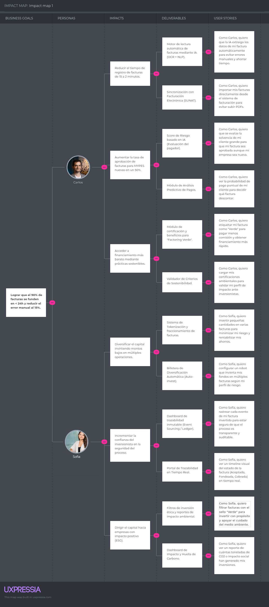

  

<h2 style="text-align: center;"> Universidad Peruana de Ciencias Aplicadas </h2>

<h4 style="text-align: center"> Ingeniería de Software </h4>

<h4 style="text-align: center"> Periodo: 202620 </h4>

<h4 style="text-align: center"> 1ASI0732 | Diseño de Experimentos de Ingeniería de Software </h4>

<h4 style="text-align: center"> NRC: &lt;NRC&gt; </h4>

<h4 style="text-align: center"> Docente: &lt;Apellidos, Nombres del docente&gt; </h4>

 

<h3 style="text-align: center;"> Informe de Trabajo Final </h3>

<h4 style="text-align: center"> Startup: YieldLabs </h4>

<h4 style="text-align: center"> Producto: Vankoo </h4>

<h4 style="text-align: center">Integrantes:</h4>

  
&lt;Código&gt; — Acuache Lucas, Mathias Joaquin

  
&lt;Código&gt; — Amaro Villar, Anjali

  
&lt;Código&gt; — García Bernal, Daniela

  
&lt;Código&gt; — Pillaca Vidal, Luis Angel

 

<h5 style="text-align: center; font-style: italic;"> Setiembre 2026 </h5>

# Registro de Versiones del Informe

| Versión | Fecha    | Autor                | Descripción de modificación                                   |
|---------|----------|----------------------|---------------------------------------------------------------|
| 1.0     | 02/09/26 | Amaro Villar, Anjali | Organización inicial del informe y estructura del repositorio |
|         |          |                      |                                                               |

# Project Report Collaboration Insights

Enlace del repositorio del Project Report: [*Ver en GitHub*](https://github.com/yieldlabshq/report)

**GitHub Collaboration Insights**

_Pendiente de elaboración._

Los integrantes del equipo son:

| Integrante                     | Usuario GitHub |
|--------------------------------|----------------|
| Acuache Lucas, Mathias Joaquin | MathiasA25     |
| Amaro Villar, Anjali           | njlmrvllr      |
| García Bernal, Daniela         | danygbernal |
| Pillaca Vidal, Luis Angel      | luispillacavidal |

Las principales ramas del repositorio, gestionadas bajo **GitFlow Workflow**, **Conventional Commits** y **Semantic Versioning 2.0.0**, son:

* `main`: rama principal que contiene la versión estable del informe.
* `develop`: rama de integración de las secciones antes de fusionarse a `main`.
* `feature/X-mathias`: rama utilizada por Mathias para las tareas correspondientes a una determinada entrega (av1, tb1, av2, tb2).
* `feature/X-anjali`: rama utilizada por Anjali para las tareas correspondientes a una determinada entrega (av1, tb1, av2, tb2).
* `feature/X-daniela`: rama utilizada por Daniela para las tareas correspondientes a una determinada entrega (av1, tb1, av2, tb2).
* `feature/X-luis`: rama utilizada por Luis para las tareas correspondientes a una determinada entrega (av1, tb1, av2, tb2).
* `release/vX.X.X`: rama de preparación de versiones candidatas del informe.
* `hotfix/<descripcion>`: rama para correcciones urgentes sobre `main`.

**AV1**

<!-- Assets: ./assets/github-insights/ — capturas de Insights > Contributors e Insights > Network. -->

_Pendiente: capturas de los analíticos de colaboración y commits en GitHub._

# Contenido

- [Registro de Versiones del Informe](#registro-de-versiones-del-informe)
- [Project Report Collaboration Insights](#project-report-collaboration-insights)
- [Contenido](#contenido)
- [Student Outcome](#student-outcome)
- [Capítulo I: Introducción](#capítulo-i-introducción)
  - [1.1. Startup Profile](#11-startup-profile)
    - [1.1.1. Descripción de la Startup](#111-descripción-de-la-startup)
    - [1.1.2. Perfiles de integrantes del equipo](#112-perfiles-de-integrantes-del-equipo)
  - [1.2. Solution Profile](#12-solution-profile)
    - [1.2.1. Antecedentes y problemática](#121-antecedentes-y-problemática)
    - [1.2.2. Lean UX Process](#122-lean-ux-process)
      - [1.2.2.1. Lean UX Problem Statements](#1221-lean-ux-problem-statements)
      - [1.2.2.2. Lean UX Assumptions](#1222-lean-ux-assumptions)
      - [1.2.2.3. Lean UX Hypothesis Statements](#1223-lean-ux-hypothesis-statements)
      - [1.2.2.4. Lean UX Canvas](#1224-lean-ux-canvas)
  - [1.3. Segmentos objetivo](#13-segmentos-objetivo)
- [Capítulo II: Requirements Elicitation \& Analysis](#capítulo-ii-requirements-elicitation--analysis)
  - [2.1. Competidores](#21-competidores)
    - [2.1.1. Análisis competitivo](#211-análisis-competitivo)
    - [2.1.2. Estrategias y tácticas frente a competidores](#212-estrategias-y-tácticas-frente-a-competidores)
  - [2.2. Entrevistas](#22-entrevistas)
    - [2.2.1. Diseño de entrevistas](#221-diseño-de-entrevistas)
    - [2.2.2. Registro de entrevistas](#222-registro-de-entrevistas)
    - [2.2.3. Análisis de entrevistas](#223-análisis-de-entrevistas)
  - [2.3. Needfinding](#23-needfinding)
    - [2.3.1. User Personas](#231-user-personas)
    - [2.3.2. User Task Matrix](#232-user-task-matrix)
    - [2.3.3. User Journey Mapping](#233-user-journey-mapping)
    - [2.3.4. Empathy Mapping](#234-empathy-mapping)
    - [2.3.5. As-is Scenario Mapping](#235-as-is-scenario-mapping)
  - [2.4. Ubiquitous Language](#24-ubiquitous-language)
- [Capítulo III: Requirements Specification](#capítulo-iii-requirements-specification)
  - [3.1. To-Be Scenario Mapping](#31-to-be-scenario-mapping)
  - [3.2. User Stories](#32-user-stories)
  - [3.3. Product Backlog](#33-product-backlog)
  - [3.4. Impact Mapping](#34-impact-mapping)
- [Capítulo IV: Product Design](#capítulo-iv-product-design)
  - [4.1. Style Guidelines](#41-style-guidelines)
    - [4.1.1. General Style Guidelines](#411-general-style-guidelines)
    - [4.1.2. Web Style Guidelines](#412-web-style-guidelines)
    - [4.1.3. Mobile Style Guidelines](#413-mobile-style-guidelines)
      - [4.1.3.1. iOS Mobile Style Guidelines](#4131-ios-mobile-style-guidelines)
      - [4.1.3.2. Android Mobile Style Guidelines](#4132-android-mobile-style-guidelines)
  - [4.2. Information Architecture](#42-information-architecture)
    - [4.2.1. Organization Systems](#421-organization-systems)
    - [4.2.2. Labeling Systems](#422-labeling-systems)
    - [4.2.3. SEO Tags and Meta Tags](#423-seo-tags-and-meta-tags)
    - [4.2.4. Searching Systems](#424-searching-systems)
    - [4.2.5. Navigation Systems](#425-navigation-systems)
  - [4.3. Landing Page UI Design](#43-landing-page-ui-design)
    - [4.3.1. Landing Page Wireframe](#431-landing-page-wireframe)
    - [4.3.2. Landing Page Mock-up](#432-landing-page-mock-up)
  - [4.4. Mobile Applications UX/UI Design](#44-mobile-applications-uxui-design)
    - [4.4.1. Mobile Applications Wireframes](#441-mobile-applications-wireframes)
    - [4.4.2. Mobile Applications Wireflow Diagrams](#442-mobile-applications-wireflow-diagrams)
    - [4.4.3. Mobile Applications Mock-ups](#443-mobile-applications-mock-ups)
    - [4.4.4. Mobile Applications User Flow Diagrams](#444-mobile-applications-user-flow-diagrams)
  - [4.5. Mobile Applications Prototyping](#45-mobile-applications-prototyping)
    - [4.5.1. Android Mobile Applications Prototyping](#451-android-mobile-applications-prototyping)
    - [4.5.2. iOS Mobile Applications Prototyping](#452-ios-mobile-applications-prototyping)
  - [4.6. Web Applications UX/UI Design](#46-web-applications-uxui-design)
    - [4.6.1. Web Applications Wireframes](#461-web-applications-wireframes)
    - [4.6.2. Web Applications Wireflow Diagrams](#462-web-applications-wireflow-diagrams)
    - [4.6.3. Web Applications Mock-ups](#463-web-applications-mock-ups)
    - [4.6.4. Web Applications User Flow Diagrams](#464-web-applications-user-flow-diagrams)
  - [4.7. Web Applications Prototyping](#47-web-applications-prototyping)
  - [4.8. Domain-Driven Software Architecture](#48-domain-driven-software-architecture)
    - [4.8.1. Software Architecture Context Diagram](#481-software-architecture-context-diagram)
    - [4.8.2. Software Architecture Container Diagrams](#482-software-architecture-container-diagrams)
    - [4.8.3. Software Architecture Components Diagrams](#483-software-architecture-components-diagrams)
  - [4.9. Software Object-Oriented Design](#49-software-object-oriented-design)
    - [4.9.1. Class Diagrams](#491-class-diagrams)
    - [4.9.2. Class Dictionary](#492-class-dictionary)
  - [4.10. Database Design](#410-database-design)
    - [4.10.1. Relational/Non-Relational Database Diagram](#4101-relationalnon-relational-database-diagram)
- [Capítulo V: Product Implementation](#capítulo-v-product-implementation)
  - [5.1. Software Configuration Management](#51-software-configuration-management)
    - [5.1.1. Software Development Environment Configuration](#511-software-development-environment-configuration)
    - [5.1.2. Source Code Management](#512-source-code-management)
    - [5.1.3. Source Code Style Guide \& Conventions](#513-source-code-style-guide--conventions)
    - [5.1.4. Software Deployment Configuration](#514-software-deployment-configuration)
  - [5.2. Product Implementation \& Deployment](#52-product-implementation--deployment)
    - [5.2.1. Sprint Backlogs](#521-sprint-backlogs)
    - [5.2.2. Implemented Landing Page Evidence](#522-implemented-landing-page-evidence)
    - [5.2.3. Implemented Frontend-Web Application Evidence](#523-implemented-frontend-web-application-evidence)
    - [5.2.4. Implemented Native-Mobile Application Evidence](#524-implemented-native-mobile-application-evidence)
    - [5.2.5. Implemented RESTful API and/or Serverless Backend Evidence](#525-implemented-restful-api-andor-serverless-backend-evidence)
    - [5.2.6. RESTful API documentation](#526-restful-api-documentation)
    - [5.2.7. Team Collaboration Insights](#527-team-collaboration-insights)
  - [5.3. Video About-the-Product](#53-video-about-the-product)
- [Conclusiones](#conclusiones)
- [Bibliografía](#bibliografía)
- [Anexos](#anexos)

# Student Outcome

Cada participante del equipo debe sustentar evidencia de cómo las actividades realizadas en el trabajo final han ayudado a desarrollar las dimensiones del student outcome. Por ello en esta sección debe haber una subsección por cada alumno donde éste describa por escrito la relación entre el outcome, sus dimensiones y el trabajo que ha realizado. 

El curso contribuye al cumplimiento del Student Outcome ABET:

**ABET – EAC - Student Outcome 4**

**Criterio:** La capacidad de reconocer responsabilidades éticas y profesionales en situaciones de ingeniería y hacer juicios informados, que deben considerar el impacto de las soluciones de ingeniería en contextos globales, económicos, ambientales y sociales.

En el siguiente cuadro se describe las acciones realizadas y enunciados de conclusiones por parte del grupo, que permiten sustentar el haber alcanzado el logro del ABET – EAC - Student Outcome 4.

| Criterio específico | Acciones realizadas | Conclusiones |
|:--------------------|:--------------------|:-------------|
| **4.c.1** Reconoce responsabilidad ética y profesional en situaciones de ingeniería de software | **Acuache Lucas, Mathias Joaquin** **AV1** _Pendiente._  **Amaro Villar, Anjali** **AV1** _Pendiente._  **García Bernal, Daniela** **AV1** _Pendiente._  **Pillaca Vidal, Luis Angel** **AV1** _Pendiente._ | **AV1** _Pendiente._ |
| **4.c.2** Emite juicios informados considerando el impacto de las soluciones de ingeniería de software en contextos globales, económicos, ambientales y sociales | **Acuache Lucas, Mathias Joaquin** **AV1** _Pendiente._  **Amaro Villar, Anjali** **AV1** _Pendiente._  **García Bernal, Daniela** **AV1** _Pendiente._  **Pillaca Vidal, Luis Angel** **AV1** _Pendiente._ | **AV1** _Pendiente._ |

# Capítulo I: Introducción

## 1.1. Startup Profile

### 1.1.1. Descripción de la Startup

Yieldlabs es una startup Fintech de base tecnológica creada por estudiantes de la carrera de Ingeniería de Software de la UPC. Nuestro objetivo es democratizar el acceso a la liquidez inmediata para las PYMES peruanas a través de una plataforma de crowdfactoring inteligente. Mediante el uso de tecnologías emergentes como Arquitecturas Orientadas a Eventos (EDA) y Tokenización de activos, conectamos a empresas que necesitan capital de trabajo con inversionistas individuales, eliminando barreras tradicionales, reduciendo el riesgo mediante Inteligencia Artificial y promoviendo prácticas empresariales sostenibles a través de nuestro modelo de "Factoring Verde".

**Misión**: Facilitar el crecimiento de las pequeñas y medianas empresas en el Perú proporcionando una plataforma financiera tecnológica, transparente y eficiente que transforme sus cuentas por cobrar en liquidez inmediata, impulsada por el análisis de datos y la colaboración ciudadana.

**Visión**: Ser la plataforma de financiamiento participativo líder en la región, reconocida por revolucionar la arquitectura de servicios financieros mediante el uso ético de la IA y la descentralización de inversiones, construyendo un ecosistema donde el capital fluya de manera justa hacia negocios con impacto positivo.

### 1.1.2. Perfiles de integrantes del equipo

<!-- Por integrante: foto, nombres y apellidos, código de estudiante, carrera y párrafo de resumen con los principales conocimientos técnicos y habilidades que aporta al equipo. -->
<!-- Assets: ./assets/profiles/ -->

|  | **Acuache Lucas, Mathias Joaquin** Código: &lt;Código&gt; Carrera: Ingeniería de Software  _Pendiente de elaboración._ |
|---|---|

|  | **Amaro Villar, Anjali** Código: &lt;Código&gt; Carrera: Ingeniería de Software   Soy estudiante de séptimo ciclo de Ingeniería de Software con sólidas competencias en el diseño e implementación de arquitecturas backend utilizando Java y el ecosistema Spring Boot. Destaco por mi comunicación asertiva, adaptabilidad y trabajo colaborativo, buscando siempre aportar valor técnico continuo y garantizar entregables de calidad dentro del equipo.  |
|--------------------------------------------------------------------|------------------------------------------------------------------------------------------------|

|  | **García Bernal, Daniela** Código: &lt;Código&gt; Carrera: Ingeniería de Software  _Pendiente de elaboración._ |
|---|---|

|  | **Pillaca Vidal, Luis Angel** Código: &lt;Código&gt; Carrera: Ingeniería de Software  _Pendiente de elaboración._ |
|---|---|

## 1.2. Solution Profile

### 1.2.1. Antecedentes y problemática

| Pregunta                 | Respuesta                                                                                                                                                                                                                                                                                                                                                                                                                             |
|--------------------------|---------------------------------------------------------------------------------------------------------------------------------------------------------------------------------------------------------------------------------------------------------------------------------------------------------------------------------------------------------------------------------------------------------------------------------------|
| **What?** (¿Qué?)        | Se presenta una severa restricción de liquidez en las MYPES peruanas. Al cierre de 2024, el ratio de inclusión financiera (acceso al crédito formal) para este segmento fue de apenas 27.8%, frente al 66.1% de la gran empresa (PRODUCE, 2025). Esto genera una brecha de capital de trabajo que el sistema bancario tradicional no logra cubrir debido a requisitos de garantía rígidos.                                            |
| **When?** (¿Cuándo?)     | El problema ocurre en la brecha temporal entre la entrega del bien o servicio y el cobro efectivo. Aunque la Ley N° 31362 establece un plazo de pago de 30 días, la norma permite "pactos en contrario", lo que en la práctica extiende los ciclos de efectivo a 60, 90 o 120 días (LP, 2021). Durante este tiempo, la empresa debe autofinanciar sus operaciones.                                                                    |
| **Where?** (¿Dónde?)     | Se identifica principalmente en las MYPES de los sectores Comercio y Servicios, que representan más del 85% de este tejido empresarial (PRODUCE, 2025). El cuello de botella se encuentra en el proceso de "conformidad" y registro de la factura negociable ante CAVALI, donde las facturas de tickets bajos (menores a S/ 10,000) representan el 67% del volumen pero enfrentan mayores dificultades de negociación (CAVALI, 2024). |
| **Who?** (¿Quién?)       | Afecta a los 2.3 millones de MYPES formales en el Perú (ComexPerú, 2025). La problemática no es de gestión interna, sino de asimetría de poder: el 99.7% de las empresas en Perú son MYPES, pero estas tienen una bajísima capacidad de negociación frente a grandes adquirentes corporativos que imponen los plazos de pago para optimizar su propio flujo de caja.                                                                  |
| **Why?** (¿Por qué?)     | Se debe a la alta percepción de riesgo y los costos operativos de la banca tradicional. El 95% de los deudores MYPE son personas naturales con negocio, lo que dificulta su evaluación bajo modelos de scoring tradicionales (ComexPerú, 2025). Además, existe una ausencia de plataformas descentralizadas (Crowdfactoring) que automaticen la evaluación de riesgo mediante IA y reduzcan costos de intermediación.                 |
| **How?** (¿Cómo?)        | El estado óptimo es un ciclo de caja donde el pago se reciba en máximo 30 días según ley. Sin embargo, la realidad muestra un patrón sistémico de postergación: las ventas de las MYPES continúan perdiendo participación en el PBI total debido a que no pueden reinvertir su capital rápidamente al tenerlo "atrapado" en facturas por cobrar (Innova Funding, 2022).                                                               |
| **How much?** (¿Cuánto?) | El saldo de crédito otorgado a empresas en Perú es de aprox. S/ 213,121 millones (2024), pero la mayoría se concentra en grandes empresas. Se estima que el mercado de factoring aún tiene un potencial de crecimiento de hasta S/ 120,000 millones hacia el 2028 (Contadores y Empresas, 2025).                                                                                                                                      |

### 1.2.2. Lean UX Process

#### 1.2.2.1. Lean UX Problem Statements

La solución que ofrecemos tiene como objetivo proporcionar a las micro y pequeñas empresas (MYPES) del Perú una plataforma de crowdfactoring inteligente que permita convertir sus facturas por cobrar en liquidez inmediata, mediante un mercado descentralizado donde inversionistas individuales financian estas operaciones de manera ágil y segura.

Nos hemos percatado de la severa restricción de caja que enfrentan las MYPES debido a plazos de cobranza que se extienden entre 60 y 120 días, sumado a un acceso limitado al crédito formal donde solo el 27.8% de estas empresas logra obtener financiamiento bancario. Esta deficiencia financiera no se debe a una mala gestión del negocio, sino a la asimetría de poder frente a los grandes adquirentes y a la falta de herramientas tecnológicas que evalúen el riesgo de manera justa. Como consecuencia, muchas empresas se ven obligadas a detener sus operaciones, incumplir pagos a proveedores o incluso cerrar por falta de flujo de caja, perdiendo competitividad en el mercado nacional.

Hemos identificado que la dependencia de procesos manuales y modelos de riesgo tradicionales excluye a miles de facturas de bajo monto del sistema financiero. La ausencia de un sistema transparente y automatizado que utilice Inteligencia Artificial para el scoring de riesgo y arquitecturas distribuidas para garantizar la seguridad de la inversión, impide que el capital fluya de manera eficiente hacia los emprendedores que más lo necesitan, afectando la sostenibilidad y el crecimiento del tejido empresarial peruano.

¿Cómo podríamos democratizar el acceso a la liquidez inmediata para las MYPES de forma transparente y automatizada, permitiendo a los empresarios obtener efectivo sin deuda y a los inversionistas participar en un mercado de bajo riesgo, reduciendo los tiempos de espera y eliminando las barreras de entrada del sistema financiero tradicional?

#### 1.2.2.2. Lean UX Assumptions

**Business Assumptions**

1. **Creemos que nuestros clientes necesitan** una plataforma digital centralizada que les permita obtener liquidez inmediata sin generar deuda bancaria tradicional.
2. **Estas necesidades se pueden resolver con** un marketplace de crowdfactoring que facilite el descuento de facturas negociables, conectando directamente a empresas con inversionistas.
3. **Nuestros clientes iniciales serán** propietarios de pequeñas y medianas empresas de los sectores comercio y servicios que actualmente enfrentan plazos de pago de 60 a 120 días.
4. **El valor más importante que el cliente quiere de nuestro servicio es** la rapidez en el desembolso (menos de 48 horas) y una evaluación de riesgo justa basada en el pagador.
5. **El cliente también puede obtener beneficios adicionales como** un dashboard de salud financiera, reducción de comisiones por prácticas sostenibles (Factoring Verde) y gestión automatizada de sus facturas ante CAVALI.
6. **Vamos a adquirir la mayoría de nuestros clientes mediante** marketing digital dirigido (LinkedIn y Google Ads), alianzas con gremios empresariales y cámaras de comercio locales.
7. **Generaremos dinero a través de** una comisión por operación (ej. 1% del monto de la factura) y un margen sobre el diferencial de la tasa de descuento ofrecida a los inversionistas.
8. **Nuestra competencia principal en el mercado son** las empresas de factoring tradicionales, bancos locales y otras Fintech de financiamiento participativo ya establecidas.
9. **Lo venceremos debido a** nuestra arquitectura basada en IA para un scoring de riesgo más preciso, la capacidad de tokenizar facturas para permitir inversiones de bajo monto y un enfoque en sostenibilidad.
10. **El mayor riesgo del servicio es que** los inversionistas perciban un alto riesgo de impago por parte de los adquirentes o que las MYPES desconfíen de las plataformas no bancarias.
11. **Resolveremos esto a través de un sistema de** transparencia total basado en eventos inmutables (Event Sourcing), validación biométrica para firmas digitales y un motor de IA que filtre facturas de alta probabilidad de cobro.

**User Assumptions**

1. **¿Quién es el usuario?** Principalmente dos perfiles: el empresario MYPE que busca liquidez urgente y el inversionista particular que busca rentabilizar su capital apoyando el crecimiento de negocios locales.
2. **¿Qué problema tiene nuestro producto que debe resolver?** Debe resolver la falta de efectivo para cubrir gastos operativos inmediatos (planillas, impuestos) y la dificultad de encontrar opciones de inversión accesibles y seguras con retornos atractivos.
3. **¿Qué características son importantes?** Destacan el motor de carga y lectura automática de facturas (IA/OCR), el marketplace con niveles de riesgo claros, la firma digital con biometría y el seguimiento en tiempo real del estado de cobranza.
4. **¿Dónde encaja nuestro producto en su trabajo o vida**? En la gestión financiera diaria del empresario para mantener operativo su negocio, y en la estrategia de ahorro e inversión del usuario particular para generar ingresos pasivos.
5. **¿Cuándo y cómo es nuestro producto usado?** Será usado semanalmente para subir nuevas facturas tras una venta, o diariamente por inversionistas para revisar nuevas oportunidades en el marketplace. Se accederá vía web para gestión administrativa y vía móvil para inversiones rápidas.
6. **¿Cómo debe verse nuestro producto y cómo debe comportarse?** Debe proyectar seguridad, transparencia y profesionalismo. La interfaz debe ser limpia, con gráficos claros de rentabilidad y flujos de caja, con una navegación intuitiva que no requiera conocimientos financieros avanzados.

#### 1.2.2.3. Lean UX Hypothesis Statements

**Hypothesis 01:** Creemos que implementar un motor de lectura automática de facturas mediante IA (OCR + NLP) reducirá el tiempo de registro y errores manuales para los empresarios MYPE. Sabremos que hemos tenido éxito cuando el tiempo promedio de carga y validación de una factura disminuya de 15 minutos (proceso manual típico) a menos de 2 minutos, y al menos el 85% de los datos extraídos no requieran corrección manual por parte del usuario.

**Hypothesis 02:** Creemos que el uso de un Score de Riesgo basado en IA, que evalúe la solvencia del adquirente (pagador) y no solo del emisor, aumentará la tasa de aprobación de facturas de pequeñas empresas. Sabremos que hemos tenido éxito cuando el volumen de facturas de MYPES nuevas (con menos de 1 año de creación) aprobadas para subasta crezca en un 50% en comparación con los criterios de evaluación de la banca tradicional durante el primer semestre.

**Hypothesis 03:** Creemos que la tokenización de facturas (fraccionamiento de deuda) permitirá que inversionistas minoristas financien operaciones con montos de entrada bajos, aumentando la velocidad de fondeo. Sabremos que hemos tenido éxito cuando el 90% de las facturas publicadas en el marketplace logren ser financiadas al 100% en un tiempo menor a 24 horas gracias a la participación de múltiples micro-inversionistas.

**Hypothesis 04:** Creemos que la transparencia brindada por una arquitectura de Event Sourcing (Ledger inmutable), que permite rastrear cada evento de la factura, aumentará la confianza de los inversionistas. Sabremos que hemos tenido éxito, cuando el 70% de los inversionistas activos califiquen la "seguridad y trazabilidad" de la plataforma como el factor principal de su permanencia en la encuesta de satisfacción trimestral.

**Hypothesis 05:** Creemos que ofrecer beneficios e incentivos (comisiones reducidas) a través del modelo de Factoring Verde para empresas con impacto positivo atraerá a un segmento de inversionistas éticos. Sabremos que hemos tenido éxito, cuando las facturas etiquetadas como "Verdes" reciban ofertas de financiamiento un 20% más rápido que las facturas convencionales y representen al menos el 15% del volumen total transaccionado en el primer año.

#### 1.2.2.4. Lean UX Canvas

El Lean UX Canvas nos permite organizar de forma clara y colaborativa los elementos clave del diseño: problema, usuarios, suposiciones, hipótesis y métricas. En este proyecto, nos ayuda a enfocar el desarrollo en generar valor real para las PYMES peruanas que requieren liquidez inmediata y los inversionistas que buscan rentabilidad con seguridad tecnológica.

A continuación, se presenta el Lean UX Canvas elaborado en la herramienta Miro:

**Enlace al Lean UX Canvas:** [https://goo.su/XhiN](https://miro.com/app/board/uXjVGGrzXsM=/?share_link_id=452277568220)

## 1.3. Segmentos objetivo

**Empresarios de Micro y Pequeñas Empresas (MYPES)**  
Este segmento representa el núcleo de la demanda de liquidez en el Perú. Según el informe de ComexPerú (2025), las MYPES formales generan el 99% del empleo empresarial en el país, pero enfrentan una brecha de crédito de aproximadamente S/ 56,000 millones. Estas empresas han sido rechazadas por la banca tradicional debido a modelos de riesgo que no consideran la solvencia del cliente final (el pagador de la factura), lo que las obliga a paralizar operaciones o recurrir a prestamistas informales con tasas usureras
- **Edad**: Emprendedores y dueños de negocio entre los 25 y 55 años.
- **Necesidad clave**: Obtener capital de trabajo de forma inmediata (en menos de 48 horas) sin aumentar su nivel de deuda bancaria y con tasas competitivas basadas en la calidad de sus facturas.
- **Nivel educativo**: Formación técnica o universitaria, con experiencia en gestión comercial pero con limitado conocimiento en ingeniería financiera avanzada.
- **Uso de tecnología**: Utilizan facturación electrónica de SUNAT y aplicaciones bancarias básicas, pero requieren una plataforma intuitiva que automatice la gestión de sus cuentas por cobrar.

**Inversionistas Minoristas (Personas Naturales)**  
Este segmento representa la oferta de capital. El mercado de factoring en Perú alcanzó un monto negociado de S/ 43,000 millones en 2024, lo que representa un crecimiento del 14% respecto al año anterior (Contadores y Empresas, 2025). Esta expansión del mercado permite que personas naturales participen financiando facturas. Según CAVALI (2024), el ticket promedio de las facturas negociadas es de aproximadamente S/ 24,405, un monto que, mediante un modelo de crowdfactoring, puede ser fraccionado para que inversionistas con menor capital participen en la compra de deuda con retornos atractivos.
- **Edad**: Profesionales de entre 22 y 45 años.
- **Necesidad clave**: Acceder a opciones de inversión con tasas de rendimiento competitivas frente a la banca tradicional y con periodos de retorno de capital a corto plazo (entre 30 y 90 días).
- **Nivel educativo**: Educación superior completa, con interés en optimizar la gestión de sus ahorros personales a través de medios digitales.
- **Uso de tecnología**: Usuarios habituales de servicios financieros digitales y aplicaciones móviles; valoran la trazabilidad de su dinero y la facilidad de monitoreo de sus ganancias en tiempo real.

# Capítulo II: Requirements Elicitation & Analysis

## 2.1. Competidores

<!-- Identificar y describir mínimo 3 competidores directos. -->
<!-- Assets: ./assets/cap2-requirements-elicitation/competidores/ -->

_Pendiente de elaboración._

### 2.1.1. Análisis competitivo

<!-- Competitive Analysis Landscape según el formato del enunciado. -->

_Pendiente de elaboración._

| **Competitive Analysis Landscape** | | | | | |
|---|---|---|---|---|---|
| **¿Por qué llevar a cabo este análisis?** | | | | | |
| | | **YieldLabs (Vankoo)** | **Competidor 1** | **Competidor 2** | **Competidor 3** |
| **Perfil** | Overview | | | | |
| | Ventaja competitiva ¿Qué valor ofrece a los clientes? | | | | |
| **Perfil de Marketing** | Mercado objetivo | | | | |
| | Estrategias de marketing | | | | |
| **Perfil de Producto** | Productos & Servicios | | | | |
| | Precios & Costos | | | | |
| | Canales de distribución (Web y/o Móvil) | | | | |
| **Análisis SWOT** | Fortalezas | | | | |
| | Debilidades | | | | |
| | Oportunidades | | | | |
| | Amenazas | | | | |

### 2.1.2. Estrategias y tácticas frente a competidores

_Pendiente de elaboración._

## 2.2. Entrevistas

_Pendiente de elaboración: párrafo introductorio de la sección._

### 2.2.1. Diseño de entrevistas

<!-- Preguntas principales y complementarias por cada segmento objetivo. -->

_Pendiente de elaboración._

### 2.2.2. Registro de entrevistas

<!-- De 3 a 5 entrevistas por segmento. Por cada una: nombres, apellidos, edad, distrito, screenshot del video, URL del video en Microsoft Stream / Clipchamp, timing de inicio, duración y resumen. -->
<!-- Assets: ./assets/cap2-requirements-elicitation/entrevistas/ -->

#### Segmento A: &lt;nombre del segmento&gt;

#### Entrevista 1:

| Atributo | Detalle |
| :---: | :--- |
| Nombre | Jorge Retuerto |
| Edad | 20 años |
| Distrito | La Victoria |
| Ocupación | Estudiante |
| Fecha de entrevista | 15 de abril del 2026 |
| Timing | 5:13 |
| Enlace a la grabación | [*Ver en Microsoft Stream*](https://upcedupe-my.sharepoint.com/:f:/g/personal/u20221g044_upc_edu_pe/IgA0-fbBN0_9RYPf_IwX4Ow1ActGMcNR2dDxP1jXcOMP96c?e=fB4axV) |
| Captura de pantalla de la grabación |  |
| Resumen | Jorge comenta que vive como estudiante foráneo en Lima junto a su hermano y cuenta con un presupuesto mensual limitado para los gastos del hogar, lo que lo obliga a ser muy metódico y buscar siempre el establecimiento que le permita ahorrar. Su mayor molestia es la pérdida de tiempo que implica preguntar precios en múltiples puestos de manera presencial. Al comprar, prioriza la calidad sobre el precio y no tiene lealtad a marcas específicas, optando usualmente por productos genéricos, a menos que una marca ofrezca un valor único. Actualmente, no utiliza ninguna herramienta digital más allá de una aplicación de notas básica y señala que le gustaría recibir ofertas directamente a través de sus redes sociales. Para Jorge, sería indispensable que una aplicación incluya métricas sobre la calidad de los productos, ya sea mediante reseñas de otros usuarios o indicadores de confianza del establecimiento, para reducir la incertidumbre al momento de elegir dónde comprar. |

#### Entrevista 2:

| Atributo | Detalle |
| :---: | :--- |
| Nombre |  |
| Edad |  |
| Distrito |  |
| Ocupación |  |
| Fecha de entrevista |  |
| Timing |  |
| Enlace a la grabación | [*Ver en Microsoft Stream*]() |
| Captura de pantalla de la grabación |  |
| Resumen |  |

#### Entrevista 3:

| Atributo | Detalle |
| :---: | :--- |
| Nombre |  |
| Edad |  |
| Distrito |  |
| Ocupación |  |
| Fecha de entrevista |  |
| Timing |  |
| Enlace a la grabación | [*Ver en Microsoft Stream*]() |
| Captura de pantalla de la grabación |  |
| Resumen |  |

#### Segmento B: &lt;nombre del segmento&gt;

#### Entrevista 4:

| Atributo | Detalle |
| :---: | :--- |
| Nombre |  |
| Edad |  |
| Distrito |  |
| Ocupación |  |
| Fecha de entrevista |  |
| Timing |  |
| Enlace a la grabación | [*Ver en Microsoft Stream*]() |
| Captura de pantalla de la grabación |  |
| Resumen |  |

#### Entrevista 5:

| Atributo | Detalle |
| :---: | :--- |
| Nombre |  |
| Edad |  |
| Distrito |  |
| Ocupación |  |
| Fecha de entrevista |  |
| Timing |  |
| Enlace a la grabación | [*Ver en Microsoft Stream*]() |
| Captura de pantalla de la grabación |  |
| Resumen |  |

#### Entrevista 6:

| Atributo | Detalle |
| :---: | :--- |
| Nombre |  |
| Edad |  |
| Distrito |  |
| Ocupación |  |
| Fecha de entrevista |  |
| Timing |  |
| Enlace a la grabación | [*Ver en Microsoft Stream*]() |
| Captura de pantalla de la grabación |  |
| Resumen |  |

### 2.2.3. Análisis de entrevistas

<!-- Análisis por segmento con sustento estadístico (porcentajes) de características objetivas y subjetivas. -->

_Pendiente de elaboración._

## 2.3. Needfinding

_Pendiente de elaboración: párrafo introductorio de la sección._

### 2.3.1. User Personas

<!-- Una ficha de User Persona por cada segmento objetivo. Herramienta: UXPressia. -->
<!-- Assets: ./assets/cap2-requirements-elicitation/user-personas/ -->

_Pendiente de elaboración._

### 2.3.2. User Task Matrix

<!-- Columna por User Persona con sub-columnas Frecuencia e Importancia; filas: tareas identificadas. -->
<!-- Assets: ./assets/cap2-requirements-elicitation/user-task-matrix/ -->

_Pendiente de elaboración._

### 2.3.3. User Journey Mapping

<!-- Un User Journey Map As-Is por cada User Persona. Herramienta: UXPressia. -->
<!-- Assets: ./assets/cap2-requirements-elicitation/user-journey-mapping/ -->

_Pendiente de elaboración._

### 2.3.4. Empathy Mapping

<!-- Un Empathy Map por cada User Persona. Herramienta: UXPressia. -->
<!-- Assets: ./assets/cap2-requirements-elicitation/empathy-mapping/ -->

_Pendiente de elaboración._

### 2.3.5. As-is Scenario Mapping

<!-- Filas: Phases, Doing, Thinking y Feeling. Herramienta: LucidChart / Miro. -->
<!-- Assets: ./assets/cap2-requirements-elicitation/as-is-scenario-mapping/ -->

_Pendiente de elaboración._

## 2.4. Ubiquitous Language

<!-- Glosario de términos del dominio (en inglés, con equivalente en español entre paréntesis). No incluir términos técnicos de ingeniería de software. -->

_Pendiente de elaboración._

| Término (EN) | Término (ES) | Definición |
|--------------|--------------|------------|
|  |  |  |

# Capítulo III: Requirements Specification

_Pendiente de elaboración: párrafo introductorio del capítulo._

## 3.1. To-Be Scenario Mapping

<!-- Un To-Be Scenario Map por cada User Persona, comparado contra el As-Is. -->
<!-- Assets: ./assets/cap3-requirements-specification/to-be-scenario-mapping/ -->

_Pendiente de elaboración._

## 3.2. User Stories

<!-- Un cuadro para todo el conjunto de Epics / User Stories. Incluir Technical Stories (rol Developer) y Spike Stories. Acceptance Criteria en formato Gherkin (Given-When-Then). -->

_Pendiente de elaboración._

| Story ID | User | Priority | Epic |
|----------|------|----------|------|
| EP01 | | | |
| **Title** | | | |
| | | | |
| **Description** | | | |
| | | | |
| **Acceptance Criteria** | | | |
| | | | |

## 3.3. Product Backlog

<!-- Orden determinado por el valor para el negocio. Incluir captura y URL pública del backlog en la herramienta indicada. -->
<!-- Assets: ./assets/cap3-requirements-specification/product-backlog/ -->

_Pendiente de elaboración._

| # Orden | User Story Id | Título | Descripción | Story Points (1 / 2 / 3 / 5 / 8) |
|---------|---------------|--------|-------------|----------------------------------|
| 1 | US01 | | Como… deseo… para… | |

## 3.4. Impact Mapping

El Impact Mapping, elaborado en UXPressia, parte del objetivo de negocio de lograr que el 90% de las facturas se fondeen en menos de 24 horas y reducir el error manual al 15%, desglosándolo en los impactos esperados sobre Carlos y Sofía, sus entregables y las historias de usuario asociadas.

# Capítulo IV: Product Design

_Pendiente de elaboración: párrafo introductorio del capítulo._

## 4.1. Style Guidelines

_Pendiente de elaboración: párrafo introductorio de la sección._

### 4.1.1. General Style Guidelines

<!-- Branding, Typography, Colors y Spacing; tono de comunicación y lenguaje aplicado. -->
<!-- Assets: ./assets/cap4-product-design/style-guidelines/ -->

_Pendiente de elaboración._

### 4.1.2. Web Style Guidelines

<!-- Estándares visuales y de interacción para responsive web interfaces. Material Design + PrimeVue. -->

_Pendiente de elaboración._

### 4.1.3. Mobile Style Guidelines

_Pendiente de elaboración._

#### 4.1.3.1. iOS Mobile Style Guidelines

_Pendiente de elaboración._

#### 4.1.3.2. Android Mobile Style Guidelines

_Pendiente de elaboración._

## 4.2. Information Architecture

_Pendiente de elaboración: párrafo introductorio de la sección._
<!-- Assets: ./assets/cap4-product-design/information-architecture/ -->

### 4.2.1. Organization Systems

_Pendiente de elaboración._

### 4.2.2. Labeling Systems

_Pendiente de elaboración._

### 4.2.3. SEO Tags and Meta Tags

<!-- Como mínimo: Title, Description, Keywords y Author, para Landing Page y Web Application. -->

_Pendiente de elaboración._

| Página | Title | Description | Keywords | Author |
|--------|-------|-------------|----------|--------|
|  |  |  |  |  |

### 4.2.4. Searching Systems

_Pendiente de elaboración._

### 4.2.5. Navigation Systems

_Pendiente de elaboración._

## 4.3. Landing Page UI Design

_Pendiente de elaboración: párrafo introductorio de la sección._

### 4.3.1. Landing Page Wireframe

<!-- Versiones Desktop Web Browser y Mobile Web Browser. Herramienta: Figma / Adobe XD. -->
<!-- Assets: ./assets/cap4-product-design/landing-page/wireframes/ -->

_Pendiente de elaboración._

### 4.3.2. Landing Page Mock-up

<!-- Versiones Desktop Web Browser y Mobile Web Browser. -->
<!-- Assets: ./assets/cap4-product-design/landing-page/mockups/ -->

_Pendiente de elaboración._

## 4.4. Mobile Applications UX/UI Design

_Pendiente de elaboración: párrafo introductorio de la sección._

### 4.4.1. Mobile Applications Wireframes

<!-- Assets: ./assets/cap4-product-design/mobile-app/wireframes/ -->

_Pendiente de elaboración._

### 4.4.2. Mobile Applications Wireflow Diagrams

<!-- Herramienta: LucidChart / Overflow. -->
<!-- Assets: ./assets/cap4-product-design/mobile-app/wireflow-diagrams/ -->

_Pendiente de elaboración._

### 4.4.3. Mobile Applications Mock-ups

<!-- Assets: ./assets/cap4-product-design/mobile-app/mockups/ -->

_Pendiente de elaboración._

### 4.4.4. Mobile Applications User Flow Diagrams

<!-- Assets: ./assets/cap4-product-design/mobile-app/user-flow-diagrams/ -->

_Pendiente de elaboración._

## 4.5. Mobile Applications Prototyping

<!-- Assets: ./assets/cap4-product-design/mobile-app/prototyping/ — incluir enlace público al prototipo en Figma. -->

_Pendiente de elaboración._

### 4.5.1. Android Mobile Applications Prototyping

_Pendiente de elaboración._

### 4.5.2. iOS Mobile Applications Prototyping

_Pendiente de elaboración._

## 4.6. Web Applications UX/UI Design

_Pendiente de elaboración: párrafo introductorio de la sección._

### 4.6.1. Web Applications Wireframes

<!-- Assets: ./assets/cap4-product-design/web-app/wireframes/ -->

_Pendiente de elaboración._

### 4.6.2. Web Applications Wireflow Diagrams

<!-- Assets: ./assets/cap4-product-design/web-app/wireflow-diagrams/ -->

_Pendiente de elaboración._

### 4.6.3. Web Applications Mock-ups

<!-- Assets: ./assets/cap4-product-design/web-app/mockups/ -->

_Pendiente de elaboración._

### 4.6.4. Web Applications User Flow Diagrams

<!-- Assets: ./assets/cap4-product-design/web-app/user-flow-diagrams/ -->

_Pendiente de elaboración._

## 4.7. Web Applications Prototyping

<!-- Assets: ./assets/cap4-product-design/web-app/prototyping/ — incluir enlace público al prototipo en Figma. -->

_Pendiente de elaboración._

## 4.8. Domain-Driven Software Architecture

_Pendiente de elaboración: párrafo introductorio de la sección._

### 4.8.1. Software Architecture Context Diagram

<!-- C4 Model - Nivel 1. Herramienta: Structurizr (o Structurizr DSL como Diagram-as-Code). -->
<!-- Assets: ./assets/cap4-product-design/software-architecture/context-diagram/ -->

_Pendiente de elaboración._

### 4.8.2. Software Architecture Container Diagrams

<!-- C4 Model - Nivel 2. -->
<!-- Assets: ./assets/cap4-product-design/software-architecture/container-diagrams/ -->

_Pendiente de elaboración._

### 4.8.3. Software Architecture Components Diagrams

<!-- C4 Model - Nivel 3. -->
<!-- Assets: ./assets/cap4-product-design/software-architecture/components-diagrams/ -->

_Pendiente de elaboración._

## 4.9. Software Object-Oriented Design

### 4.9.1. Class Diagrams

<!-- UML. Herramienta: LucidChart o PlantUML (Diagram-as-Code). -->
<!-- Assets: ./assets/cap4-product-design/class-diagrams/ -->

_Pendiente de elaboración._

### 4.9.2. Class Dictionary

_Pendiente de elaboración._

## 4.10. Database Design

### 4.10.1. Relational/Non-Relational Database Diagram

<!-- Herramienta: LucidChart / Vertabelo. -->
<!-- Assets: ./assets/cap4-product-design/database-design/ -->

_Pendiente de elaboración._

# Capítulo V: Product Implementation

## 5.1. Software Configuration Management

En esta sección el equipo establece las decisiones y convenciones que permiten mantener la consistencia del código y la documentación durante el ciclo de vida de Vankoo: los productos de software utilizados en cada actividad del proyecto, el esquema de control de versiones sobre GitHub y las convenciones de estilo de código adoptadas para cada lenguaje de la solución.

### 5.1.1. Software Development Environment Configuration

A continuación se detallan los productos de software utilizados por el equipo en cada actividad del ciclo de vida de Vankoo, indicando su propósito y el enlace de acceso (para herramientas SaaS) o de descarga (para software instalado localmente).

| Categoría | Producto | Propósito de uso | Ruta de referencia / descarga |
|---|---|---|---|
| Project Management | Trello | Gestión ágil del Product Backlog y seguimiento de tareas del equipo mediante tableros Kanban. | [https://trello.com](https://trello.com) |
| Requirements Management | UXPressia | Elaboración de los Empathy Maps y el Impact Mapping. | [https://uxpressia.com](https://uxpressia.com) |
| Requirements Management | Miro | Elaboración del Lean UX Canvas y los As-Is / To-Be Scenario Mapping. | [https://miro.com](https://miro.com) |
| Product UX/UI Design | Figma | Diseño de wireframes, mockups y prototipos interactivos de alta fidelidad de la landing page y las aplicaciones web. | [https://figma.com](https://figma.com) |
| Software Architecture Design | Structurizr | Elaboración de los diagramas C4 (contexto, contenedores y componentes) mediante un modelo DSL versionado. | [https://structurizr.com](https://structurizr.com) |
| Software Architecture Design | PlantUML | Elaboración de los diagramas de clases de dominio y de base de datos mediante Diagrams-as-Code. | [https://plantuml.com](https://plantuml.com) |
| Software Development | JetBrains IntelliJ IDEA | Desarrollo de los microservicios Java / Spring Boot: IAM, Finance, Investment, API Gateway y Discovery Server. | [https://www.jetbrains.com/idea](https://www.jetbrains.com/idea) |
| Software Development | JetBrains WebStorm | Desarrollo de la Landing Page, del Web SPA de la Mype (React) y del servicio Profile (NestJS / TypeScript). | [https://www.jetbrains.com/webstorm](https://www.jetbrains.com/webstorm) |
| Software Development | JetBrains Rider | Desarrollo del servicio Invoicing (.NET / C#). | [https://www.jetbrains.com/rider](https://www.jetbrains.com/rider) |
| Software Development | Android Studio | Desarrollo de la aplicación móvil del Inversionista (Kotlin Multiplatform + Jetpack Compose). | [https://developer.android.com/studio](https://developer.android.com/studio) |
| Software Development | Docker & Docker Compose | Contenerización y orquestación local de los microservicios, sus bases de datos, Kafka y MinIO para el entorno de desarrollo. | [https://www.docker.com](https://www.docker.com) |
| Software Testing | JUnit 5, Mockito, AssertJ | Pruebas unitarias de los microservicios Java / Spring Boot. | [https://junit.org/junit5](https://junit.org/junit5) |
| Software Testing | Testcontainers | Pruebas de integración contra Kafka y Axon Server reales, usadas en el servicio Finance. | [https://testcontainers.com](https://testcontainers.com) |
| Software Testing | Jest & Supertest | Pruebas unitarias y end-to-end del servicio Profile (NestJS). | [https://jestjs.io](https://jestjs.io) |
| Software Testing | xUnit.net | Pruebas unitarias del servicio Invoicing (.NET). | [https://xunit.net](https://xunit.net) |
| Software Deployment |  |  |  |
| Software Documentation | Markdown | Lenguaje de marcado ligero usado para todo el informe y la documentación técnica del proyecto. | [https://www.markdownguide.org](https://www.markdownguide.org) |
| Software Documentation | Scalar (sobre OpenAPI) | Documentación interactiva autogenerada de los endpoints REST de cada microservicio. | [https://scalar.com](https://scalar.com) |
| Software Documentation | Visual Studio Code | Edición y previsualización del informe en Markdown. | [https://code.visualstudio.com](https://code.visualstudio.com) |

### 5.1.2. Source Code Management

El equipo utiliza **GitHub** como plataforma de alojamiento y **Git** como sistema de control de versiones para todos los repositorios del proyecto, aplicando **GitFlow** (Vincent Driessen, *"A successful Git branching model"*) como workflow de ramificación, **Semantic Versioning 2.0.0** para nombrar los releases y **Conventional Commits** para los mensajes de commit.

| Producto | Repositorio                                                                                                                                                                                                                                                                                                                                                                                                                                                                                                                                                                                                                                                                                                                                                                                                                                                         |
|---|---------------------------------------------------------------------------------------------------------------------------------------------------------------------------------------------------------------------------------------------------------------------------------------------------------------------------------------------------------------------------------------------------------------------------------------------------------------------------------------------------------------------------------------------------------------------------------------------------------------------------------------------------------------------------------------------------------------------------------------------------------------------------------------------------------------------------------------------------------------------|
| Landing Page | [yieldlabs/vankoo-landing-page](https://github.com/yieldlabs/vankoo-landing-page)                                                                                                                                                                                                                                                                                                                                                                                                                                                                                                                                                                                                                                                                                                                                                                                 |
| Frontend Web Application | [yieldlabs/vankoo-mype-web](https://github.com/yieldlabs/vankoo-mype-web)                                                                                                                                                                                                                                                                                                                                                                                                                                                                                                                                                                                                                                                                                                                                                                                         |
| Frontend Mobile Application | [yieldlabs/vankoo-investor-mobile](https://github.com/liquilabshq/vankoo-investor-mobile)                                                                                                                                                                                                                                                                                                                                                                                                                                                                                                                                                                                                                                                                                                                                                                         |
| Web Services | [yieldlabs/vankoo-iam-service](https://github.com/yieldlabs/vankoo-iam-service) [yieldlabs/vankoo-profile-service](https://github.com/yieldlabs/vankoo-profile-service) [yieldlabs/vankoo-finance-service](https://github.com/yieldlabs/vankoo-finance-service) [yieldlabs/vankoo-investment-service](https://github.com/yieldlabs/vankoo-investment-service) [yieldlabs/vankoo-invoicing-service](https://github.com/yieldlabs/vankoo-invoicing-service) [yieldlabs/vankoo-api-gateway](https://github.com/yieldlabs/vankoo-api-gateway) |
| Informe del proyecto | [yieldlabs/report](https://github.com/yieldlabs/report)                                                                                                                                                                                                                                                                                                                                                                                                                                                                                                                                                                                                                                                                                                                                                                                                   |

**GitFlow Workflow**

Se sigue el modelo propuesto por Vincent Driessen, con dos ramas permanentes:

- **main**: contiene únicamente las versiones estables ya liberadas.
- **develop**: rama de integración donde convergen las nuevas funcionalidades antes de pasar a producción.

Sobre estas ramas permanentes se crean ramas temporales según el tipo de trabajo:

| Tipo de rama | Propósito | Convención de nombres | Ejemplo real del proyecto |
|---|---|---|---|
| **feature** | Desarrollo de una nueva funcionalidad; nace de `develop` y se integra de vuelta a `develop` mediante Pull Request. | `feature/<nombre-descriptivo>` | `feature/deposit-aggregate`, `feature/amazon-s3-integration` |
| **release** | Estabilización de una nueva versión antes de publicarla; nace de `develop` y se integra a `main` y `develop`. | `release/vX.Y.Z` | `release/v1.0.0` |
| **hotfix** | Corrección urgente sobre una versión ya en producción; nace de `main` y se integra a `main` y `develop`. | `hotfix/<problema>` | `hotfix/fix-webhook-signature-validation` |

**Semantic Versioning 2.0.0**

Los releases se nombran siguiendo el esquema `vMAJOR.MINOR.PATCH`:

- **MAJOR**: cambios incompatibles con versiones anteriores de la API o el contrato del servicio.
- **MINOR**: nuevas funcionalidades compatibles con versiones anteriores.
- **PATCH**: correcciones de errores o mejoras menores retrocompatibles.

**Conventional Commits**

Todos los mensajes de commit siguen el formato `<tipo>(<scope-opcional>): <descripción breve>`, ya adoptado de forma consistente en los repositorios del proyecto (por ejemplo, `feat(kyc): ...`, `fix(storage): ...`, `docs(finance): ...`, `test(finance): ...`). Los tipos utilizados son:

- `feat`: una nueva funcionalidad.
- `fix`: corrección de un error.
- `docs`: cambios exclusivamente de documentación.
- `style`: cambios de formato que no afectan la lógica (espacios, punto y coma, etc.).
- `refactor`: cambios de código que no corrigen errores ni agregan funcionalidades.
- `test`: se agregan o corrigen pruebas.
- `chore`: tareas de mantenimiento que no modifican código de producción ni pruebas.

### 5.1.3. Source Code Style Guide & Conventions

Para asegurar un código legible, mantenible y coherente entre los distintos lenguajes y servicios de Vankoo, el equipo adopta las siguientes convenciones de estilo. En todos los lenguajes, la nomenclatura de variables, funciones, clases, archivos y comentarios se escribe en **inglés**.

**HTML & CSS**

Basado en el *Google HTML/CSS Style Guide* y la documentación de HTML/CSS de MDN, aplicado en la Landing Page:

- Atributos en minúsculas y comillas dobles (`class="hero-section"`).
- Nombres de clases CSS en **kebab-case** (`hero-section`, `pricing-card`).
- Sangría de 2 espacios; una declaración por línea.
- Estructura semántica (`<header>`, `<nav>`, `<main>`, `<section>`, `<footer>`) en lugar de `
` genéricos.
- Estilos construidos con **Tailwind CSS**, agrupando utilidades por orden lógico (layout → espaciado → color → tipografía).

**JavaScript & TypeScript (Landing Page y Web SPA de la Mype)**

Basado en el *Google TypeScript Style Guide*, aplicado sobre React:

- **camelCase** para variables, funciones y parámetros; **PascalCase** para clases, tipos, interfaces y componentes React.
- Constantes globales en `UPPER_CASE_WITH_UNDERSCORES`.
- Preferir `const` sobre `let`; nunca `var`.
- Imports explícitos, agrupados primero externos y luego internos.
- Un componente React por archivo, nombrado igual que el componente (`InvoiceCard.tsx`).
- Tipado estricto: evitar `any`; preferir tipos e interfaces explícitos.

**TypeScript & NestJS (Profile Service)**

Basado en el *Angular coding style guide*, cuyas convenciones de organización adopta NestJS (módulos, controladores y proveedores inyectables mediante decoradores, al estilo Angular):

- Sufijos por responsabilidad en el nombre de archivo: `*.controller.ts`, `*.service.ts`, `*.module.ts`, `*.entity.ts`, `*.aggregate.ts`.
- **PascalCase** para clases decoradas (`@Controller`, `@Injectable`, `@Entity`); **camelCase** para sus miembros.
- Inyección de dependencias por constructor, nunca por propiedad.
- Un archivo por clase; carpetas organizadas por capa DDD (`domain`, `application`, `infrastructure`, `interfaces`), consistente con el diseño de dominio del servicio.

**Java & Spring Boot (IAM, Finance, Investment, API Gateway, Discovery Server)**

Basado en el *Google Java Style Guide* y en *Spring Boot Features* (documentación oficial de Spring):

- **camelCase** para variables, métodos y parámetros; **PascalCase** para clases e interfaces.
- Paquetes en minúsculas, separados por puntos, reflejando la capa DDD (`com.liquilabs.vankoo.<contexto>.domain.model.aggregates`).
- Constantes en `UPPER_CASE_WITH_UNDERSCORES`.
- Value Objects implementados como `record` de Java, con validación de invariantes en el constructor compacto.
- Inyección de dependencias por constructor; anotaciones de Spring (`@Service`, `@RestController`, `@Repository`) para declarar responsabilidades.
- Manejo centralizado de errores mediante `@ControllerAdvice` / `@ExceptionHandler`.
- Documentación de la API REST autogenerada con springdoc-openapi y expuesta mediante Scalar.

**C# & .NET (Invoicing Service)**

Basado en las *C# Coding Conventions* de Microsoft:

- **PascalCase** para clases, métodos y propiedades públicas; **camelCase** para variables locales y parámetros.
- Value Objects implementados como `sealed record`, inmutables, con validación en factory methods estáticos (`Of(...)`, `Create(...)`).
- Un archivo por clase, organizado por capa (`Domain`, `Application`, `Infrastructure`, `Interfaces`) según Clean Architecture.
- Comandos y queries bajo el patrón CQRS con MediatR, un handler por caso de uso.
- Documentación de la API con OpenAPI nativo de ASP.NET Core y UI Scalar.

**Kotlin & Jetpack Compose (Investor Mobile App)**

Basado en las *Kotlin Coding Conventions* oficiales y las *Jetpack Compose API Guidelines*:

- **camelCase** para variables y funciones; **PascalCase** para clases, objetos y funciones `@Composable`.
- Paquetes en minúsculas, separados por puntos.
- Funciones `@Composable` en PascalCase, cortas y enfocadas en un solo elemento de UI.
- Estado elevado a un `ViewModel`; los composables no contienen lógica de negocio.

**Gherkin**

Basado en las convenciones de Gherkin de Cucumber, adoptadas para cuando el equipo incorpore especificaciones ejecutables sobre los criterios de aceptación de las User Stories (al cierre de este informe, los repositorios de Vankoo aún no contienen archivos `.feature`):

- Archivos `.feature` en inglés, uno por funcionalidad.
- Estructura `Given-When-Then`, con un escenario por comportamiento observable.
- Nombres de features y escenarios descriptivos, en modo indicativo (`Given the deposit is pending`).

### 5.1.4. Software Deployment Configuration

Se utilizarán las siguientes plataformas para el despliegue de los diferentes productos del proyecto:

| **Producto** | **Plataforma de Despliegue** | **Propósito** | **Enlace / Ruta de Acceso** |
|---|---|---|---|
| **Landing Page** | **Netlify** | Plataforma utilizada para el despliegue automático y continuo de la landing page estática. | [https://www.netlify.com](https://www.netlify.com) |
| **Frontend Web Application** | **Netlify** | Alojamiento y despliegue continuo de la aplicación web cliente, con soporte para rutas y variables de entorno. | [https://www.netlify.com](https://www.netlify.com) |
| **Microservices** | **Microsoft Azure (Azure Container Instances / ACR)** | Ejecución de microservicios contenedorizados sin servidor (serverless containers), alimentados desde imágenes privadas en Azure Container Registry. | [https://portal.azure.com](https://portal.azure.com) |
| **Discovery Server** | **Microsoft Azure (Dapr / Azure Container Apps)** | Descubrimiento de servicios y resolución dinámica de nombres entre componentes mediante la integración de Dapr en Azure. | [https://dapr.io](https://dapr.io) |
| **Message Broker** | **Microsoft Azure (Azure Event Hubs)** | Plataforma de transmisión masiva de datos y desacoplamiento de eventos asíncronos en tiempo real entre microservicios. | [https://azure.microsoft.com/services/event-hubs](https://azure.microsoft.com/services/event-hubs) |
| **Kotlin Multiplatform Mobile App (Android)** | **Google Play Console** | Publicación, gestión de versiones y distribución del artefacto Android generado desde la base de código compartida. | [https://play.google.com/console](https://play.google.com/console) |

**Netlify (Landing Page & Frontend Web Application)**

Netlify es una plataforma de nube especializada en la automatización del ciclo de vida de aplicaciones frontend y sitios web modernos. Ofrece integración nativa con repositorios Git, facilitando la integración continua (CI/CD) mediante webhooks que ejecutan pipelines de build y publicación instantánea con invalidación automática de caché en su CDN global.

Para configurar el despliegue tanto de la Landing Page como del Frontend Web Application en Netlify, se siguen los siguientes pasos:
1. Iniciar sesión en [Netlify](https://www.netlify.com) y conectar la cuenta de GitHub de la organización o proyecto.
2. Seleccionar la opción **"Add new site" > "Import an existing project"** y vincular el repositorio correspondiente.
3. Especificar la rama de producción (`main`) o de pruebas (`develop`) según el entorno a configurar.
4. Definir los parámetros de compilación:
  - **Build command:** Por ejemplo, `npm run build` o `pnpm build`.
  - **Publish directory:** El directorio generado por el empaquetador (por ejemplo, `dist/` o `build/`).
5. Configurar las variables de entorno necesarias (API Gateway URLs, tokens públicos de autenticación) en la sección **Site configuration > Environment variables**.
6. Añadir las reglas de redirección en un archivo `_redirects` o `netlify.toml` para asegurar el correcto enrutamiento SPA (*Single Page Application*).
7. Desplegar el sitio y verificar la generación del subdominio provisto por Netlify o la configuración de un dominio personalizado con certificado SSL automático.

**Microsoft Azure (Ecosistema Backend y Mensajería)**

Microsoft Azure centraliza la infraestructura de backend del proyecto, garantizando alta disponibilidad, seguridad por aislamiento y escalabilidad mediante soluciones gestionadas y serverless.

Los microservicios son empaquetados como imágenes Docker y gestionados mediante dos servicios complementarios:
* **Azure Container Registry (ACR):** Repositorio privado y seguro administrado en la nube donde se compilan y almacenan las imágenes de cada microservicio a través de pipelines de CI/CD.
* **Azure Container Instances (ACI):** Entorno de ejecución serverless que permite inicializar contenedores de forma aislada, rápida y sin necesidad de gestionar la infraestructura de un clúster de máquinas virtuales subyacente.

**Flujo de despliegue:**
1. Crear un recurso de Azure Container Registry en el grupo de recursos del proyecto.
2. Construir la imagen Docker de cada microservicio y publicarla (`docker push`) en ACR utilizando credenciales administradas o un Service Principal.
3. Crear y configurar instancias en Azure Container Instances vinculando la imagen correspondiente desde ACR.
4. Definir las variables de entorno (cadenas de conexión a bases de datos, perfiles de entorno) y especificaciones de cómputo (CPU y memoria).
5. Asignar redes virtuales (VNet) o puertos públicos para permitir la comunicación entre servicios.

**Discovery Server (Azure con Dapr)**
Para la orquestación, resolución de endpoints y comunicación directa service-to-service, se utiliza **Dapr (Distributed Application Runtime)** integrado en el entorno de Azure (Azure Container Apps / ACI con sidecars).
* Dapr actúa como capa de abstracción desacoplada, permitiendo que cada microservicio descubra y consuma a otros componentes mediante llamadas seguras gRPC/HTTP utilizando identificadores lógicos (`app-id`), eliminando el acoplamiento a direcciones IP o puertos dinámicos.
* Proporciona resiliencia automática mediante políticas de reintento, balanceo de carga en el lado del cliente y cifrado mutuo TLS (mTLS).

**Message Broker (Azure Event Hubs)**
Azure Event Hubs es el motor de ingesta y mensajería distribuida de baja latencia utilizado para habilitar una arquitectura orientada a eventos (Event-Driven Architecture):
* Permite el desacoplamiento asíncrono entre productores y consumidores de eventos del dominio.
* Cuenta con particionamiento de datos para procesamiento paralelo concurrente y compatibilidad nativa con el protocolo AMQP y la API de Apache Kafka.
* Se aprovisiona un espacio de nombres (*Event Hubs Namespace*) donde se crean los temas/hubs requeridos por los distintos flujos de negocio del proyecto.

**Google Play Console (Kotlin Multiplatform - Android)**

Google Play Console es la consola oficial para publicar y gestionar el artefacto Android generado a partir de la lógica compartida y la interfaz de Kotlin Multiplatform.

Para publicar la versión de Android en Google Play Console, se siguen los siguientes pasos:
1. Acceder a la cuenta de desarrollador en [Google Play Console](https://play.google.com/console).
2. Crear una nueva aplicación ingresando el nombre oficial, idioma predeterminado y tipo de distribución (gratuita o de pago).
3. Generar el paquete firmado en formato Android App Bundle (`.aab`) mediante Gradle en el proyecto (`./gradlew :composeApp:bundleRelease`).
4. Crear un lanzamiento en el canal de pruebas internas o producción y cargar el archivo `.aab`.
5. Completar la ficha de Play Store (descripción breve y completa, capturas de pantalla de la app en móvil y tablet, e icono en alta resolución).
6. Configurar la clasificación de contenido, la política de privacidad y la declaración de permisos de la app.
7. Enviar la versión a revisión para su posterior publicación en Google Play Store.

**Apple App Store Connect (Kotlin Multiplatform - iOS)**

Apple App Store Connect administra el ciclo de vida, distribución de compilaciones y publicación de la versión para iOS generada a partir del proyecto Kotlin Multiplatform.

Para publicar la versión de iOS en Apple App Store Connect, se siguen los siguientes pasos:
1. Iniciar sesión con la cuenta de desarrollador en [Apple App Store Connect](https://appstoreconnect.apple.com).
2. Crear un nuevo registro de aplicación asociándolo al Bundle ID registrado previamente en el Apple Developer Portal.
3. Compilar el target de iOS desde el entorno de desarrollo y generar el archivo binario empaquetado (`.ipa`) con los perfiles de aprovisionamiento correspondientes.
4. Subir la compilación a App Store Connect utilizando Xcode Cloud, la herramienta Transporter o pipelines de CI/CD automatizados (Fastlane/GitHub Actions).
5. (Opcional) Distribuir la versión a través de TestFlight para validaciones de pruebas internas y beta testers externos.
6. Completar la ficha de la App Store: metadatos, palabras clave de búsqueda, URLs de soporte y capturas de pantalla para los tamaños de pantalla requeridos.
7. Enviar la compilación final al equipo de revisión de Apple (App Review).

> **Nota:**  La publicación en Apple App Store está considerada fuera del alcance de este proyecto debido a limitaciones de recursos.

<!-- Assets: ./assets/cap5-product-implementation/sprint-backlogs/ -->

_Pendiente de elaboración._

**Sprint 1**

| Sprint # | Sprint 1 |
|----------|----------|
| **Sprint Planning Background** | |
| Date | |
| Time | |
| Location | |
| Prepared By | |
| Attendees (to planning meeting) | |
| Sprint n - 1 Review Summary | |
| Sprint n - 1 Retrospective Summary | |
| **Sprint Goal & User Stories** | |
| Sprint n Goal | |
| Sprint n Velocity | |
| Sum of Story Points | |

| User Story Id | Work-Item / Task Id | Título | Descripción | Estimación (Hours) | Asignado a | Estado |
|---------------|---------------------|--------|-------------|--------------------|------------|--------|
|  |  |  |  |  |  |  |

### 5.2.2. Implemented Landing Page Evidence

<!-- Assets: ./assets/cap5-product-implementation/landing-page-evidence/ — incluir URL de despliegue. -->

_Pendiente de elaboración._

### 5.2.3. Implemented Frontend-Web Application Evidence

<!-- Vue Framework + PrimeVue. Assets: ./assets/cap5-product-implementation/web-app-evidence/ -->

_Pendiente de elaboración._

### 5.2.4. Implemented Native-Mobile Application Evidence

<!-- Assets: ./assets/cap5-product-implementation/mobile-app-evidence/ -->

_Pendiente de elaboración._

### 5.2.5. Implemented RESTful API and/or Serverless Backend Evidence

<!-- ASP.NET Core. Assets: ./assets/cap5-product-implementation/backend-api-evidence/ -->

_Pendiente de elaboración._

### 5.2.6. RESTful API documentation

<!-- OpenAPI Specification vía Swagger. Assets: ./assets/cap5-product-implementation/api-documentation/ -->

_Pendiente de elaboración._

### 5.2.7. Team Collaboration Insights

<!-- Assets: ./assets/cap5-product-implementation/collaboration-insights/ -->

_Pendiente de elaboración._

## 5.3. Video About-the-Product

<!-- Incluir enlace del video en Microsoft Stream y screenshot. Assets: ./assets/videos/ -->

_Pendiente de elaboración._

| Entrega | Título del video | Enlace | Duración |
|---------|------------------|--------|----------|
| AV1 |  |  |  |

# Conclusiones

**Conclusiones y recomendaciones**

<!-- Avance de conclusiones para AV1. Se expande en cada entrega. -->

_Pendiente de elaboración._

# Bibliografía

<!-- Formato APA. Usar la clase .ref para sangría francesa: 
Autor, A. (año). Título...
 -->

_Pendiente de elaboración._

# Anexos

<!-- Enumerar con letra mayúscula: Anexo A, Anexo B, etc. Assets: ./assets/anexos/ -->

**Anexo A. Videos de Exposiciones**

| Entrega | Enlace del video |
|---------|------------------|
| AV1 |  |

**Anexo B. Enlaces de artefactos y herramientas**

| Artefacto | Herramienta | Enlace |
|-----------|-------------|--------|
| Lean UX Canvas | UXPressia |  |
| User Personas / Empathy Maps / Journey Maps / Impact Map | UXPressia |  |
| As-Is / To-Be Scenario Maps | LucidChart / Miro |  |
| Wireframes / Mock-ups / Prototypes | Figma |  |
| Wireflows / User Flows | LucidChart / Overflow |  |
| Software Architecture (C4) | Structurizr |  |
| Database Design | LucidChart / Vertabelo |  |
| Product Backlog | Trello / Jira / Pivotal Tracker |  |
